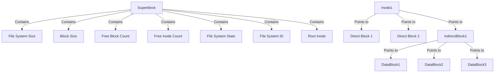
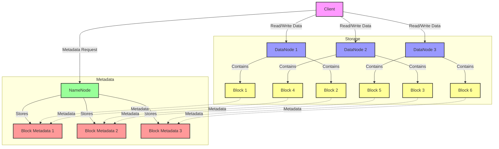
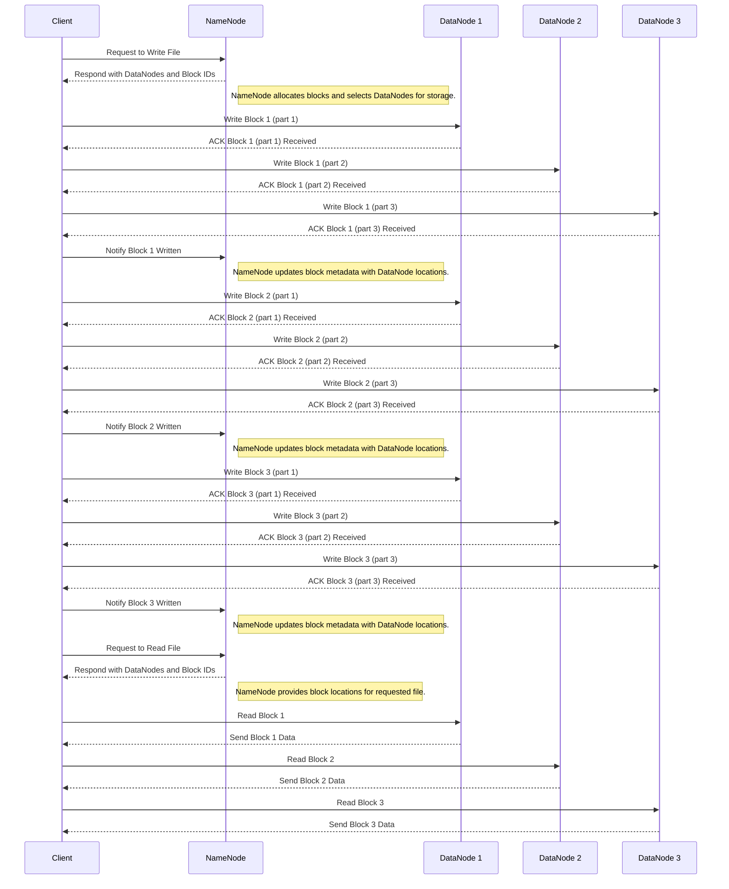

## 文件系统

### Linux 文件系统

Linux 文件系统始于 1987 年，当时 Linus Torvalds 在创建 Linux 内核时，选择了 Minix 文件系统。Minix 文件系统由 Andrew S. Tanenbaum 为 Minix 操作系统设计，具有简单且可靠的特点。然而，由于其最大文件和文件系统大小仅为 64MB，以及文件名长度限制为 14 字符，无法满足更复杂的需求。

1992 年，Rémy Card 开发了第一个专为 Linux 设计的文件系统 **Extended File System (EXT)**，以解决 Minix 文件系统的限制问题。EXT 的最大文件和文件系统大小分别为 2GB，文件名长度扩展到 255 字符。然而，EXT 仍然缺乏日志功能和对更大规模的支持。

1993 年，Rémy Card 发布了 EXT2 文件系统，这成为 Linux 内核 2.0 版的默认文件系统。EXT2 支持的最大文件大小为 2TB，最大文件系统大小为 4TB，尽管没有日志功能，但它提供了更大的文件和文件系统支持，并改进了性能。

1994 年，Silicon Graphics（SGI）开发了 **XFS 文件系统**，最初用于其 IRIX 操作系统。XFS 以其高性能和可扩展性在科学计算和数据密集型应用中广泛使用，支持的最大文件和文件系统大小分别为 18EB，具有高效的日志记录机制。

2001 年，Stephen Tweedie 发布了 EXT3 文件系统，这是 EXT2 的升级版本，增加了日志功能以提高数据可靠性和系统恢复速度。EXT3 保持了 EXT2 的文件和文件系统大小限制，并且向后兼容 EXT2。同年，Hans Reiser 开发了 ReiserFS，这是第一个默认支持日志功能的文件系统，支持的最大文件和文件系统大小分别为 8TB 和 16TB。ReiserFS 以高效的小文件存储和快速目录查找而闻名，但后续发展受限，逐渐被其他文件系统取代。

2004 年，Sun Microsystems 开发并发布了 **ZFS 文件系统**，最初用于 Solaris 操作系统，现在已移植到多个平台。ZFS 提供了极高的数据完整性和灵活性，支持的最大文件和文件系统大小为 256 兆亿亿字节，并集成了文件系统和逻辑卷管理、数据完整性校验、快照和复制、自动修复等新特性，适用于企业存储解决方案和云存储环境。

2007 年，Oracle 公司开发的 **Btrfs 文件系统**首次发布，旨在提供高级管理功能和高可靠性。Btrfs 支持的最大文件和文件系统大小均为 16EB，具有快照、内联数据压缩、子卷管理和在线文件系统检查等新特性，适用于需要高级存储管理和数据保护的场景。

2008 年，由 Theodore Ts'o 领导开发的 EXT4 文件系统发布，成为 EXT3 的继任者。EXT4 显著改进了性能和可靠性，支持的最大文件大小达到 1EB，最大文件系统大小为 16TB，并引入了延迟分配、多块分配、无日志模式和在线碎片整理等新特性。

Linux 文件系统从 Minix 到 EXT，再到更高级的 EXT4、Btrfs、XFS 和 ZFS 的发展过程中，每一次升级都带来了更大的存储支持、更高的性能和可靠性，以及更多的管理功能。

#### EXT4

EXT4（Fourth Extended File System）于 2008 年发布，由 Theodore Ts'o 领导开发，作为 EXT3 的继任者。EXT4 的发展旨在解决 EXT3 在大规模存储和性能上的限制，并引入了许多新特性和性能改进。EXT4 成为现代 Linux 系统的主流文件系统，广泛应用于各种场景，从个人电脑到企业级服务器。它的设计兼顾了向后兼容和未来扩展的需求，使其在稳定性和性能上都有显著提升。


**特点**

- **最大文件大小**：1EB（Exabyte）
- **最大文件系统大小**：16TB（Terabyte）
- **文件碎片整理**：引入了延迟分配（Delayed Allocation）技术，这一特性通过推迟分配数据块的位置来减少文件碎片，提高了文件系统性能。
- **多块分配**：多块分配（Multiblock Allocation）允许一次性分配多个块，减少文件碎片，提高写入效率。
- **日志模式**：支持多种日志模式（Journal Mode），包括数据模式、元数据模式和延迟模式，以平衡性能和数据安全。
- **文件系统检查**：引入了快速文件系统检查功能（Fast Fsck），通过存储已校验的文件系统部分，减少了文件系统检查时间。
- **无日志模式**：支持无日志模式（No Journaling Mode），适用于对性能要求极高而对数据安全要求不高的场景。
- **在线碎片整理**：支持在线碎片整理功能，允许在不卸载文件系统的情况下进行碎片整理，提高了系统的可用性。

#### Btrfs

Btrfs（B-Tree 文件系统）由 Oracle 公司于 2007 年首次发布，旨在提供高级管理功能和高可靠性。Btrfs 的设计目标是应对大规模存储系统的需求，并提供丰富的数据管理功能。Btrfs 在开发初期得到了广泛关注，被认为是未来 Linux 文件系统的发展方向之一。它的许多特性，如快照、压缩和自我修复，使其在数据密集型和高可靠性要求的应用场景中具有显著优势。


**特点**

- **最大文件大小**：16EB（Exabyte）
- **最大文件系统大小**：16EB
- **快照**：支持快照（Snapshot）功能，可以快速创建文件系统的时间点副本，用于数据备份和恢复。
- **内联数据压缩**：支持内联数据压缩（Inline Compression），有效减少存储空间需求。
- **子卷管理**：支持子卷（Subvolume）管理，允许在同一文件系统中创建多个逻辑卷，提供更灵活的存储管理。
- **在线文件系统检查**：支持在线文件系统检查和修复（Online Scrubbing and Repair），可以在系统运行时检测和修复数据损坏。
- **自我修复**：内置数据校验和自我修复功能，自动检测并修复数据损坏，确保数据完整性。
- **可扩展性**：高可扩展性，支持大规模存储需求，并允许在不中断服务的情况下进行文件系统扩展和缩减。

#### XFS

XFS 文件系统由 Silicon Graphics（SGI）于 1994 年开发，最初用于其高性能计算和图形工作站的 IRIX 操作系统。XFS 以其高性能和可扩展性著称，特别适合处理大文件和高并发 I/O 操作。随着时间的推移，XFS 被移植到 Linux 平台，并在数据密集型应用和科学计算领域得到了广泛应用。


**特点**

- **最大文件大小**：18EB（Exabyte）
- **最大文件系统大小**：18EB
- **日志记录机制**：高效的日志记录机制（Efficient Logging），减少了系统崩溃后的恢复时间，提高了数据可靠性。
- **直接 I/O**：支持直接 I/O（Direct I/O），允许应用程序直接访问磁盘，绕过文件系统缓存，提高了 I/O 性能。
- **可扩展性**：极高的可扩展性，能够处理极大规模的存储需求，适用于高性能计算和数据中心。
- **动态扩展**：支持文件系统的动态扩展（Dynamic Allocation），在不卸载文件系统的情况下进行扩展。
- **并发支持**：优秀的并发支持，适用于高并发的 I/O 操作场景，如数据库和大规模数据处理。

#### ZFS

ZFS（Zettabyte File System）由 Sun Microsystems 开发，最初用于 Solaris 操作系统，现已移植到多个平台。ZFS 于 2004 年首次发布，旨在提供极高的数据完整性和灵活性。ZFS 的设计理念是将文件系统和逻辑卷管理融合在一起，简化存储管理，同时提供强大的数据保护和管理功能。其创新的设计和丰富的特性使其在企业存储解决方案和云存储环境中得到了广泛应用。


**特点**

- **最大文件大小**：256 兆亿亿字节
- **最大文件系统大小**：256 兆亿亿字节
- **集成文件系统和逻辑卷管理**：ZFS 将文件系统和逻辑卷管理融合在一起，提供统一的存储管理界面，简化了管理操作。
- **数据完整性校验**：内置数据校验（Data Integrity Verification）和自我修复功能，确保数据在传输和存储过程中的完整性。
- **快照和克隆**：支持快照（Snapshot）和克隆（Clone）功能，可以快速创建数据副本，用于备份和测试。
- **自动修复**：当检测到数据损坏时，ZFS 能自动从冗余数据中恢复，确保数据的高可靠性。
- **高级存储管理**：支持数据压缩、去重（Deduplication）和动态磁盘池（Dynamic Storage Pooling），提高存储效率和灵活性。
- **可扩展性**：高可扩展性，支持大规模存储环境，适用于企业级和云计算场景。

#### 对比表

| 文件系统 | 最大文件大小  | 最大文件系统大小 | 日志功能 | 快照 | 压缩 | 数据校验 | 自我修复 | 应用场景                                                   |
| -------- | ------------- | ---------------- | -------- | ---- | ---- | -------- | -------- | ---------------------------------------------------------- |
| EXT4     | 1EB           | 16TB             | 有       | 无   | 无   | 无       | 无       | 现代 Linux 系统，广泛应用于个人电脑和服务器                |
| Btrfs    | 16EB          | 16EB             | 有       | 有   | 有   | 有       | 有       | 高级存储管理和数据保护，适用于服务器和企业级应用           |
| XFS      | 18EB          | 18EB             | 有       | 无   | 无   | 无       | 无       | 高并发 I/O 和大文件处理，适用于高性能计算和数据密集型应用  |
| ZFS      | 256 兆亿亿字节 | 256 兆亿亿字节    | 有       | 有   | 有   | 有       | 有       | 企业存储解决方案和云存储环境，提供极高的数据完整性和灵活性 |

### Windows 文件系统

1980 年代中期，微软推出了最初的文件系统——**FAT 文件系统（File Allocation Table）**，用于 MS-DOS 操作系统。FAT 文件系统简单且高效，适用于当时的硬盘存储需求。它最初有 FAT12 和 FAT16 两个版本，分别用于小型和中型存储设备。FAT16 支持的最大分区大小为 2GB，文件名长度为 8.3 格式（即最多 8 个字符的文件名加上 3 个字符的扩展名）。

1993 年，随着 Windows NT 3.1 的发布，微软引入了**NTFS 文件系统（New Technology File System）**。NTFS 提供了许多先进的功能，如文件和文件系统的权限管理、日志记录、文件压缩和加密等。NTFS 支持的最大文件和文件系统大小大幅提升，文件名长度扩展到 255 字符。

1996 年，FAT32 文件系统随着 Windows 95 OSR2 的发布而推出，旨在克服 FAT16 的限制。FAT32 支持的最大分区大小为 2TB，文件名长度仍为 8.3 格式，但增加了长文件名支持，允许最多 255 个字符。FAT32 广泛用于 U 盘和小型存储设备，因其跨平台兼容性而受到欢迎。

2001 年，随着 Windows XP 的发布，NTFS 文件系统成为默认文件系统。NTFS 的优势包括支持大文件和大分区、更好的数据安全性和可靠性，以及改进的磁盘空间利用率。Windows XP 还继续支持 FAT32 文件系统，以保持对旧系统和设备的兼容性。

2006 年，Windows Vista 发布，引入了 NTFS 3.1 版本，增加了对事务性 NTFS（TxF）的支持，以提高文件操作的可靠性和一致性。虽然 TxF 在后来版本中被弃用，但它显示了 NTFS 在功能和性能上的不断改进。

2012 年，随着 Windows 8 的发布，微软推出了**ReFS 文件系统（Resilient File System）**，旨在提供更高的数据完整性和可扩展性。ReFS 具有自动修复、数据校验、数据损坏隔离等特性，特别适用于大规模数据存储和虚拟化环境。ReFS 支持的最大文件大小和文件系统大小为 1YB（1 百万 TB）。

2017 年，随着 Windows 10 的更新，**微软引入了对 Linux 文件系统（如 Ext4 和 Btrfs）的支持**，通过 Windows Subsystem for Linux（WSL），使用户能够在 Windows 上使用 Linux 文件系统和工具。这标志着 Windows 文件系统生态的进一步扩展和兼容性提升。

Windows 文件系统的发展历程从早期的 FAT 和 FAT16，逐步发展到功能强大的 NTFS，再到专为大规模数据存储设计的 ReFS，每一次升级都带来了更高的性能、可靠性和功能。现代 Windows 操作系统还通过 WSL 支持 Linux 文件系统，展示了其在兼容性和多样性上的持续改进。

#### NTFS

NTFS（New Technology File System）由 Microsoft 于 1993 年随 Windows NT 3.1 发布，作为 FAT 文件系统的继任者。NTFS 设计初衷是提供更高的安全性、可靠性和可扩展性，适应企业级应用的需求。它的发展伴随着 Windows NT 系列操作系统的进化，从最初的 NT 3.1 到后来的 Windows 2000、XP、Vista、7、8 和 10。NTFS 的引入标志着文件系统安全性和性能的显著提升，使其成为 Windows 系统的标准文件系统。

**特点**

- **文件和卷加密**：支持 EFS（Encrypting File System）加密技术，提供文件和文件夹级别的加密保护。
- **磁盘配额**：允许管理员设置磁盘配额，限制用户或组的磁盘使用量。
- **压缩**：支持文件和文件夹的压缩功能，节省存储空间。
- **日志功能**：具有日志功能，记录文件系统元数据的变更，确保数据完整性和快速恢复。
- **单个文件和卷大小**：支持高达 256TB 的单个文件和卷大小，满足大规模存储需求。
- **权限管理**：提供细粒度的文件和文件夹权限设置，增强了数据安全性。
- **索引服务**：支持文件内容索引，加快文件搜索速度。

#### FAT32

FAT32（File Allocation Table 32）是 FAT 文件系统的改进版，于 1996 年随 Windows 95 OSR2 发布。FAT32 旨在解决 FAT16 的容量限制问题，提供更大的卷和文件支持。由于其良好的兼容性，FAT32 在便携设备和多平台数据交换中得到广泛应用。

**特点**

- **兼容性**：FAT32 可以在多种操作系统（如 Windows、MacOS、Linux）之间无缝使用，广泛用于便携式存储设备。
- **卷和文件大小**：支持最高 4GB 的单个文件和 2TB 的卷大小。
- **效率**：较小的簇大小提高了磁盘空间的利用率。
- **简单性**：文件系统结构简单，易于实现和维护。
- **局限性**：不支持文件加密、磁盘配额和文件压缩等高级功能。

#### exFAT

exFAT（Extended File Allocation Table）于 2006 年由 Microsoft 发布，旨在替代 FAT32，专为闪存存储设备（如 SD 卡和 USB 闪存驱动器）优化。exFAT 解决了 FAT32 在文件大小和卷大小上的限制，同时保持了跨平台兼容性。

**特点**

- **文件和卷大小**：支持高达 128PB 的卷大小和无实际限制的文件大小，适用于大容量存储需求。
- **优化性能**：针对闪存存储器优化，提供更高的读写性能。
- **跨平台兼容性**：广泛支持多种操作系统，适合便携式存储设备。
- **簇大小**：支持更大的簇大小，适合处理大文件。
- **简单性**：比 NTFS 结构简单，适合嵌入式系统和便携设备。

#### ReFS

ReFS（Resilient File System）于 2012 年由 Microsoft 发布，作为 NTFS 的继任者，主要用于 Windows Server 环境。ReFS 设计初衷是提高数据可用性和弹性，特别适用于大规模数据存储和虚拟化环境。

**特点**

- **数据完整性**：采用校验和算法，检测和修复数据损坏，提高数据可靠性。
- **自动修复**：支持自动修复功能，通过冗余数据副本自动修复损坏的数据。
- **弹性**：设计用于处理极大规模的数据卷和文件，支持高达数百 PB 的存储容量。
- **性能优化**：针对虚拟化和大规模存储场景进行了优化，提高了性能和效率。
- **兼容性**：虽然 ReFS 不完全兼容所有 NTFS 功能，但它与 Windows Server 和存储空间（Storage Spaces）高度集成。

#### 对比表

| 文件系统 | 最大文件大小 | 最大卷大小 | 日志功能 | 文件和卷加密 | 磁盘配额 | 压缩 | 跨平台兼容性 | 应用场景                                   |
| -------- | ------------ | ---------- | -------- | ------------ | -------- | ---- | ------------ | ------------------------------------------ |
| NTFS     | 256TB        | 256TB      | 有       | 有           | 有       | 有   | 部分兼容     | Windows 桌面和服务器，企业级应用           |
| FAT32    | 4GB          | 2TB        | 无       | 无           | 无       | 无   | 广泛兼容     | 便携式存储设备，多平台数据交换             |
| exFAT    | 无实际限制   | 128PB      | 无       | 无           | 无       | 无   | 广泛兼容     | 闪存存储设备，便携式大容量存储             |
| ReFS     | 35PB         | 35PB       | 有       | 无           | 有       | 无   | 部分兼容     | 大规模数据存储，虚拟化环境，Windows Server |

### MacOS 主流文件系统

1984 年，Apple 推出了用于 Macintosh 计算机的初代文件系统——**MFS（Macintosh File System）**。MFS 是一个简单的文件系统，支持单级目录结构和 128KB 的块大小。虽然对于早期的 Macintosh 计算机来说足够，但随着存储需求的增加，MFS 的局限性逐渐显现。

1985 年，Apple 发布了**HFS（Hierarchical File System）**以替代 MFS。HFS 引入了分层目录结构，支持更大容量的硬盘和文件系统，最大支持 2GB 的卷和 2GB 的文件大小。HFS 采用 512 字节的块大小，并增加了多级目录支持，极大地改善了文件管理。

1998 年，随着 Mac OS 8.1 的发布，Apple 推出了**HFS+（也称为 Mac OS Extended）**，这是对 HFS 的重大改进。HFS+ 引入了更小的块大小（4KB），大幅提高了磁盘空间利用率，支持的最大卷和文件大小分别扩展到 8EB（exabytes）。HFS+ 还引入了 Unicode 支持，使文件名能够包含更多的字符。

2002 年，Mac OS X 10.2 Jaguar 发布，HFS+ 成为默认文件系统。随着系统的不断更新，HFS+ 增加了许多新功能，包括文件压缩、稀疏文件支持和更高效的文件存储。

2014 年，Apple 在 OS X Yosemite 中引入了 Core Storage，这是一个逻辑卷管理器，允许用户创建加密卷和使用 Fusion Drive 技术，将 SSD 和 HDD 组合成一个卷以提高性能和存储效率。

2016 年，Apple 发布了 macOS Sierra，并引入了**APFS（Apple File System）**。APFS 是对 HFS+ 的彻底重构，设计目标是提高性能、安全性和可靠性。APFS 支持 64 位文件 ID，最大支持的文件和卷大小为 8EB，具有更快的目录操作、更高效的空间管理和更强的数据完整性保障。APFS 还支持快照、克隆、加密和原子操作，极大地提升了文件系统的功能性和用户体验。

2017 年，macOS High Sierra 发布，APFS 成为默认文件系统。APFS 特别针对 SSD 优化，但也兼容 HDD 和外部存储设备。APFS 的推出标志着 macOS 文件系统迈向现代化和高效管理的新阶段。

macOS 文件系统从最初的 MFS 到 HFS，再到 HFS+ 和现代的 APFS，每一次升级都带来了显著的改进和新功能。随着存储需求和技术的发展，Apple 不断提升文件系统的性能、可靠性和功能，确保 macOS 能够满足现代用户的需求。

#### HFS+

HFS+（Hierarchical File System Plus），也称为 Mac OS Extended，是 Apple 于 1998 年推出的文件系统，用于替代早期的 HFS 文件系统。HFS+ 是为适应更大的存储需求和提高文件管理效率而设计的。它首次随 Mac OS 8.1 引入，并在之后的多个 Mac OS 版本中成为标准文件系统。HFS+ 通过增加文件大小和卷大小的支持，改进文件命名和目录结构，满足了当时不断增长的存储需求。

**特点**

- **最大文件大小**：8EB（Exabyte）
- **最大卷大小**：8EB
- **硬链接和软链接**：支持硬链接和软链接，提供更灵活的文件管理方式。
- **文件压缩**：支持文件压缩，减少存储空间的占用。
- **分层目录结构**：改进的分层目录结构，支持更大的文件和目录。
- **Unicode 支持**：改进的文件名编码，支持 Unicode 字符集，增强了跨平台兼容性。
- **数据完整性**：支持日志功能，记录文件系统的元数据更改，提高数据完整性和恢复速度。

#### APFS

**文化和发展历史**

APFS（Apple File System）是 Apple 于 2017 年发布的新一代文件系统，设计初衷是替代 HFS+，以满足现代存储需求。APFS 针对 SSD 和闪存存储器进行了优化，显著提升了性能和数据安全性。APFS 随着 macOS High Sierra 的发布而引入，并逐渐成为 macOS、iOS、watchOS 和 tvOS 的标准文件系统。其设计注重高性能、高安全性和高效的存储管理，适应了当前和未来的数据存储需求。

**特点**

- **最大文件大小**：8EB（Exabyte）
- **最大卷大小**：8EB
- **快照**：支持快照功能，可以在不同时间点创建文件系统的副本，方便数据恢复和备份。
- **克隆**：支持克隆功能，在不占用额外存储空间的情况下创建文件或目录的副本。
- **加密**：内置强大的加密功能，支持单文件和整个卷的加密，增强了数据安全性。
- **空间共享**：支持空间共享（Space Sharing），多个卷可以共享同一存储池，有效利用存储空间。
- **文件和目录压缩**：支持高效的文件和目录压缩，节省存储空间。
- **高效存储**：优化的元数据管理和文件系统布局，提供更高的存储效率和性能。
- **崩溃保护**：具备崩溃保护机制，通过快速重启和数据恢复，确保数据的高可用性。

#### 对比表

| 文件系统 | 发布年份 | 最大文件大小 | 最大卷大小 | 日志功能 | 硬链接 | 软链接 | 文件压缩 | 快照 | 克隆 | 加密 | 空间共享 | 应用场景                                                     |
| -------- | -------- | ------------ | ---------- | -------- | ------ | ------ | -------- | ---- | ---- | ---- | -------- | ------------------------------------------------------------ |
| HFS+     | 1998 年   | 8EB          | 8EB        | 有       | 有     | 有     | 有       | 无   | 无   | 无   | 无       | 早期 Mac OS 系统，个人计算和多媒体处理                       |
| APFS     | 2017 年   | 8EB          | 8EB        | 有       | 无     | 有     | 有       | 有   | 有   | 有   | 有       | 现代 macOS、iOS、watchOS 和 tvOS 设备，提供高性能和数据安全性 |

## 文件系统结构与管理

### 文件系统结构

#### 层次

文件系统层次结构指的是文件和目录的组织方式。大多数现代文件系统采用层次结构，即目录和子目录构成树状结构。根目录（Root Directory）是树的起点，其他所有文件和目录都可以从根目录访问。

- **根目录**：文件系统的顶层目录，通常表示为 `/`（在 Unix 和 Linux 系统中）或 `C:\`（在 Windows 系统中）。
- **目录和子目录**：目录是包含其他文件和目录的容器。子目录是父目录的一部分，形成树状层次结构。
- **文件**：存储数据的基本单位，可以是文本文档、图像、可执行程序等。

#### 结构图




- **超级块（Superblock）**：包含文件系统的元数据，例如文件系统大小、块大小、空闲块数量、空闲 Inode 数量、文件系统状态、文件系统 ID、根 Inode 等。
- **索引节点（Inode）**：包含文件的元数据，并指向文件的数据块。
  - **直接指针（Direct Pointers）**：直接指向数据块。
  - **一次间接指针（Indirect Pointers）**：指向一个包含数据块指针的块，每个指针指向一个数据块。
- **数据块（Data Block）**：实际存储文件数据的基本单元。

#### 超级块（Superblock）

超级块是文件系统的核心元数据结构，存储文件系统的整体信息。每个文件系统都有一个超级块，用于描述文件系统的特性和状态。

> 超级块就像是图书馆的管理员记录的总册，它包含了图书馆的总体信息，比如图书馆有多大，每个书架的大小，图书馆的状态（是否开放，有没有损坏等），以及图书馆的标识符和根目录的位置。

| 项目                 | 描述                                                         |
| -------------------- | ------------------------------------------------------------ |
| 文件系统大小         | 文件系统的总大小，包括所有的数据块。                         |
| 块大小               | 文件系统中每个数据块的大小，通常为 1KB、2KB、4KB 或 8KB。    |
| 空闲块数量           | 当前可用的数据块数量，表示文件系统中剩余的可用空间。         |
| 空闲 Inode 数量      | 当前可用的索引节点数量，表示文件系统中可用的文件/目录数。    |
| 文件系统挂载状态     | 文件系统是否已挂载，以及以何种模式挂载（只读或读写）。       |
| 文件系统标识符       | 唯一标识文件系统的 ID，用于区分不同的文件系统实例。          |
| 文件系统版本         | 文件系统的版本号，表示文件系统的格式版本。                   |
| 根目录 Inode         | 指向根目录的索引节点号，根目录是文件系统的入口。             |
| 块组描述符位置       | 存储块组描述符（Block Group Descriptor）的位置，用于描述块组的结构。 |
| 超级块备份位置       | 存储超级块备份的位置，通常在文件系统的多个位置保存超级块备份。 |
| 文件系统状态         | 文件系统当前的状态，如是否干净卸载、是否需要检查等。         |
| 文件系统创建时间     | 文件系统创建的时间戳。                                       |
| 文件系统修改时间     | 最后一次修改文件系统元数据的时间戳。                         |
| 上次挂载时间         | 文件系统上次被挂载的时间戳。                                 |
| 上次卸载时间         | 文件系统上次被卸载的时间戳。                                 |
| 最大挂载次数         | 在需要进行文件系统检查之前，文件系统可以挂载的最大次数。     |
| 文件系统检查间隔时间 | 在需要进行文件系统检查之前，文件系统可以运行的最长时间间隔。 |
| 文件系统标志         | 指示文件系统特性的标志，如只读、已被卸载等。                 |
| 文件系统日志位置     | 存储文件系统日志的起始位置，用于恢复文件系统的一致性。       |
| 默认权限掩码         | 创建文件时使用的默认权限掩码。                               |
| 文件系统特性         | 文件系统支持的特性标志，如是否支持大文件、是否启用日志等。   |

超级块是文件系统管理的核心，一旦损坏，整个文件系统将无法使用。超级块的损坏可能导致文件系统无法挂载或文件数据丢失。因此，文件系统通常会在多个位置保存超级块的副本，以提高容错性。

- **主超级块**：文件系统中的主要超级块，通常位于文件系统的第一个块。
- **备份超级块**：为了防止单点故障，文件系统会在多个位置保存超级块的副本。不同文件系统的备份策略不同，例如，EXT2/3/4 文件系统在每组块（Block Group）中保存备份超级块。

#### 索引节点（Inode）

Inode 是文件系统中的核心数据结构，用于存储文件元数据。每个文件和目录都有一个唯一的 Inode，负责记录文件的相关信息。

> Inode 就像每本书的标签，它记录了每本书的详细信息，比如书名、作者、出版日期、类别以及书在书架上的位置。

| 项目             | 描述                                                         |
| ---------------- | ------------------------------------------------------------ |
| 文件类型         | 指示文件的类型，如普通文件、目录、符号链接等。               |
| 文件大小         | 文件的总字节数。                                             |
| 文件权限         | 文件的访问权限，包括读（r）、写（w）和执行（x）权限。        |
| 所有者信息       | 文件的所有者用户 ID（UID）和所属组 ID（GID）。               |
| 创建时间         | 文件创建的时间戳。                                           |
| 修改时间         | 文件内容最后修改的时间戳。                                   |
| 访问时间         | 文件最后访问的时间戳。                                       |
| 链接计数         | 指向此 Inode 的硬链接数量。                                  |
| 数据块指针       | 指向存储文件内容的数据块的指针，包括直接指针、一次间接指针、二次间接指针和三次间接指针。 |
| 文件系统标志     | 用于指示文件系统特性和状态的标志。                           |
| 文件生成号       | 文件的唯一标识符，通常用于网络文件系统（NFS）。              |
| 文件大小（高位） | 文件大小的高位部分，用于支持大文件。                         |
| 数据块数量       | 文件使用的数据块总数。                                       |
| 文件系统标识符   | 标识文件系统类型或版本的标识符。                             |
| 数据块指针数量   | 数据块指针的总数，包括直接和间接指针。                       |
| 直接指针         | 直接指向数据块的指针，通常有 12 个直接指针。                 |
| 一次间接指针     | 指向一个包含数据块指针的块，每个指针指向一个数据块。         |
| 二次间接指针     | 指向一个包含一次间接指针块的块，每个一次间接指针指向一个包含数据块指针的块。 |
| 三次间接指针     | 指向一个包含二次间接指针块的块，每个二次间接指针指向一个包含一次间接指针块的块。 |

Inode 负责管理文件的存储位置，通过数据块指针指向文件的实际数据块。Inode 不存储文件名，文件名和 Inode 的关联关系存储在目录项中。

1. **直接指针**：直接指向数据块的指针，通常一个 Inode 有 12 个直接指针。
2. **一次间接指针**：指向一个包含数据块指针的块，每个指针指向一个数据块。
3. **二次间接指针**：指向一个包含一次间接指针块的块，每个一次间接指针指向一个包含数据块指针的块。
4. **三次间接指针**：指向一个包含二次间接指针块的块，每个二次间接指针指向一个包含一次间接指针块的块。

这种指针结构使得 Inode 能够高效地管理小文件和大文件，同时提供良好的性能。

#### 数据块（Data Block）

数据块是文件系统中存储文件实际内容的基本单元。文件的所有数据都存储在数据块中，由 Inode 通过指针进行管理。数据块的大小通常为 4KB，但可以根据文件系统的配置有所不同。常见的块大小有 1KB、2KB、4KB 和 8KB 等。

> 数据块是文件系统中存储文件实际内容的基本单元，就像图书馆的书架上的每一层存放书的地方。

数据块用于存储文件的实际数据内容。Inode 通过直接和间接指针指向相应的数据块，以组织和管理文件数据。

- **小文件存储**：对于小文件，数据可以存储在少量数据块中，甚至可能只使用一个数据块。Inode 的直接指针能够高效地管理这些数据块。
- **大文件存储**：对于大文件，可能需要多个直接指针、间接指针和多级间接指针来管理数据块。通过这种层次化指针结构，文件系统能够有效地管理大文件，同时保持性能。
- **数据块分配**：文件系统在创建和扩展文件时，会动态分配数据块。为了减少碎片化和提高性能，文件系统通常会尽量连续分配数据块。
- **数据块缓存**：为了提高文件读写性能，操作系统会使用内存缓存（如页缓存）来缓存数据块的内容，减少磁盘 I/O 操作。

### 文件系统管理

#### 文件系统的创建与挂载

- **创建文件系统**：

  在 Unix/Linux 系统中，可以使用 `mkfs` 命令创建文件系统。例如：

  ```sh
  # 创建一个 EXT4 文件系统。
  mkfs.ext4 /dev/sda1
  ```

  **步骤**：

  1. 选择并准备存储设备（如磁盘分区）。
  2. 选择适当的文件系统类型。
  3. 使用 `mkfs` 命令创建文件系统。

- **挂载文件系统**：

  使用 `mount` 命令将文件系统挂载到目录。例如：

  ```shell
  # 将设备 `/dev/sda1` 挂载到 `/mnt` 目录。
  mount /dev/sda1 /mnt
  ```

  **步骤**：

  1. 创建挂载点目录（如 `/mnt`）。
  2. 使用 `mount` 命令挂载文件系统。
  3. 查看挂载状态，可以使用 `df -h` 或 `mount` 命令。

#### 文件系统的格式化和修复

- **格式化文件系统**：

  格式化文件系统可以使用 `mkfs` 命令。例如：

  ```sh
  #　格式化设备 `/dev/sda1` 为 EXT4 文件系统
  mkfs.ext4 /dev/sda1
  ```

  **步骤：**

  1. 确保设备未挂载。
  2. 使用 `mkfs` 命令进行格式化。

- **修复文件系统**：

  在 Unix/Linux 系统中，可以使用 `fsck` 命令检查和修复文件系统。例如：

  ```sh
  # 检查并修复设备 `/dev/sda1` 上的文件系统
  fsck /dev/sda1
  ```

  **步骤**：

  1. 确保文件系统未挂载（对于根文件系统，可以在单用户模式下进行）。
  2. 使用 `fsck` 命令检查文件系统的完整性。
  3. 根据检查结果进行修复。

#### 文件权限与用户管理

- **文件权限**：

  文件权限分为读（r）、写（w）和执行（x）三种。权限应用于文件所有者（User）、文件所属组（Group）和其他用户（Others）。

  | 组别   | 读（r） | 写（w） | 执行（x） |
  | ------ | ------- | ------- | --------- |
  | User   | 4       | 2       | 1         |
  | Group  | 4       | 2       | 1         |
  | Others | 4       | 2       | 1         |

  使用 `chmod` 命令修改文件权限。例如：

  ```sh
  # 将文件 `filename` 的权限设置为 `rwxr-xr-x`
  chmod 755 filename
  ```

- **用户和组管理**：

  用户管理：使用 `useradd` 命令添加用户，`usermod` 命令修改用户，`userdel` 命令删除用户。例如：

  ```shell
  # 添加新用户 `username`
  useradd username
  ```

  组管理：使用 `groupadd` 命令添加组，`groupmod` 命令修改组，`groupdel` 命令删除组。例如：

  ```shell
  # 添加新组 `groupname`
  groupadd groupname
  ```

## 分布式文件系统

分布式文件系统（Distributed File System，DFS）是一种通过网络将文件存储在多个节点上的系统。它允许文件和数据跨越多台计算机进行存储和访问，从而实现高可用性、高性能和高扩展性。以下内容将详细介绍几种常见的分布式文件系统，包括 Hadoop Distributed File System (HDFS)、Google File System (GFS)、GlusterFS 和 CephFS。

### Hadoop Distributed File System (HDFS)

#### 概述

[Hadoop Distributed File System](https://hadoop.apache.org/) (HDFS) 是 Apache Hadoop 项目的一部分，专为大数据处理设计。HDFS 能够处理大规模数据集，支持高吞吐量的数据访问，并具备良好的容错性。HDFS 最早由 Doug Cutting 和 Mike Cafarella 在 2005 年开发，灵感来源于 Google File System (GFS)。它主要用于存储和管理海量的数据，支持并行处理和分布式计算。

#### 历史发展

HDFS 的历史发展与 Hadoop 项目的演进密切相关。2005 年，Doug Cutting 和 Mike Cafarella 开始开发 Hadoop，最初作为 Nutch 搜索引擎项目的一部分。2006 年，Hadoop 被 Yahoo!采用，并迅速成长为大数据处理的核心技术之一。2008 年，Hadoop 成为 Apache 的顶级项目，HDFS 作为其关键组件，随着大数据生态系统的扩展和完善，逐渐发展成现今广泛应用的分布式文件系统。

#### 架构与组件



HDFS 采用主从架构，由 NameNode 和多个 DataNode 组成：

- **NameNode**：负责管理文件系统的命名空间和元数据。它记录文件和目录的树形结构，并维护每个文件块的位置。NameNode 是 HDFS 的核心，所有的文件操作请求都需要通过 NameNode 来完成。
- **DataNode**：负责存储实际的数据块，并执行块的读写操作。每个 DataNode 定期向 NameNode 汇报其状态（心跳信号和块报告），以便 NameNode 能追踪数据块的分布和健康状态。

此外，还有一些辅助组件：

- **Secondary NameNode**：负责定期获取 NameNode 的元数据快照，辅助 NameNode 进行崩溃恢复，但不替代 NameNode 的功能。
- **JournalNode**：在高可用 HDFS 配置中，用于保存 NameNode 的元数据日志，确保在主 NameNode 失败时可以无缝切换到备 NameNode。

#### 数据存储和复制机制

HDFS 将文件划分为固定大小的数据块（默认 64MB 或 128MB），并将每个数据块复制到多个 DataNode 上（默认 3 个副本），以提高数据的可靠性和容错性。数据块的多副本机制确保即使某个 DataNode 发生故障，数据仍然可以从其他副本中恢复。



- **数据块划分**：大文件被拆分成多个数据块存储在不同的 DataNode 上，以实现并行处理。
- **副本管理**：NameNode 决定每个数据块的副本数量和存放位置，确保副本均匀分布，以提高系统的可靠性和读取效率。
- **副本放置策略**：为了提高数据的可靠性和可用性，HDFS 通常将一个副本放在本地机架，第二个副本放在同一机架的不同节点上，第三个副本放在不同机架的节点上。

#### HDFS 的优缺点及应用场景

**优点**：

- **高容错性**：通过数据块的多副本机制保障数据安全。当一个或多个 DataNode 发生故障时，数据仍然可以从其他副本中恢复。
- **高吞吐量**：适合大规模数据的批处理。HDFS 优化了数据的流式传输，支持大文件的高吞吐量数据访问。
- **可扩展性**：易于扩展集群规模。通过添加新的 DataNode，HDFS 可以方便地扩展存储容量和处理能力。

**缺点**：

- **不适合低延迟的数据访问**：HDFS 设计初衷是为批处理优化，而不是低延迟的随机读写操作。
- **小文件存储效率低**：HDFS 更适合大文件存储，小文件会带来元数据管理的负担和存储效率问题。

**应用场景**：

- **大数据分析与处理**：如 MapReduce 任务。HDFS 被广泛应用于大数据分析平台，支持海量数据的并行处理。
- **数据仓库和日志处理**：HDFS 常用于数据仓库的底层存储，以及日志数据的存储和处理。

### Google File System (GFS)

#### 设计目标

Google File System (GFS) 是 Google 设计的一种可扩展的分布式文件系统，旨在支持大规模数据处理应用。GFS 的设计目标包括高容错性、高性能和高扩展性。GFS 的诞生背景是为了应对 Google 在互联网搜索和数据分析中面临的大量数据存储和处理需求。GFS 被设计为能够处理海量数据集，并且能够在廉价硬件上运行，同时具备良好的容错性和高性能。

#### 历史发展

GFS 的开发始于 2000 年，最初由 Sanjay Ghemawat、Howard Gobioff 和 Shun-Tak Leung 领导的团队设计。GFS 在 2003 年正式发布，并在 Google 内部得到广泛应用，支持 Google 搜索、广告和其他大规模数据处理任务。GFS 的设计和实现奠定了现代分布式文件系统的基础，影响了后来的许多文件系统，如 HDFS。

#### 架构与组件


GFS 采用主从架构，由一个 Master 和多个 ChunkServer 组成：

- **Master**：管理文件系统元数据，如命名空间、访问控制信息和文件块（chunk）的位置信息。Master 还负责协调系统中的各种操作，如数据块的分配、复制和负载均衡。
- **ChunkServer**：存储实际的文件块，并执行读写请求。每个 ChunkServer 都存储多个文件块，并通过心跳机制向 Master 汇报其状态和所持有的数据块信息。

GFS 的架构还包括一个客户端库，提供给应用程序使用，使其能够与 GFS 进行交互。客户端直接与 ChunkServer 通信进行数据读写操作，从而减轻 Master 的负担。

#### 数据分片与复制策略

GFS 将文件划分为固定大小的块（64MB），每个块有一个唯一的全局 ID，并被复制到多个 ChunkServer 上（默认 3 个副本），以提高数据的可靠性。

- **数据块划分**：每个文件被拆分成固定大小的数据块，这些数据块被分布存储在不同的 ChunkServer 上。
- **副本管理**：每个数据块默认有三个副本，分布在不同的 ChunkServer 上，以确保高可用性和容错性。
- **副本放置策略**：GFS 通过副本放置策略确保数据在不同物理位置和机架之间分布，以提高系统的容错性和数据可用性。

Master 负责监控数据块的副本情况，并在副本丢失或损坏时自动创建新的副本。

#### GFS 的优缺点及应用场景

**优点**：

- **高容错性**：通过多副本和定期的完整性检查保障数据安全。GFS 能够在硬件故障频繁发生的环境中保持高可用性。
- **高性能**：适合大文件的高吞吐量数据访问。GFS 优化了数据的流式传输，支持大规模数据处理任务。
- **可扩展性**：通过增加 ChunkServer 节点，GFS 可以轻松扩展存储容量和计算能力。

**缺点**：

- **主节点是单点故障**：尽管 GFS 设计了多种机制来提高 Master 的可靠性，但它仍然是单点故障。如果 Master 失败，系统的可用性会受到影响。
- **不适合小文件和低延迟数据访问**：GFS 更适合大文件存储和批处理任务，对小文件和低延迟访问的支持较差。

**应用场景**：

- **大规模数据处理应用**：如 Google 的搜索和数据分析任务。GFS 能够处理 PB 级数据，并支持高效的数据读写和分析。
- **存储和处理大量日志数据**：GFS 非常适合存储和处理来自多个数据源的大量日志文件，支持大规模日志分析和数据挖掘。

### GlusterFS

#### 概述与历史

GlusterFS 是一个开源的分布式文件系统，旨在处理海量数据存储。它最初由 Gluster 公司开发，并已被 Red Hat 收购。GlusterFS 以其高扩展性和灵活性而著称，能够在无需改变应用程序代码的情况下，通过聚合多台存储服务器，实现高性能和高可用性的数据存储解决方案。

GlusterFS 的设计理念是通过对等架构（peer-to-peer architecture）消除单点故障，增强系统的容错性和扩展性。自 2005 年首次发布以来，GlusterFS 已经经历了多次重大更新和改进，成为企业级存储解决方案的首选之一。

#### 架构与工作原理


GlusterFS 采用无中心节点的对等架构，每个节点同时充当客户端和服务器。它通过将多个存储服务器聚合成一个大的并行文件系统来实现扩展。GlusterFS 的主要组件包括：

- **Gluster 节点（Gluster Node）**：每个节点既是客户端又是服务器，负责存储和提供文件数据。
- **砖（Brick）**：每个节点上的存储单元，通常是一个挂载点或目录。多个砖组成一个卷（volume）。
- **卷（Volume）**：由多个砖组成，是 GlusterFS 的基本存储单元。卷通过聚合不同的砖提供存储服务。

GlusterFS 的工作原理包括：

- **卷管理**：通过卷管理器（Volume Manager）来创建和配置卷。卷可以是分布式卷、复制卷或条带化卷，根据应用需求选择合适的卷类型。
- **分布式哈希表（DHT）**：用于分布式卷的文件分配。DHT 根据文件名计算哈希值，并将文件分配到合适的砖上。
- **自我修复**：GlusterFS 具有内置的自我修复机制，当检测到数据不一致时，会自动进行数据同步和修复。

#### 存储卷的管理与配置

GlusterFS 通过卷（Volume）管理存储。卷由一个或多个砖（Brick）组成，每个砖对应一个存储服务器上的目录。常见的卷类型包括：

- **分布式卷（Distributed Volume）**：将文件分布在所有砖上，适合需要高吞吐量和大容量的应用场景。
- **复制卷（Replicated Volume）**：在多个砖之间复制文件，提高数据的冗余性和可用性，适合高可用性需求的应用。
- **条带化卷（Striped Volume）**：将文件分块存储在多个砖上，适合大文件的高性能读写需求。
- **分布式复制卷（Distributed Replicated Volume）**：结合分布和复制特性，既保证数据的高可用性，又能扩展存储容量。

配置卷的步骤包括：

1. **创建卷**：使用 `gluster volume create` 命令创建所需类型的卷。
2. **启动卷**：使用 `gluster volume start` 命令启动创建的卷。
3. **挂载卷**：使用客户端将卷挂载到本地文件系统，通常使用 FUSE（Filesystem in Userspace）挂载。

#### GlusterFS 的优缺点及应用场景

**优点**：

- **高可扩展性**：可以通过添加节点无缝扩展存储容量，适应数据增长需求。
- **高可用性**：通过数据复制和分布式架构实现数据的高可用性，避免单点故障。
- **灵活性**：支持多种卷类型，能够根据不同应用需求进行灵活配置。

**缺点**：

- **性能在高负载下可能下降**：在高负载情况下，性能可能会受到影响，需要优化配置。
- **配置和管理相对复杂**：需要一定的专业知识和经验进行配置和管理，特别是在大规模部署时。

**应用场景**：

- **大规模数据存储和备份**：适合企业级大规模数据存储和备份解决方案，能够提供高可用性和数据安全性。
- **多媒体内容存储和分发**：适用于多媒体文件的存储和分发，如视频、音频和图像文件，能够支持高吞吐量和大文件存储需求。
- **虚拟化环境和云计算**：支持虚拟机和容器存储，适用于云计算和虚拟化环境中的数据存储解决方案。

### CephFS

#### 概述

CephFS 是 Ceph 分布式存储系统的一部分，提供 POSIX 兼容的文件系统接口。CephFS 利用 Ceph 强大的分布式存储架构，实现高性能和高可靠性的文件存储服务。Ceph 的设计目标是创建一个统一的、可扩展的存储平台，支持对象存储、块存储和文件系统。CephFS 通过元数据服务器（MDS）和对象存储设备（OSD）协同工作，实现了文件系统的高效管理和数据存储。


#### 历史发展

Ceph 的开发始于 2004 年，由 Sage Weil 在加州大学圣克鲁兹分校作为博士研究项目启动。2010 年，Ceph 项目被 Inktank 公司商业化，随后于 2014 年被 Red Hat 收购。Ceph 的设计灵感来源于需要高扩展性和高性能的分布式存储解决方案，其独特的 CRUSH 算法和无中心架构使其在众多分布式存储系统中脱颖而出。

#### Ceph 集群的架构与组件

Ceph 集群由以下几部分组成：

- **Monitor (MON)**：负责维护集群状态、管理元数据和认证服务。Monitor 节点保持集群的一致性和健康状态，管理集群成员和元数据信息。
- **Object Storage Device (OSD)**：负责存储数据并处理数据的读写请求。每个 OSD 节点负责管理一部分数据存储，执行数据复制、恢复和再平衡等操作。
- **Metadata Server (MDS)**：管理文件系统的元数据，支持快速文件系统操作。MDS 维护文件系统的目录结构和文件元数据，处理客户端的文件操作请求。

#### 元数据服务器（MDS）和对象存储设备（OSD）

CephFS 通过 MDS 管理文件系统元数据，OSD 存储实际的数据。MDS 和 OSD 协同工作，实现高效的数据存取和元数据管理。

- **Metadata Server (MDS)**：MDS 负责处理文件系统的元数据操作，如目录查询、文件创建和删除。MDS 分担了文件系统操作的负载，提高了整体系统的性能和响应速度。CephFS 支持多个 MDS 节点，以实现负载均衡和高可用性。
- **Object Storage Device (OSD)**：OSD 节点负责存储数据块，并执行数据读写操作。每个文件被分解为多个数据块，并通过 Ceph 的 CRUSH 算法分布在多个 OSD 节点上。OSD 节点之间通过网络进行数据同步和恢复，确保数据的一致性和可靠性。

#### CephFS 的优缺点及应用场景

**优点**：

- **高性能**：支持高吞吐量和低延迟的数据访问。CephFS 利用高效的元数据管理和数据分布策略，实现快速的数据读写操作。
- **高可扩展性**：通过添加更多的 OSD 和 MDS 节点实现水平扩展。CephFS 可以根据存储需求的增长灵活扩展，无需中断服务。
- **高可靠性**：通过多副本和纠删码保障数据安全。CephFS 具备强大的数据保护机制，确保数据在硬件故障或网络故障时的安全性。

**缺点**：

- **部署和配置相对复杂**：CephFS 的部署和配置需要较高的技术知识和经验，特别是在大规模集群环境中。
- **需要较高的硬件资源支持**：CephFS 的性能和可靠性依赖于高质量的硬件资源，包括高速网络、SSD 存储和充足的内存。

**应用场景**：

- **高性能计算（HPC）和科学研究数据存储**：CephFS 适用于需要高吞吐量和大规模数据存储的高性能计算和科学研究领域。
- **企业级数据存储和备份解决方案**：CephFS 提供可靠的企业级存储解决方案，适用于存储和备份大量企业数据，确保数据的高可用性和安全性。
- **云计算和虚拟化环境**：CephFS 支持云计算和虚拟化环境中的数据存储需求，提供灵活的存储扩展能力和高效的数据访问性能。
