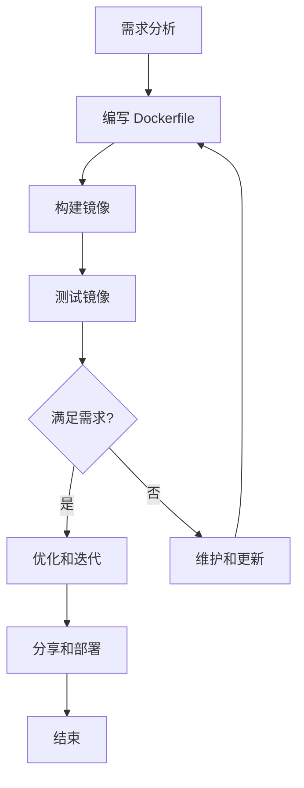
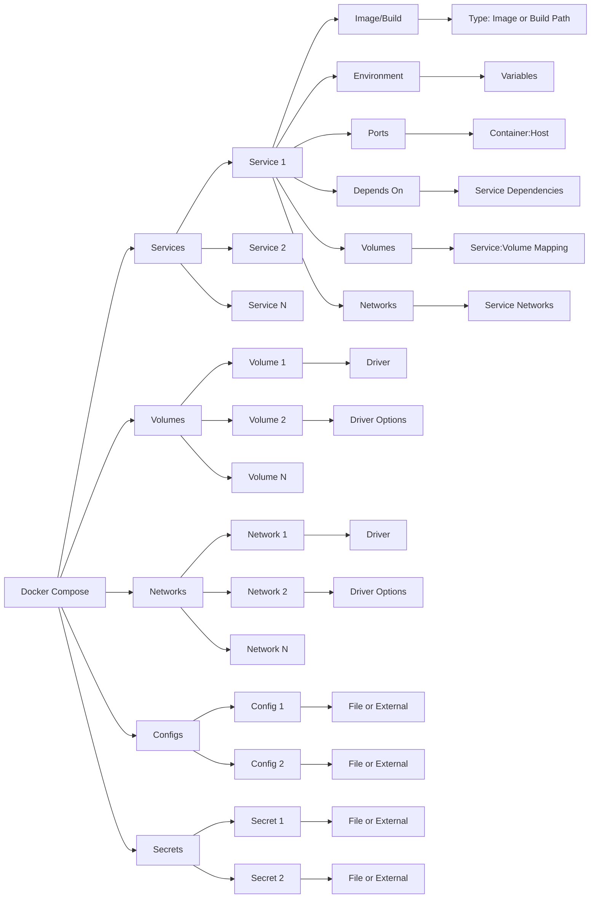

## 概述

Docker 是一种开源的容器化技术，它允许开发者将应用及其运行环境打包在一个轻量级、可移植的容器中。这个容器可以在任何支持 Docker 的系统上运行，确保了应用在不同环境之间的一致性。可以把 Docker 容器看作是一个简化版的虚拟机，但与传统的虚拟机相比，它更为轻量和高效，因为**容器直接运行在宿主机的操作系统内核上**，而不需要额外的操作系统层。

想象一下，如果你是一位厨师，Docker 就像是你的食材和调料被一起打包在一个便携式的盒子里。无论你去到哪个厨房（服务器），只要那里有 Docker（相当于一个标准的炉子），你就能够使用那个盒子里的东西（应用和环境）来准备你的菜肴（运行你的应用）。

我们还可以把 Docker 想象成一种创新的快递服务。它不仅提供了一个标准化的包裹盒（容器），而且还确保了无论包裹被送到哪里（无论是开发、测试还是生产环境），里面的物品（应用和环境）都能够完好无损地到达。

### 历史发展


**2013 年：Docker 的诞生**

Docker 最初是由 Solomon Hykes 在 dotCloud 公司（后来改名为 Docker Inc.）开发的一个内部项目，旨在简化应用的部署过程。它基于 Linux 容器（LXC）技术，并在 2013 年 3 月以开源项目的形式发布。

**2014 年：Docker 1.0 发布**

Docker 迅速获得开发者社区的关注和支持。2014 年 6 月，Docker 1.0 正式发布，标志着 Docker 成为生产环境准备就绪的技术。

**2015 年：Docker Compose 和 Docker Swarm 的推出**

随着 Docker 的普及，用户开始寻求更好的工具来管理多个容器。Docker Compose 作为定义和运行多容器 Docker 应用的工具在 2015 年初推出。同年，Docker Swarm 也被引入作为 Docker 的原生集群管理工具。

**2016 年：Docker 成为 Moby 项目**

2016 年，Docker Inc.宣布将 Docker 核心分割为多个独立的组件，核心 Docker 平台被重命名为 Moby Project。这一变化旨在促进社区贡献，并提高项目的模块化。

**2017 年：Docker 宣布支持 Kubernetes**

随着 Kubernetes 成为容器编排领域的领导者，Docker Inc.在 2017 年宣布原生支持 Kubernetes，允许用户在 Docker 平台上直接使用 Kubernetes 进行容器编排。

**2019 年：Docker 企业业务被 Mirantis 收购**

2019 年 11 月，Docker Inc.宣布将其企业业务出售给云计算公司 Mirantis，同时 Docker Inc.将专注于发展 Docker Desktop 和 Docker Hub。

**2020 年及以后：Docker 的持续发展**

即使在企业业务被出售后，Docker 仍然是开发和运行容器化应用最流行的平台之一。Docker 继续推出新版本，增加新特性，并优化用户体验。同时，社区和生态系统也在不断壮大，为 Docker 的未来发展提供了坚实的基础。

Docker 的发展历史体现了容器技术在软件开发和部署中的革命性变化。从一个小型内部项目到成为全球广泛采用的开源平台，Docker 不仅改变了我们构建和部署应用的方式，也促进了 DevOps 文化和微服务架构的发展。

### 主要优势

Docker 提供了许多优势，包括但不限于：

1. **一致性和可移植性**：无论开发者的本地机器使用什么操作系统，Docker 容器都能确保应用可以在任何支持 Docker 的环境中以相同的方式运行。
2. **快速部署**：由于容器不需要启动一个完整的操作系统，它们可以在几秒钟内启动和停止，这大大加快了部署和扩展应用的速度。
3. **资源高效**：容器共享宿主机的核心，不需要额外的操作系统负担，这使得它们比虚拟机更加资源高效。
4. **隔离**：每个容器都在自己的环境中运行，与其他容器隔离。这提高了安全性，因为它防止了应用之间的干扰。

### 应用场景

Docker 可以用于多种场景，包括：

- **开发环境的一致性**：确保开发、测试和生产环境完全一致，减少了“在我这里运行得好好的”问题。
- **微服务架构**：每个微服务运行在自己的容器中，便于管理和扩展。
- **持续集成/持续部署（CI/CD）**：Docker 容器可以用于自动化测试和生产部署，提高软件交付的速度和质量。
- **应用的快速部署和扩展**：在云平台和虚拟化环境中快速部署和扩展应用。

### 同类产品对比

| 特性/产品      | Docker                                               | Podman                                                       | Kubernetes                                                   |
| -------------- | ---------------------------------------------------- | ------------------------------------------------------------ | ------------------------------------------------------------ |
| **定义**       | 开源容器化平台，允许开发者打包、分发和运行应用。     | 开源容器化工具，允许开发者构建、运行和管理容器和容器镜像。   | 开源的容器编排平台，用于自动化容器的部署、扩展和管理。       |
| **设计目标**   | 简化应用的打包和部署流程。                           | 提供一个与 Docker 兼容的命令行界面，但不依赖于守护进程，更加注重安全性。 | 在集群中自动化部署、扩展和操作容器化的应用程序。             |
| **运行环境**   | 单机或 Swarm 模式下的多机环境。                      | 单机，支持通过 Podman 或 Kubernetes 进行编排。               | 集群环境，可以跨多个主机运行容器。                           |
| **安全性**     | 通过 Docker 守护进程运行，需要考虑守护进程的安全性。 | 不需要守护进程，每个容器都是在用户空间中作为独立进程运行，提供更高的安全性。 | 设计用于多租户场景，提供严格的安全策略。                     |
| **使用场景**   | 开发、测试和生产环境中的应用容器化和微服务架构。     | 适用于希望避免使用守护进程或寻求更高安全性的开发者和系统管理员。 | 大规模容器管理和自动化部署、管理和扩展容器化应用。           |
| **社区和生态** | 庞大的社区支持和丰富的容器镜像库。                   | 正在快速增长的社区，与 Docker 镜像和容器生态系统兼容。       | 强大的社区支持，是云原生计算基金会（CNCF）的一部分，拥有广泛的生态系统。 |
| **主要优势**   | 用户友好的界面和命令行工具，广泛的采用和支持。       | 更适合安全敏感的环境，无需守护进程，支持 rootless 运行。     | 强大的容器编排和管理能力，适合大规模部署。                   |

Docker 是一个开源的容器化平台，它允许开发者打包应用及其依赖到一个可移植的容器中，然后在任何支持 Docker 的系统上运行这个容器。容器化技术使得应用从环境配置中解脱出来，增强了应用的可移植性、效率和安全性。

## Docker 架构

- **容器（Containers）**：容器是 Docker 的核心，可以被理解为一个轻量级、可执行的软件包，包含了运行某个应用所需的全部内容——代码、运行时环境、库、环境变量和配置文件等。你可以把容器想象成一个独立的小型计算机，它在一个隔离的环境中运行应用。
- **镜像（Images）**：镜像是创建 Docker 容器的模板。镜像是静态的，包含了运行应用所需的代码、库、环境变量和配置文件。可以把镜像想象成容器的“蓝图”。创建容器时，Docker 会从镜像中读取这些信息。
- **仓库（Repositories）**：仓库是集中存放镜像的地方。Docker Hub 是最著名的公共仓库，但用户也可以创建私有仓库来存储和管理自己的镜像。
- **Dockerfile**：Dockerfile 是一个文本文件，包含了一系列的指令和参数，用于自动化构建 Docker 镜像的过程。通过编写 Dockerfile，开发者可以定义如何构建镜像，包括添加文件、运行命令和配置环境等。
- **Docker Compose**：Docker Compose 是一个用于定义和运行多容器 Docker 应用的工具。通过一个 YAML 文件，你可以配置应用服务所需的所有容器，然后使用一个命令同时创建和启动所有这些容器。

### Docker 工作原理

Docker 使用容器来运行应用，容器运行在 Docker 引擎之上。Docker 引擎负责管理容器的生命周期，包括容器的创建、启动、停止、移动和删除。容器与虚拟机相比，占用的资源更少，启动更快，因为容器共享宿主机的内核，而不需要模拟整个操作系统。

### Docker 设计架构

**Docker 的架构主要基于客户端 - 服务器（Client-Server）模型**，涉及几个关键组件：Docker 客户端、Docker 服务器（也称为守护进程）、Docker 镜像、容器、仓库等。

- **Docker 客户端（Client）**：Docker 客户端是用户与 Docker 交互的主要方式。用户通过运行 Docker 客户端命令来告诉 Docker 守护进程需要做什么。例如，构建镜像、运行容器、停止容器等操作都是通过客户端发起的。
- **Docker 服务器（守护进程，Daemon）**：Docker 守护进程运行在宿主机上，处理客户端发来的请求，如创建、运行、监控容器，构建和存储镜像等。守护进程与其他 Docker 守护进程通信，管理 Docker 服务。

Docker 客户端和守护进程可以在同一系统上运行，也可以将 Docker 客户端连接到远程 Docker 守护进程。 Docker 客户端和守护进程使用 REST API 通过 UNIX 套接字或网络接口进行通信。


## Docker 安装

- Get Docker：https://docs.docker.com/get-docker/

### 安装脚本

```shell
# 正式版本
curl -fsSL https://get.docker.com -o get-docker.sh
sh get-docker.sh
#　测试版本
curl -fsSL https://test.docker.com -o test-docker.sh
sh test-docker.sh
```

### 启动测试

```shell
# 默认启动
sudo systemctl enable docker
sudo systemctl start docker

# 验证是否正确安装
docker run --rm hello-world
```

### 镜像加速

国内从 Docker Hub 拉取镜像有时会遇到困难，此时可以配置镜像加速器。国内各大云服务商（腾讯云、阿里云、百度云）均提供了 Docker 镜像加速服务，建议根据运行 Docker 的云平台选择对应的镜像加速服务。

请首先执行以下命令，查看是否在 `docker.service` 文件中配置过镜像地址。

```
$ systemctl cat docker | grep '\-\-registry\-mirror'
```

如果该命令有输出，那么请执行 `$ systemctl cat docker` 查看 `ExecStart=` 出现的位置，修改对应的文件内容去掉 `--registry-mirror` 参数及其值，并按接下来的步骤进行配置。

如果以上命令没有任何输出，那么就可以在 `/etc/docker/daemon.json` 中写入如下内容（如果文件不存在请新建该文件）：

```json
{
  "registry-mirrors": [
    "https://hub-mirror.c.163.com",
    "https://mirror.baidubce.com"
  ]
}
```

> 注意，一定要保证该文件符合 json 规范，否则 Docker 将不能启动。

最后重新启动服务。

```shell
sudo systemctl daemon-reload

sudo systemctl restart docker
```

## Docker 使用

Docker 是一个开源平台，用于自动化开发、部署和运行应用程序的过程，通过使用容器化技术，Docker 允许开发者将应用及其依赖打包成一个轻量级、可移植的容器，然后这个容器可以在任何地方运行。这样，**它解决了在我的机器上可以运行的问题，提高了软件交付的效率和可靠性。**

### 容器

容器化是一种虚拟化技术，它允许你在隔离的环境中运行和部署应用。每个容器独立运行一个或多个应用程序，包括它们所需的所有依赖。这就像将你的应用及其所有依赖打包在一个集装箱中，无论在什么环境下运输（运行），都能确保其内容不受影响。

#### 生命周期

容器的生命周期管理是 Docker 使用的核心概念之一，涉及容器从创建到销毁的全过程。容器的生命周期可以通过一系列的 Docker 命令来管理，这些命令包括创建、启动、停止、重启、删除等操作。


#### 创建容器

创建容器是容器生命周期的第一步，这一过程依赖于 Docker 镜像。Docker 镜像是一个包含了应用及其依赖的轻量级、可执行的软件包，确保了应用在任何环境下的一致性和可移植性。

```shell
docker run hello-world
```

#### 容器管理

容器一旦创建，就可以通过各种命令进行管理。这些命令允许用户控制容器的生命周期，包括启动、停止、重启和删除等操作。

- **启动容器**：`docker start my_container`，此命令用于启动一个或多个已经创建但停止运行的容器。
- **停止容器**：`docker stop my_container`，该命令用于停止一个或多个正在运行的容器。停止容器会向容器内的主进程发送 SIGTERM 信号，之后发送 SIGKILL 信号，以确保容器停止运行。
- **查看运行中的容器**：`docker ps`，此命令展示了所有当前正在运行的容器。使用 `-a` 选项可以查看包括停止的在内的所有容器。
- **进入运行中的容器**：`docker exec -it my_container /bin/bash`，该命令允许用户进入一个正在运行的容器内部，并以交互模式启动一个新的终端会话。这对于调试应用或管理容器内的服务非常有用。
- **删除容器**：`docker rm my_container`，使用这个命令可以删除一个或多个已停止的容器。如果要删除运行中的容器，需要加上 `-f` 或 `--force` 参数来强制删除。

#### 高级容器管理

除了基本的生命周期管理命令，Docker 还提供了一系列高级功能，以支持更复杂的容器操作和管理需求。

- **查看容器日志**：`docker logs my_container`，这个命令允许用户检查和跟踪容器内的标准输出和错误输出。对于调试应用和监控容器运行状态非常有用。
- **查看容器内部进程**：`docker top my_container`，此命令显示运行在容器内部的进程列表，有助于了解容器内部的活动。
- **暂停容器**：`docker pause my_container`，该命令用于暂停运行中的容器，所有进程都会被挂起。这可以用于资源管理或在特定时刻“冻结”容器的状态。
- **恢复容器**：`docker unpause my_container`，与 `docker pause` 相对，此命令用于恢复被暂停的容器的执行。
- **容器资源限制**：在创建或运行容器时，可以通过 `--memory`、`--cpu-shares` 等参数来限制容器可以使用的资源，从而避免单个容器占用过多的系统资源。

### 数据卷

数据卷是 Docker 实现数据持久化和共享的关键机制之一。通过使用数据卷，用户可以在不同容器之间共享数据，同时保证数据的持久化存储，即使容器被删除，卷中的数据也不会丢失。

- **数据持久化**：数据卷提供了一种机制，可以将数据存储在容器之外，确保重要数据不会因容器的删除而丢失。
- **数据共享与重用**：数据卷可以被多个容器挂载和访问，实现数据的共享。
- **容器解耦**：通过数据卷，应用程序的运行状态可以与数据保持独立，便于应用的迁移和备份。

#### 使用数据卷

创建和使用数据卷的基本命令如下：

```shell
# 创建一个新的数据卷
docker volume create my_volume

# 将数据卷挂载到容器
docker run -d -v my_volume:/path/in/container --name my_container my_image
```

此命令会启动一个新的容器，将之前创建的数据卷 `my_volume` 挂载到容器的指定路径 `/path/in/container` 下。容器内应用对该路径的任何写操作都会直接反映到数据卷上，同样，对数据卷的任何更改也会立即在挂载它的所有容器中可见。

#### 数据卷容器

数据卷容器是一种使用数据卷共享数据的模式。通过创建一个专门的容器来持有数据卷，其他容器可以通过 --volumes-from 标志来挂载这个容器中的数据卷。

```shell
# 创建一个带数据卷的容器
docker run -d --name data_container -v my_volume:/path/in/container my_image

# 使用 --volumes-from 从其他容器挂载数据卷
docker run -d --name app_container --volumes-from data_container my_app_image
```

这种方法使得数据的管理和共享变得更加集中和高效。

### Docker 网络

Docker 网络功能允许容器相互通信，并与外部世界交互。Docker 提供了多种网络模式，以支持不同的使用场景。

#### 网络模式

- **bridge**：默认网络模式。当容器运行在桥接网络中时，Docker 会自动使用私有子网内的 IP 地址来分配给每个容器，并通过 NAT 实现与外部网络的通信。
- **host**：在这种模式下，容器共享宿主机的网络命名空间，不进行网络隔离。容器的网络性能更好，但是安全性降低。
- **none**：在这种模式下，容器具有自己的网络命名空间，但不配置任何网络接口，通常用于需要手动管理网络的高级场景。

#### 自定义网络

创建自定义网络可以提供更灵活的网络配置，使得容器间的通信更加方便和安全。

```shell
# 创建自定义桥接网络
docker network create --driver bridge my_custom_bridge

# 运行容器时指定网络
docker run -d --name my_container --network my_custom_bridge my_image
```

在自定义网络中，容器可以通过容器名相互访问，而不需要使用 IP 地址，简化了容器间通信的配置。

#### 网络连接和断开

Docker 允许在运行时将容器连接到网络或从网络断开。

```shell
# 将运行中的容器连接到网络
docker network connect my_custom_bridge my_container

# 将容器从网络断开
docker network disconnect my_custom_bridge my_container
```

这提供了动态管理容器网络连接的灵活性，允许根据需要调整容器的网络配置。

## Docker 存储

**Docker 提供了三种主要的数据存储机制：数据卷、目录绑定和临时数据。** 这些机制可以根据不同的需求和场景来实现数据的持久化存储和共享。

### 数据卷

**数据卷是一种用于持久化存储容器数据的机制。**它可以将主机上的目录或文件挂载到容器中，从而实现数据在容器和主机之间的共享和持久化。数据卷的主要优势是容器与数据的解耦，使得**容器可以在不同的主机上迁移和共享数据。**

数据卷的主要特点包括：

- 数据卷是独立于容器的实体。即使容器被删除，数据卷仍然存在。
- 数据卷可以被多个容器共享。这意味着多个容器可以访问和修改同一个数据卷中的数据。
- 数据卷可以在容器之间进行传递。例如，可以将一个数据卷从一个容器挂载到另一个容器中，从而实现数据的共享和传递。
- 数据卷可以在容器运行时进行挂载和卸载。这意味着可以在容器运行时动态地修改数据卷的挂载点。

使用数据卷的步骤如下：

1. 创建一个数据卷：

   ```shell
   docker volume create my-volume
   ```

   这将创建一个名为 `my-volume` 的数据卷。

2. 将数据卷挂载到容器中：

   ```shell
   docker run -v my-volume:/path/in/container my-image
   ```

   这将把名为 `my-volume` 的数据卷挂载到容器中的 `/path/in/container` 目录。

3. 可以在多个容器中使用相同的数据卷：

   ```shell
   docker run -v my-volume:/path/in/container another-image
   ```

   这将把同一个名为 `my-volume` 的数据卷挂载到另一个容器中。

数据卷的生命周期管理包括创建、使用和删除。可以使用以下命令和操作来管理数据卷：

- 创建一个数据卷：

  ```shell
  docker volume create my-volume
  ```

  这将创建一个名为 `my-volume` 的数据卷。

- 将数据卷挂载到容器中：

  ```shell
  docker run -v my-volume:/path/in/container my-image
  ```

  这将把名为 `my-volume` 的数据卷挂载到容器中的 `/path/in/container` 目录。

- 查看数据卷的详细信息：

  ```shell
  docker volume inspect my-volume
  ```

  这将显示关于数据卷的详细信息，包括挂载点、创建时间等。

- 删除一个数据卷：

  ```shell
  docker volume rm my-volume
  ```

  这将删除名为 `my-volume` 的数据卷。请注意，只有在没有容器使用该数据卷时才能删除。

数据卷的备份和还原可以使用以下方法：

- 备份数据卷：

  ```shell
  docker run --rm -v my-volume:/data -v $(pwd):/backup busybox tar cvf /backup/my-volume.tar /data
  ```

  这将创建一个名为 `my-volume.tar` 的备份文件，其中包含了 `my-volume` 数据卷中的所有数据。

- 还原数据卷：

  ```shell
  docker run --rm -v my-volume:/data -v $(pwd):/backup busybox tar xvf /backup/my-volume.tar -C /
  ```

  这将从备份文件 `my-volume.tar` 中还原数据到 `my-volume` 数据卷中。

### 目录绑定

**目录绑定是将主机上的目录直接映射到容器中的一种机制。通过目录绑定，容器可以直接访问和修改主机上的文件和目录。**

目录绑定的主要特点包括：

- 目录绑定是容器和主机之间的直接映射关系。容器中的操作会直接影响主机上的文件和目录。
- 目录绑定是一种静态的映射关系。一旦映射建立，容器运行期间无法修改映射关系。
- 目录绑定是一对一的关系。每个容器只能与一个主机目录进行映射。
- 目录绑定可以在容器创建时进行设置，也可以在容器运行时进行修改。但无论何时修改映射关系，都需要重新启动容器。

使用目录绑定的步骤如下：

1. 将主机上的目录映射到容器中：

   ```shell
   docker run -v /path/on/host:/path/in/container my-image
   ```

   这将把主机上的 `/path/on/host` 目录映射到容器中的 `/path/in/container` 目录。

2. 容器中对映射的目录进行操作，将直接影响主机上的目录。

### 临时数据

在某些情况下，容器可能需要临时性的数据存储，这些数据不需要持久化保存。Docker 提供了几种方式来实现临时数据存储。

临时数据的存储方式包括：

- 临时文件系统（tmpfs）：可以将一个临时文件系统挂载到容器中的某个目录，用于存储临时数据。这些数据在容器停止时会被删除。

  ```shell
  docker run --rm -it --mount type=tmpfs,destination=/data my-image
  ```

- 临时性数据卷：可以创建一个临时性的数据卷，用于存储临时数据。这些数据卷在容器停止时会被删除。

  ```shell
  docker run --rm -it -v /data my-image
  ```

临时数据的清理与管理方法包括：

- 定期清理任务：可以编写一个定期运行的清理任务，删除不再需要的临时数据。
- 使用临时性数据卷：如果使用临时性数据卷存储临时数据，可以在容器停止时自动删除数据卷。

### 数据卷插件

除了默认的本地数据卷驱动程序，Docker 还支持使用数据卷插件进行数据存储。数据卷插件可以提供更高级的存储功能，例如远程存储、分布式存储等。

数据卷插件分为存储驱动程序插件和第三方数据卷插件。

#### 存储驱动程序插件

存储驱动程序插件是 Docker 的一种官方插件类型，用于扩展 Docker 引擎的存储功能。存储驱动程序插件可以实现不同的存储后端，例如 Amazon EBS、GlusterFS、Ceph 等。

使用存储驱动程序插件时，需要先安装插件并将其配置为 Docker 引擎的默认存储驱动程序。然后，可以使用标准的 Docker 命令和操作来创建和管理存储卷。

#### 第三方数据卷插件

除了官方的存储驱动程序插件，还有很多第三方数据卷插件可供选择。这些插件提供了各种不同的存储后端和功能，可以根据具体需求选择合适的插件。

使用第三方数据卷插件时，需要先安装插件并配置其相关参数。然后，可以使用插件特定的命令和操作来创建和管理存储卷。

### 数据备份与迁移

在 Docker 中，数据备份和迁移是常见的需求。下面介绍一些备份和迁移容器中数据的方法。

#### 备份容器中的数据

备份容器中的数据可以使用以下方法：

- 使用 `docker cp` 命令将容器中的数据复制到主机上：

  ```shell
  docker cp <container_id>:/path/in/container /path/on/host
  ```

  这将把容器中的 `/path/in/container` 目录或文件复制到主机上的 `/path/on/host` 目录。

- 使用数据卷进行备份：如果容器使用了数据卷，可以直接备份数据卷，或者将数据卷挂载到另一个容器中进行备份。

#### 迁移容器中的数据到其他环境

迁移容器中的数据到其他环境可以使用以下方法：

- 使用数据卷进行迁移：如果容器使用了数据卷，可以将数据卷挂载到另一个容器中，然后在新环境中运行该容器，从而迁移数据。

- 使用容器快照进行迁移：Docker 提供了容器快照功能，可以将容器的状态和数据保存为一个快照文件，然后在其他环境中加载该快照文件，从而迁移数据。

## Docker 网络

Docker 网络是容器间通信的基础，它提供了不同容器之间的网络连接和通信能力。**Docker 默认的网络是 `bridge` 网络，它是一种虚拟的以太网桥，用于连接未指定网络配置的容器。**除了 `bridge` 网络之外，Docker 还提供了其他网络驱动类型，如 `host`、`ipvlan`、`macvlan` 和 `overlay` 等，用于满足不同的网络需求。

- **自动连接**：当启动容器时，如果没有明确指定网络，容器会自动加入到 `bridge` 网络。这种默认行为简化了容器间通信的设置。
- **隔离与通信**：`bridge` 网络允许容器之间相互通信，但默认情况下对外部网络是不可见的。要从外部访问容器内的应用，需要设置端口映射。
- **内部 DNS 解析**：Docker 为 `bridge` 网络提供了内部 DNS 解析，容器可以使用其他容器的名字进行相互通信，而不是依赖于 IP 地址，提高了配置的灵活性和容器间互联的便利性。

### 网络管理

Docker 网络的管理涉及以下几个方面：

#### 步骤 1: 创建自定义网络

首先，我们可以创建一个自定义的网络，以实现更好的网络隔离和通信管理。

```shell
docker network create --driver bridge my-custom-network
```

这个命令创建了一个名为 `my-custom-network` 的新网络，使用的是 `bridge` 驱动。

#### 步骤 2: 在自定义网络中启动容器

现在，我们可以在这个新创建的网络中启动容器了。例如，我们可以运行一个简单的 web 应用容器：

```shell
docker run -d --name my-web-app --network my-custom-network -p 8080:80 nginx
```

这个命令做了几件事情：

- `-d`：以 detached 模式运行容器，即在后台运行。
- `--name my-web-app`：给容器指定一个名称，这里是 `my-web-app`。
- `--network my-custom-network`：指定容器加入 `my-custom-network` 网络。
- `-p 8080:80`：将容器内部使用的端口 80 映射到宿主机的端口 8080 上。这意味着，你可以通过访问宿主机的 8080 端口来访问容器内部运行的 Nginx 服务。

#### 步骤 3: 验证网络和端口映射

在容器启动后，你可以使用以下命令来检查网络设置和端口映射是否按预期工作：

```shell
docker container inspect my-web-app
```

这个命令会输出很多信息，包括容器的网络配置。你可以查找到 `Networks` 部分，确保容器已经加入到 `my-custom-network` 网络。同时，查看 `Ports` 部分，确认端口映射设置正确。

#### 步骤 4: 访问你的 Web 应用

既然我们已经将容器的 80 端口映射到了宿主机的 8080 端口，你可以通过浏览器访问 `http://<宿主机IP>:8080` 来查看 Nginx 的欢迎页面。这表明你的容器已经成功运行，并且端口映射工作正常。

### 网络类型

Docker 提供了多种网络类型，可以根据需求选择合适的网络驱动和配置。下面是一个关于 Docker 网络驱动的表格整理：

| 网络驱动 | 介绍                           | 优点                                                         | 缺点                                       | 配置方式                                                    | 适用场景                                     |
| -------- | ------------------------------ | ------------------------------------------------------------ | ------------------------------------------ | ----------------------------------------------------------- | -------------------------------------------- |
| Bridge   | 默认网络驱动，创建桥接网络     | 简单易用，容器之间可以互相通信                               | 容器与宿主机之间的网络性能有一定损耗       | `docker network create --driver bridge my-bridge-network`   | 多个容器需要在同一网络中进行通信             |
| Host     | 容器直接使用宿主机网络栈       | 最大化网络性能，容器与宿主机共享网络资源                     | 容器与宿主机之间的网络隔离性较弱           | 在运行容器时使用 `--network host` 参数                      | 需要容器与宿主机共享网络资源的场景           |
| IPvlan   | 容器直接使用宿主机物理网络接口 | 容器与外部网络直接通信，性能较好                             | 需要满足宿主机网络接口的限制，配置较为复杂 | `docker network create --driver ipvlan my-ipvlan-network`   | 需要容器具有独立的 IP 地址的场景             |
| Macvlan  | 容器直接使用宿主机物理网络接口 | 容器与外部网络直接通信，性能较好                             | 需要满足宿主机网络接口的限制，配置较为复杂 | `docker network create --driver macvlan my-macvlan-network` | 需要容器具有独立的 MAC 和 IP 地址的场景      |
| Overlay  | 多主机网络，用于跨主机容器通信 | 容器可以在多个主机之间进行通信，支持跨主机容器编排和服务发现 | 需要配置额外的网络管理工具和服务           | 使用 Docker Swarm 模式创建 Overlay 网络                     | 多主机环境下需要容器之间进行通信的场景       |
| None     | 容器不连接到任何网络           | 提供完全的网络隔离，适用于一些特殊的使用场景                 | 容器无法与其他容器或外部网络进行通信       | 在运行容器时使用 `--network none` 参数                      | 需要在容器中运行一些网络隔离的工具或测试环境 |

#### 桥接网络（Bridge Network）

桥接网络是 Docker 默认网络的一种模式，它允许容器通过一个虚拟网桥接口连接到宿主机的物理网络。这种网络模式下，Docker 会为每个容器分配一个唯一的 IP 地址，并使用 NAT（网络地址转换）技术将容器内部的 IP 地址映射到宿主机的 IP 地址上，从而实现容器与外部网络的通信。

要创建一个桥接网络，可以使用以下命令：

```shell
docker network create my-bridge-network
```

#### 主机网络（Host Network）

主机网络模式允许容器直接使用宿主机的网络栈，与宿主机共享网络命名空间。这意味着容器将使用宿主机的 IP 地址和端口，与宿主机一样具有与外部网络通信的能力。这种模式适用于需要容器与宿主机共享网络资源的场景，但也带来了安全性和隔离性的考虑。

要在容器中使用主机网络模式，可以在运行容器时使用 `--network host` 参数：

```shell
docker run --network host my-container
```

当涉及到 Docker 网络连接时，除了桥接网络、主机网络和 None 网络之外，还有两种重要的网络连接方式：ipvlan 和 macvlan。这两种连接方式可以提供更高级的网络功能和更好的性能。下面我们将深入了解这两种网络连接方式的概念、用法和适用场景。

#### IPvlan Network

IPvlan 是一种网络连接方式，允许容器直接使用宿主机的网络接口，并为每个容器分配独立的 MAC 和 IP 地址。与桥接网络不同，IPvlan 不需要进行 NAT 转换，从而提供了更好的性能和更低的延迟。

在 IPvlan 中，有两种模式可供选择：

- L2 模式（Layer 2 mode）：容器可以直接使用宿主机的网络接口，每个容器分配一个独立的 MAC 地址。这种模式适用于需要容器与外部网络直接通信的场景，如虚拟机迁移和容器之间的高性能通信。
- L3 模式（Layer 3 mode）：容器使用宿主机的网络接口，并为每个容器分配一个独立的 IP 地址。这种模式适用于需要容器与外部网络进行通信，但不需要直接与其他容器通信的场景。

#### 使用 IPvlan 连接容器

要在 Docker 中使用 IPvlan 连接容器，需要满足以下要求：

- 宿主机的内核版本必须支持 IPvlan。
- 宿主机的网络接口必须支持多播（multicast）。

以下是使用 IPvlan 连接容器的示例命令：

```shell
docker network create -d ipvlan --subnet=192.168.0.0/24 --gateway=192.168.0.1 -o parent=eth0 my-ipvlan-network

docker run --network=my-ipvlan-network --ip=192.168.0.2 my-container
```

在上面的示例中，我们创建了一个名为 `my-ipvlan-network` 的 IPvlan 网络，并将容器连接到该网络。容器被分配了一个 IP 地址（192.168.0.2），并使用了宿主机的 `eth0` 接口。

#### Macvlan Network

Macvlan 是另一种网络连接方式，允许容器直接使用宿主机的网络接口，并为每个容器分配独立的 MAC 地址。与 IPvlan 类似，Macvlan 也提供了更好的性能和更低的延迟。

在 Macvlan 中，有三种模式可供选择：

- 桥接模式（Bridge mode）：容器使用宿主机的网络接口，并分配一个独立的 MAC 地址。这种模式适用于需要容器与外部网络直接通信的场景。
- VEPA 模式（Virtual Ethernet Port Aggregator mode）：容器使用宿主机的网络接口，并分配一个独立的 MAC 地址。这种模式适用于需要容器与外部网络通信，并且需要在物理网络上进行流量分析的场景。
- Private 模式：容器使用宿主机的网络接口，并分配一个独立的 MAC 地址。这种模式适用于需要容器与外部网络通信，但不需要与其他容器直接通信的场景。

##### 使用 Macvlan 连接容器

要在 Docker 中使用 Macvlan 连接容器，需要满足以下要求：

- 宿主机的内核版本必须支持 Macvlan。
- 宿主机的网络接口必须支持 promiscuous 模式。

以下是使用 Macvlan 连接容器的示例命令：

```shell
docker network create -d macvlan --subnet=192.168.0.0/24 --gateway=192.168.0.1 -o parent=eth0 my-macvlan-network

docker run --network=my-macvlan-network --ip=192.168.0.2 my-container
```

在上面的示例中，我们创建了一个名为 `my-macvlan-network` 的 Macvlan 网络，并将容器连接到该网络。容器被分配了一个 IP 地址（192.168.0.2），并使用了宿主机的 `eth0` 接口。

#### None 网络

None 网络模式是一种特殊的网络模式，它表示容器不连接到任何网络。在这种模式下，容器只能与它自己隔离，并且无法与其他容器或外部网络进行通信。这种模式适用于一些特殊的使用场景，例如需要在容器中运行一些网络隔离的工具或测试环境。

要在容器中使用 None 网络模式，可以在运行容器时使用 `--network none` 参数：

```shell
docker run --network none my-container
```

### 自定义网络

Docker 允许用户创建自定义网络，以满足特定的网络需求。自定义网络可以提供更好的隔离性、灵活性和可管理性。

#### 1. 创建自定义网络

首先，**确定你需要的网络类型**。Docker 支持多种网络类型（例如，`bridge`、`overlay`、`macvlan`），但对于大多数单宿主场景，`bridge` 类型是最常用的。

可以使用以下命令创建具有自定义子网和网关的 `bridge` 类型网络：

```shell
docker network create --driver bridge --subnet=192.168.1.0/24 --gateway=192.168.1.1 my-custom-network
```

| 选项            | 描述                                                         |
| --------------- | ------------------------------------------------------------ |
| `--driver`      | 指定网络的驱动类型。常用的驱动有 `bridge`、`overlay`、`macvlan` 等。 |
| `--subnet`      | 定义网络的 IP 地址范围。例如，`--subnet=192.168.1.0/24` 指定了一个包含 256 个可能 IP 地址的网络。 |
| `--ip-range`    | 指定允许分配给容器的 IP 地址范围。它必须在 `--subnet` 指定的范围内。 |
| `--gateway`     | 定义网络的网关地址。容器将使用这个地址作为出口网关。         |
| `--aux-address` | 为网络上的特定用途保留 IP 地址。例如，可以为网络服务保留地址。 |
| `--ipam-driver` | 指定 IP 地址管理（IPAM）驱动，默认是 `default`。             |
| `--ipam-opt`    | 传递给 IPAM 驱动的选项。                                     |
| `--opt` 或 `-o` | 设置驱动特定的选项和参数。例如，`-o com.docker.network.bridge.name=docker1` 可以设置桥接网络的名称。 |
| `--label`       | 为网络添加元数据标签。                                       |

#### 2. 指定容器的网络设置

在你的自定义网络中启动容器时，可以使用 `--ip` 选项为容器指定一个固定的 IP 地址：

```shell
docker run -d --name my-container --network my-custom-network --ip=192.168.1.5 nginx
```

确保指定的 IP 地址在 `--subnet` 指定的范围内。

如果需要，可以在启动容器时通过 `--dns` 选项指定一个或多个 DNS 服务器：

```shell
docker run -d --name my-container --network my-custom-network --dns=8.8.8.8 nginx
```

| 选项           | 描述                                                      |
| -------------- | --------------------------------------------------------- |
| `--dns`        | 设置容器使用的 DNS 服务器的 IP 地址。                     |
| `--dns-search` | 设置容器 DNS 搜索域名，用于解析未完全限定的域名（FQDN）。 |
| `--dns-option` | 设置容器 DNS 解析器的内部选项。                           |

#### 3. 管理和验证网络配置

创建网络和容器后，可以使用以下命令查看网络的详细信息，验证配置是否正确：

```shell
docker network inspect my-custom-network
```

这将显示网络的配置详情，包括分配给网络中容器的 IP 地址。

为了测试容器间的网络通信，可以在两个或更多容器之间进行 ping 测试，确保它们能够相互通信。

### Docker Swarm 模式下的网络

Docker Swarm 是 Docker 的集群管理和编排工具，用于在多个 Docker 守护进程上运行和管理容器。在 Docker Swarm 模式下，网络的管理和配置与单个 Docker 守护进程的方式有所不同。Docker Swarm 提供了一种名为 Overlay 网络的特殊网络类型，用于实现跨主机容器的通信。

#### Overlay 网络

Overlay 网络是一种多主机网络，它允许在 Docker Swarm 集群中的多个节点上创建和管理网络。Overlay 网络使用 VXLAN（Virtual Extensible LAN）技术来实现容器之间的通信，提供了跨主机的网络隔离和连接。

要创建一个 Overlay 网络，需要先初始化一个 Docker Swarm 集群，然后使用以下命令创建网络：

```shell
docker network create --driver overlay my-overlay-network
```

这将创建一个名为 `my-overlay-network` 的 Overlay 网络。

#### 在 Overlay 网络中启动服务

在 Overlay 网络中启动服务与在普通网络中启动服务类似，只需将服务加入到 Overlay 网络即可。以下是一个示例命令：

```shell
docker service create --name my-service --network my-overlay-network nginx
```

这将在 Swarm 集群中启动一个名为 `my-service` 的服务，并将其加入到 `my-overlay-network` 网络中。服务将在 Swarm 集群中的多个节点上运行，并通过 Overlay 网络进行通信。

#### 跨主机通信

在 Overlay 网络中，容器可以跨主机进行通信，无需显式配置。Docker Swarm 使用内置的路由和负载均衡机制来处理跨主机通信。

例如，如果在 Swarm 集群中有两个节点，分别是 Node1 和 Swarm 节点上的网络管理有一些特殊考虑。

#### Overlay 网络

Overlay 网络是 Docker Swarm 模式下的一种网络类型，它允许在多个 Swarm 节点之间创建跨主机的容器网络。Overlay 网络提供了容器之间的透明通信，并支持容器的动态伸缩和服务发现。

要创建一个 Overlay 网络，可以使用以下命令：

```shell
docker network create --driver overlay my-overlay-network
```

在创建 Overlay 网络时，Docker 会自动配置网络的路由和负载均衡，使得容器可以在不同的 Swarm 节点上进行通信。

#### 跨主机通信

在 Docker Swarm 模式下，容器可以在不同的 Swarm 节点上运行。为了实现跨主机的容器通信，需要使用 Overlay 网络。

以下是在 Swarm 模式下实现跨主机通信的一般步骤：

1. 创建一个 Overlay 网络：

   ```shell
   docker network create --driver overlay my-overlay-network
   ```

2. 在 Swarm 中创建服务：

   ```shell
   docker service create --name my-service --network my-overlay-network my-image
   ```

   这将在 Swarm 中创建一个名为 `my-service` 的服务，并将其连接到 `my-overlay-network` 网络。

3. 根据需要进行扩展：

   ```shell
   docker service scale my-service=3
   ```

   这将将 `my-service` 服务的副本数扩展到 3 个。

4. 验证容器间的通信：

   ```shell
   docker exec -it <container_id> ping <container_name>
   ```

   使用上述命令在一个容器中执行 ping 命令，以验证与另一个容器的通信。

#### 负载均衡

在 Docker Swarm 模式下，Overlay 网络提供了内置的负载均衡功能。当多个副本的服务容器运行在不同的 Swarm 节点上时，Docker 会自动将流量分发到这些容器上，实现负载均衡。

负载均衡是通过 Swarm 内部的 DNS 解析和代理实现的。当一个服务容器被创建时，Docker 会自动为该容器分配一个虚拟 IP 地址，并将其注册到内部 DNS 服务中。当其他容器或外部客户端访问该服务时，DNS 解析会将请求路由到可用的服务副本上。

下面是一个在 Docker Swarm 模式下创建 Overlay 网络和服务的操作示例：

1. 创建一个 Overlay 网络：

   ```shell
   docker network create --driver overlay my-overlay-network
   ```

2. 构建一个包含 Web 应用的镜像：

   ```shell
   docker build -t my-web-app .
   ```

3. 将镜像推送到 Docker 镜像仓库：

   ```shell
   docker push my-web-app:latest
   ```

4. 在 Swarm 中创建一个服务：

   ```shell
   docker service create --name my-service --network my-overlay-network -p 8080:80 my-web-app
   ```

   这将在 Swarm 中创建一个名为 `my-service` 的服务，并将其连接到 `my-overlay-network` 网络。同时，将容器内部的 80 端口映射到宿主机的 8080 端口上，以便从外部访问该服务。

5. 验证服务是否正常运行：

   ```shell
   curl http://localhost:8080
   ```

   如果一切正常，你应该能够看到 Web 应用返回的内容。

## Docker 镜像

Dockerfile 是一个文本文件，包含了一系列指令和参数，用于自动化构建 Docker 镜像。每条指令都会在镜像中创建一个新的层，涵盖了从基础镜像开始、复制文件、运行命令、设置环境变量等多种操作。通过 Dockerfile，可以确保镜像的构建过程是可重复且无差异的，这对于持续集成和持续部署（CI/CD）的实施至关重要。

### Dockerfile

Dockerfile 的开发是一个循环的过程，涉及编写、构建、测试、优化和维护，旨在创建高效、可维护且可重复使用的 Dockerfile，以生成高质量的 Docker 镜像。

以下是 Dockerfile 开发的常规工作流程：



关键步骤：

1. **定义基础镜像**：从一个已有的镜像开始，这是所有后续操作的基础。
2. **执行构建命令**：安装软件包、修改配置文件等。
3. **添加文件和目录**：将所需文件和目录添加到镜像中。
4. **设置工作目录**：为 Dockerfile 中的指令指定工作目录。
5. **配置环境变量**：设定必要的环境变量。
6. **暴露端口**：声明容器监听的端口。
7. **配置启动命令**：设置容器启动时执行的命令。

#### 指令

| 指令            | 描述                                                         | 示例                                                 |
| --------------- | ------------------------------------------------------------ | ---------------------------------------------------- |
| **FROM**        | 指定基础镜像，是构建新镜像的起点。                           | `FROM ubuntu:18.04`                                  |
| **RUN**         | 在镜像构建过程中运行命令。                                   | `RUN apt-get update && apt-get install -y nginx`     |
| **CMD**         | 提供容器启动时的默认执行命令。                               | `CMD ["nginx", "-g", "daemon off;"]`                 |
| **ENTRYPOINT**  | 配置容器启动时运行的命令，可以与 CMD 指令配合使用。          | `ENTRYPOINT ["./app"]`                               |
| **COPY**        | 将文件从构建上下文复制到镜像中。                             | `COPY . /app`                                        |
| **ADD**         | 将文件从构建上下文或 URL 复制到镜像中，可自动解压压缩包。    | `ADD http://example.com/big.tar.xz /usr/src/things/` |
| **ENV**         | 设置环境变量。                                               | `ENV MY_VAR=value`                                   |
| **EXPOSE**      | 声明容器运行时监听的端口。                                   | `EXPOSE 80`                                          |
| **VOLUME**      | 创建一个挂载点来持久化数据。                                 | `VOLUME /data`                                       |
| **WORKDIR**     | 为 Dockerfile 中的指令设置工作目录。                         | `WORKDIR /app`                                       |
| **ARG**         | 定义构建时的变量，可以在构建命令中用 `--build-arg` 来覆盖。  | `ARG VERSION=latest`                                 |
| **USER**        | 指定运行容器时的用户名或 UID，以及可选的用户组或 GID。       | `USER www-data`                                      |
| **LABEL**       | 为镜像添加元数据。                                           | `LABEL version="1.0"`                                |
| **ONBUILD**     | 为镜像指定触发器指令，当镜像作为基础镜像时，触发器将在派生镜像中执行。 | `ONBUILD RUN echo 'Doing something...'`              |
| **HEALTHCHECK** | 指定一个命令，用于检查容器是否健康运行。                     | `HEALTHCHECK CMD curl --fail http://localhost:80/    |
| **SHELL**       | 用于覆盖默认的 shell 命令。                                  | `SHELL ["/bin/bash", "-c"]`                          |
| **STOPSIGNAL**  | 设置停止容器时发送的系统调用信号。                           | `STOPSIGNAL SIGTERM`                                 |

#### 示例

```dockerfile
# 指定基础镜像
FROM python:3.8

# 设置工作目录
WORKDIR /app

# 复制依赖文件到容器中
COPY requirements.txt ./

# 安装依赖
RUN pip install --no-cache-dir -r requirements.txt

# 将当前目录下的所有文件复制到容器的工作目录中
COPY . .

# 暴露端口
EXPOSE 5000

# 定义容器启动时执行的命令
CMD ["flask", "run", "--host=0.0.0.0"]
```

### 镜像构建

镜像构建是 Docker 使用中的核心概念，它允许用户从一个基础镜像开始，通过一系列步骤添加自定义的层次，最终创建出一个新的镜像。深入了解镜像构建，包括二次构建（多阶段构建）等高级特性，可以帮助你更高效地使用 Docker，优化你的开发和部署流程。

- **Dockerfile**：Dockerfile 是构建 Docker 镜像的蓝图，它包含了一系列的指令，每个指令都会在镜像中创建一个新的层。
- **镜像层**：Docker 镜像是由多个只读层组成的。当你更改镜像并提交这些更改时，你实际上是在基础镜像上添加了一个新层。
- **构建上下文**：构建上下文是指向 Docker 守护进程的一组文件和目录，这些文件和目录用于构建 Docker 镜像。构建上下文的路径可以在 `docker build` 命令中指定。

#### 基本构建

使用 `docker build` 命令和 Dockerfile 来构建镜像。在构建过程中，Docker 逐条处理 Dockerfile 中的指令，每条指令都会创建镜像的一个新层。构建完成后，你将获得一个可用于创建容器的镜像。

```shell
docker build -t my_image_name:my_tag .
```

这个命令将使用当前目录中的 Dockerfile 来构建镜像，并将其标记为 `my_image_name:my_tag`。

#### 多阶段构建

多阶段构建是 Docker 17.05 版本引入的一个特性，它允许在一个 Dockerfile 中定义多个构建阶段，每个阶段都可以使用不同的基础镜像。多阶段构建的主要优点是减小最终镜像的大小，提高构建效率，避免在最终镜像中包含不必要的文件。

- **定义多个阶段**：可以通过在 Dockerfile 中多次使用 `FROM` 指令来定义多个构建阶段。
- **复制阶段间的文件**：使用 `COPY --from=<stage>` 指令可以从一个阶段复制文件到另一个阶段。

```dockerfile
# 第一阶段：构建阶段
# 使用官方 Python 镜像作为构建镜像的基础
FROM python:3.8-slim as builder

# 设置工作目录
WORKDIR /app

# 将应用依赖复制到容器中
COPY requirements.txt .

# 安装应用依赖
RUN pip install --user -r requirements.txt

# 复制应用代码到容器中
COPY . .

# 第二阶段：运行阶段
# 再次从一个干净的 Python 镜像开始
FROM python:3.8-slim

# 创建一个非 root 用户
RUN useradd -m myuser
USER myuser

# 从构建阶段复制已安装的依赖
COPY --from=builder /root/.local /home/myuser/.local
COPY --from=builder /app /app

# 设置工作目录
WORKDIR /app

# 设置环境变量
ENV PATH=/home/myuser/.local/bin:$PATH

# 暴露应用端口
EXPOSE 5000

# 设置容器启动时执行的命令
CMD ["python", "app.py"]
```

#### 优化构建

- **减少层的数量**：合并多个 `RUN` 指令可以减少镜像层的数量，减小镜像大小。
- **使用 `.dockerignore` 文件**：通过定义 `.dockerignore` 文件排除不必要的文件和目录，减少构建上下文的大小，加快构建速度。
- **利用构建缓存**：Docker 会缓存每一层的结果，如果 Dockerfile 中的某一层没有变化，则在构建时会重用这一层的缓存。合理利用构建缓存可以显著提高构建效率。

### 镜像管理

Docker 提供了多种命令来管理本地存储的镜像：

| 命令                                 | 描述                               | 示例                                        |
| ------------------------------------ | ---------------------------------- | ------------------------------------------- |
| `docker images` 或 `docker image ls` | 列出本地所有镜像                   | `docker images`                             |
| `docker rmi <image>`                 | 删除指定的镜像                     | `docker rmi nginx:latest`                   |
| `docker inspect <image>`             | 显示镜像的详细信息                 | `docker inspect ubuntu:18.04`               |
| `docker pull <image>`                | 从远程仓库拉取指定的镜像           | `docker pull python:3.8-slim`               |
| `docker push <image>`                | 将本地镜像推送到远程仓库           | `docker push myusername/myimage:tag`        |
| `docker build -t <tag> .`            | 根据当前目录的 Dockerfile 构建镜像 | `docker build -t myapp:v1 .`                |
| `docker history <image>`             | 查看镜像的构建历史                 | `docker history nginx:latest`               |
| `docker tag <image> <tag>`           | 为镜像添加一个新标签               | `docker tag myimage:latest myimage:v2`      |
| `docker save -o <path> <image>`      | 将镜像保存为 tar 归档文件          | `docker save -o myimage.tar myimage:latest` |
| `docker load -i <path>`              | 从 tar 归档文件中加载镜像          | `docker load -i myimage.tar`                |
| `docker image prune`                 | 删除未被任何容器使用的悬挂镜像     | `docker image prune`                        |
| `docker image rm <image>`            | 删除一个或多个镜像                 | `docker image rm myimage1 myimage2`         |

### 镜像仓库

Docker 镜像仓库扮演着在 Docker 生态系统中极为关键的角色，它们不仅存储和分发容器镜像，还促进了开发和运维工作的协同。这些仓库可以是公开的，也可以是私有的，以满足不同的安全和隐私需求。

Docker Hub 是最广为人知的 Docker 镜像仓库，提供了大量的公共镜像供下载和使用。它支持个人和组织管理镜像，并能与自动化构建和测试流程无缝集成。

对于需要控制镜像访问权限的场景，私有 Docker 仓库是理想的选择。私有仓库可以部署在内部网络中，确保敏感镜像的安全。Docker Registry 是官方提供的开源仓库解决方案，支持本地部署和管理私有镜像。

#### 使用 Docker Hub 拉取镜像

从 Docker Hub 或私有仓库拉取镜像是常见操作。使用 `docker pull` 命令可以轻松完成这一任务：

```shell
docker pull my_username/my_image_name:my_tag
```

#### 推送镜像到 Docker Hub

##### 1. 创建 Docker Hub 账号

如果你还没有 Docker Hub 的账号，你需要先在 [Docker Hub](https://hub.docker.com/) 上注册一个。

##### 2. 登录到 Docker Hub

在终端或命令行界面，使用 `docker login` 命令登录到你的 Docker Hub 账号。输入你的用户名和密码进行认证。

```
docker login
```

成功登录后，你的认证信息将被保存，以便后续操作无需重复登录。

##### 3. 标记你的镜像

在推送镜像之前，你需要为你的镜像设置一个标签（Tag），这个标签应该包含你的 Docker Hub 用户名、镜像的名字，以及（可选的）标签。

```
docker tag local-image-name:tag your-dockerhub-username/repository-name:tag
```

- `local-image-name:tag` 是你本地镜像的名称和标签。
- `your-dockerhub-username` 是你在 Docker Hub 上的用户名。
- `repository-name` 是你希望在 Docker Hub 上创建的仓库名。
- `tag` 是你给镜像指定的标签，如果不指定，默认为 `latest`。

例如，如果你的 Docker Hub 用户名是 `johndoe`，并且你想要推送一个名为 `myapp` 的镜像，标签为 `v1.0`，你可以执行：

```
docker tag myapp:latest johndoe/myapp:v1.0
```

##### 4. 推送镜像到 Docker Hub

使用 `docker push` 命令将镜像推送到你的 Docker Hub 仓库：

```
docker push your-dockerhub-username/repository-name:tag
```

继续之前的例子：

```
docker push johndoe/myapp:v1.0
```

这个命令会将 `myapp` 镜像的 `v1.0` 标签版本推送到 Docker Hub 上的 `johndoe/myapp` 仓库中。

##### 5. 验证

推送完成后，你可以在 Docker Hub 的网站上登录你的账号，查看你的仓库列表，确认新推送的镜像已经出现在列表中。

#### 推送镜像到私人仓库

推送镜像到私人仓库的过程与推送到 Docker Hub 类似，但需要确保你有权限访问该私人仓库，并且可能需要配置额外的认证信息。以下是推送镜像到私人仓库的一般步骤：

##### 1. 登录私人仓库

私有仓库通常需要认证，以保证仓库的安全性。使用 `docker login` 命令进行登录，确保你拥有足够的权限来推送镜像。

```shell
docker login myregistry.example.com
```

##### 2.标记你的镜像

在推送镜像之前，需要将其标记为私人仓库的地址。这是通过 `docker tag` 命令完成的，标记格式通常为 `仓库地址/用户名/镜像名称:标签`。

```shell
docker tag my_image_name:my_tag myregistry.example.com/my_username/my_image_name:my_tag
```

这里：

- `my_image_name:my_tag` 是你本地镜像的名称和标签。
- `myregistry.example.com` 是你的私人仓库地址。
- `my_username` 是你在该仓库的用户名或命名空间。

##### 3. 推送镜像

完成镜像标记后，使用 `docker push` 命令将其推送到私人仓库。

标记完成后，使用 `docker push` 命令将镜像推送到私人仓库：

```shell
docker push myregistry.example.com/my_username/my_image_name:my_tag
```

##### 4. 管理私人仓库中的镜像

私人仓库可能提供了一个用户界面或者 API，供你管理仓库中的镜像，包括查看、删除和设置访问权限等。

##### 5. 使用私人仓库中的镜像

从私人仓库拉取镜像时，同样需要先进行认证。一旦认证通过，你可以使用 `docker pull` 命令拉取所需的镜像。

```shell
docker pull myregistry.example.com/my_username/my_image_name:my_tag
```

## Docker Compose

Docker Compose 是一种工具，用于定义和运行多容器 Docker 应用程序。通过使用 Compose，你可以使用 YAML 文件来配置你的应用服务。然后，只需一个简单的命令，就能创建并启动你配置中的所有服务。

Docker Compose 允许你使用 YAML 文件来定义多个容器的应用服务，包括网络、卷等其他资源。这种方法可以让你将整个应用的配置集中管理，极大地简化了容器管理过程。

- **简化配置**：使用 YAML 文件定义服务，使得配置过程更加简单明了。
- **一键部署**：多容器应用可以通过一个命令同时启动，无需分别操作每个容器。
- **易于维护和扩展**：服务的更新和扩展可以通过修改配置文件实现，易于管理。

### 安装

Docker Compose 的安装过程取决于你的操作系统。在大多数情况下，它可以作为 Docker Desktop 的一部分自动安装，或者可以单独安装。

#### 在 Linux 上安装

```shell
curl -L "https://github.com/docker/compose/releases/download/v2.24.6/docker-compose-linux-x86_64" -o /usr/local/bin/docker-compose
sudo chmod +x /usr/local/bin/docker-compose
```

### 基本命令

| 命令                     | 描述                                                         |
| ------------------------ | ------------------------------------------------------------ |
| `docker-compose up`      | 构建、（重新）创建、启动和连接到服务的容器。使用 `-d` 参数以后台模式运行。 |
| `docker-compose down`    | 停止并移除容器、网络、卷和镜像。                             |
| `docker-compose build`   | 构建或重新构建服务中定义的镜像。                             |
| `docker-compose logs`    | 查看服务的日志输出。                                         |
| `docker-compose pull`    | 拉取服务依赖的镜像。                                         |
| `docker-compose push`    | 将服务镜像推送到 Docker Hub 或其他镜像仓库。                 |
| `docker-compose restart` | 重启服务。                                                   |
| `docker-compose start`   | 启动已经存在的服务容器。                                     |
| `docker-compose stop`    | 停止运行中的容器，不移除它们。                               |
| `docker-compose pause`   | 暂停服务中的容器。                                           |
| `docker-compose unpause` | 恢复服务中已暂停的容器。                                     |
| `docker-compose rm`      | 删除所有（停止状态的）服务容器。                             |
| `docker-compose run`     | 在一个服务上运行一次性命令。                                 |
| `docker-compose exec`    | 在服务的容器中执行命令。                                     |
| `docker-compose scale`   | 设置服务的容器数量。*（注：在 3.x 版本中已被 `docker-compose up --scale` 代替）* |
| `docker-compose config`  | 验证并查看 Compose 文件的配置。                              |
| `docker-compose top`     | 显示运行中的容器的进程。                                     |
| `docker-compose port`    | 打印绑定的公开端口。                                         |
| `docker-compose ps`      | 列出项目中目前的所有容器。                                   |
| `docker-compose version` | 显示 Docker Compose 的版本信息。                             |

如果你想操作特定的一个 Docker Compose 编排，你应该在该编排文件所在的目录下执行相应的 `docker-compose ` 命令，并使用 `-f` 参数指定你的编排文件（如果不是使用默认的 `docker-compose.yml` 文件名）。

### 管理应用

让我们通过一个简单的示例来展示如何使用 Docker Compose 管理多容器应用。

#### 示例应用

下面创建一个 `docker-compose.yml` 文件，定义一个简单的 web 应用服务。

##### app.py

```python
from flask import Flask
from redis import Redis

app = Flask(__name__)
redis = Redis(host='redis', port=6379)

@app.route('/')
def hello():
    count = redis.incr('hits')
    return 'Hello World! 该页面已被访问 {} 次。\n'.format(count)

if __name__ == "__main__":
    app.run(host="0.0.0.0", debug=True)
```

##### Dockerfile

```dockerfile
FROM python:3.6-alpine
ADD . /code
WORKDIR /code
RUN pip install redis flask
CMD ["python", "app.py"]
```

##### docker-compose.yml

```yaml
version: '3'
services:

  web:
    build: .
    ports:
     - "5000:5000"

  redis:
    image: "redis:alpine"
```

#### 启动应用

使用 `docker-compose up` 命令来启动应用，Docker Compose 会自动启动定义的所有服务。

```shell
docker-compose up -d
```

#### 停止应用

当你完成工作后，可以使用 `docker-compose down` 命令来停止并清理应用服务。

```shell
docker-compose down
```

### Compose 文件

Docker Compose 文件是 Docker Compose 的核心，它使用 YAML 文件格式定义了多容器 Docker 应用的所有服务、网络和卷。

#### 文件结构

一个基本的 `docker-compose.yml` 文件包含**三个主要部分：services（服务）、networks（网络）和 volumes（卷）。**

下面是一个简单的示例，展示了这些组件如何被定义和关联：

```yaml
version: '3'
services:
  web:
    image: nginx
    ports:
      - "80:80"
    depends_on:
      - db
    networks:
      - backend
  db:
    image: postgres
    environment:
      POSTGRES_PASSWORD: mysecretpassword
    volumes:
      - db-data:/var/lib/postgresql/data
    networks:
      - backend

networks:
  backend:

volumes:
  db-data:
```

##### 服务（Services）

在 `services` 部分，你定义了应用中的各个服务，每个服务可以是一个容器，在上面的例子中，有两个服务：`web` 和 `db`。

- **image**: 指定服务使用的镜像。
- **ports**: 映射端口到宿主机。
- **depends_on**: 表示服务之间的依赖关系。
- **networks**: 指定服务连接的网络。
- **environment**: 设置环境变量。

##### 网络（Networks）

在 `networks` 部分，你可以定义一个或多个网络，服务可以连接到这些网络。在上例中，定义了一个名为 `backend` 的网络，`web` 和 `db` 服务都连接到了这个网络，使得它们可以相互通信。

##### 卷（Volumes）

在 `volumes` 部分，你定义了数据卷用于数据持久化。在上例中，`db-data` 卷被挂载到了 `db` 服务的容器中，用于存储数据库数据。

#### 语法



#### 关键字

| 配置项                     | 描述                                                         |
| -------------------------- | ------------------------------------------------------------ |
| `build`                    | 定义了构建服务的配置，可以是一个构建上下文的路径，或者一个包含 `context`、`dockerfile` 和 `args` 的对象。 |
| `cap_add`, `cap_drop`      | 添加或删除容器的能力。                                       |
| `cgroup_parent`            | 指定容器的父 cgroup。                                        |
| `command`                  | 覆盖容器的默认命令。                                         |
| `configs`                  | 为服务提供对配置的访问。                                     |
| `container_name`           | 指定自定义容器名称。                                         |
| `credential_spec`          | 配置管理服务帐户的凭据规范。                                 |
| `depends_on`               | 表达服务之间的依赖关系。                                     |
| `deploy`                   | 指定与服务部署和运行相关的配置。                             |
| `devices`                  | 设备映射列表。                                               |
| `dns`, `dns_search`        | 自定义 DNS 服务器和搜索域。                                  |
| `entrypoint`               | 覆盖容器的默认入口点。                                       |
| `env_file`                 | 从文件中加载环境变量。                                       |
| `environment`              | 设置环境变量。                                               |
| `expose`                   | 暴露端口而不发布到宿主机。                                   |
| `external_links`           | 链接到 Docker Compose 外部的容器。                           |
| `extra_hosts`              | 添加主机名映射。                                             |
| `healthcheck`              | 配置容器的健康检查。                                         |
| `image`                    | 指定服务使用的镜像。                                         |
| `init`                     | 使用 Docker 的 init 进程。                                   |
| `labels`                   | 添加标签到容器。                                             |
| `links`                    | 链接到其他服务的容器。                                       |
| `logging`                  | 配置日志记录。                                               |
| `network_mode`             | 网络模式。                                                   |
| `networks`                 | 配置网络。                                                   |
| `pid`                      | PID 模式。                                                   |
| `ports`                    | 发布端口。                                                   |
| `secrets`                  | 配置访问秘密。                                               |
| `security_opt`             | 安全选项。                                                   |
| `stop_grace_period`        | 设置停止前的等待时间。                                       |
| `stop_signal`              | 设置停止容器的信号。                                         |
| `sysctls`                  | 内核参数设置。                                               |
| `tmpfs`                    | 挂载临时文件系统。                                           |
| `ulimits`                  | 用户限制。                                                   |
| `user`                     | 指定运行用户。                                               |
| `userns_mode`              | 用户命名空间模式。                                           |
| `volumes`, `volume_driver` | 配置卷。                                                     |
| `volumes_from`             | 从其他服务或容器挂载卷。                                     |
| `working_dir`              | 工作目录。                                                   |

### 服务配置详解

#### 构建选项

如果你不是使用现有的镜像，而是需要构建自定义镜像，可以使用 `build` 选项：

```yaml
version: '3'
services:
  webapp:
    build: ./dir
```

#### 环境变量

你可以直接在 `docker-compose.yml` 文件中为服务设置环境变量，或者使用 `.env` 文件来管理：

```yaml
version: '3'
services:
  web:
    image: nginx
    environment:
      - NGINX_PORT=80
```

#### 依赖关系

使用 `depends_on` 选项可以定义服务启动的先后顺序：

```yaml
version: '3'
services:
  web:
    image: nginx
    depends_on:
      - db
  db:
    image: postgres
```

#### 端口映射

通过 `ports` 选项，可以将容器内的端口映射到宿主机的端口：

```yaml
version: '3'
services:
  web:
    image: nginx
    ports:
      - "80:80"
```

#### 环境变量与 .env 文件的使用

管理配置和敏感信息时，推荐使用 `.env` 文件来外部定义环境变量，然后在 `docker-compose.yml` 文件中引用这些变量：

.env 文件：

```env
DB_PASSWORD=mysecretpassword
```

docker-compose.yml 文件：

```yaml
version: '3'
services:
  db:
    image: postgres
    environment:
      POSTGRES_PASSWORD: ${DB_PASSWORD}
```

通过这种方式，你可以避免将敏感信息直接硬编码在 `docker-compose.yml` 文件中，而是将其存储在外部的 `.env` 文件中，这有助于保持你的配置的安全性和灵活性。

### 多容器应用管理

在 Docker Compose 的使用中，管理多容器应用是核心任务之一。这包括了如何定义和运行多容器应用、如何管理容器间的网络连接以及如何实现数据的持久化和共享。

#### 定义与运行多容器应用

利用 `docker-compose.yml` 文件，开发者可以定义涵盖多个服务（容器）的完整应用架构，实现一键部署和管理。

考虑到一个典型的三层应用架构，包含前端、后端及数据库层：

```yaml
version: '3.8'
services:
  frontend:
    image: nginx:latest
    ports:
      - "80:80"
    depends_on:
      - backend
    networks:
      - app-network

  backend:
    image: node:14
    environment:
      DB_HOST: db
    ports:
      - "3000:3000"
    depends_on:
      - db
    networks:
      - app-network

  db:
    image: postgres:13
    environment:
      POSTGRES_USER: user
      POSTGRES_PASSWORD: password
    volumes:
      - db-data:/var/lib/postgresql/data
    networks:
      - app-network

volumes:
  db-data:

networks:
  app-network:
```

在这个例子中，我们指定了使用的镜像、环境变量、端口映射、依赖关系、网络和数据卷。通过这样的配置，可以确保应用的各个部分能够正确连接和交互，同时数据也得到了持久化。

#### 网络管理

Docker Compose 默认创建一个网络，使得同一 `docker-compose.yml` 文件中定义的所有服务都能够在这个网络中相互通信。然而，复杂应用可能需要更精细的网络配置来满足不同的安全和隔离需求。

自定义网络配置允许服务根据实际需求分配到不同的网络中，实现更细致的网络隔离和通信策略。

```yaml
networks:
  app-network:
    driver: bridge
  internal-network:
    driver: bridge
    internal: true
```

在上述配置中，`app-network` 用于暴露外部可访问的服务（如前端），而 `internal-network` 则用于内部服务间的通信，不对外部暴露，增强了安全性。

#### 数据卷与持久化

数据持久化对于任何生产级应用都至关重要，Docker Compose 通过卷（volumes）提供了数据持久化的能力。

```yaml
volumes:
  db-data:
    driver: local
```

这里定义了一个名为 `db-data` 的卷，用于 PostgreSQL 数据库的数据持久化存储。通过指定卷，即使容器重新创建，数据也不会丢失。

Docker Compose 也支持定义卷来实现服务之间的数据共享：

```yaml
services:
  service1:
    volumes:
      - shared-data:/path/to/data
  service2:
    volumes:
      - shared-data:/path/to/data

volumes:
  shared-data:
```

在此配置中，`service1` 和 `service2` 共享了同一个卷 `shared-data`，允许它们访问和修改相同的数据集，这在需要数据共享的应用场景中非常有用。

### 高级功能

Docker Compose 不仅仅是一个多容器部署工具，它还提供了一系列高级功能和最佳实践，帮助开发者和运维人员优化应用配置和管理。本章节将深入探讨服务的健康检查、如何使用 `extends` 特性以及如何通过覆盖文件分离环境配置。

#### 服务的健康检查

健康检查是监控服务状态和健康状况的重要手段。通过配置健康检查，Docker 可以自动检测服务是否正常运行。

在 `docker-compose.yml` 文件中，可以为服务配置 `healthcheck` 指令：

```yaml
services:
  web:
    image: my-web-app
    healthcheck:
      test: ["CMD", "curl", "-f", "http://localhost"]
      interval: 30s
      timeout: 10s
      retries: 3
      start_period: 40s
```

这个配置定义了一个健康检查，每 30 秒执行一次 `curl -f http://localhost` 命令来检查 `web` 服务的健康状态，如果命令在 10 秒内没有成功执行（即返回状态码非 0），则认为是一次失败。如果连续 3 次检查失败，则服务被认为是不健康的。

#### 扩展与重写服务

`extends` 特性允许在一个服务中重用另一个服务的配置。这对于不同环境下的配置共享非常有用。

假设有一个基础服务配置 `base-service.yml`：

```yaml
version: '3.8'
services:
  app_base:
    image: my-app
    environment:
      - DEBUG=false
```

可以在 `docker-compose.yml` 中扩展这个服务：

```yaml
version: '3.8'
services:
  app:
    extends:
      file: base-service.yml
      service: app_base
    ports:
      - "80:80"
```

通过这种方式，`app` 服务继承了 `app_base` 的所有配置，并添加了端口映射。

#### 使用覆盖文件来分离环境配置

Docker Compose 允许使用多个文件来定义项目配置，这使得可以针对不同环境（如开发、测试、生产）使用不同的配置。

基础 `docker-compose.yml` 文件定义了所有环境共有的配置：

```yaml
version: '3.8'
services:
  web:
    image: my-web-app
    environment:
      - LOG_LEVEL=info
```

针对开发环境的 `docker-compose.override.yml`：

```yaml
version: '3.8'
services:
  web:
    environment:
      - DEBUG=true
    volumes:
      - .:/code
```

在生产环境的 `docker-compose.prod.yml`：

```yaml
version: '3.8'
services:
  web:
    ports:
      - "80:80"
    environment:
      - LOG_LEVEL=warning
```

通过指定 `-f` 参数来使用不同的配置文件：

```yaml
docker-compose -f docker-compose.yml -f docker-compose.prod.yml up -d
```

这种方法使得基础配置与环境特定配置分离，便于管理和维护。

## Docker 实战项目

本实战项目将引导你构建一个简单的 Web 应用，该应用包含三个主要组件：前端（使用 Nginx 静态文件服务），后端（一个简单的 Node.js API），以及数据库（PostgreSQL）。此外，我们还将探讨如何调试这些服务并进行基本的性能优化。

### Web 实战项目

#### 项目概述

- **前端**：使用 Nginx 服务静态文件。
- **后端**：Node.js 应用提供 RESTful API。
- **数据库**：PostgreSQL 存储数据。

#### `docker-compose.yml`

```yaml
version: '3.8'
services:
  frontend:
    image: nginx:alpine
    volumes:
      - ./frontend:/usr/share/nginx/html
    ports:
      - "80:80"
    depends_on:
      - backend
    networks:
      - app-network

  backend:
    build:
      context: ./backend
      dockerfile: Dockerfile
    environment:
      DATABASE_URL: postgres://user:password@db:5432/mydb
    ports:
      - "3000:3000"
    depends_on:
      - db
    networks:
      - app-network

  db:
    image: postgres:13
    environment:
      POSTGRES_USER: user
      POSTGRES_PASSWORD: password
      POSTGRES_DB: mydb
    volumes:
      - db-data:/var/lib/postgresql/data
    networks:
      - app-network

volumes:
  db-data:

networks:
  app-network:
```

#### 前端

前端使用 Nginx 静态文件服务。你需要在 `./frontend` 目录下放置你的静态文件（HTML、CSS、JavaScript 文件等）。

#### 后端

后端是一个简单的 Node.js 应用，提供 RESTful API。你需要在 `./backend` 目录下创建一个 `Dockerfile` 和你的 Node.js 应用代码。

`./backend/Dockerfile`

```yaml
FROM node:14-alpine
WORKDIR /app
COPY package*.json ./
RUN npm install
COPY . .
EXPOSE 3000
CMD ["node", "server.js"]
```

#### Node.js 服务器

```javascript
// server.js
const express = require('express');
const app = express();
const PORT = process.env.PORT || 3000;

app.get('/api', (req, res) => {
  res.json({ message: "Hello from the backend!" });
});

app.listen(PORT, () => {
  console.log(`Server is running on port ${PORT}`);
});
```

#### 数据库

使用 PostgreSQL 作为数据库服务。`docker-compose.yml` 文件中已经配置了必要的环境变量。

### 调试与优化

#### 容器日志查看

使用 Docker Compose 查看服务日志的命令：

```yaml
docker-compose logs -f backend
```

这将跟踪并显示后端服务的实时日志输出。

#### 资源监控与性能优化

Docker Desktop 和其他第三方工具如 Portainer 或 cAdvisor 可用于监控容器的资源使用情况。基于监控数据，你可以对服务进行必要的调整，比如调整容器的 CPU 和内存限制：

```yaml
services:
  backend:
    build: ./backend
    mem_limit: 500m
    cpus: '0.5'
```

在 `docker-compose.yml` 文件中，为后端服务设置了内存限制为 500MB，CPU 使用限制为 50%。

## Docker 命令手册

### 容器生命周期管理

| 命令                                               | 说明                             |
| -------------------------------------------------- | -------------------------------- |
| `docker run [OPTIONS] IMAGE [COMMAND] [ARG...]`    | 创建一个新容器并运行一个命令     |
| `docker start CONTAINER`                           | 启动一个或多个已经停止的容器     |
| `docker stop CONTAINER`                            | 停止一个或多个正在运行的容器     |
| `docker restart CONTAINER`                         | 重启一个或多个容器               |
| `docker kill CONTAINER`                            | 强制停止一个或多个正在运行的容器 |
| `docker rm CONTAINER`                              | 删除一个或多个容器               |
| `docker pause CONTAINER`                           | 暂停一个或多个容器的所有进程     |
| `docker unpause CONTAINER`                         | 恢复一个或多个容器的所有进程     |
| `docker create [OPTIONS] IMAGE [COMMAND] [ARG...]` | 创建一个新的容器但不启动它       |
| `docker exec [OPTIONS] CONTAINER COMMAND [ARG...]` | 在运行的容器中执行一个命令       |

### 容器操作

| 命令                                           | 说明                                         |
| ---------------------------------------------- | -------------------------------------------- |
| `docker ps [OPTIONS]`                          | 列出容器                                     |
| `docker inspect [OPTIONS] TARGET`              | 返回 Docker 对象的底层信息                   |
| `docker top CONTAINER [ps OPTIONS]`            | 显示容器的运行进程                           |
| `docker attach CONTAINER`                      | 连接到正在运行的容器                         |
| `docker events [OPTIONS]`                      | 从服务器获取实时事件                         |
| `docker logs [OPTIONS] CONTAINER`              | 获取容器的日志                               |
| `docker wait CONTAINER`                        | 阻塞到容器停止，然后打印退出代码             |
| `docker export CONTAINER`                      | 将文件系统作为一个 tar 归档文件导出到 STDOUT |
| `docker port CONTAINER [PRIVATE_PORT[/PROTO]]` | 列出容器的端口映射，或打印指定端口的映射     |
| `docker stats [OPTIONS] [CONTAINER...]`        | 实时显示容器的资源使用统计信息               |

### 网络管理

| 命令                                          | 说明                     |
| --------------------------------------------- | ------------------------ |
| `docker network ls`                           | 列出所有网络             |
| `docker network inspect NETWORK`              | 显示指定网络的详细信息   |
| `docker network create [OPTIONS] NETWORK`     | 创建一个新的网络         |
| `docker network connect NETWORK CONTAINER`    | 将一个容器连接到指定网络 |
| `docker network disconnect NETWORK CONTAINER` | 从网络中断开容器         |
| `docker network rm NETWORK`                   | 删除一个或多个网络       |

### 卷管理

| 命令                                      | 说明                 |
| ----------------------------------------- | -------------------- |
| `docker volume ls`                        | 列出所有卷           |
| `docker volume inspect VOLUME`            | 显示指定卷的详细信息 |
| `docker volume create [OPTIONS] [VOLUME]` | 创建一个新的卷       |
| `docker volume rm VOLUME`                 | 删除一个或多个卷     |
| `docker volume prune`                     | 删除所有未使用的卷   |

### Docker Compose

| 命令                                  | 说明                       |
| ------------------------------------- | -------------------------- |
| `docker-compose up [OPTIONS]`         | 启动并运行服务             |
| `docker-compose down [OPTIONS]`       | 停止并删除容器、网络等资源 |
| `docker-compose ps`                   | 列出服务状态               |
| `docker-compose logs [OPTIONS]`       | 查看服务的日志             |
| `docker-compose build [OPTIONS]`      | 构建或重新构建服务         |
| `docker-compose exec SERVICE COMMAND` | 在指定服务的容器中执行命令 |

### 安全与权限管理

| 命令                                            | 说明                         |
| ----------------------------------------------- | ---------------------------- |
| `docker update [OPTIONS] CONTAINER`             | 更新一个或多个容器的资源限制 |
| `docker rename CONTAINER NEW_NAME`              | 重命名容器                   |
| `docker checkpoint create CONTAINER CHECKPOINT` | 创建容器的检查点             |
| `docker checkpoint ls CONTAINER`                | 列出容器的所有检查点         |
| `docker checkpoint rm CONTAINER CHECKPOINT`     | 删除容器的检查点             |

### 配置管理

| 命令                                    | 说明                   |
| --------------------------------------- | ---------------------- |
| `docker config create CONFIG_NAME FILE` | 从文件创建新的配置     |
| `docker config ls`                      | 列出所有配置           |
| `docker config inspect CONFIG`          | 显示指定配置的详细信息 |
| `docker config rm CONFIG`               | 删除指定配置           |

### 多主机集群管理 (Swarm 模式)

| 命令                                                       | 说明                      |
| ---------------------------------------------------------- | ------------------------- |
| `docker swarm init`                                        | 初始化一个新的 Swarm 集群 |
| `docker swarm join [OPTIONS]`                              | 将节点加入到 Swarm 集群   |
| `docker swarm leave [OPTIONS]`                             | 让当前节点离开 Swarm 集群 |
| `docker node ls`                                           | 列出所有集群节点          |
| `docker service create [OPTIONS] IMAGE [COMMAND] [ARG...]` | 创建一个新服务            |
| `docker service ls`                                        | 列出所有服务              |
| `docker service rm SERVICE`                                | 删除一个服务              |
| `docker stack deploy [OPTIONS] STACK`                      | 部署一个新的应用堆栈      |
| `docker stack rm STACK`                                    | 删除一个应用堆栈          |

### 容器 Rootfs 命令

| 命令                                                   | 说明                           |
| ------------------------------------------------------ | ------------------------------ |
| `docker commit [OPTIONS] CONTAINER [REPOSITORY[:TAG]]` | 从容器创建一个新的镜像         |
| `docker cp [OPTIONS] CONTAINERDEST_PATH                | -`                             |
| `docker diff CONTAINER`                                | 检查在容器文件系统上所做的更改 |

### 镜像仓库

| 命令                               | 说明                       |
| ---------------------------------- | -------------------------- |
| `docker login [OPTIONS] [SERVER]`  | 登录 Docker 的镜像仓库     |
| `docker pull [OPTIONS] NAME[       | @DIGEST]`                  |
| `docker push [OPTIONS] NAME[:TAG]` | 将镜像或仓库推送到镜像仓库 |
| `docker search [OPTIONS] TERM`     | 在 Docker Hub 中搜索镜像   |

### 本地镜像管理

| 命令                                               | 说明                                |
| -------------------------------------------------- | ----------------------------------- |
| `docker images [OPTIONS] [REPOSITORY[:TAG]]`       | 列出镜像                            |
| `docker rmi [OPTIONS] IMAGE [IMAGE...]`            | 删除一个或多个镜像                  |
| `docker tag SOURCE_IMAGE[:TAG] TARGET_IMAGE[:TAG]` | 为源镜像创建一个新的别名标签        |
| `docker build [OPTIONS] PATH                       | URL                                 |
| `docker history [OPTIONS] IMAGE`                   | 显示镜像的历史                      |
| `docker save [OPTIONS] IMAGE [IMAGE...]`           | 将一个或多个镜像保存为 tar 归档文件 |
| `docker load [OPTIONS]`                            | 从 tar 归档文件加载一个或多个镜像   |
| `docker import [OPTIONS] file                      | URL                                 |

### 系统信息

| 命令                       | 说明                 |
| -------------------------- | -------------------- |
| `docker info [OPTIONS]`    | 显示系统级信息       |
| `docker version [OPTIONS]` | 显示 Docker 版本信息 |
