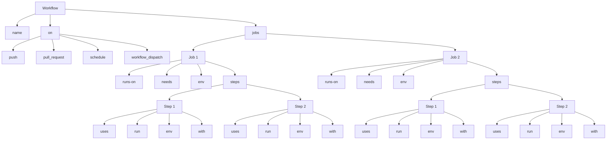
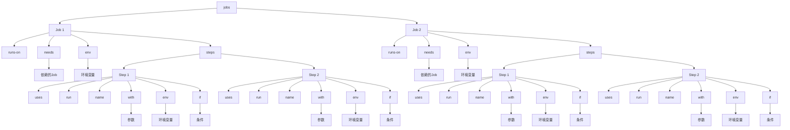
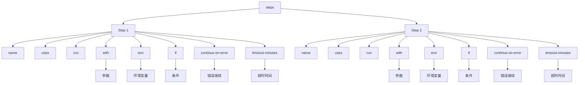

## GitHub Actions

[GitHub Actions](https://docs.github.com/en/actions) 是一个持续集成和持续交付（CI/CD）平台，它允许开发者在 GitHub 仓库中自动化构建、测试和部署软件项目。通过定义工作流文件（workflow），开发者可以在特定事件（如代码提交或发布标签）触发时执行一系列任务。

GitHub Actions 的主要特性：

- **事件驱动**：工作流可以基于 GitHub 上的各种事件（如 push、pull request、issue）触发。
- **基于 YAML 文件**：使用易于编写和阅读的 YAML 文件定义工作流。
- **跨平台支持**：支持在 Linux、macOS 和 Windows 环境下运行作业。
- **安全性**：通过 GitHub Secrets 管理敏感信息，确保工作流的安全性。

GitHub Actions 的主要用途：

- **持续集成（CI）**：在代码每次变更时自动运行构建和测试流程，确保代码的正确性和稳定性。
- **持续交付（CD）**：将代码自动部署到开发、测试或生产环境，确保软件可以快速、安全地发布。
- **自动化任务**：执行其他重复性任务，如代码格式化、依赖管理、安全扫描等。

## GitHub Actions 基本概念

### 工作流（Workflow）

**工作流（Workflow）是 GitHub Actions 的核心单元**，通过 YAML 文件定义，位于 `.github/workflows/` 目录下。工作流文件描述了自动化流程的具体操作步骤，包括何时触发（on）、在何种环境中运行（runs-on）、以及执行的任务（jobs 和 steps）。



| 关键字              | 描述                           | 示例                                                         |
| ------------------- | ------------------------------ | ------------------------------------------------------------ |
| `name`              | 工作流的名称（可选）           | `name: CI/CD Pipeline`                                       |
| `on`                | 定义触发工作流的事件           | `on: [push, pull_request, schedule, workflow_dispatch]`      |
| `push`              | 代码推送事件                   | `push: { branches: [main] }`                                 |
| `pull_request`      | 拉取请求事件                   | `pull_request: { branches: [main] }`                         |
| `schedule`          | 定时器触发                     | `schedule: [{ cron: '0 0 * * *' }]`                          |
| `workflow_dispatch` | 手动触发工作流                 | `workflow_dispatch:`                                         |
| `jobs`              | 包含一个或多个作业             | `jobs: { build: { ... }, test: { ... }, deploy: { ... } }`   |
| `runs-on`           | 指定作业运行的虚拟环境         | `runs-on: ubuntu-latest`                                     |
| `needs`             | 指定作业的依赖关系             | `needs: build`                                               |
| `env`               | 设置环境变量（作业级或步骤级） | `env: { NODE_ENV: production }`                              |
| `steps`             | 作业中的具体操作步骤           | `steps: [ { name: Checkout code, uses: actions/checkout@v2 }, ... ]` |
| `name` (Step)       | 步骤的名称                     | `name: Checkout code`                                        |
| `uses`              | 调用预定义的 action            | `uses: actions/checkout@v2`                                  |
| `run`               | 运行命令行命令                 | `run: npm install`                                           |
| `with`              | 传递给 action 的参数           | `with: { node-version: '14' }`                               |

### 作业（Job）

**作业（Job）是工作流中独立运行的一组步骤。**作业可以在不同的虚拟环境中运行，并且可以并行或按顺序执行；作业之间可以是独立的，也可以相互依赖。



| **关键字**          | **描述**                                                     |
| ------------------- | ------------------------------------------------------------ |
| `jobs`              | 顶级节点，包含所有作业的定义。                               |
| `Job`               | 每个作业的定义，包含运行环境、步骤、依赖关系和环境变量。     |
| `runs-on`           | 指定作业运行的虚拟环境，如 `ubuntu-latest`、`windows-latest`、`macos-latest`。 |
| `steps`             | 包含作业中所有步骤的列表。                                   |
| `Step`              | 每个步骤的定义，可以包含 `uses`、`run`、`name`、`with`、`env` 和 `if` 等子字段。 |
| `uses`              | 调用预定义的 Action，例如 `actions/checkout@v2`。            |
| `run`               | 运行命令行命令，如 `npm install`。                           |
| `name`              | 步骤名称，用于描述步骤的功能。                               |
| `with`              | 传递给 Action 的参数，如 `node-version: '14'`。              |
| `env`               | 环境变量，可以在作业级别或步骤级别定义。                     |
| `if`                | 条件表达式，控制步骤或作业的执行，例如 `if: github.ref == 'refs/heads/main'`。 |
| `needs`             | 定义作业的依赖关系，确保按顺序执行，例如 `needs: [build]`。  |
| `matrix`            | 定义矩阵策略，用于在多个环境组合上并行运行作业。             |
| `timeout-minutes`   | 设置作业超时时间，以分钟为单位，防止作业无限制地运行。       |
| `continue-on-error` | 如果设置为 `true`，即使作业失败也会继续执行后续作业。        |
| `container`         | 在指定的 Docker 容器中运行作业。                             |
| `services`          | 为作业提供依赖服务，如数据库服务。                           |

### 步骤（Step）

**步骤（Step）是作业中的单个任务。**步骤可以是运行命令行命令（run）或调用预定义的 action（uses）。步骤在同一个作业中按顺序执行，且共享相同的上下文，包括工作目录、环境变量等。



| **关键字**          | **描述**                                                     |
| ------------------- | ------------------------------------------------------------ |
| `steps`             | 包含作业中所有步骤的列表。                                   |
| `name`              | 步骤名称，用于描述步骤的功能。                               |
| `uses`              | 调用预定义的 Action，例如 `actions/checkout@v2`。            |
| `run`               | 运行命令行命令，如 `npm install`。                           |
| `with`              | 传递给 Action 的参数，如 `node-version: '14'`。              |
| `env`               | 环境变量，可以在步骤级别定义。                               |
| `if`                | 条件表达式，控制步骤的执行，例如 `if: github.ref == 'refs/heads/main'`。 |
| `continue-on-error` | 如果设置为 `true`，即使步骤失败也会继续执行后续步骤。        |
| `timeout-minutes`   | 设置步骤超时时间，以分钟为单位，防止步骤无限制地运行。       |

### Runner 和执行器（Runner）

Runner 是运行 GitHub Actions 作业的计算资源。GitHub 提供了托管 Runner，也可以使用自托管 Runner。

- **托管 Runner**：由 GitHub 提供和维护，目前支持 Linux、macOS 和 Windows。
- **自托管 Runner**：由用户提供和维护，适用于需要特殊软件或硬件环境的场景。

## GitHub Actions 中 YAML 的具体示例

在 GitHub Actions 中，YAML 文件用于定义工作流的结构和行为。主要包括工作流名称、触发事件、作业和步骤等。

```yaml
name: CI/CD Pipeline

# 定义触发事件：推送到 main 分支、拉取请求到 main 分支、定时触发、手动触发
on:
  push:
    branches:
      - main
  pull_request:
    branches:
      - main
  schedule:
    - cron: '0 0 * * *'
  workflow_dispatch:

jobs:
  build:
    # 使用 GitHub 托管的 Ubuntu 环境
    runs-on: ubuntu-latest

    # 矩阵策略：在多个 Node.js 版本上运行作业
    strategy:
      matrix:
        node-version: [12, 14, 16]

    # 作业级别环境变量
    env:
      BUILD_ENV: production

    steps:
      - name: Checkout code
        # 使用 actions/checkout@v2 Action 检出代码
        uses: actions/checkout@v2

      - name: Set up Node.js
        # 使用 actions/setup-node@v2 Action 设置 Node.js 环境
        uses: actions/setup-node@v2
        with:
          node-version: ${{ matrix.node-version }}

      - name: Install dependencies
        # 运行命令安装依赖
        run: npm install

      - name: Build project
        # 运行命令构建项目
        run: npm run build

      - name: Upload build artifacts
        # 上传构建产物
        uses: actions/upload-artifact@v2
        with:
          name: build-artifacts
          path: build/

  test:
    # 需要等待 build 作业完成后再执行
    needs: build
    runs-on: ubuntu-latest

    # 矩阵策略：在多个 Node.js 版本上运行作业
    strategy:
      matrix:
        node-version: [12, 14, 16]

    steps:
      - name: Checkout code
        uses: actions/checkout@v2

      - name: Set up Node.js
        uses: actions/setup-node@v2
        with:
          node-version: ${{ matrix.node-version }}

      - name: Install dependencies
        run: npm install

      - name: Run tests
        # 运行命令执行测试
        run: npm test
        # 设置步骤级别的环境变量
        env:
          CI: true

  deploy:
    # 需要等待 test 作业完成后再执行
    needs: test
    runs-on: ubuntu-latest

    # 仅在推送到 main 分支时执行部署
    if: github.ref == 'refs/heads/main'

    steps:
      - name: Checkout code
        uses: actions/checkout@v2

      - name: Set up Node.js
        uses: actions/setup-node@v2
        with:
          node-version: 14

      - name: Install dependencies
        run: npm install

      - name: Build project
        run: npm run build

      - name: Deploy to server
        # 使用 GitHub Secrets 管理敏感信息
        env:
          SSH_PRIVATE_KEY: ${{ secrets.SSH_PRIVATE_KEY }}
          REMOTE_USER: ${{ secrets.REMOTE_USER }}
          REMOTE_HOST: ${{ secrets.REMOTE_HOST }}
        run: |
          echo "$SSH_PRIVATE_KEY" | tr -d '\r' | ssh-add - > /dev/null
          ssh -o StrictHostKeyChecking=no $REMOTE_USER@$REMOTE_HOST "mkdir -p ~/myapp"
          rsync -avz -e "ssh -o StrictHostKeyChecking=no" ./build/ $REMOTE_USER@$REMOTE_HOST:~/myapp/
          ssh -o StrictHostKeyChecking=no $REMOTE_USER@$REMOTE_HOST "pm2 restart myapp"
```

## GitHub Actions 基础实践

### 创建第一个 GitHub Actions 工作流

使用模板创建工作流是快速上手 GitHub Actions 的一种方法。GitHub 提供了一些预定义的模板，帮助用户快速生成工作流配置文件，适用于常见的 CI/CD 场景，如构建、测试和部署。

#### 使用模板


1. **访问仓库的 Actions 页面：** 在 GitHub 仓库页面上，点击顶部菜单中的 "Actions" 标签，进入 Actions 页面。
2. **选择模板：** GitHub 会根据仓库中的项目类型推荐一些工作流模板。例如，对于 Node.js 项目，会推荐 Node.js CI 模板。用户可以选择一个合适的模板进行创建。
3. **修改模板：** 选择模板后，GitHub 会展示模板的 YAML 配置文件。用户可以根据需要修改该文件，例如调整触发条件、添加或删除步骤。
4. **保存工作流文件：** 修改完成后，点击 "Start commit" 按钮，将工作流文件保存到仓库的 `.github/workflows/` 目录下。

#### 手动创建

手动编写工作流文件提供了更高的灵活性和控制力，适用于复杂或特定需求的自动化流程。用户可以根据具体需求，自定义工作流的触发条件、作业和步骤。


1. **创建工作流文件：** 在仓库的根目录下创建 `.github/workflows/` 目录。如果该目录不存在，需要手动创建。
2. **编写 YAML 文件：** 在 `.github/workflows/` 目录下创建一个新的 YAML 文件，例如 `ci.yml`。在该文件中定义工作流的名称、触发条件、作业和步骤。
3. **定义工作流名称和触发条件：** 使用 `name` 字段定义工作流的名称，使用 `on` 字段定义工作流的触发条件，如 `push`、`pull_request`。
4. **定义作业和步骤：** 使用 `jobs` 字段定义一个或多个作业，每个作业包含多个步骤。步骤可以是运行命令或调用预定义的 action。

### 使用预定义的 Actions

GitHub Actions 生态系统中包含大量的预定义 Actions，分为官方 Actions 和社区 Actions。官方 Actions 由 GitHub 维护和提供，质量和可靠性有保障；社区 Actions 由开源社区开发和维护，种类丰富，覆盖了各种功能需求。可以在 [GitHub Marketplace](https://github.com/marketplace?type=actions) 查找和使用各种 Actions，查看其文档和示例。

#### 官方 Actions 库

| Action                      | 功能说明                           | 示例                                 |
| --------------------------- | ---------------------------------- | ------------------------------------ |
| `actions/checkout`          | 检查出仓库代码                     | `uses: actions/checkout@v2`          |
| `actions/setup-node`        | 设置 Node.js 环境                  | `uses: actions/setup-node@v2`        |
| `actions/upload-artifact`   | 上传构建工件                       | `uses: actions/upload-artifact@v2`   |
| `actions/download-artifact` | 下载构建工件                       | `uses: actions/download-artifact@v2` |
| `actions/setup-python`      | 设置 Python 环境                   | `uses: actions/setup-python@v2`      |
| `actions/setup-java`        | 设置 Java 环境                     | `uses: actions/setup-java@v2`        |
| `actions/setup-go`          | 设置 Go 环境                       | `uses: actions/setup-go@v3`          |
| `actions/cache`             | 缓存依赖和构建结果                 | `uses: actions/cache@v2`             |
| `actions/github-script`     | 在 GitHub 上运行任意脚本           | `uses: actions/github-script@v5`     |
| `actions/labeler`           | 根据文件更改自动打标签             | `uses: actions/labeler@v2`           |
| `actions/stale`             | 自动标记和关闭过期的 issues 和 PRs | `uses: actions/stale@v5`             |

#### 社区 Actions 库

| Action                                 | 功能说明                    | 示例                                               |
| -------------------------------------- | --------------------------- | -------------------------------------------------- |
| `stefanzweifel/git-auto-commit-action` | 自动提交代码更改            | `uses: stefanzweifel/git-auto-commit-action@v4`    |
| `docker/build-push-action`             | 构建并推送 Docker 镜像      | `uses: docker/build-push-action@v2`                |
| `slackapi/slack-github-action`         | 发送通知到 Slack 频道       | `uses: slackapi/slack-github-action@v1`            |
| `github/codeql-action`                 | 代码安全分析和质量检查      | `uses: github/codeql-action/analyze@v2`            |
| `peter-evans/create-issue-from-file`   | 从文件创建 issue            | `uses: peter-evans/create-issue-from-file@v2`      |
| `softprops/action-gh-release`          | 发布 GitHub Release         | `uses: softprops/action-gh-release@v1`             |
| `peaceiris/actions-gh-pages`           | 部署静态网站到 GitHub Pages | `uses: peaceiris/actions-gh-pages@v3`              |
| `JamesIves/github-pages-deploy-action` | 自动部署到 GitHub Pages     | `uses: JamesIves/github-pages-deploy-action@4.1.4` |
| `coverallsapp/github-action`           | 测试覆盖率报告              | `uses: coverallsapp/github-action@v1`              |
| `actions-rs/toolchain`                 | 设置 Rust 工具链            | `uses: actions-rs/toolchain@v1`                    |
| `microsoft/playwright-github-action`   | 运行 Playwright 测试        | `uses: microsoft/playwright-github-action@v1`      |

使用预定义的 Actions 可以简化工作流配置，快速实现复杂功能。流行的预定义 Actions 通常经过广泛测试和使用，具有较高的可靠性和易用性。

**步骤：**

1. **选择 Action：** 在 GitHub Marketplace 或官方文档中查找需要的 Action，阅读其使用说明和示例。

2. **添加到工作流：** 在工作流文件的 `steps` 部分，使用 `uses` 关键字引用选定的 Action，并根据需求传递参数。

3. **具体示例：** 使用 `actions/checkout` 和 `actions/setup-node` Actions 的工作流示例：

   ```yaml
   jobs:
     build:
       runs-on: ubuntu-latest
       steps:
       - name: Checkout code
         uses: actions/checkout@v2 # 该 Action 用于将仓库代码检出到 Runner 的工作目录。此步骤通常是工作流的第一步，用于获取最新代码。
       - name: Set up Node.js
         uses: actions/setup-node@v2
         with:
           node-version: '14'
       - name: Install dependencies
         run: npm install
       - name: Run tests
         run: npm test
   ```

   **示例解析：**

   - `actions/checkout`：
   - `actions/setup-node`：该 Action 用于设置 Node.js 环境。通过传递 `node-version` 参数，指定要使用的 Node.js 版本。
   - `run`：使用 `run` 关键字直接运行命令行命令，如安装依赖和运行测试。

### 运行基本的 CI 流程

#### 构建

构建工具用于自动化编译、打包和依赖管理，是 CI 流程的重要组成部分。Maven 和 Gradle 是常见的 Java 项目构建工具，其他语言也有类似的工具，如 Node.js 的 npm 和 Python 的 pip。

**步骤：**

1. **设置构建环境：** 在工作流文件中，配置运行环境和必要的依赖工具。例如，在 Java 项目中，通常需要设置 JDK 环境。
2. **添加构建步骤：** 在 `steps` 部分，使用 `run` 关键字执行构建工具的命令，如 `mvn install` 或 `gradle build`。

**示例：** 集成 Maven 的工作流文件示例：

```yaml
jobs:
  build:
    runs-on: ubuntu-latest
    steps:
    - name: Checkout code
      uses: actions/checkout@v2
    - name: Set up JDK
      uses: actions/setup-java@v2
      with:
        java-version: '11'
    - name: Build with Maven
      run: mvn install
```

集成 Gradle 的工作流文件示例：

```yaml
jobs:
  build:
    runs-on: ubuntu-latest
    steps:
    - name: Checkout code
      uses: actions/checkout@v2
    - name: Set up JDK
      uses: actions/setup-java@v2
      with:
        java-version: '11'
    - name: Build with Gradle
      run: gradle build
```

#### 测试

单元测试和集成测试是保证代码质量和功能正确性的关键步骤。通过在工作流中集成测试步骤，可以在每次代码变更时自动运行测试，及时发现和修复问题。

**步骤：**

1. **配置测试环境：** 确保工作流中包含必要的依赖工具和环境设置，以便能够运行测试。例如，在 Node.js 项目中，需要安装依赖包。
2. **添加测试步骤：** 在 `steps` 部分，使用 `run` 关键字执行测试命令，如 `npm test`、`mvn test` 或 `gradle test`。

**示例：** 添加单元测试和集成测试的工作流文件示例（Node.js 项目）：

```yaml
jobs:
  build:
    runs-on: ubuntu-latest
    steps:
    - name: Checkout code
      uses: actions/checkout@v2
    - name: Set up Node.js
      uses: actions/setup-node@v2
      with:
        node-version: '14'
    - name: Install dependencies
      run: npm install
    - name: Run unit tests
      run: npm test
    - name: Run integration tests
      run: npm run integration-test
```

添加单元测试和集成测试的工作流文件示例（Java 项目）：

```yaml
jobs:
  build:
    runs-on: ubuntu-latest
    steps:
    - name: Checkout code
      uses: actions/checkout@v2
    - name: Set up JDK
      uses: actions/setup-java@v2
      with:
        java-version: '11'
    - name: Build with Maven
      run: mvn install
    - name: Run unit tests
      run: mvn test
    - name: Run integration tests
      run: mvn verify
```

## GitHub Actions 进阶操作

### 自定义 Actions

#### 创建和发布 JavaScript Actions

JavaScript Actions 是基于 Node.js 环境执行的自定义 Actions，适用于编写需要复杂逻辑或与 Node.js 生态系统集成的任务。它们可以复用现有的 npm 包，并且易于调试和测试。

1. **初始化项目：** 使用 `npm init` 初始化一个新的 Node.js 项目，并安装必要的依赖。

   ```shell
   $ mkdir my-action
   $ cd my-action
   $ npm init -y
   $ npm install @actions/core @actions/github
   ```

2. **编写代码：** 创建 `index.js` 文件，编写 Action 的核心逻辑。

   ```javascript
   const core = require('@actions/core');
   const github = require('@actions/github');
   
   try {
     const nameToGreet = core.getInput('who-to-greet');
     console.log(`Hello ${nameToGreet}!`);
     const time = new Date().toTimeString();
     core.setOutput("time", time);
   } catch (error) {
     core.setFailed(error.message);
   }
   ```

3. **创建 Action 元数据文件：** 在项目根目录下创建 `action.yml` 文件，定义 Action 的元数据。

   ```yaml
   name: 'Hello World'
   description: 'Greet someone and print the current time'
   inputs:
     who-to-greet:
       description: 'The name of the person to greet'
       required: true
       default: 'World'
   runs:
     using: 'node12'
     main: 'index.js'
   ```

4. **发布 Action：** 将代码提交到 GitHub 仓库，并打标签发布。

   ```shell
   $ git add .
   $ git commit -m "Initial commit"
   $ git tag -a -m "Initial release" v1
   $ git push --follow-tags
   ```

5. **示例使用：**在工作流中使用自定义的 JavaScript Action：

    ```yaml
    jobs:
      greet:
        runs-on: ubuntu-latest
        steps:
        - name: Checkout code
          uses: actions/checkout@v2
        - name: Greet
          uses: my-org/my-action@v1
          with:
            who-to-greet: 'John Doe'
    ```

#### 创建和发布 Docker Actions

Docker Actions 运行在 Docker 容器中，适用于需要特定环境或依赖的任务。通过 Docker，可以确保 Action 在各种环境中具有一致的运行行为。

1. **创建 Dockerfile：** 在项目根目录下创建 `Dockerfile`，定义容器的构建过程。

   ```dockerfile
   FROM node:12-alpine
   COPY . /my-action
   WORKDIR /my-action
   RUN npm install
   ENTRYPOINT ["node", "/my-action/index.js"]
   ```

2. **编写代码：** 创建 `index.js` 文件，编写 Action 的核心逻辑。

   ```javascript
   const core = require('@actions/core');
   const github = require('@actions/github');
   
   try {
     const nameToGreet = core.getInput('who-to-greet');
     console.log(`Hello ${nameToGreet}!`);
     const time = new Date().toTimeString();
     core.setOutput("time", time);
   } catch (error) {
     core.setFailed(error.message);
   }
   ```

3. **创建 Action 元数据文件：** 在项目根目录下创建 `action.yml` 文件，定义 Action 的元数据。

   ```yaml
   name: 'Hello World'
   description: 'Greet someone and print the current time'
   inputs:
     who-to-greet:
       description: 'The name of the person to greet'
       required: true
       default: 'World'
   runs:
     using: 'docker'
     image: 'Dockerfile'
   ```

4. **发布 Action：** 将代码提交到 GitHub 仓库，并打标签发布。

   ```shell
   $ git add .
   $ git commit -m "Initial commit"
   $ git tag -a -m "Initial release" v1
   $ git push --follow-tags
   ```

5. **示例使用：** 在工作流中使用自定义的 Docker Action：

    ```yaml
    jobs:
      greet:
        runs-on: ubuntu-latest
        steps:
        - name: Checkout code
          uses: actions/checkout@v2
        - name: Greet
          uses: my-org/my-action@v1
          with:
            who-to-greet: 'Jane Doe'
    ```

#### 使用 Composite Actions 复用步骤

Composite Actions 允许将多个步骤组合成一个 Action，以便在多个工作流中复用。适用于需要多个步骤的复杂任务。

**步骤：**

1. **创建 Composite Action 文件：** 在项目根目录下创建 `action.yml` 文件，定义 Composite Action。

   ```yaml
   name: 'Greet and Time'
   description: 'Greet someone and print the current time'
   inputs:
     who-to-greet:
       description: 'The name of the person to greet'
       required: true
       default: 'World'
   runs:
     using: 'composite'
     steps:
     - run: echo "Hello ${{ inputs.who-to-greet }}!"
     - run: echo "The current time is ${{ steps.time.outputs.time }}"
       id: time
       shell: bash
   ```

2. **发布 Composite Action：** 将代码提交到 GitHub 仓库，并打标签发布。

   ```shell
   $ git add .
   $ git commit -m "Initial commit"
   $ git tag -a -m "Initial release" v1
   $ git push --follow-tags
   ```

3. **示例使用：** 在工中使用自定义的 Composite Action：

```yaml
jobs:
  greet_and_time:
    runs-on: ubuntu-latest
    steps:
    - name: Checkout code
      uses: actions/checkout@v2
    - name: Greet and Time
      uses: my-org/greet-and-time@v1
      with:
        who-to-greet: 'Alice'
```

### 使用 GitHub Secrets 进行安全管理

#### 添加和管理 Secrets

Secrets 是 GitHub 提供的一种安全管理敏感信息的方法，用于存储诸如 API 密钥、凭据和其他机密数据。Secrets 可以在工作流中安全地引用，而不暴露实际值。

**步骤：**

1. **添加 Secrets：** 在 GitHub 仓库页面，进入 "Settings" -> "Secrets" -> "Actions"，点击 "New repository secret" 添加新的 Secret。
   - **Name**：为 Secret 取一个名称，例如 `MY_SECRET`.
   - **Value**：输入 Secret 的值，例如 `super-secret-value`.
2. **管理 Secrets：** Secrets 可以通过 GitHub 界面进行添加、编辑和删除。注意：Secret 值一旦保存，不能直接查看，只能通过工作流引用。

#### 在工作流中安全地使用 Secrets

在工作流中，可以通过 `${{ secrets.SECRET_NAME }}` 的语法安全地引用 Secrets。GitHub Actions 会在运行时将该表达式替换为实际的 Secret 值。

```yaml
jobs:
  build:
    runs-on: ubuntu-latest
    steps:
    - name: Checkout code
      uses: actions/checkout@v2
    - name: Use Secret
      run: echo "The secret is ${{ secrets.MY_SECRET }}"
```

**示例解析：**

- `secrets.MY_SECRET`：引用名称为 `MY_SECRET` 的 Secret。GitHub Actions 会在运行时自动替换为 Secret 的实际值。

### 设置条件化执行和并行作业

#### 使用 `if` 表达式设置条件化执行

`if` 表达式允许根据条件控制工作流的执行。例如，可以在特定分支上执行特定步骤，或在测试失败时停止后续步骤。

```yaml
jobs:
  build:
    runs-on: ubuntu-latest
    steps:
    - name: Checkout code
      uses: actions/checkout@v2
    - name: Run tests
      run: npm test
    - name: Deploy
      if: github.ref == 'refs/heads/main' && success()
      run: ./deploy.sh
```

**示例解析：**

- `if: github.ref == 'refs/heads/main' && success()`：仅在当前分支为 `main` 且前一步骤成功时执行 `deploy` 步骤。

#### 配置并行作业和依赖关系

默认情况下，GitHub Actions 中的作业是并行运行的。通过配置 `needs` 关键字，可以定义作业之间的依赖关系，确保某些作业按顺序执行。

```yaml
jobs:
  build:
    runs-on: ubuntu-latest
    steps:
    - name: Checkout code
      uses: actions/checkout@v2
    - name: Build project
      run: npm build

  test:
    runs-on: ubuntu-latest
    needs: build
    steps:
    - name: Checkout code
      uses: actions/checkout@v2
    - name: Run tests
      run: npm test

  deploy:
    runs-on: ubuntu-latest
    needs: [build, test]
    steps:
    - name: Checkout code
      uses: actions/checkout@v2
    - name: Deploy project
      run: ./deploy.sh
```

**示例解析：**

- `needs: build`：表示 `test` 作业依赖 `build` 作业，`test` 作业将在 `build` 作业完成后执行。
- `needs: [build, test]`：表示 `deploy` 作业依赖 `build` 和 `test` 作业，`deploy` 作业将在 `build` 和 `test` 作业完成后执行。

### 集成第三方服务（如 Slack、AWS、Azure）

#### 使用 Webhooks 和自定义 Notifications

Webhooks 允许工作流在特定事件发生时向外部服务发送 HTTP 请求，实现与外部服务的集成和通知。自定义 Notifications 可用于在工作流执行过程中发送通知，例如 Slack 通知。

**示例：** 向 Slack 发送通知：

1. **创建 Slack Webhook URL：** 在 Slack 工作区中，创建一个新的 Webhook URL。

2. **添加 Slack Webhook URL 到 Secrets：** 在 GitHub 仓库中添加一个新的 Secret，例如 `SLACK_WEBHOOK_URL`，保存 Webhook URL。

3. **在工作流中使用 Webhook URL：**

   ```yaml
   jobs:
     notify:
       runs-on: ubuntu-latest
       steps:
       - name: Send notification to Slack
         run: |
           curl -X POST -H 'Content-type: application/json' \
           --data '{"text":"Build completed successfully!"}' \
           ${{ secrets.SLACK_WEBHOOK_URL }}
   ```

**示例解析：**

- `secrets.SLACK_WEBHOOK_URL`：引用名称为 `SLACK_WEBHOOK_URL` 的 Secret，用于发送 HTTP 请求到 Slack Webhook URL。

#### 部署到 AWS、Azure、GCP 等云服务

GitHub Actions 可以与各大云服务平台（如 AWS、Azure、GCP）集成，实现自动化部署。通过使用官方或社区提供的 Actions，可以简化部署流程。

**部署到 AWS S3：**

1. **添加 AWS 凭证到 Secrets：** 在 GitHub 仓库中添加 `AWS_ACCESS_KEY_ID` 和 `AWS_SECRET_ACCESS_KEY` Secrets。

2. **在工作流中配置部署步骤：**

   ```yaml
   jobs:
     deploy:
       runs-on: ubuntu-latest
       steps:
       - name: Checkout code
         uses: actions/checkout@v2
       - name: Upload to S3
         uses: aws-actions/configure-aws-credentials@v1
         with:
           aws-access-key-id: ${{ secrets.AWS_ACCESS_KEY_ID }}
           aws-secret-access-key: ${{ secrets.AWS_SECRET_ACCESS_KEY }}
           aws-region: us-west-2
       - name: Sync S3 bucket
         run: |
           aws s3 sync . s3://my-bucket --exclude ".git/*"
   ```

**示例解析：**

- `aws-actions/configure-aws-credentials@v1`：配置 AWS 凭证和区域。
- `aws s3 sync`：使用 AWS CLI 将代码同步到 S3 存储桶。

#### 通知集成（如 Slack、Microsoft Teams）

除了 Webhooks，GitHub Actions 还可以通过官方和社区 Actions 发送通知到各种消息平台，如 Slack 和 Microsoft Teams。这些通知可以用于报告工作流状态、构建结果等。

**发送通知到 Microsoft Teams：**

1. **创建 Microsoft Teams Webhook URL：** 在 Microsoft Teams 中，创建一个新的 Webhook URL。

2. **添加 Webhook URL 到 Secrets：** 在 GitHub 仓库中添加一个新的 Secret，例如 `TEAMS_WEBHOOK_URL`，保存 Webhook URL。

3. **在工作流中使用 Webhook URL：**

   ```yaml
   jobs:
     notify:
       runs-on: ubuntu-latest
       steps:
       - name: Send notification to Microsoft Teams
         run: |
           curl -H 'Content-Type: application/json' \
           -d '{"title": "Build Notification", "text": "The build has completed successfully!"}' \
           ${{ secrets.TEAMS_WEBHOOK_URL }}
   ```

**示例解析：**

- `secrets.TEAMS_WEBHOOK_URL`：引用名称为 `TEAMS_WEBHOOK_URL` 的 Secret，用于发送 HTTP 请求到 Microsoft Teams Webhook URL。

## GitHub Actions 高级实践

### 持续交付（CD）流程

#### 配置持续交付流水线

持续交付（CD）是软件工程中的一项实践，旨在通过自动化部署过程，使软件能够随时发布到任何环境。GitHub Actions 提供了强大的工具支持配置和管理 CD 流水线。

**步骤：**

1. **创建工作流文件：** 在 `.github/workflows/` 目录下创建一个新的工作流文件，例如 `cd.yml`。

2. **定义触发条件：** 配置工作流在合适的事件发生时触发，如代码推送到主分支或发布标签创建。

   ```yaml
   on:
     push:
       branches:
         - main
     release:
       types: [created]
   ```

3. **配置作业：** 定义 CD 流水线的各个作业，包括构建、测试和部署。

```yaml
name: CD Pipeline

on:
  push:
    branches:
      - main
  release:
    types: [created]

jobs:
  build:
    runs-on: ubuntu-latest
    steps:
    - name: Checkout code
      uses: actions/checkout@v2
    - name: Build project
      run: npm build

  test:
    runs-on: ubuntu-latest
    needs: build
    steps:
    - name: Checkout code
      uses: actions/checkout@v2
    - name: Run tests
      run: npm test

  deploy:
    runs-on: ubuntu-latest
    needs: [build, test]
    steps:
    - name: Checkout code
      uses: actions/checkout@v2
    - name: Deploy to production
      run: ./deploy.sh
```

#### 自动化版本发布和部署

自动化版本发布和部署确保软件能够快速、安全地交付给用户，减少人为操作和错误。GitHub Actions 可以自动执行版本号管理、构建工件发布和部署到目标环境。

**步骤：**

1. **版本号管理：** 在构建完成后，使用脚本自动更新版本号。
2. **发布构建工件：** 使用 `actions/upload-artifact` 将构建工件上传到 GitHub，或使用 `actions/create-release` 创建 GitHub Release。
3. **自动部署：** 配置部署步骤，将构建工件部署到目标环境。

```yaml
jobs:
  build:
    runs-on: ubuntu-latest
    steps:
    - name: Checkout code
      uses: actions/checkout@v2
    - name: Set up Node.js
      uses: actions/setup-node@v2
      with:
        node-version: '14'
    - name: Build project
      run: npm build
    - name: Upload build artifacts
      uses: actions/upload-artifact@v2
      with:
        name: build-artifacts
        path: build/

  release:
    runs-on: ubuntu-latest
    needs: build
    steps:
    - name: Checkout code
      uses: actions/checkout@v2
    - name: Create GitHub Release
      uses: actions/create-release@v1
      env:
        GITHUB_TOKEN: ${{ secrets.GITHUB_TOKEN }}
      with:
        tag_name: v1.0.0
        release_name: Release v1.0.0
        draft: false
        prerelease: false
    - name: Upload release assets
      uses: actions/upload-release-asset@v1
      with:
        upload_url: ${{ steps.create_release.outputs.upload_url }}
        asset_path: ./build/
        asset_name: build-artifacts.zip
        asset_content_type: application/zip

  deploy:
    runs-on: ubuntu-latest
    needs: release
    steps:
    - name: Checkout code
      uses: actions/checkout@v2
    - name: Deploy to production
      run: ./deploy.sh
```

### 使用矩阵构建不同环境和配置

#### 定义矩阵策略

矩阵策略允许在多个环境和配置下并行运行作业，确保代码在不同平台、依赖版本和配置下的兼容性和稳定性。

**步骤：**

1. **定义矩阵：** 在工作流文件中使用 `matrix` 关键字定义多个变量组合。
2. **配置作业：** 配置作业使用矩阵变量运行。

```yaml
jobs:
  build:
    runs-on: ubuntu-latest
    strategy:
      matrix:
        node-version: [12, 14, 16]
        os: [ubuntu-latest, windows-latest, macos-latest]
    steps:
    - name: Checkout code
      uses: actions/checkout@v2
    - name: Setup Node.js
      uses: actions/setup-node@v2
      with:
        node-version: ${{ matrix.node-version }}
    - name: Install dependencies
      run: npm install
    - name: Run tests
      run: npm test
```

#### 针对不同操作系统和依赖版本运行作业

使用矩阵策略，可以针对不同操作系统和依赖版本并行运行作业，验证代码在多种环境下的行为。

**示例： 在多个操作系统和 Node.js 版本上运行测试：**

```yaml
jobs:
  test:
    runs-on: ${{ matrix.os }}
    strategy:
      matrix:
        node-version: [12, 14, 16]
        os: [ubuntu-latest, windows-latest, macos-latest]
    steps:
    - name: Checkout code
      uses: actions/checkout@v2
    - name: Setup Node.js
      uses: actions/setup-node@v2
      with:
        node-version: ${{ matrix.node-version }}
    - name: Install dependencies
      run: npm install
    - name: Run tests
      run: npm test
```

### 部署到 Kubernetes

#### 使用 `kubectl` 和 `kustomize` 进行 Kubernetes 部署

`kubectl` 是 Kubernetes 的命令行工具，用于管理 Kubernetes 集群。`kustomize` 允许在 Kubernetes 原生清单上进行声明式配置管理。使用它们可以实现自动化 Kubernetes 部署。

**步骤：**

1. **配置 Kubernetes 凭证：** 在 GitHub Secrets 中添加 Kubernetes 配置，例如 `KUBE_CONFIG`.
2. **编写部署步骤：** 在工作流中使用 `kubectl` 和 `kustomize` 部署应用。

```yaml
jobs:
  deploy:
    runs-on: ubuntu-latest
    steps:
    - name: Checkout code
      uses: actions/checkout@v2
    - name: Set up kubectl
      uses: azure/setup-kubectl@v1
      with:
        version: 'v1.18.0'
    - name: Deploy to Kubernetes
      env:
        KUBE_CONFIG: ${{ secrets.KUBE_CONFIG }}
      run: |
        kubectl apply -k ./kustomize
```

#### 集成 Helm Charts

Helm 是 Kubernetes 的包管理工具，使用 Charts 定义、安装和管理 Kubernetes 应用。通过 Helm 可以简化 Kubernetes 应用的部署和管理。

**步骤：**

1. **添加 Helm 凭证：** 在 GitHub Secrets 中添加 Helm 凭证，例如 `HELM_REPO_URL` 和 `HELM_REPO_AUTH`.
2. **编写部署步骤：** 在工作流中使用 Helm 部署应用。

```yaml
jobs:
  deploy:
    runs-on: ubuntu-latest
    steps:
    - name: Checkout code
      uses: actions/checkout@v2
    - name: Set up Helm
      uses: azure/setup-helm@v1
    - name: Deploy with Helm
      env:
        HELM_REPO_URL: ${{ secrets.HELM_REPO_URL }}
        HELM_REPO_AUTH: ${{ secrets.HELM_REPO_AUTH }}
      run: |
        helm repo add my-repo $HELM_REPO_URL --username $HELM_REPO_AUTH
        helm upgrade --install my-release my-repo/my-chart
```

#### 4.3.3 配置自动扩展和滚动更新

自动扩展和滚动更新是 Kubernetes 提供的功能，用于动态调整应用实例数量和无停机时间更新应用。配置这些功能可以提高应用的弹性和可靠性。

**步骤：**

1. **编写 Kubernetes 配置文件：** 使用 HPA（Horizontal Pod Autoscaler）和 Rolling Update 策略配置文件。
2. **在工作流中应用配置：** 使用 `kubectl` 命令应用这些配置。

```yaml
jobs:
  deploy:
    runs-on: ubuntu-latest
    steps:
    - name: Checkout code
      uses: actions/checkout@v2
    - name: Set up kubectl
      uses: azure/setup-kubectl@v1
      with:
        version: 'v1.18.0'
    - name: Apply Kubernetes configuration
      env:
        KUBE_CONFIG: ${{ secrets.KUBE_CONFIG }}
      run: |
        kubectl apply -f k8s/deployment.yaml
        kubectl apply -f k8s/hpa.yaml
```

### 性能优化和故障排查

#### 优化工作流运行时间

优化工作流运行时间可以提高开发效率，减少等待时间。通过并行执行任务、缓存依赖和减少不必要的步骤可以实现优化。

**步骤：**

1. **使用缓存：** 使用 `actions/cache` 缓存依赖，减少重复下载和安装时间。
2. **并行执行任务：** 将独立的任务配置为并行执行，减少总运行时间。

```yaml
jobs:
  build:
    runs-on: ubuntu-latest
    steps:
    - name: Checkout code
      uses: actions/checkout@v2
    - name: Cache npm dependencies
      uses: actions/cache@v2
      with:
        path: ~/.npm
        key: ${{ runner.os }}-node-${{ hashFiles('**/package-lock.json') }}
        restore-keys: |
          ${{ runner.os }}-node-
    - name: Install dependencies
      run: npm install
    - name: Build project
      run: npm build
```

#### 日志和调试

通过分析日志可以排查工作流中的问题。GitHub Actions 提供详细的日志记录，可以在执行过程中查看每个步骤的输出。

**步骤：**

1. **启用调试日志：** 在工作流文件中设置 `ACTIONS_STEP_DEBUG` 环境变量为 `true`。
2. **查看运行日志：** 在 GitHub Actions 界面查看每个作业和步骤的详细日志。

```yaml
jobs:
  build:
    runs-on: ubuntu-latest
    env:
      ACTIONS_STEP_DEBUG: true
    steps:
    - name: Checkout code
      uses: actions/checkout@v2
    - name: Run tests
      run: npm test
```

#### 监控和告警设置

通过监控和告警可以及时发现和处理问题，确保工作流的稳定运行。可以使用外部服务（如 Prometheus 和 Grafana）或集成通知（如 Slack）实现监控和告警。

**步骤：**

1. **集成监控工具：** 在工作流中集成 Prometheus、Grafana 等监控工具，收集和可视化指标数据。
2. **设置告警通知：** 在工作流中配置告警通知，通过 Slack 或 Email 接收告警信息。

**示例： 通过 Slack 发送告警通知：**

```yaml
jobs:
  notify:
    runs-on: ubuntu-latest
    steps:
    - name: Send notification to Slack
      run: |
        curl -X POST -H 'Content-type: application/json' \
        --data '{"text":"Build failed!"}' \
        ${{ secrets.SLACK_WEBHOOK_URL }}
```

## GitHub Actions 与其他 CI/CD 工具的对比

CI/CD 工具用于自动化软件构建、测试和部署过程，确保快速和可靠的发布周期。不同的工具有各自的优势和特点，适合不同规模和需求的项目。

### Jenkins

Jenkins 是一个开源的自动化服务器，广泛用于构建、部署和自动化任何项目。由于其强大的插件生态系统和可扩展性，Jenkins 成为许多企业的首选 CI/CD 工具。

**优点：**

- **开源和可扩展性**：庞大的插件库，可以满足几乎所有的 CI/CD 需求。
- **广泛的社区支持**：活跃的社区和丰富的资源（文档、教程、插件）。
- **可自托管**：完全控制构建环境和安全性，适用于企业内部部署。

**缺点：**

- **复杂性**：设置和维护可能需要大量时间和经验。
- **用户界面**：传统界面可能不够直观，需要学习曲线。
- **资源消耗**：自托管模式需要管理服务器资源。

**适用场景：**

- 需要高度定制化和控制的企业级项目。
- 复杂的构建和部署流水线。

**示例：**

```pipline
pipeline {
    agent any
    stages {
        stage('Build') {
            steps {
                sh 'mvn clean install'
            }
        }
        stage('Test') {
            steps {
                sh 'mvn test'
            }
        }
        stage('Deploy') {
            steps {
                sh './deploy.sh'
            }
        }
    }
}
```

### Travis CI

Travis CI 是一个基于云的 CI 服务，特别适合开源项目。它提供简单的配置和与 GitHub 的深度集成。

**优点：**

- **简单易用**：配置文件简洁明了，适合快速上手。
- **开源友好**：免费提供给开源项目。
- **GitHub 集成**：无缝集成 GitHub 仓库。

**缺点：**

- **有限的自定义**：相比 Jenkins，Travis CI 的自定义能力较弱。
- **资源限制**：免费版有并发构建和资源使用限制。
- **速度和稳定性**：在高峰期可能会出现构建排队和延迟。

**适用场景：**

- 开源项目。
- 需要快速上手和简便配置的小型项目。

**示例：**

```yaml
language: java
jdk:
  - openjdk11
script:
  - mvn clean install
  - mvn test
deploy:
  provider: script
  script: ./deploy.sh
  on:
    branch: main
```

### CircleCI

CircleCI 是一个基于云的 CI/CD 工具，提供灵活的配置和强大的并行执行能力，支持多种编程语言和框架。

**优点：**

- **并行执行**：支持并行化构建和测试，加快 CI/CD 流水线速度。
- **灵活配置**：通过 YAML 文件配置流水线，支持多种语言和环境。
- **集成和扩展**：与 GitHub、Bitbucket 和 Docker 集成良好。

**缺点：**

- **成本**：高级功能和更多资源需要付费。
- **复杂配置**：高级功能可能需要复杂的配置和调试。
- **资源限制**：免费版有并发和资源使用限制。

**适用场景：**

- 需要高并发和快速构建的大型项目。
- 希望在云端管理 CI/CD 流水线的项目。

**示例：**

```yaml
version: 2.1
jobs:
  build:
    docker:
      - image: circleci/openjdk:11
    steps:
      - checkout
      - run: mvn clean install
      - run: mvn test
workflows:
  version: 2
  build-and-test:
    jobs:
      - build
```

### GitLab CI

GitLab CI 是 GitLab 集成的 CI/CD 工具，提供完整的 DevOps 生命周期管理，适合从代码托管到部署的全流程管理。

**优点：**

- **集成性**：与 GitLab 无缝集成，支持整个 DevOps 生命周期。
- **自托管**：提供自托管和云端版本，满足不同企业需求。
- **安全性**：内置的安全扫描和代码质量检查功能。

**缺点：**

- **复杂性**：全面的功能可能需要较长的学习曲线。
- **资源管理**：自托管版本需要额外的资源管理和维护。
- **界面**：某些高级功能的界面和配置可能不够直观。

**适用场景：**

- 需要一体化 DevOps 解决方案的企业。
- 希望在同一平台上管理代码、CI/CD 和部署的项目。

**示例：**

```yaml
stages:
  - build
  - test
  - deploy

build:
  stage: build
  script:
    - mvn clean install

test:
  stage: test
  script:
    - mvn test

deploy:
  stage: deploy
  script:
    - ./deploy.sh
  only:
    - main
```

### 比较总结

| 特性             | Jenkins                  | Travis CI          | CircleCI                   | GitLab CI                |
| ---------------- | ------------------------ | ------------------ | -------------------------- | ------------------------ |
| **开源/商业**    | 开源                     | 商业，开源项目免费 | 商业，开源项目有限免费     | 开源，商业版             |
| **托管方式**     | 自托管                   | 云服务             | 云服务，自托管             | 云服务，自托管           |
| **扩展性**       | 高                       | 中                 | 中                         | 高                       |
| **配置复杂度**   | 高                       | 低                 | 中                         | 中                       |
| **社区支持**     | 强                       | 强                 | 强                         | 强                       |
| **适用项目类型** | 大型企业项目，复杂流水线 | 开源项目，小型项目 | 需要高并发和快速构建的项目 | 希望全流程管理的企业项目 |

不同的 CI/CD 工具各有优劣，选择合适的工具需要根据项目规模、复杂度和团队需求进行综合考虑。
