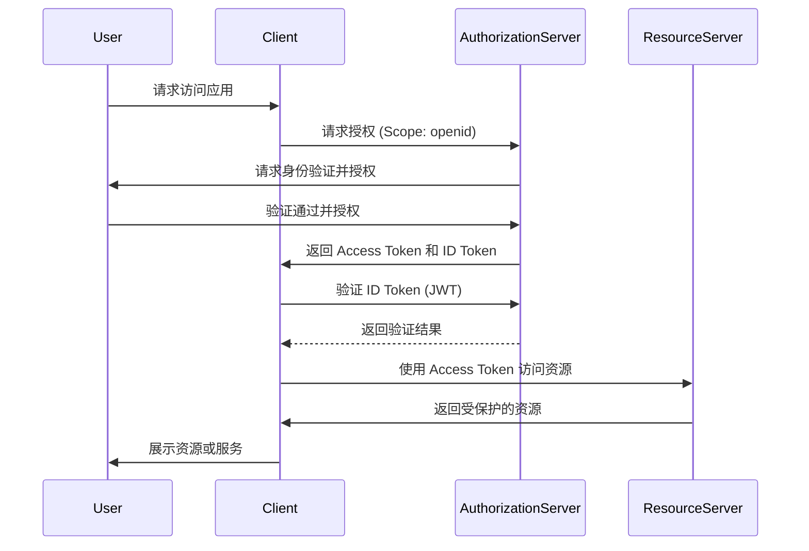
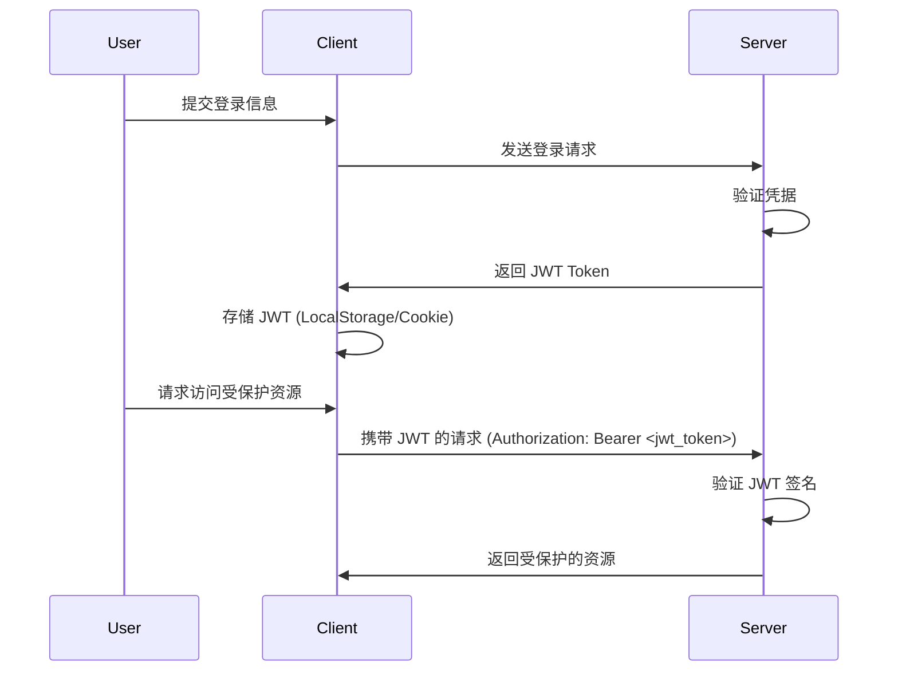

## HTTP 协议

**HTTP（HyperText Transfer Protocol）是互联网应用中最基础的通信协议之一，主要用于在客户端（通常是浏览器）和服务器之间传输超文本。** 随着互联网的发展，HTTP 协议经历了多个版本的演变，每次升级都引入了更高效、更安全的特性，特别是对现代 Web 和 API 开发有着重要的影响。

### HTTP 的发展历史

HTTP 协议自从 1990 年代初被发明以来，已经经历了多个版本的升级，目的是为了应对不断增长的 Web 流量需求，提升数据传输效率和安全性。

- **HTTP/0.9**: 这是最早期的 HTTP 版本，仅支持 GET 请求和简单的 HTML 文档传输，完全没有状态码、Headers 的概念。它只能请求单一资源，没有元数据传递。
- **HTTP/1.0**: 引入了多种请求方法（如 POST 和 HEAD）、状态码（如 404）、Headers 机制（如 Content-Type），支持传输更多数据类型。这是第一代较为成熟的 HTTP 协议。
- **HTTP/1.1**: 在 1997 年发布，成为 Web 应用的主流协议。该版本引入了持久连接（Persistent Connections）、管道化（Pipelining），减少了每次请求都需要重新建立连接的开销，并且进一步扩展了 HTTP 方法、增加了缓存控制等重要特性。这一版本至今仍广泛使用。
- **HTTP/2**: 该版本于 2015 年发布，旨在大幅提升 Web 性能。HTTP/2 通过多路复用（Multiplexing）支持在同一个 TCP 连接上并发多个请求，减少了延迟，还引入了 Header 压缩、服务器推送（Server Push）等优化。
- **HTTP/3**: 基于 QUIC 协议（UDP 的一种扩展），HTTP/3 主要解决了 HTTP/2 中的队头阻塞问题，提供了更快、更可靠的数据传输，尤其适用于移动设备和高延迟网络环境。

**版本对 API 设计的影响**: 随着 HTTP 版本的升级，API 开发者在设计时必须考虑到版本的特性。例如，HTTP/2 允许并行处理多个请求，因此在 RESTful API 设计中可以优化性能，减少请求数量。此外，HTTP/2 和 HTTP/3 的 Header 压缩也能提高传输效率。

### 请求/响应模型详解

**HTTP 是基于请求 - 响应模型**的，这意味着每当客户端需要访问资源时，都会向服务器发送请求，并接收到服务器的响应。这种**通信模式是无状态的，即每个请求都独立进行，服务器不会记住之前的请求。**

#### 请求的组成部分

| **请求组成部分**     | **描述**                                                     |
| -------------------- | ------------------------------------------------------------ |
| **请求行**           | 包含 HTTP 方法（如 GET、POST）、目标资源的 URI 和协议版本，定义了请求的类型和目标资源。 |
| **Headers**          | 提供关于请求的元信息，如内容类型、用户代理、认证信息等，帮助服务器处理请求。 |
| **Body**             | 包含请求发送的实际数据，通常用于 POST、PUT 等方法，可包含 JSON、XML、表单数据等格式。 |
| **方法（Method）**   | 指定请求的操作类型，常见方法包括 GET（获取资源）、POST（创建资源）、PUT（更新资源）、DELETE（删除资源）。 |
| **Query Parameters** | URL 中可选的参数，用于筛选或过滤请求的数据。                 |
| **Cookies**          | 客户端存储的信息，用于会话管理，随请求自动发送至服务器。     |
| **Path Variables**   | URL 路径中的动态参数，标识特定资源或操作。                   |

#### 响应的组成部分

| **响应组成部分** | **描述**                                                     |
| ---------------- | ------------------------------------------------------------ |
| **状态行**       | 包含协议版本、状态码及其文本描述，指示服务器对请求的处理结果。 |
| **Headers**      | 提供响应的元信息，如内容类型、内容长度、缓存控制等，帮助客户端理解和处理响应。 |
| **Body**         | 响应体包含实际返回的数据，格式可能为 JSON、HTML、XML 等，取决于请求类型和响应内容。 |
| **状态码**       | 三位数代码，表明请求结果，主要分为成功（2xx）、客户端错误（4xx）、服务器错误（5xx）等。 |
| **协议版本**     | 指定 HTTP 协议的版本，如 HTTP/1.1 或 HTTP/2，决定了通信方式的特性和性能。 |
| **Cookies**      | 服务器通过响应设置客户端的 Cookies，用于会话管理或跟踪用户状态。 |
| **缓存控制**     | 通过响应头控制客户端或代理服务器的缓存策略，优化性能，减少重复请求。 |
| **重定向**       | 通过 3xx 状态码和 `Location` 头实现，将客户端引导至新的资源 URI。 |

### HTTP 方法的语义与应用场景（GET、POST、PUT、PATCH、DELETE 等）

每个 HTTP 方法都具有特定的语义，并且适用于不同的操作场景。在设计 RESTful API 时，选择合适的 HTTP 方法可以确保语义的清晰性，并减少不必要的复杂性。

| **方法**    | **描述**                                    | **应用场景**                                           |
| ----------- | ------------------------------------------- | ------------------------------------------------------ |
| **GET**     | 获取资源，不会修改服务器上的数据。          | 数据检索、读取操作，如获取用户列表或单个用户信息。     |
| **POST**    | 创建资源，在服务器上生成新数据。            | 创建新资源，如提交表单、创建新用户或订单。             |
| **PUT**     | 更新资源，完全替换目标资源。                | 更新完整的资源，如更新用户的所有信息。                 |
| **PATCH**   | 部分更新资源，修改资源的部分属性。          | 局部更新资源，如修改用户的部分信息（如电子邮件地址）。 |
| **DELETE**  | 删除资源，从服务器上移除指定资源。          | 删除操作，如删除用户或订单。                           |
| **HEAD**    | 与 GET 类似，但不返回响应体，仅返回响应头。 | 用于检查资源是否存在或获取元数据信息。                 |
| **OPTIONS** | 返回目标资源支持的 HTTP 方法。              | 检查服务器支持的请求方法，常用于跨域请求预检。         |

在设计 RESTful API 时，**务必为资源的不同操作选择最合适的 HTTP 方法**，确保 API 具有良好的语义一致性。错误使用方法（如用 GET 修改资源）会导致不易维护和安全性问题。

### HTTP 状态码的分类与标准化使用（2xx、3xx、4xx、5xx）

HTTP 状态码用于表示服务器对客户端请求的处理结果。状态码被分为五个主要类别，每个类别的状态码都有特定的含义和应用场景：

| **状态码**                    | **描述**                                                     | **应用场景**                                                 |
| ----------------------------- | ------------------------------------------------------------ | ------------------------------------------------------------ |
| **200 OK**                    | 请求成功，服务器返回请求的数据。                             | 数据获取成功，如返回用户信息或资源列表。                     |
| **201 Created**               | 请求成功，服务器创建了新的资源。                             | 资源创建成功，如新用户或新订单创建成功。                     |
| **204 No Content**            | 请求成功，但无返回内容。                                     | 更新或删除操作成功，但无需返回数据，如删除用户操作。         |
| **301 Moved Permanently**     | 请求的资源已被永久移动到新的 URI。                           | 用于永久重定向到新地址，如页面永久搬迁。                     |
| **302 Found**                 | 请求的资源临时移动到新的 URI，客户端应使用新的 URI 进行访问。 | 临时重定向，例如用户登录后重定向到首页。                     |
| **304 Not Modified**          | 资源未被修改，客户端可以使用缓存的版本。                     | 用于缓存验证，减少重复数据传输。                             |
| **307 Temporary Redirect**    | 请求资源临时重定向到新的 URI，但应继续使用原请求方法。       | 临时重定向，且要求客户端保持请求方法不变（如 POST 仍保持为 POST）。 |
| **400 Bad Request**           | 请求无效，服务器无法处理。                                   | 请求格式错误或缺少必需参数。                                 |
| **401 Unauthorized**          | 请求未授权，缺少或错误的身份验证凭据。                       | 用户未登录或提供了无效的 Token。                             |
| **403 Forbidden**             | 请求被拒绝，用户没有权限访问资源。                           | 用户尝试访问未授权的资源或功能。                             |
| **404 Not Found**             | 请求的资源不存在。                                           | 请求的 URL 无效或资源已删除。                                |
| **405 Method Not Allowed**    | 请求方法不被允许。                                           | 使用了不支持的 HTTP 方法，如对资源使用错误的请求方式。       |
| **500 Internal Server Error** | 服务器内部错误，无法处理请求。                               | 服务器发生意外错误或无法完成请求。                           |
| **503 Service Unavailable**   | 服务器当前无法处理请求，可能暂时过载或维护。                 | 服务器过载或正在维护，客户端需要稍后再试。                   |

**在设计 API 时，务必使用合适的状态码来准确反映请求的处理结果。**例如，避免使用 200 OK 返回错误信息，应使用 4xx 或 5xx 类状态码以便客户端能正确处理异常情况。

### HTTP Headers 的使用（如 Content-Type、Authorization、Accept 等）

HTTP Headers 是 HTTP 请求和响应的重要组成部分，它们用于传递有关资源的元数据以及控制请求和响应的行为。以下是一些常见的 Headers 及其在 API 设计中的作用：

| **Header**            | **描述**                                                     | **应用场景**                                                 |
| --------------------- | ------------------------------------------------------------ | ------------------------------------------------------------ |
| **Content-Type**      | 指定请求或响应体的媒体类型（如 `application/json`、`text/html`）。 | 用于指定数据格式，如传递 JSON 数据时使用 `application/json`。 |
| **Authorization**     | 用于传递认证信息，如 Bearer Token 或 Basic Auth。            | 用户认证和授权场景，如 API 调用时传递 JWT。                  |
| **Accept**            | 指定客户端可接受的媒体类型（如 `application/json`、`text/html`）。 | 客户端希望接收到的响应格式，如请求 JSON 数据时使用 `application/json`。 |
| **User-Agent**        | 指定发起请求的客户端信息（浏览器、设备、操作系统等）。       | 用于服务器识别客户端类型，如识别是桌面端还是移动端。         |
| **Cache-Control**     | 控制缓存行为，常见值包括 `no-cache`（不使用缓存）、`max-age`（缓存有效时间）。 | 优化缓存策略，减少不必要的请求，提升性能。                   |
| **Cookie**            | 客户端发送给服务器的 Cookie，用于维持会话状态。              | 用户会话管理，传递用户登录状态或偏好设置。                   |
| **Set-Cookie**        | 服务器返回给客户端的 Cookie，用于存储会话信息。              | 用于创建或更新客户端的 Cookie，如登录后设置用户会话 Cookie。 |
| **Content-Length**    | 指定请求或响应体的字节长度。                                 | 服务器在响应中告知客户端数据长度，便于优化传输。             |
| **Host**              | 指定请求的目标主机及端口号。                                 | 用于虚拟主机场景，帮助服务器确定请求的目标网站。             |
| **Accept-Encoding**   | 指定客户端可接受的内容编码格式（如 `gzip`、`deflate`）。     | 用于压缩响应数据，减少带宽占用。                             |
| **Content-Encoding**  | 指定响应的编码方式（如 `gzip`、`deflate`）。                 | 服务器在响应中使用压缩编码，提高传输效率。                   |
| **Referer**           | 指定请求来源的页面 URL，通常用于追踪链接点击来源。           | 用于分析用户从何处访问当前页面，支持流量追踪和安全控制。     |
| **Location**          | 指定重定向的目标 URL。                                       | 当使用 3xx 状态码时，告知客户端资源的重定向地址。            |
| **Connection**        | 控制连接行为，如 `keep-alive` 保持长连接或 `close` 关闭连接。 | 控制 HTTP 连接的生命周期，优化连接性能或资源释放。           |
| **Accept-Language**   | 指定客户端可接受的语言列表（如 `en-US`、`zh-CN`）。          | 用于内容本地化，服务器根据此信息返回合适语言的内容。         |
| **If-Modified-Since** | 告知服务器自某个时间点以来资源是否被修改过。                 | 客户端缓存验证，减少重复下载未修改的资源，提升效率。         |

在 API 设计中，合理使用 HTTP Headers 不仅能够优化性能（如缓存控制），还可以提升安全性（如使用 Authorization Header 进行身份验证），同时帮助客户端与服务器之间的通信更为高效。

### Cookies、Session 与 Token 的区别与应用

在 Web 应用中，状态管理是一个重要的环节，尤其是当 HTTP 协议本身是无状态的情况下。为了在多个请求之间保持用户的身份和会话，常用的技术包括 Cookies、Session 和 Token。

| **维度**         | **Cookies**                                                  | **Session**                                                  | **Token（如 JWT）**                                          |
| ---------------- | ------------------------------------------------------------ | ------------------------------------------------------------ | ------------------------------------------------------------ |
| **存储位置**     | 存储在客户端浏览器中，并在每次请求时自动发送给服务器。       | 存储在服务器端，客户端只保存 Session ID（通常通过 Cookie）。 | 存储在客户端，通常通过 `Authorization` 头部或 Cookie 发送。  |
| **数据存储**     | 可存储少量数据，如会话标识符、用户偏好等。                   | 会话数据存储在服务器端，客户端仅传递会话标识符。             | Token 本身携带用户身份信息，可自包含认证信息。               |
| **安全性**       | 易受 XSS、CSRF 攻击，如果不加密或设置不当，可能泄露敏感数据。 | 会话标识符通常通过 Cookies 传递，避免敏感数据直接暴露，但可能被劫持。 | JWT 可以通过签名防止篡改，但易受 XSS 攻击，且无法主动失效。  |
| **服务器开销**   | 几乎无服务器开销，所有数据存储在客户端。                     | 会话数据存储在服务器，服务器需要维护大量会话，导致高并发时内存开销较大。 | 无服务器存储开销，服务器不需要保存 Token 状态，适合分布式架构。 |
| **扩展性**       | 易于实现，适合简单的 Web 应用。                              | 扩展性有限，服务器需要保存每个用户的会话信息，增加负担。     | 高扩展性，Token 可以跨服务器节点使用，适合分布式和无状态系统。 |
| **状态管理方式** | 通过在客户端存储会话标识符来维持状态。                       | 通过服务器保存会话数据，客户端通过会话 ID 与服务器会话关联。 | 无状态管理，Token 本身携带用户身份信息，服务器不保存状态。   |
| **使用场景**     | 适用于存储简单信息，如用户偏好、会话标识符等。               | 适合传统的 Web 应用和小规模的用户会话管理。                  | 适用于现代 Web 应用和 API 认证，尤其是分布式系统中的无状态认证。 |
| **有效期控制**   | 可以设置过期时间，但一旦生成，客户端完全控制其生命周期。     | 服务器可以主动失效会话，但需要持续维护会话状态。             | Token 有有效期，通过 `exp` 设置，但过期后客户端必须重新登录。 |
| **认证方式**     | 通常用于存储会话标识符，不能直接实现认证。                   | 基于服务器端会话存储，通过 Session ID 识别用户。             | 自包含认证，Token 本身包含用户身份信息，服务器通过验证 Token 认证。 |
| **管理与维护**   | 客户端管理，较易实现，但不易追踪与主动失效。                 | 服务器管理，较为安全，但增加服务器开销。                     | 客户端自管理，服务器不存储状态，适合大规模分布式系统。       |

**在设计 API 时，通常推荐使用 Token，尤其是 JWT，因为它不依赖服务器会话，并且可以轻松扩展至多个服务器节点。** Cookies 和 Session 更适合于传统的 Web 应用，但在现代的 RESTful API 中，Token 逐渐成为主流。

## REST

**REST（Representational State Transfer）是一种架构风格，它通过一系列原则和约束定义了如何在 Web 环境中高效、简单地进行分布式系统通信。** REST 的核心思想是通过 Web 的资源和 HTTP 协议实现系统间的通信，使得 Web 服务具有高度的可扩展性和可维护性。理解 REST 架构风格的背景、六大约束以及与其他架构的对比，是设计优秀的 RESTful API 的基础。

### REST 的起源

**REST 这一架构风格最早由 Roy Fielding 在 2000 年的博士论文中提出。** Fielding 是 HTTP 协议的共同设计者之一，他在设计和发展 HTTP 的过程中，总结出了一系列的架构约束，旨在提高 Web 系统的可扩展性、性能和简单性。

REST 的背景可以追溯到 1990 年代，当时互联网正迅速发展，传统的分布式计算模型（如 CORBA、RPC 等）在 Web 环境下表现得不够灵活。因此，Fielding 提出了 REST，作为一种通过统一接口来简化客户端和服务器之间交互的架构风格。

REST 强调的是利用现有的 Web 标准（如 HTTP 协议、URL、MIME 类型等）来设计系统，使得客户端和服务器能够通过统一的、标准化的接口进行通信。REST 的设计理念在于构建面向资源的架构，通过操作资源状态的转移实现功能。

### REST 设计理念的核心

- **资源导向**：一切对象都可以看作资源，且通过 URI 进行唯一标识。
- **状态转移**：客户端通过 HTTP 方法（如 GET、POST、PUT、DELETE）与资源交互，资源的状态在请求中被转移。
- **表现层独立**：客户端不需要知道服务器的实现细节，而是通过资源的表现层进行交互。

### REST 的六大约束

Fielding 在他的论文中提出了 **REST 架构风格的六大核心约束**，这些约束共同定义了 REST 系统的行为和特性。在设计 RESTful API 时，这些约束为开发者提供了清晰的指导。

#### 1. 客户端 - 服务器架构

**客户端和服务器角色在 REST 架构中是分离的。** 客户端负责用户界面，服务器负责处理数据存储和逻辑。通过这种解耦，系统的开发和演进更加灵活。客户端和服务器可以独立开发、更新，而不需要彼此依赖。

- 服务器只需要暴露数据接口，而不必关心如何展示数据；客户端只需要调用 API，而不必关心底层数据如何存储和处理。
- 这种分离使得前后端分离开发成为可能，也是现代 Web 应用中非常普遍的实践。

#### 2. 无状态性

**每个客户端的请求都应当是独立的、无状态的。** 服务器不应保存客户端的会话信息，每次请求都必须包含所有必要的信息来完成请求。这样做简化了服务器设计，提高了可扩展性。

- 每次请求中都要携带认证信息（如 Token），以确保服务器能够识别并处理请求。
- 无状态性使得扩展服务器集群变得容易，因为请求的处理不依赖于任何特定的服务器。

#### 3. 统一接口

**REST 的一个重要特性是通过统一的接口与资源进行交互。** 所有的资源都通过标准化的 URI 进行标识，客户端通过通用的 HTTP 方法（如 GET、POST、PUT、DELETE）对资源进行操作。资源与其操作行为是独立的，这种统一接口使得系统设计更为简洁、规范。

- 统一接口保证了客户端和服务器之间的一致性，客户端可以预测如何与资源进行交互。
- 标准的 HTTP 方法与状态码约定了行为的语义性，简化了开发和文档的维护。

#### 4. 可缓存性

**为了提高性能，服务器可以通过 HTTP Headers 控制资源的缓存行为。** 客户端可以缓存静态资源，避免频繁请求同一资源，这在提升性能和降低服务器负载方面非常重要。

- 通过适当的缓存策略（如 Cache-Control、ETag），可以显著提升 API 的响应速度和系统的可扩展性。
- 缓存使得静态内容的重复传输最小化，从而提高了资源利用率。

#### 5. 分层系统

**REST 允许通过多层架构的方式组织系统。** 中间层可以用于负载均衡、缓存、安全、代理等功能，而客户端不需要知道这些中间层的存在。分层系统的好处是提高了系统的安全性和扩展性。

- API 的设计可以通过代理或网关等中间件进行处理，如认证、负载均衡、限流等操作。
- 分层架构为系统提供了灵活性和可扩展性，可以根据需要引入不同的服务层。

#### 6. 按需代码（可选）

**REST 的这一约束是可选的，指服务器可以临时向客户端传递代码（如 JavaScript），使得客户端在本地执行某些功能。** 这个约束在实际 API 设计中较少使用，但对于增强客户端功能是有帮助的。

- 按需代码通常用于需要动态加载脚本的场景，如在单页应用（SPA）中为客户端提供额外的功能。

### REST 与其他架构风格的对比：SOAP、GraphQL、gRPC

REST 并不是唯一的 Web 服务架构风格，其他常见的架构包括 SOAP、GraphQL 和 gRPC。每种架构都有其独特的优势和适用场景，了解它们的异同对于选择合适的架构至关重要。

| **对比维度** | **REST**                                                     | **SOAP**                                                     | **GraphQL**                                                  | **gRPC**                                         |
| ------------ | ------------------------------------------------------------ | ------------------------------------------------------------ | ------------------------------------------------------------ | ------------------------------------------------ |
| **架构风格** | 基于资源的无状态架构                                         | 基于 XML 的消息传递协议                                      | 基于查询语言的灵活数据请求                                   | 基于 HTTP/2 的高性能 RPC 框架                    |
| **协议**     | HTTP/HTTPS                                                   | HTTP/HTTPS、SMTP 等                                          | HTTP/HTTPS                                                   | HTTP/2                                           |
| **数据格式** | 通常为 JSON，也支持 XML                                      | XML                                                          | JSON                                                         | Protocol Buffers (二进制格式)                    |
| **使用场景** | Web 应用、移动应用、轻量级服务                               | 企业级应用、银行、支付系统、事务性应用                       | 复杂数据查询、前端优化、移动和 Web 应用                      | 微服务间通信、分布式系统、高性能低延迟通信       |
| **消息传输** | 通过 URI 定位资源，使用标准 HTTP 方法（GET、POST、PUT、DELETE） | 基于 XML 的消息体，严格标准化的协议                          | 单一端点，基于查询语言，客户端可自定义请求结构               | 双向流式通信，支持一元和流式 RPC 请求            |
| **性能**     | 轻量级，较高的性能                                           | 较重，性能相对较低，开销较大                                 | 数据传输灵活，性能良好，减少多余数据传输                     | 高效的二进制传输，性能和吞吐量非常高             |
| **扩展性**   | 易扩展，轻量，适合快速开发和高并发                           | 扩展性较低，严格依赖规范，事务处理复杂                       | 高度扩展，适合复杂的数据模型和大规模查询                     | 高扩展性，特别适合微服务和分布式架构             |
| **安全性**   | 依赖于传输层（如 HTTPS）、OAuth 等                           | 支持 WS-Security，具有内置的安全和事务性支持                 | 依赖 HTTPS 等传输层安全                                      | 支持认证、加密，需自定义安全机制                 |
| **实时通信** | 支持 WebSocket 等方式实现实时通信                            | 不支持内置实时通信机制                                       | 支持实时更新，通过 `Subscription` 实现                       | 支持双向流式通信，天然支持实时数据传输           |
| **优缺点**   | - 简单易用，灵活性高，工具链成熟 - 无状态、易于缓存         | - 标准化程度高，安全性强，适合复杂业务场景 - 性能较低，复杂度高 | - 数据请求灵活，避免数据过量和不足 - 需要客户端精确控制查询逻辑 | - 高性能，支持流式通信 - 学习曲线较陡，调试复杂 |
| **典型应用** | Web 服务、移动 API、微服务                                   | 银行、支付、企业内部复杂系统                                 | 复杂前端应用（如单页应用 SPA）、优化数据请求                 | 微服务间通信、高性能系统、物联网、实时应用       |

REST 是一种通用性强、实现简单的架构风格，适合大多数 Web 应用，尤其是资源导向的系统。如果系统对请求的复杂度要求不高、需要高扩展性、并且使用标准化 HTTP 协议，那么 REST 是最佳选择。

## RESTful API

**RESTful API 是一种基于 REST（Representational State Transfer）架构风格设计的 Web 服务接口。**RESTful API 的目的是通过标准的 Web 协议（通常是 HTTP），以资源为中心的方式进行系统间的通信，确保服务具备高可扩展性、简洁性和易维护性。其核心思想是利用 HTTP 的方法来操作 Web 上的资源，并通过统一的接口进行数据交互。

### 基本定义

**RESTful API 是遵循 REST 架构风格设计的 API。** REST 架构的核心思想是把 Web 中的所有对象视为资源，通过 URI（统一资源标识符）来标识资源，并使用标准的 HTTP 方法（如 GET、POST、PUT、DELETE）来操作这些资源。RESTful API 的特性决定了它在 Web 服务中的广泛应用。

### 基本特性

1. **资源导向**：在 REST 中，所有的实体（如用户、订单、商品）都被视为资源。每个资源通过唯一的 URI 进行标识，这使得资源的查找和操作变得直观。
2. **无状态性**：每个请求都是独立的，服务器不会保存客户端的状态。这种无状态的设计减少了服务器的负担，并使得系统更具扩展性。
3. **统一接口**：RESTful API 强调通过统一的接口来操作资源。HTTP 方法（如 GET、POST、PUT、DELETE）为资源操作提供了明确的语义，并且通过状态码返回操作结果。
4. **表现层独立**：客户端和服务器之间的通信通过资源的表现层（如 JSON 或 XML）进行传递，客户端并不需要了解服务器端资源的内部实现。这种分离使得客户端和服务器可以独立演进。
5. **可缓存性**：通过 HTTP 的缓存机制，客户端可以缓存一些静态资源或不经常更新的数据，减少不必要的请求，提升系统性能。
6. **分层系统**：RESTful API 支持分层架构设计，系统可以引入负载均衡、代理服务器等中间层，客户端不需要知道服务器背后的架构细节。

RESTful API 拥有诸多优势，首先在于其高灵活性，客户端可以通过标准的 HTTP 方法（如 GET、POST、PUT、DELETE）灵活地选择操作方式，执行各种操作。其次，RESTful API 简洁明了，基于资源的 URI 和 HTTP 方法的组合提供了一种直观的交互方式，降低了开发者理解和使用的复杂性。最后，RESTful API 的无状态性和分层架构为其提供了强大的扩展性，特别适合应对高并发和大规模的分布式系统。

### 资源与 URI 的设计

**RESTful API 的核心是资源，资源是任何可以被存储或操作的数据实体，例如用户、订单或文件。**在 REST 中，资源通过 URI 进行唯一标识，因此设计一个合理的 URI 是构建良好 RESTful API 的关键。

### URI 设计的基本原则

在设计 RESTful API 时，良好的 URI 设计不仅能提高可读性，还能使 API 更加直观、易于维护和扩展。以下是一些关键的 URI 设计原则及其示例。

#### 使用名词而非动词

URI 应表示资源本身，而不是对资源的操作。具体的操作通过 HTTP 方法（如 GET、POST、PUT、DELETE）来决定，而不应该在 URI 中体现。

```text
# 错误示例
/getUserInfo

# 正确示例
/users/{id}
```

在这里，`/users/{id}` 表示用户资源，通过 HTTP 方法来区分不同的操作。例如，GET 表示获取用户信息，PUT 表示更新用户信息。

#### 保持层次结构

当资源之间有上下级关系时，URI 应该体现这种层次关系。例如，订单属于某个用户，URI 可以设计为 `/users/{id}/orders`，通过这种方式直观展示资源之间的依赖关系。

```text
/users/{id}/orders/{orderId}
```

该示例表示用户 `id` 下的特定订单 `orderId`，清晰表达了用户和订单之间的关联。

#### 使用复数表示资源集合

当 URI 表示资源的集合时，应该使用复数形式。这样可以保证一致性，也能明确区分资源集合与单个资源。例如，`/users` 表示用户集合，`/orders` 表示订单集合。

```text
/users
/orders
```

#### 避免使用过多的查询参数

URI 应保持简洁明了，查询参数用于筛选、分页或排序，而不应该用于资源的主干定位。比如，查询参数适合处理分页和筛选需求，而不适合直接用来定位资源。

```text
/users?page=1&limit=10
/orders?sort=date&status=shipped
```

#### 遵循标准的 HTTP 方法

URI 仅用于标识资源，具体的操作应通过标准的 HTTP 方法实现。常见的 HTTP 方法及其在 URI 设计中的应用如下：

| **HTTP 方法** | **URI**       | **操作**     | **描述**               |
| ------------- | ------------- | ------------ | ---------------------- |
| GET           | `/users/{id}` | 获取用户信息 | 获取指定 ID 的用户信息 |
| POST          | `/users`      | 创建新用户   | 创建一个新的用户       |
| PUT           | `/users/{id}` | 更新用户信息 | 更新指定 ID 的用户信息 |
| DELETE        | `/users/{id}` | 删除用户     | 删除指定 ID 的用户     |

通过这些设计原则，API 的 URI 能够更具可读性和一致性，使客户端能够更加方便、快速地理解和使用 API。这样的设计也有助于 API 的可维护性和扩展性，便于应对系统增长和新功能的添加。

### 幂等性与安全性

**幂等性是 RESTful API 中的一个重要概念。** 幂等性指的是无论客户端多次重复执行同样的操作，结果总是相同。换句话说，幂等操作不会因为多次执行而对系统产生不同的影响。

**安全性指请求是否只用于读取数据而不会修改服务器上的资源。** GET 是安全的，因为它不会对服务器数据产生副作用，而 DELETE、PUT、POST 会对数据进行更改，因此被认为是不安全的。

| **HTTP 方法** | **幂等性** | **安全性** | **描述**                                                     |
| ------------- | ---------- | ---------- | ------------------------------------------------------------ |
| GET           | 幂等       | 安全       | 用于读取资源，多次请求返回相同的资源，不会影响服务器的数据。 |
| DELETE        | 幂等       | 不安全     | 用于删除资源，无论执行多少次，结果都是相同的，即资源被删除或确认其不存在。 |
| PUT           | 幂等       | 不安全     | 用于更新资源，多次请求将资源更新到相同状态，不会重复创建资源。 |
| POST          | 非幂等     | 不安全     | 用于创建新资源，多次请求可能创建多个相同的资源实例。         |

**如何保证 API 的幂等性与安全性？**

- 对于幂等操作，应设计好 HTTP 方法，避免不必要的副作用。
- 对于非幂等的 POST 操作，考虑使用客户端生成的唯一 ID 来避免重复创建资源。
- 实现良好的错误处理机制，确保在网络中断或错误重试时系统能够正确处理。

### 资源表示

在 RESTful API 中，资源的表示是指资源在被传递时的表现形式。不同的表现形式可以满足不同的需求，而在选择资源的表示格式时，常见的选项包括 **JSON**、**XML** 和 **YAML**。

| **对比维度**       | **JSON**                                                     | **XML**                                                 | **YAML**                                             |
| ------------------ | ------------------------------------------------------------ | ------------------------------------------------------- | ---------------------------------------------------- |
| **数据结构复杂度** | 适合简单到中等复杂的数据结构，表现为键值对。                 | 支持复杂的嵌套结构和命名空间，适合高度结构化的数据。    | 适合简单和轻量级的数据，依赖缩进表示层次关系。       |
| **可读性**         | 可读性较好，结构简洁，开发者易于理解和使用。                 | 结构较为冗长，可读性差，尤其是在大规模数据时。          | 可读性高，格式简洁直观，易于人工编辑和维护。         |
| **数据体积**       | 较轻量，数据体积小，适合在带宽有限的环境下传输。             | 数据较为冗长，体积大，传输效率低。                      | 体积较小，适合用于配置和轻量级数据传输。             |
| **解析难度与效率** | 解析速度快，几乎所有语言和框架都支持 JSON 解析库。           | 解析速度相对较慢，且需要处理复杂的 XML 结构和命名空间。 | 解析较简单，但在处理大规模数据时易出错。             |
| **注释支持**       | 不支持注释，常用来传输纯数据。                               | 支持注释和元数据，适合带有文档和描述信息的场景。        | 支持注释，适合用于配置文件和开发者文档。             |
| **数据类型支持**   | 支持常见数据类型（字符串、数值、数组、对象等），但不支持二进制数据。 | 支持丰富的数据类型（包括二进制、复杂对象、命名空间）。  | 支持基础数据类型，适合简单的配置和传输。             |
| **常见应用场景**   | Web 应用、移动应用、轻量级 API 传输。                        | 企业级系统、复杂数据交换、跨平台数据传输。              | 配置文件、轻量级数据传输、开发文档和配置管理。       |
| **兼容性**         | 与 JavaScript 原生兼容，适用于大多数现代开发环境。           | 多语言、多平台支持，广泛用于企业应用和遗留系统。        | 适合配置管理和轻量数据交换，现代开发中较少用于 API。 |
| **扩展性**         | 可扩展性有限，不适合非常复杂的场景。                         | 高度可扩展，支持复杂的数据结构和验证机制。              | 可扩展性较弱，主要用于简单的数据结构和配置。         |

1. **JSON 作为默认选择**：对于大多数 RESTful API，JSON 是首选的数据格式，尤其是在现代 Web 和移动应用中，JSON 因其轻量和兼容性广泛使用。
2. **XML 在企业级系统中的应用**：如果系统需要支持复杂的数据结构或与遗留的企业系统进行交互，XML 可能是更合适的选择。
3. **YAML 适用于配置和轻量级数据传输**：YAML 更适合配置文件，但较少用于数据交换格式。

在设计 API 时，确保 API 支持多种格式（如 JSON 和 XML），并通过 `Content-Type` 和 `Accept` 头来协商客户端和服务器之间的资源表示格式，可以提高 API 的兼容性和灵活性。

## 资源建模

资源建模是 RESTful API 设计的核心工作之一。在 REST 架构中，资源是 Web 上的基本实体，每个资源都有独立的标识符（URI），客户端通过 HTTP 方法对这些资源进行操作。良好的资源建模有助于系统具备清晰的逻辑结构、易于理解和扩展的 API，并减少客户端和服务器之间的耦合度。

### 资源建模的基本概念

**在 RESTful API 中，资源 是可以通过 URI 进行标识的实体。**它可以是任何可访问的对象，如用户、订单、产品、文件等。资源的本质是服务器存储的一段数据，资源建模的目标是以自然、直观的方式将这些数据结构化。

### 资源建模的基本原则

资源建模是设计 RESTful API 的核心步骤，它直接影响 API 的可读性、可扩展性和可维护性。以下是资源建模时应遵循的基本原则，帮助开发者构建稳定、高效的 API。

#### 明确资源的边界

资源应该对应实际的业务对象，而不是技术操作。例如，`用户` 和 `订单` 是两个独立的业务概念，分别建模为独立的资源 `/users` 和 `/orders`。资源应该反映业务逻辑，而非操作行为。

```text
/users/{id}       # 表示单个用户
/orders/{orderId} # 表示单个订单
```

#### 避免过度建模

不应为每一个操作或功能都设计独立的资源，应该保持资源的抽象级别合理。过度细化的资源设计会增加系统复杂性，导致 API 维护困难。确保每个资源都足够通用，能够反映业务的核心数据。

```text
/createUser        # 不推荐使用动词操作
/updateOrderStatus # 不推荐将操作作为资源
```

#### 资源是稳定的

资源建模应基于稳定的数据结构。资源的设计应尽量减少变动，即使业务需求发生变化，也不应轻易更改资源的定义。这有助于保证 API 的长期稳定性和向后兼容性。

```text
/products          # 产品资源不应频繁改变，结构稳定
/categories        # 类别资源保持一致
```

#### 资源的演进

通过 API 版本控制来应对不可避免的变化，而不是直接修改现有资源结构。可以通过 URI 或请求头进行版本管理，确保旧版本的客户端依然能够正常使用。

```text
/v1/products       # 旧版本的产品资源
/v2/products       # 新版本的产品资源，带有扩展功能
```

#### 遵循 REST 的无状态性

资源建模应遵循 REST 的无状态原则。每个请求必须包含足够的信息，使服务器可以独立处理该请求。不要让服务器依赖客户端的历史操作或状态信息。

```text
GET /orders/{orderId}         # 请求包含必要的订单 ID，无需额外上下文
```

#### 自包含请求

每个请求都应自包含所有必需的数据，例如身份认证信息、查询参数等。避免设计依赖于会话或前置请求的 API 调用。

```text
GET /orders?status=shipped    # 查询所有已发货订单，无需依赖服务器保存状态
```

### 如何识别资源

资源建模的关键是识别业务实体，并基于这些实体构建资源。在识别资源时，可以遵循以下规则：

#### 唯一标识

资源应具备唯一标识。例如，用户通过 `/users/{id}` 进行唯一标识，订单通过 `/orders/{orderId}` 唯一标识。通过这种方式，客户端和服务器之间可以清晰地定位并操作具体资源。

```text
/users/{id}        # 用户资源，id 唯一标识每个用户
/orders/{orderId}  # 订单资源，orderId 唯一标识每个订单
```

#### 资源集合与单个资源

不仅仅是单个对象，资源集合也是资源。可以通过集合 URI 访问资源集合，例如 `/users` 表示所有用户的数据集合，而 `/users/{id}` 访问具体用户。

```
GET /users         # 获取所有用户
GET /users/{id}    # 获取单个用户
```

#### 复合资源

当资源与另一个资源密切相关时，可以通过嵌套 URI 表示层次结构。例如，订单属于用户，可以通过 `/users/{id}/orders` 访问该用户的所有订单。这样的层次结构能够清晰展示资源间的关系。

```
/users/{id}/orders            # 获取用户的所有订单
/users/{id}/orders/{orderId}  # 获取用户的具体订单
```

### 资源层次结构及其设计

资源层次结构是资源建模中的一个关键部分，它帮助定义资源之间的关系，并通过 URL 路径表达这种层次关系。层次结构清晰的资源模型能够使 API 更加直观、易于理解。

#### 资源之间的父子关系

**如果资源之间存在自然的父子关系，可以将子资源嵌套在父资源的路径中。** 例如，用户和订单是典型的父子关系，每个订单都属于某个特定用户。因此可以设计为 `/users/{id}/orders`，表示该用户的订单列表，或者 `/users/{id}/orders/{orderId}` 表示某个用户的具体订单。

层次化的路径设计不仅直观，而且可以清晰地表现资源间的关联性，帮助客户端理解资源结构。

#### 避免过度嵌套

虽然嵌套可以表达资源关系，但过深的嵌套会导致 URI 冗长且不易使用。**一般情况下，嵌套层次不宜超过两层。**例如，`/users/{id}/orders/{orderId}/items` 可能过于复杂，通常可以简化为 `/orders/{orderId}/items`。

**对于更深层次的关系，可以通过查询参数来替代过度嵌套。** 例如，订单的某些明细可以通过 `/orders/{orderId}?include=details` 来实现，而不是通过路径嵌套。

#### 处理多对多的关系

**当资源之间存在多对多关系时，应避免嵌套 URI。可以通过独立的资源或查询参数来表示。** 例如，用户和产品之间存在购买关系，而不应通过嵌套 URI（如 `/users/{userId}/products/{productId}`）来表示，最好通过单独的资源来表示购买行为，如 `/purchases/{purchaseId}` 或通过查询参数来筛选资源 `/products?buyer={userId}`。

#### 层次结构设计的优势

通过层次化设计，资源之间的关系在 URL 中得到了清晰地表达，使得 API 更加语义化、直观化，同时也更容易维护。同时清晰的层次结构能够帮助前端开发者更好地理解资源之间的关系，减少文档查阅的时间。

### REST 中的 URL 设计策略

在 RESTful API 中，URL（统一资源定位符）用于唯一标识资源。设计一个良好的 URL 是确保 API 清晰易用的重要步骤。一个合理的 URL 设计可以让用户通过直观的路径轻松理解资源的位置和操作方式。

#### 简洁性与一致性

**URL 应保持简洁**，避免使用复杂的结构和不必要的参数。简洁的 URL 不仅易于记忆和理解，也更符合 REST 的设计精神。

**URL 设计应保持一致。** 例如，资源集合使用复数形式 `/users`，而具体资源使用单数形式 `/users/{id}`。保持一致的命名规则有助于减少客户端的困惑。

#### 遵循 HTTP 方法的语义

**URL 只负责表示资源，不应包含操作信息。资源的操作应通过 HTTP 方法来决定。** 例如，创建用户应通过 `POST /users` 而不是 `/users/create`，删除用户应通过 `DELETE /users/{id}` 而不是 `/deleteUser?id={id}`。这样可以保持 URL 的纯粹性，使其只负责资源的标识，而不涉及操作。

#### 使用查询参数进行过滤和分页

**当需要对资源进行过滤、排序或分页时，应使用查询参数。** 例如，可以使用 `/products?category=electronics` 过滤出电子产品，或使用 `/products?page=1&limit=10` 进行分页。查询参数的使用使得 API 更加灵活，并避免通过路径过度嵌套带来的复杂性。

#### 避免使用文件扩展名

现代 RESTful API 中通常避免在 URL 中使用文件扩展名（如 `.json` 或 `.xml`）。**客户端应通过 `Accept` 头来指定所期望的返回格式，** 而不是通过扩展名。这可以使 URL 更加整洁和统一。

#### URL 设计示例

| **操作描述**           | **HTTP 方法** | **URL 示例**                           | **说明**                         |
| ---------------------- | ------------- | -------------------------------------- | -------------------------------- |
| 获取用户列表           | GET           | `/users`                               | 返回所有用户的列表               |
| 获取某个用户信息       | GET           | `/users/{id}`                          | 根据用户 ID 获取指定用户的信息   |
| 创建新用户             | POST          | `/users`                               | 创建新的用户                     |
| 更新用户信息           | PUT           | `/users/{id}`                          | 更新指定 ID 用户的信息           |
| 删除用户               | DELETE        | `/users/{id}`                          | 删除指定 ID 的用户               |
| 获取用户订单列表       | GET           | `/users/{id}/orders`                   | 获取指定用户的所有订单           |
| 获取某个订单详情       | GET           | `/users/{id}/orders/{orderId}`         | 获取指定用户的某个订单详情       |
| 创建新订单             | POST          | `/users/{id}/orders`                   | 为指定用户创建一个新的订单       |
| 更新订单信息           | PUT           | `/users/{id}/orders/{orderId}`         | 更新指定用户的某个订单信息       |
| 删除订单               | DELETE        | `/users/{id}/orders/{orderId}`         | 删除指定用户的某个订单           |
| 获取所有产品列表       | GET           | `/products`                            | 获取所有产品的列表               |
| 获取某个产品信息       | GET           | `/products/{productId}`                | 获取指定产品的详细信息           |
| 创建新产品             | POST          | `/products`                            | 创建新的产品                     |
| 更新产品信息           | PUT           | `/products/{productId}`                | 更新指定产品的信息               |
| 删除产品               | DELETE        | `/products/{productId}`                | 删除指定产品                     |
| 获取订单的发货信息     | GET           | `/orders/{orderId}/shipping`           | 获取指定订单的发货信息           |
| 更新订单的发货信息     | PUT           | `/orders/{orderId}/shipping`           | 更新指定订单的发货信息           |
| 获取用户的购物车       | GET           | `/users/{id}/cart`                     | 获取指定用户的购物车信息         |
| 将商品加入用户的购物车 | POST          | `/users/{id}/cart/items`               | 将商品添加到指定用户的购物车     |
| 从购物车中移除某个商品 | DELETE        | `/users/{id}/cart/items/{itemId}`      | 从指定用户的购物车中移除某个商品 |
| 获取购物车中的所有商品 | GET           | `/users/{id}/cart/items`               | 获取指定用户购物车中的所有商品   |
| 清空用户的购物车       | DELETE        | `/users/{id}/cart`                     | 清空指定用户的购物车             |
| 检查用户的购物车状态   | GET           | `/users/{id}/cart/status`              | 获取指定用户的购物车状态         |
| 处理支付               | POST          | `/users/{id}/orders/{orderId}/payment` | 为指定订单进行支付操作           |

### RESTful API 的版本控制策略

**随着 API 的演进，版本控制是不可避免的。**当业务需求不断变化时，为了避免对现有客户端造成破坏，需要对 API 进行版本管理。版本控制能够确保旧版本的客户端仍能正常使用，而新功能可以在新版本中得到实现。

- **URI 版本控制**：适合早期的 API 版本管理，路径清晰，适用于版本较少的系统。
- **请求头版本控制**：在保持 URI 稳定的情况下支持复杂 API 版本管理，适合需要平滑升级的系统。
- **参数版本控制**：适合小型 API 或简单场景，版本控制通过参数完成，URI 结构保持稳定。

| **对比维度**     | **URI 版本控制**                     | **请求头版本控制**                      | **参数版本控制**                       |
| ---------------- | ------------------------------------ | --------------------------------------- | -------------------------------------- |
| **示例**         | `/v1/users`                          | `Accept: application/vnd.myapi.v1+json` | `/users?version=1`                     |
| **版本显示位置** | 显示在 URI 路径中                    | 显示在 HTTP 请求头中                    | 作为查询参数显示在 URL 中              |
| **URI 结构**     | 每个版本有独立的 URI                 | URI 保持不变，版本由请求头控制          | URI 保持不变，版本通过查询参数控制     |
| **客户端操作**   | 客户端需修改 URI 来访问不同版本      | 客户端需通过 `Accept` 头指定版本        | 客户端需通过查询参数指定版本           |
| **服务器处理**   | 服务器根据不同的 URI 处理不同版本    | 服务器需解析 `Accept` 头确定版本        | 服务器解析查询参数以确定版本           |
| **请求清晰度**   | 版本清晰，显式显示在 URI 中          | 版本隐藏在请求头中，较为隐式            | 版本信息位于查询参数，清晰度中等       |
| **扩展性**       | 新版本需要新的 URI，旧版本可继续使用 | 新版本可在不修改 URI 的情况下引入       | 新版本通过查询参数引入，无需修改 URI   |
| **向后兼容性**   | 保留旧 URI，易于维护多版本           | 可通过头信息管理多版本，向后兼容性较强  | 版本信息通过参数控制，易维护向后兼容性 |
| **API 文档维护** | 文档需为不同版本分别编写             | 文档需解释如何设置 `Accept` 头请求版本  | 文档需解释如何在查询参数中指定版本     |
| **适用场景**     | 适合简单场景和版本较少的系统         | 适合复杂系统，需要平滑引入新版本        | 适合小型 API 和简单系统                |

## HTTP 方法设计

**在 RESTful API 中，HTTP 方法是操作资源的关键工具。**每种方法具有特定的语义，并用于处理不同的操作（如创建、读取、更新、删除等）。选择合适的 HTTP 方法，可以确保 API 语义的清晰性和一致性，从而提升系统的易用性和可维护性。

### 如何为资源操作选择合适的 HTTP 方法

**RESTful API 强调使用标准的 HTTP 方法来操作资源。** 通过合理使用这些方法，API 可以保持清晰的语义，简化客户端的使用。HTTP 提供了多种方法，但在 RESTful API 中，最常用的几种是：**GET**、**POST**、**PUT**、**PATCH** 和 **DELETE**。

| **HTTP 方法** | **操作类型** | **安全性** | **幂等性** | **典型应用场景**                                       | **示例**                       |
| ------------- | ------------ | ---------- | ---------- | ------------------------------------------------------ | ------------------------------ |
| **GET**       | 读取资源     | 安全       | 幂等       | 获取资源列表、获取某个具体资源                         | `GET /users` `GET /users/{id}` |
| **POST**      | 创建新资源   | 不安全     | 非幂等     | 创建新用户、发送表单数据                               | `POST /users` `POST /forms`    |
| **PUT**       | 完全替换资源 | 不安全     | 幂等       | 更新某个用户的所有信息、如果资源不存在，可能创建新资源 | `PUT /users/{id}`              |
| **PATCH**     | 部分更新资源 | 不安全     | 幂等       | 更新资源的部分属性，如修改用户的部分信息               | `PATCH /users/{id}`            |
| **DELETE**    | 删除资源     | 不安全     | 幂等       | 删除指定资源，如删除某个用户                           | `DELETE /users/{id}`           |

**选择合适方法的关键在于理解操作的语义**：对于**读取**操作使用 GET，**创建**使用 POST，**完全更新**使用 PUT，**部分更新**使用 PATCH，**删除**使用 DELETE。这不仅使得 API 符合 REST 的设计理念，还让客户端对 API 的行为有明确的预期。

### REST 设计中的 HTTP PATCH 实践

**PATCH 方法是 HTTP/1.1 引入的，用于对资源进行部分更新。** 与 PUT 不同的是，PATCH 不会替换整个资源，而是只更新请求中包含的部分字段。

#### PATCH 的应用场景

1. **部分更新**：PATCH 非常适合资源的部分更新场景。例如，更新用户的某些字段时，使用 PATCH 可以仅发送要修改的字段，而不是将整个用户对象发送回服务器。例如：

   ```text
   PATCH /users/{id}
   {
     "email": "newemail@example.com"
   }
   ```

2. **避免冗余数据传输**：由于 PATCH 只传递变化的数据，它比 PUT 更高效，尤其当资源对象非常大时。例如，如果用户的资料中包含大量数据，但你只想更新其中的邮箱地址，PATCH 允许你只发送与邮箱相关的字段，而 PUT 则需要传递整个用户对象。

3. **复杂更新逻辑**：PATCH 也可以用于需要复杂逻辑的更新，例如某些资源字段是依赖其他字段的变化，使用 PATCH 可以更加灵活地处理部分更新操作。

#### 如何正确实现 PATCH

- 在服务端，需要对 PATCH 请求进行部分更新的解析和处理。这意味着，服务器需要验证传入的数据并仅更新指定的字段。处理 PATCH 时，必须保证不对未包含在请求中的字段进行不必要的更改。
- **幂等性**：尽管 PATCH 被设计为幂等操作，但其实现可能会因资源的设计复杂性而引入非幂等的行为。为确保 PATCH 的幂等性，服务端应在接收到相同的 PATCH 请求时多次执行不会产生不同的结果。

通过合理使用 PATCH 方法，RESTful API 可以在更新资源时减少数据传输量，提高性能，并增强灵活性。

### 请求与响应设计

在 RESTful API 中，请求和响应是客户端与服务器之间交互的基础。请求体和响应体的设计应当遵循一致性、简洁性和易读性的原则，以便提升开发效率和用户体验。此外，合理使用状态码与错误处理机制对于 API 的健壮性和可维护性至关重要。**特别是在处理大数据集时，分页、排序和过滤策略的设计有助于优化性能。**

API 的请求体（Request Body）和响应体（Response Body）包含了客户端与服务器之间传递的主要数据。如何为这些数据选择合适的格式和设计结构，直接影响 API 的易用性和可扩展性。

#### 请求体设计

- **创建请求 (POST)**: 当客户端需要向服务器创建新资源时，POST 请求体应当包含资源的完整数据。通常以 JSON 格式传递新资源的属性。例如，创建新用户：

  ```json
  {
    "name": "John Doe",
    "email": "john.doe@example.com",
    "age": 30
  }
  ```

- **更新请求 (PUT/PATCH)**: PUT 请求需要包含完整的资源数据（即便是更新部分字段），而 PATCH 请求则只需传递需要更新的部分字段。例如，更新用户电子邮件地址：

  ```json
  {
    "email": "newemail@example.com"
  }
  ```

#### 响应体设计

- **成功响应**: 成功的响应通常包括资源的当前状态。以 JSON 格式为例，服务器返回用户的详细信息：

  ```json
  {
    "id": 123,
    "name": "John Doe",
    "email": "john.doe@example.com",
    "age": 30
  }
  ```

- **资源创建响应 (201 Created)**: 创建新资源的响应应返回新资源的 URI 和相关数据。服务器可以返回响应头 `Location` 来指示新资源的位置，响应体则包含资源的详细信息：

  ```json
  {
    "id": 123,
    "name": "John Doe",
    "email": "john.doe@example.com"
  }
  ```

### 状态码的合理使用与错误处理

**HTTP 状态码是 RESTful API 的重要组成部分，它能够明确告知客户端操作的结果。**在 API 设计中，合理使用状态码有助于提升系统的可理解性和可维护性。

#### **常见状态码的合理使用**

| **状态码**                | **描述**                                                     |
| ------------------------- | ------------------------------------------------------------ |
| **2xx 成功状态码**        |                                                              |
| 200 OK                    | 请求成功，服务器返回请求的数据，常用于 GET、PUT、PATCH 请求。 |
| 201 Created               | 资源已成功创建，常用于 POST 请求，响应中应包含新资源的 URI。 |
| 202 Accepted              | 请求已被接受，但尚未处理，通常用于异步操作。                 |
| 204 No Content            | 请求成功，但没有返回任何内容，常用于 DELETE 或 PUT 请求。    |
| **3xx 重定向状态码**      |                                                              |
| 301 Moved Permanently     | 资源已被永久移动到新的 URI，客户端应使用新的 URI 进行访问。  |
| 302 Found                 | 临时重定向，客户端应使用新的 URI，但未来请求仍使用原 URI。   |
| 304 Not Modified          | 缓存未过期，客户端可以继续使用缓存的资源，无需重新获取。     |
| **4xx 客户端错误状态码**  |                                                              |
| 400 Bad Request           | 客户端请求有误，通常是请求格式错误或缺少必要的参数。         |
| 401 Unauthorized          | 请求未授权，客户端需要提供认证信息。                         |
| 403 Forbidden             | 服务器理解请求，但拒绝执行，通常是权限不足。                 |
| 404 Not Found             | 请求的资源不存在，服务器无法找到相应的资源。                 |
| 405 Method Not Allowed    | 请求方法不允许对资源执行。                                   |
| 409 Conflict              | 请求冲突，通常是资源状态与当前操作不一致。                   |
| 410 Gone                  | 请求的资源已永久删除，不再可用。                             |
| 422 Unprocessable Entity  | 请求格式正确，但无法处理，通常是验证错误。                   |
| 429 Too Many Requests     | 客户端发送了过多的请求，服务器限制请求频率。                 |
| **5xx 服务器错误状态码**  |                                                              |
| 500 Internal Server Error | 服务器内部错误，通常是代码问题或服务器故障。                 |
| 502 Bad Gateway           | 服务器作为网关或代理，从上游服务器收到无效响应。             |
| 503 Service Unavailable   | 服务器暂时无法处理请求，可能正在维护或过载。                 |
| 504 Gateway Timeout       | 服务器作为网关或代理，未能及时从上游服务器获取响应。         |

#### **错误处理策略**

错误响应应当提供足够的错误描述信息，帮助客户端开发者理解问题并进行修复。例如，验证错误时返回字段错误信息：

```json
{
  "error": "Validation Failed",
  "details": [
    {
      "field": "email",
      "message": "Email is invalid"
    }
  ]
}
```

设计统一的错误响应结构，包括错误码、错误描述、调试信息等。这样可以确保不同类型的错误都能通过相同的方式处理。

### 错误响应的标准化设计

在 RESTful API 中，标准化的错误响应有助于简化客户端处理错误的逻辑，并帮助调试。良好的错误响应不仅包括错误码，还应提供有用的描述信息和建议的解决方案。

#### **错误响应的基本结构**

错误响应应该包含以下几个关键字段：

| **字段名称**             | **描述**                                                     |
| ------------------------ | ------------------------------------------------------------ |
| **错误码 (error_code)**  | 应用级别的唯一错误码，用于标识具体的错误类型。例如，`4001` 代表验证错误，`4031` 代表权限错误。客户端可以根据该错误码采取对应的行动。 |
| **错误消息 (message)**   | 简洁明了的错误描述，帮助用户或开发者快速了解问题所在。例如：“Invalid input” 或 “Unauthorized access”。 |
| **详细信息 (details)**   | 对错误的详细描述，特别适用于复杂错误的调试。例如，表明哪个字段的验证失败、哪个参数缺失等，帮助开发者进行更深层次的错误分析。 |
| **时间戳 (timestamp)**   | 记录错误发生的时间，通常以 ISO 8601 格式提供。例如：`2023-10-09T14:48:00Z`。便于日志管理和问题追踪。 |
| **请求 ID (request_id)** | 可选字段，用于唯一标识该请求，方便在服务器日志中查找对应请求的相关信息。 |
| **路径 (path)**          | 可选字段，记录发生错误的 API 路径，便于明确是在哪个端点出错。 |
| **建议 (suggestion)**    | 可选字段，提供给客户端的一些可能的解决方案或进一步的操作建议。例如：“请检查输入数据格式” 或 “请联系管理员”。 |

示例：

```json
{
  "error_code": "4001",
  "message": "Invalid input",
  "details": "The 'email' field is required",
  "timestamp": "2024-10-09T14:48:00Z",
  "request_id": "abc123xyz",
  "path": "/users",
  "suggestion": "Please provide a valid email address"
}
```

这种一致性可以让开发者快速识别错误并处理，避免不同错误类型返回不同结构的响应，增加客户端处理的复杂度。

### 分页、排序、过滤的设计策略

当数据量较大时，分页、排序和过滤机制是提高 API 性能和用户体验的必要手段。通过分页，客户端可以逐步加载数据，而不是一次性获取全部数据。排序和过滤功能可以帮助客户端更高效地找到所需的数据。

#### 分页设计

- **常见分页模式：** 采用查询参数控制分页。通常的做法是通过 `page` 参数控制当前页数，`limit` 参数控制每页的记录数。

  ```text
  # 返回第 2 页，每页 20 条数据。
  /users?page=2&limit=20
  ```

- **返回分页信息：** 响应中应返回分页的相关元数据，如总页数、当前页、总记录数等，**帮助客户端知道下一步如何处理。**

  ```json
  {
    "data": [
      { "id": 1, "name": "John Doe" },
      { "id": 2, "name": "Jane Doe" }
    ],
    "pagination": {
      "current_page": 2,
      "total_pages": 5,
      "total_items": 100,
      "limit": 20
    }
  }
  ```

#### 排序设计

排序通常通过 `sort` 参数实现。可以通过 `asc` 或 `desc` 指定升序或降序。例如：

```text
# 根据创建时间降序排序用户列表。
GET /users?sort=created_at&order=desc
```

#### 过滤设计

过滤通过查询参数实现。通常可以通过字段名作为查询参数来筛选数据。例如 `GET /users?role=admin` 返回角色为管理员的用户。

复杂的过滤可以通过多个查询参数组合。例如 `GET /users?role=admin&status=active` 返回活跃状态的管理员用户。

## HATEOAS

HATEOAS（Hypermedia as the Engine of Application State）是 REST 架构的核心特性之一，它确保客户端能够通过 API 提供的链接自发现和操作资源，从而实现 API 的自描述性。HATEOAS 提供了一种动态的方式，允许客户端通过导航链接了解当前资源状态，并执行后续操作。

### HATEOAS 的概念、原理与意义

HATEOAS 是 REST 架构的约束之一，它指的是在 API 响应中嵌入超媒体（Hypermedia）链接，使得客户端不仅能够获取资源的当前状态，还能根据提供的链接执行进一步的操作。换句话说，客户端不需要事先知道 API 的详细操作路径，而是通过 API 响应中的链接进行下一步操作。

**HATEOAS 的作用**：

- **可发现性**：通过超媒体链接，客户端可以发现资源的所有可能操作，而无需提前编写操作逻辑。客户端根据返回的链接执行后续操作。
- **自描述性**：API 响应中嵌入的链接描述了客户端接下来可以做什么，使得 API 自带文档性质，减少了额外文档的需求。
- **解耦性**：客户端不必依赖于服务器的具体实现，而是依赖于超媒体指引。即使 API 版本更新或内部逻辑发生变化，只要链接保持一致，客户端仍然可以正常工作。

HATEOAS 强化了 REST 的核心特性之一，即通过统一接口来操作资源。它使得客户端能够灵活地与服务器交互，尤其在资源复杂、操作链较长的场景中，HATEOAS 通过链接引导客户端进行进一步操作，减少了客户端与服务器的耦合性。

**在没有 HATEOAS 的传统 API 设计中，客户端通常需要事先知道每个操作的具体路径和方法。而 HATEOAS 允许客户端根据响应中的超媒体链接动态决定接下来的请求，减少了对 API 事先了解的依赖。**

### 如何在 API 中实现 HATEOAS

实现 HATEOAS 的核心思想是，在资源的响应中嵌入相关的超媒体链接。这些链接描述了资源的当前状态以及可能的后续操作。

#### 实现步骤

1. **定义资源的链接**：在 API 响应中，除了返回资源的具体数据，还应包含相关的链接。这些链接通常嵌入到 `links` 或 `_links` 字段中，指向与该资源相关的其他操作。例如，返回一个用户资源时，可能会提供指向该用户订单的链接、更新用户信息的链接等。
2. **链接的类型**：
   - **self**：表示当前资源的 URL，客户端可以通过此链接重新获取资源。
   - **related**：指向与当前资源相关的其他资源。例如，用户的订单列表、用户的地址信息等。
   - **actions**：表示客户端可以对该资源执行的操作，例如编辑、删除等。
3. **返回响应中包含链接**： 在 RESTful API 的响应体中，返回的资源除了数据本身，还可以包含指向相关资源的超链接。通过这些链接，客户端可以动态发现可以执行的操作，而无需事先了解所有 API 细节。例如，在获取用户资源时，响应体不仅返回用户的基本信息，还应包含一些超媒体链接，指向用户的其他关联资源或可执行的操作。

**示例响应**：

```json
{
  "id": 123,
  "name": "John Doe",
  "email": "john.doe@example.com",
  "_links": {
    "self": {
      "href": "/users/123"
    },
    "orders": {
      "href": "/users/123/orders"
    },
    "edit": {
      "href": "/users/123/edit",
      "method": "PUT"
    },
    "delete": {
      "href": "/users/123",
      "method": "DELETE"
    }
  }
}
```

在这个示例中，响应体不仅包含了用户的基本信息，还包含了一系列可执行的操作链接：

- `self` 链接指向当前用户资源的详细信息。
- `orders` 链接指向用户的订单列表。
- `edit` 链接指向用户信息的更新操作。
- `delete` 链接指向删除用户的操作。

客户端可以基于这些链接执行相应的操作，而不需要事先知道每个路径或方法。

#### 实现中的注意点

- **链接的描述**：除了提供链接的 URL，最好还指明该链接对应的 HTTP 方法，例如 GET、PUT、DELETE 等。这让客户端更加明确该链接是用于获取、修改还是删除资源。
- **动态链接生成**：服务器端应根据资源的当前状态动态生成合适的链接。例如，当某个资源处于只读状态时，不应返回更新或删除的链接。

### HATEOAS 实例

下面我们通过一个完整的实例来展示如何在 RESTful API 中使用 HATEOAS。假设我们有一个电商系统，客户端请求获取某个商品的信息，同时希望知道可以对该商品进行的操作。

#### 请求

客户端发出请求获取商品的详细信息：`GET /products/456`

#### 响应

服务器返回商品的信息，并提供相关操作的链接：

```json
{
  "id": 456,
  "name": "Laptop",
  "price": 1200,
  "availability": "in_stock",
  "_links": {
    "self": {
      "href": "/products/456"
    },
    "add_to_cart": {
      "href": "/cart",
      "method": "POST",
      "body": {
        "product_id": 456,
        "quantity": 1
      }
    },
    "reviews": {
      "href": "/products/456/reviews"
    },
    "related_products": {
      "href": "/products/456/related"
    }
  }
}
```

- `self` 链接指向当前商品的详细信息，允许客户端重新获取或刷新商品信息。
- `add_to_cart` 链接指向将该商品加入购物车的操作，并提供了 POST 请求的示例 body，说明需要发送的具体数据。
- `reviews` 链接指向该商品的评论，客户端可以通过该链接获取相关评论。
- `related_products` 链接提供了推荐的相关产品。

通过这种设计，客户端无需提前知道如何将商品加入购物车或如何获取商品的评论，只需要解析响应中的链接并进行相应操作即可。这种方式减少了客户端与服务器的耦合性，并使得 API 更加灵活易用。

### HATEOAS 的优势

- **动态性**：HATEOAS 使得客户端能够动态适应服务器端的变化。即使服务器端 API 的部分实现发生改变（如路径或操作方式），客户端仍然可以通过解析超链接来继续使用 API。
- **减少客户端与服务器的依赖**：HATEOAS 将服务器的操作引导内嵌到 API 响应中，客户端只需依赖返回的超媒体链接进行操作，无需在代码中硬编码 API 路径。
- **自描述性**：API 响应不仅提供数据，还提供了关于如何操作这些数据的详细说明，这使得 API 更具自描述性，减少了对文档的依赖。

## 安全模型概述

在 RESTful API 的开发过程中，安全性是一个至关重要的方面。由于 API 通常直接暴露在互联网上，成为恶意攻击的潜在目标，因此 API 的安全性设计需要特别重视。安全模型的设计不仅需要防止常见的攻击如 XSS、CSRF、SQL 注入，还需要确保 API 具备良好的身份验证、授权和数据保护机制。以下内容将讨论常见的 Web 安全威胁以及设计 API 安全模型的基本原则。

### 常见 Web 安全威胁

RESTful API 的安全威胁通常与 Web 应用面临的安全威胁类似。以下是几种常见的 Web 安全威胁及其在 API 中的防护措施：

#### 跨站脚本攻击 (XSS)

XSS 攻击指的是恶意攻击者在 Web 页面中注入恶意脚本代码，通常是在没有充分验证和过滤用户输入的情况下发生。这些脚本代码会被浏览器执行，攻击者可以窃取用户的敏感信息，如身份验证 Cookie、会话 Token，甚至修改页面内容。

**在 API 中的防护措施**：

- **输入验证与输出编码**：严格验证所有来自客户端的输入，并对输出到客户端的数据进行编码，防止 HTML 或 JavaScript 注入。确保任何用户提交的内容都不会被未经处理地传递给其他用户或系统。
- **使用内容安全策略 (CSP)**：CSP 是一种浏览器的安全策略，可以防止跨站脚本和其他恶意代码执行。通过设定严格的 CSP，可以降低 XSS 攻击的风险。
- **避免反射性 XSS**：在 API 中尽量避免直接将用户输入的数据返回给客户端，尤其是未经处理的数据。

#### 跨站请求伪造 (CSRF)

CSRF 攻击是指攻击者通过伪造用户的身份向 API 发起恶意请求。通常，攻击者会诱骗用户点击恶意链接或打开某些页面，利用用户已登录的身份在目标网站上执行未授权的操作，例如更改账户信息或提交表单。

**在 API 中的防护措施**：

- **使用 CSRF Token**：API 应要求客户端发送唯一的 CSRF Token，验证该 Token 是否与用户会话匹配。这样，即便攻击者尝试发起 CSRF 攻击，没有有效的 Token 就无法成功执行请求。
- **同源策略**：确保 API 只允许来自受信任的源的请求。可以通过设置 `Access-Control-Allow-Origin` 来限制访问源。
- **使用 `SameSite` Cookie 属性**：确保会话 Cookie 设置了 `SameSite` 属性，这样可以防止 Cookie 被跨站请求利用。

#### SQL 注入

SQL 注入是指攻击者通过注入恶意 SQL 语句来操控数据库，通常是通过未经过滤的输入直接构造 SQL 查询发生的。这种攻击会导致数据泄露、数据篡改甚至系统的全面控制。

**在 API 中的防护措施**：

- **使用参数化查询或预处理语句**：永远不要直接将用户输入的数据拼接到 SQL 查询中，而是使用参数化查询或预处理语句来处理输入，这可以有效避免 SQL 注入。
- **输入验证**：对所有的输入数据进行严格的验证与过滤，确保其符合预期格式，避免恶意数据进入系统。

#### 暴力破解攻击 (Brute Force Attack)

攻击者通过大量尝试用户名和密码组合，暴力破解账户。这种攻击通常利用 API 中的身份认证系统，以试图获取未经授权的访问权限。

**在 API 中的防护措施**：

- **限速和速率限制 (Rate Limiting)**：通过 API 速率限制，防止恶意用户在短时间内进行大量请求。可以采用 IP 限制或用户级别的请求速率限制。
- **多因素身份验证 (MFA)**：启用多因素身份验证，可以有效减少单凭密码无法保护账户的风险。

#### 数据泄露和敏感信息暴露

攻击者通过漏洞或不安全的传输方式获取系统中的敏感数据，例如未加密的密码、个人信息等。

**在 API 中的防护措施**：

- **加密敏感数据**：确保在传输和存储过程中，敏感信息（如密码、身份验证 Token）都经过加密处理。使用 HTTPS 协议来加密传输过程中的数据。
- **敏感信息最小化**：避免在响应体或错误信息中暴露敏感信息，例如详细的数据库错误或服务器结构信息。

### API 安全性设计的基本原则

为了设计一个安全的 RESTful API，开发者需要遵循一些核心的安全性原则。这些原则可以帮助 API 抵御常见的攻击，提高系统的健壮性。

#### 身份验证与授权

**身份验证**：验证客户端身份是确保 API 安全的第一步。API 可以使用多种身份验证机制来确保客户端请求的合法性：

- **OAuth 2.0 和 OpenID Connect**：这是目前最常见的身份验证和授权机制。OAuth 2.0 通过授权服务器分发 Token，客户端通过携带 Token 请求受保护的资源，服务器验证 Token 的有效性并授予访问权限。
- **JWT (JSON Web Token)**：JWT 是一种轻量的 Token 格式，常用于用户身份验证。API 可以使用 JWT 来验证用户身份，JWT 包含了用户信息和数字签名，服务器通过解密签名来验证请求的真实性。

**授权**：在身份验证之后，还需要验证用户是否有权限执行特定的操作。这可以通过细粒度的角色权限控制来实现。

- **角色权限模型**：基于用户的角色（例如管理员、普通用户），控制其可以访问的资源和操作。
- **资源级权限控制**：除了角色权限，还可以基于具体资源的所有权来控制访问权限。例如，一个用户只能修改自己创建的资源。

#### HTTPS 加密传输

所有 API 通信都应该使用 HTTPS 进行加密，防止敏感数据在网络中传输时被窃听或篡改。TLS（传输层安全协议）可以确保数据在传输过程中的机密性、完整性和真实性。

#### 速率限制和 IP 黑名单

**速率限制 (Rate Limiting)**：限制单个客户端在单位时间内可以发送的请求数量，可以有效防止暴力破解攻击、DDoS 攻击等。速率限制可以根据用户、IP 地址、API 端点等多种维度进行设置。例如限制用户在 1 分钟内只能发起 100 次请求，超过限制则返回 `429 Too Many Requests`。

**IP 黑名单和白名单**：可以根据客户端的 IP 地址对请求进行控制，拒绝来自已知恶意 IP 的请求，或仅允许来自特定 IP 地址的访问。

#### 最小权限原则

API 应该遵循**最小权限原则**，即每个用户或服务只能访问其执行操作所需的最小权限范围。这可以防止由于过多权限而导致的潜在滥用或攻击。

- **限制 Token 权限**：在使用 OAuth 2.0 或其他 Token 验证机制时，确保 Token 只具有访问必要资源的权限。Token 的生命周期应短，以减少攻击面。

#### 防止过度暴露信息

API 响应中应避免泄露过多的敏感信息，尤其是在错误响应时。不要返回可能暴露系统内部实现的详细错误信息。对于客户端请求的错误，返回的错误信息应简洁明了，例如：

- **避免**：返回详细的 SQL 错误。
- **应当**：返回简单的 `400 Bad Request` 或 `401 Unauthorized`。

#### 日志记录与监控

API 应该对所有敏感操作进行详细的日志记录，包括身份验证尝试、授权失败、数据修改操作等。日志有助于在发生攻击时快速追踪问题和响应。

- **实时监控**：可以设置自动化监控系统，在检测到可疑活动（如大量 401 错误或速率限制触发）时及时报警。

## API 认证机制

API 认证机制的目的是确保只有合法的用户或客户端能够访问受保护的资源。设计和实现安全、灵活的认证机制是 API 开发中的关键步骤。认证机制的选择应根据应用的具体需求，包括安全性、可扩展性和用户体验来做出决定。本节将详细介绍几种常见的 API 认证机制，包括基本认证、摘要认证、OAuth 2.0、OpenID Connect 以及 JWT（JSON Web Token）。

### 基本认证和摘要认证

**基本认证（Basic Authentication）** 和**摘要认证（Digest Authentication）** 是两种较为简单的 HTTP 认证机制，它们通过 HTTP Headers 提供用户凭据来验证用户身份。

| **维度**         | **基本认证**                                                 | **摘要认证**                                                 |
| ---------------- | ------------------------------------------------------------ | ------------------------------------------------------------ |
| **认证机制**     | 客户端将用户名和密码通过 Base64 编码后发送至服务器。请求头格式：`Authorization: Basic base64(username:password)` | 客户端发送经过加密散列算法（如 MD5）生成的摘要，包含用户名、密码和随机数（Nonce）。服务器对摘要进行验证。 |
| **密码传输方式** | 用户名和密码以 Base64 编码形式发送，需依赖 HTTPS 来防止中间人攻击。 | 用户名和密码不会直接传输，使用摘要验证，提供了一定程度的防护。 |
| **服务器端验证** | 服务器接收并解码 Base64 字符串，然后匹配用户名和密码是否正确。 | 服务器根据相同的加密算法和参数生成摘要，并与客户端发送的摘要进行对比。 |
| **请求头格式**   | `Authorization: Basic base64(username:password)`             | `Authorization: Digest username="user", realm="realm", nonce="random", response="hashed-data"` |
| **安全性依赖**   | 高度依赖 HTTPS 加密来确保安全性，如果未加密，信息容易被拦截。 | 提供比基本认证更好的安全性，因为密码不直接传输，但在未加密的通道上依然可能被攻击。 |
| **状态保持**     | 无状态认证，每次请求都需要包含认证信息，服务器无需维护会话状态。 | 也是无状态认证，每次请求都需包含认证摘要，但复杂度增加。     |
| **实现复杂性**   | 实现简单，客户端和服务器都容易支持，尤其适用于快速开发场景。 | 实现较复杂，客户端需要生成加密摘要，服务器需要根据多个参数验证摘要。 |
| **常见应用场景** | 内部系统、开发测试环境、简单 API 请求                        | 安全性要求稍高的场景、基本 Web 认证、使用加密通道但不需要复杂认证的系统 |
| **浏览器支持**   | 原生支持，无需特殊处理。                                     | 部分支持，需更多配置。                                       |
| **性能影响**     | 对性能影响较小，因为只需要简单的 Base64 编码。               | 对性能影响略大，因为需要进行多次加密和摘要计算。             |
| **使用复杂度**   | 客户端和服务器均简单，适合低复杂度应用。                     | 客户端和服务器需进行额外的摘要计算，客户端的复杂度较高。     |

### OAuth 2.0

**OAuth 2.0** 是目前最流行的认证和授权框架，广泛应用于各种 Web API 中。它提供了一种安全且灵活的方式，让用户能够通过第三方应用安全地授权 API 访问资源，而无需分享其用户名和密码。OAuth 2.0 主要用于授权，而不是直接用于身份验证。

#### OAuth 2.0 的工作原理


OAuth 2.0 的核心思想是通过 **授权服务器**（Authorization Server）来颁发 **访问令牌**（Access Token），而不是用户直接向客户端提供凭据。整个过程分为以下步骤：

1. **用户访问资源**：用户想要访问 Web 应用提供的某些受保护资源（通常存储在资源服务器上）。
2. **客户端请求授权**：Web 应用作为客户端，向授权服务器请求用户的授权。
3. **用户输入凭证**：用户在 Web 应用界面中输入其凭证（如用户名和密码），并同意授予 Web 应用访问其资源的权限。
4. **客户端传递凭证**：Web 应用将用户的凭证与 OAuth 相关的凭证（如客户端 ID、重定向 URI 等）发送给授权服务器，以换取访问令牌。
5. **授权服务器返回访问令牌**：授权服务器验证凭证并返回一个 **访问令牌（Access Token）**。这个令牌代表了 Web 应用的访问权限。
6. **客户端传递访问令牌**：Web 应用将获取的访问令牌传递给资源服务器。
7. **资源服务器授权访问**：资源服务器验证访问令牌，并允许 Web 应用访问受保护的资源。
8. **用户可以访问应用**：用户最终可以通过 Web 应用访问到资源服务器上的受保护资源。

#### OAuth 2.0 的授权模式

OAuth 2.0 提供了几种不同的授权模式，适用于不同的场景：

| **维度**         | **授权码模式** （Authorization Code Grant）                  | **隐式授权模式** （Implicit Grant）                          | **资源所有者密码凭证模式** （Password Grant）                | **客户端凭证模式** （Client Credentials Grant）              |
| ---------------- | ------------------------------------------------------------ | ------------------------------------------------------------ | ------------------------------------------------------------ | ------------------------------------------------------------ |
| **适用场景**     | 服务器端应用（如 Web 应用、后台服务）                        | 单页应用（SPA）、移动应用                                    | 高度信任的应用（如第一方应用、内部系统）                     | 机器对机器（M2M）通信，应用程序之间的服务调用                |
| **认证流程**     | 1. 用户通过浏览器登录并授权。 2. 授权服务器返回授权码。 3. 后端服务器使用授权码交换访问令牌。 | 1. 用户授权后，直接通过浏览器返回访问令牌。 2. 客户端可立即使用访问令牌访问资源。 | 1. 用户直接提供用户名和密码给客户端。 2. 客户端使用凭证请求授权服务器获取令牌。 | 1. 客户端使用自己的凭证直接向授权服务器请求访问令牌，无需用户参与。 |
| **令牌存储位置** | 令牌存储在服务器端，前端无法访问。                           | 令牌存储在浏览器或移动应用中，可能暴露在 URL 哈希或客户端存储。 | 令牌存储在客户端，客户端必须保护用户名、密码和令牌安全。     | 令牌存储在服务器端或应用程序中，应用需保护凭证和令牌的安全。 |
| **安全性**       | **高**：令牌通过后端服务器交换，不直接暴露在客户端中。       | **低**：令牌直接暴露在客户端的 URL 中，容易被截获，建议使用短期令牌。 | **中等**：凭证和令牌都直接提供给客户端，需要确保客户端的高度安全性。 | **高**：仅限于应用程序间的通信，不涉及用户凭证，因此安全性较高。 |
| **实现复杂性**   | **高**：需要后端服务器管理授权码和访问令牌的交换，流程相对复杂。 | **低**：流程简单，令牌直接返回给客户端，但安全性较差。       | **中等**：客户端需要管理用户凭证和访问令牌的安全，服务器端无需额外处理。 | **低**：应用直接使用凭证获取令牌，无需用户交互，流程较为简单。 |
| **刷新令牌支持** | **支持**：可以使用刷新令牌获取新的访问令牌，适合长期授权使用。 | **不支持**：无法使用刷新令牌，需重新授权，适合短期访问场景。 | **支持**：可以通过刷新令牌获取新的访问令牌，但用户凭证仍然需要安全管理。 | **支持**：可以使用刷新令牌进行无缝授权续期。                 |
| **用户交互**     | 用户需要通过浏览器授权并登录，之后授权码通过后端交换，用户交互较少。 | 用户直接在浏览器中完成授权和令牌获取，交互相对较多，但不涉及后端处理。 | 用户直接提供用户名和密码给客户端，交互简单，但涉及高度信任的客户端。 | 不涉及用户交互，应用程序自动完成凭证授权和令牌获取。         |
| **常见应用场景** | - Web 应用程序 - 高安全性要求的应用，如金融服务              | - 单页应用（SPA） - 移动应用快速授权                         | - 内部系统 - 高度信任的客户端，如公司内部的第一方应用        | - 后端服务之间的通信 - 微服务架构中应用程序之间的授权        |
| **典型缺点**     | 实现复杂，需要维护服务器端的授权码和令牌交换机制。           | 安全性较低，令牌易泄露，适合短期授权的场景，不适合长期会话。 | 用户凭证直接暴露在客户端，适合信任关系高的场景，不适合开放性平台。 | 只适用于服务端授权场景，不涉及用户，不能用于用户授权的情境。 |

### OpenID Connect

**OpenID Connect** 是基于 OAuth 2.0 构建的身份认证协议，它将 OAuth 2.0 授权框架扩展为可以执行身份验证的协议。它不仅允许客户端获取用户的资源访问权限，还提供了用户身份的验证服务。

#### OpenID Connect 工作原理

OpenID Connect 在 OAuth 2.0 的基础上引入了 **ID Token**，该 ID Token 是一种 JWT（JSON Web Token），包含了用户的身份信息，如用户 ID、登录时间、签发者等。它不仅允许客户端获取访问令牌来访问用户资源，还能够验证用户身份。



1. **客户端请求授权**：客户端通过授权请求向授权服务器发起身份验证和授权请求，在请求中包含 `openid` 范围，表明客户端希望获取用户的身份信息。
2. **用户认证并授权**：用户通过授权服务器的身份验证，并同意授予客户端访问权限。
3. **授权服务器返回 ID Token 和 Access Token**：授权服务器在颁发访问令牌的同时，还会返回一个 ID Token。ID Token 是一个 JWT，其中包含了用户的身份信息。
4. **客户端验证 ID Token**：客户端解码并验证 JWT（ID Token），确保其由授权服务器合法签发，并且包含正确的用户身份信息。
5. **使用 Access Token 访问资源**：客户端可以使用 OAuth 2.0 中获得的 Access Token，向资源服务器请求访问受保护的资源。
6. **资源服务器验证 Access Token 并返回数据**：资源服务器验证 Access Token 的合法性后，返回用户的资源数据。

#### OpenID Connect 的优势

- **统一身份验证与授权**：通过一个标准协议同时解决身份验证和授权问题。
- **安全性强**：通过 JWT 进行身份验证，客户端可以验证 Token 的有效性、合法性。
- **广泛支持**：OpenID Connect 得到许多主流身份提供者的支持，如 Google、Microsoft、Facebook 等。

**应用场景**：

- 实现单点登录（SSO），允许用户使用第三方身份提供者登录。
- 用户认证场景，尤其是在需要用户信息的应用中，OpenID Connect 提供了标准化的身份验证机制。

### JWT

**JSON Web Token (JWT)** 是一种基于 JSON 的开放标准（RFC 7519），用于在客户端与服务器之间安全地传输信息。JWT 具有自包含性，Token 中不仅包含了认证信息，还携带了一定的用户数据。它是 API 中广泛使用的认证和授权机制。

#### JWT 的结构

JWT 由三个部分组成，分别是：

1. **Header**：描述了 Token 的类型和签名算法，例如：

   ```json
   {
     "alg": "HS256",
     "typ": "JWT"
   }
   ```

2. **Payload**：包含了用户信息（如用户 ID、角色）和其他声明（claims）。例如：

   ```json
   {
     "sub": "1234567890",
     "name": "John Doe",
     "admin": true
   }
   ```

3. **Signature**：使用 Header 中声明的算法对 Header 和 Payload 进行签名，确保 Token 的完整性和可信度。

   ```text
   Header.Payload.Signature
   ```

#### JWT 的工作原理



1. **客户端发送登录请求**：当用户提交登录信息（如用户名和密码）时，服务器会验证这些凭据。如果验证通过，服务器生成一个 JWT（包含用户信息的 Token），并将其返回给客户端。

2. **客户端存储并使用 JWT**：客户端接收到 JWT 后，会将其存储在安全的位置（如浏览器的 LocalStorage 或 Cookies）。在后续的 API 请求中，客户端通过在 `Authorization` 头中携带 JWT，向服务器证明身份：

   ```text
   Authorization: Bearer <jwt_token>
   ```

3. **服务器验证 JWT**：当服务器接收到包含 JWT 的请求时，会对 JWT 的签名进行验证，确保它未被篡改。如果验证通过，并且 Token 仍然有效（没有过期），则服务器允许客户端访问受保护的资源。

#### JWT 的安全性与实现模式

JWT 的签名确保了它的完整性和可信度，但需要注意 JWT 本身不加密。敏感信息不应直接放在 JWT 的 Payload 中。可以结合 HTTPS 传输加密，确保数据的保密性。

JWT 通常带有过期时间，确保 Token 的有效期有限。为了避免用户频繁登录，可以实现**刷新 Token**（Refresh Token）机制，允许客户端在 Token 过期时通过 Refresh Token 重新获取新的 JWT。

**示例**：

```
GET /profile
Authorization: Bearer <jwt_token>
```

#### JWT 的优势

- **自包含性**：JWT 中自带了用户信息，服务器不需要存储 Token 状态，这使得 JWT 非常适合无状态的 RESTful API。
- **扩展性强**：JWT 可以通过 Payload 携带任意声明，支持复杂的身份验证和授权逻辑。

**应用场景**：

- 无状态的分布式应用认证。
- 需要轻量化、低延迟的 Web 和移动应用认证。

## API Key

API Key 是一种简单且常见的 API 认证机制，通常用于控制对 API 的访问权限。尽管它相比 OAuth 2.0 和 JWT 等复杂的认证机制较为基础，但在某些场景中，API Key 提供了足够的安全性和便利性。理解 API Key 的应用场景、优缺点，以及如何确保 API Key 的安全性，对 API 的开发和维护至关重要。

### API Key 的概念

API Key 是一段唯一的字符串，用于标识和验证客户端请求。每个客户端在访问 API 时，都会将 API Key 附带在请求中，API 服务器根据这个 Key 验证客户端的合法性，从而允许或拒绝访问资源。API Key 通常通过 HTTP 头、查询参数或请求体传递。

**示例**：

```
GET /api/v1/resources
Authorization: Api-Key {your-api-key}
```

#### API Key 的应用场景

API Key 通常用于以下场景：

1. **公共 API 访问控制**：API Key 广泛用于公共 API 来限制访问和监控流量。即使是开放的 API 也可能要求用户通过 API Key 来追踪和限制使用量。
2. **简单的身份验证**：在对复杂性要求不高的系统中，API Key 提供了一种简单、直接的身份验证机制。许多内部系统和低安全性需求的应用会使用 API Key。
3. **服务到服务的通信**在微服务架构或其他分布式系统中，API Key 常用于服务之间的身份验证。相比于 OAuth 等机制，API Key 在无需用户交互的机器间通信中更为简便。
4. **监控和速率限制**：通过 API Key，可以轻松地对每个客户端进行速率限制和监控。API Key 可以帮助开发者统计每个客户端的请求数量、频率等指标。

#### API Key 的优点

1. **简单易用**：API Key 易于生成、管理和集成。客户端只需在请求中附带 API Key 即可访问资源，服务器通过简单的验证机制即可控制访问权限。
2. **良好的可追溯性**：API Key 便于对客户端的使用情况进行监控和统计。例如，可以根据不同的 API Key 追踪请求来源、调用频率和使用量。
3. **广泛支持**：API Key 几乎所有的 Web 应用、移动应用和服务端应用都支持，并且与 HTTP 请求轻松集成。

#### API Key 的缺点

1. **安全性较低**：API Key 通常是静态的，容易暴露。API Key 仅凭一段字符串即可进行身份验证，无法提供足够强的安全保障，尤其是在恶意拦截攻击（如中间人攻击）下。
2. **缺乏授权控制**：API Key 只能用来认证客户端，但无法控制细粒度的资源授权。它无法像 OAuth 2.0 那样控制访问特定资源的权限，也无法处理用户身份验证。
3. **无状态性**：API Key 通常是无状态的，每次请求都需要携带 Key，且服务器无法了解 Key 的上下文，难以提供复杂的认证和授权逻辑。

### 与 OAuth 和 JWT 的对比分析

为了帮助开发者选择合适的认证机制，理解 API Key、OAuth 2.0 和 JWT 的不同点是很重要的。每种机制都有其独特的应用场景和优缺点。

| **对比维度**       | **API Key**                                 | **OAuth 2.0**                                             | **JWT**                                                |
| ------------------ | ------------------------------------------- | --------------------------------------------------------- | ------------------------------------------------------ |
| **身份验证与授权** | 仅提供身份验证，不能细粒度控制权限          | 提供身份验证和授权，支持细粒度权限控制，适合复杂授权场景  | 可以携带用户信息，既可用于身份验证也可用于授权         |
| **安全性**         | 静态密钥，容易被拦截和泄露，安全性较低      | 动态 Access Token，支持短生命周期 Token，安全性较高       | 通过签名防篡改，安全性较高，适合无状态认证             |
| **复杂性**         | 实现简单，客户端只需附带 API Key            | 实现复杂，需要授权服务器，客户端需管理 Token 的获取与刷新 | 需要签发和验证 JWT，需管理 Token 生命周期，复杂度较高  |
| **使用成本**       | 开发成本低，适合快速开发的项目              | 开发成本高，适合复杂的多方授权和高安全性需求的应用        | 复杂度较高，需处理签名和验证，适合需要无状态认证的系统 |
| **Token 生命周期** | 无生命周期，API Key 不会自动过期            | Token 有生命周期，过期后需要通过 Refresh Token 更新       | JWT 有固定的有效期，过期后需重新获取                   |
| **Token 类型**     | 静态 Key                                    | 动态 Access Token 和 Refresh Token                        | JWT（JSON Web Token），包含用户信息和签名              |
| **传输安全性**     | 需要通过 HTTPS 保护密钥，防止泄露           | 通过 Token 传输，支持加密传输，安全性较高                 | 通过签名和加密，防止数据篡改，传输安全性高             |
| **典型应用场景**   | 适用于简单的公共 API 或低安全要求的内部应用 | 第三方登录、社交应用、复杂授权（多角色、多权限）          | 分布式系统、无状态认证、需要携带用户身份的场景         |
| **实现的灵活性**   | 适合简单 API 调用，灵活度有限               | 灵活，适用于多种应用场景，特别是复杂的授权场景            | 灵活，支持无状态、分布式应用，适用于身份验证和授权     |
| **适合的系统架构** | 单体应用或简单的微服务架构                  | 复杂系统、多方授权的微服务架构                            | 分布式系统，跨服务的用户身份验证和授权                 |

### API Key 安全实践

尽管 API Key 的安全性较弱，但通过正确的安全措施，可以提高其安全性，防止常见的攻击和泄露。以下是一些在生成、存储和验证 API Key 时的最佳实践：

#### API Key 的生成

- **随机性与长度**：API Key 应具有足够的随机性和长度，避免简单的猜测和暴力破解。使用安全的伪随机算法生成 Key，确保其不可预测性。推荐的 Key 长度至少为 32 个字符。
- **唯一性**：确保每个客户端拥有唯一的 API Key，防止 Key 的冲突和复用。

#### API Key 的存储

- **加密存储**：在服务器端存储 API Key 时，必须进行加密存储。不要将 API Key 以明文形式存储在数据库中。使用哈希算法（如 SHA-256）加密 Key，防止其在数据库泄露时被直接使用。
- **传输时使用 HTTPS**：始终通过 HTTPS 传输 API Key，确保 Key 在传输过程中不会被窃听。通过 TLS 加密通信可以有效防止中间人攻击。

#### API Key 的验证

- **限制 API Key 的使用范围**：限制 API Key 只能在特定的 IP 地址、域名或平台上使用。这可以防止 API Key 被滥用。例如，限制 Key 只能从特定的 IP 地址发送请求。
- **设置过期时间**：API Key 可以设置生命周期，确保 Key 在一段时间后失效，减少 Key 泄露带来的风险。如果应用长期使用，可以提供 Key 刷新机制，让用户周期性更换 Key。
- **速率限制和流量监控**：对每个 API Key 进行速率限制，防止 API 被恶意滥用或攻击。通过速率限制，确保每个客户端在特定时间窗口内只能发送有限数量的请求（如每分钟 100 次请求）。

#### API Key 的管理

- **支持 API Key 的轮换与吊销**：为用户提供 API Key 轮换和吊销的功能。当 Key 泄露或不再需要时，用户应能够吊销旧 Key 并生成新的 Key。通过这种机制可以减少 Key 泄露的影响。
- **日志记录与监控**：记录每次使用 API Key 的请求，进行日志监控。定期检查是否存在异常使用行为，如频繁的失败请求、来自未知 IP 地址的访问等，以便及时发现和阻止潜在的攻击。

## API 性能监控与调优

RESTful API 的性能对应用的整体用户体验和可扩展性至关重要。性能监控和调优是确保 API 在高并发和大流量情况下依然保持稳定、高效的关键环节。本节将介绍如何进行 API 性能监控、识别常见性能瓶颈，并通过负载测试和调优工具提高 API 的性能。

API 性能监控的目的是实时捕获 API 的响应时间、吞吐量、错误率等关键指标，确保系统在正常工作负载和高负载下都能够正常运作。通过性能监控，开发者可以识别系统的瓶颈，并采取必要的调优措施。

### 常用监控工具

#### Prometheus

Prometheus 是一个开源的监控系统，专门用于时间序列数据的监控。它提供了强大的查询语言（PromQL）用于定义监控规则和创建告警，还可以与其他监控工具（如 Grafana）结合使用。

Prometheus 非常适合实时监控 API 的性能指标，包括响应时间、请求速率、错误率等。开发者可以设定阈值，当性能指标异常时自动触发告警。

#### Grafana

Grafana 是一个开源的数据可视化平台，通常与 Prometheus 一起使用，用于实时显示监控数据。开发者可以创建自定义仪表盘，展示 API 性能的各项关键指标。

适合展示 API 性能趋势、监控 API 健康状态，以及通过丰富的可视化图表（如折线图、柱状图）监控多个 API 实例或微服务集群。

#### Elastic Stack（ELK）

Elastic Stack（Elasticsearch、Logstash、Kibana）可以帮助捕获和分析 API 的日志数据，并通过 Kibana 提供强大的日志可视化和搜索功能。API 的请求和错误日志可以通过 Logstash 收集并存储到 Elasticsearch 中，方便后续分析。

适合通过分析日志数据监控 API 的运行状态，尤其是在需要深入分析请求失败、慢响应时。

### 关键性能指标

| **性能指标**          | **描述**                                                     | **监控方式**                                                 | **作用与优化方向**                                           |
| --------------------- | ------------------------------------------------------------ | ------------------------------------------------------------ | ------------------------------------------------------------ |
| **响应时间**          | 以毫秒（ms）为单位，表示从客户端发出请求到收到服务器响应的时间。通常监控平均响应时间、P95（95% 请求的响应时间）和 P99（99% 请求的响应时间）来衡量 API 的性能。 | 使用监控工具（如 Prometheus、Grafana）跟踪每个 API 端点的响应时间，计算 P95、P99 等分位数指标。 | 优化网络延迟、数据库查询、服务间调用等，确保绝大多数请求的响应时间符合预期，降低长尾延迟对用户体验的影响。 |
| **吞吐量（TPS/QPS）** | 每秒处理的事务或请求数量，TPS（每秒事务数）或 QPS（每秒查询数）是衡量 API 并发处理能力的核心指标。高吞吐量表示 API 能够处理大量并发请求。 | 使用性能测试工具（如 JMeter、Locust）模拟高并发场景，监控每秒处理的请求量（TPS/QPS）。 | 优化 API 并发处理能力，通过水平扩展（如负载均衡）、异步处理等技术提高吞吐量，避免系统过载。 |
| **错误率**            | API 请求中的错误比例，通常通过 HTTP 状态码监控错误率。4xx 代表客户端错误，5xx 代表服务器错误。高错误率可能反映出系统异常或过载，需要及时处理和优化。 | 监控返回的 HTTP 状态码，使用工具（如 ELK Stack、Datadog）分析 4xx 和 5xx 错误的频率。 | 优化错误处理逻辑，减少服务端 5xx 错误，确保客户端调用参数正确减少 4xx 错误。通过速率限制和健康检查减少服务过载导致的错误。 |
| **服务器资源使用率**  | 包括 CPU、内存、磁盘 I/O 的使用情况，帮助识别系统资源是否足够支撑 API 的负载。CPU 使用率过高可能导致响应延迟，内存不足可能引发服务崩溃，磁盘 I/O 过载则可能导致读写性能下降。 | 使用监控工具（如 Prometheus、New Relic、Datadog）跟踪服务器的 CPU、内存、磁盘 I/O 的使用率，分析资源瓶颈。 | 通过优化算法、提高资源配置、负载均衡、水平扩展等手段来降低资源使用率，防止资源瓶颈影响系统稳定性和性能，确保在高负载下系统依然能够稳定运行。 |
| **请求排队时间**      | 请求进入服务器队列后直到被处理的时间，较高的排队时间表示服务器处理能力达到瓶颈或请求过多。 | 通过跟踪请求的进入和处理时间，监控排队时间，确保其保持在合理范围内。 | 优化线程池配置、减少同步阻塞操作，提升服务器并发处理能力，降低请求排队时间，确保系统在高并发场景下仍能快速响应。 |
| **连接超时率**        | 请求连接服务器时，由于网络延迟或服务器负载导致的超时请求的比例。 | 监控连接的建立、处理和关闭时间，计算超时请求的比例。         | 通过优化网络配置、使用 CDN 或边缘计算减少网络延迟，调整服务器负载，避免高并发或资源不足导致的连接超时。 |
| **依赖服务性能**      | 如果 API 依赖其他服务（如数据库、缓存、外部 API），这些依赖服务的性能也是关键指标，包括数据库查询延迟、缓存命中率、外部服务响应时间等。 | 监控与依赖服务的交互时间，跟踪数据库查询、缓存读取、外部 API 调用的响应时间和成功率。 | 通过优化数据库查询（如索引、缓存）、提高缓存命中率，减少外部 API 调用次数，确保依赖服务的高效性，降低 API 响应延迟。 |
| **缓存命中率**        | API 调用缓存的数据的成功率。高缓存命中率表示更多的请求可以从缓存中直接获取数据，减少对数据库等后端服务的依赖，提升响应速度。 | 监控缓存请求的命中率和未命中率，分析缓存的使用情况。         | 提高缓存的有效性和覆盖率，减少重复计算和数据库访问，确保常见请求能直接从缓存获取数据，从而提升 API 性能。 |

### API 性能瓶颈识别

识别 API 性能瓶颈是提升性能的关键步骤。常见的性能瓶颈可以来自数据库、网络延迟、服务器负载等。通过监控和分析，可以快速识别问题所在，并采取相应的优化措施。

| **性能瓶颈**         | **问题描述**                                                 | **监控方法**                                                 | **优化措施**                                                 |
| -------------------- | ------------------------------------------------------------ | ------------------------------------------------------------ | ------------------------------------------------------------ |
| **数据库瓶颈**       | 数据库查询复杂、缺乏索引或大量数据库连接会导致查询缓慢，成为 API 性能的主要瓶颈。 | 监控数据库查询时间、每秒查询数、慢查询日志，关注执行时间长的 SQL 语句。 | - 优化查询语句，减少复杂度 - 使用索引加快查询 - 引入缓存层（如 Redis）减少数据库压力 |
| **网络延迟**         | 网络不稳定或带宽限制，尤其是跨地域调用，可能导致请求延迟增加，影响用户体验。 | 监控网络延迟时间（如 DNS 查询时间、TCP 建立时间、HTTP 请求 - 响应时间等）。 | - 使用 CDN 加速静态资源和部分动态响应 - 就近部署 API 服务节点，减少传输距离 - 使用 HTTP/2 或 HTTP/3 减少延迟 |
| **服务器负载**       | 高并发请求、CPU/内存资源不足或磁盘 I/O 过高，可能导致服务器性能下降，甚至服务中断。 | 通过监控工具跟踪 CPU 使用率、内存占用率、磁盘 I/O 等服务器资源使用情况。 | - 通过负载均衡增加服务器节点 - 垂直扩展（增加 CPU 核心数、内存容量） - 优化代码，减少 CPU 密集型操作和内存占用 |
| **API 自身设计**     | API 设计不合理，如一次请求查询多个资源、返回大量冗余数据，增加了请求复杂性和响应时间。 | 分析 API 的设计和调用次数，监控单个请求的响应时间和数据返回量，避免不必要的查询和数据传输。 | - 优化 API 路由和返回数据 - 使用 Gzip 压缩响应体 - 设计批量接口，一次请求返回多个结果，减少请求次数 |
| **磁盘 I/O 瓶颈**    | 磁盘读写速度过慢或 I/O 操作频繁会导致服务器性能下降，尤其是在处理大量数据写入或查询时。 | 监控磁盘 I/O 性能，查看 I/O 等待时间和读写操作的频率，特别关注高 I/O 负载下的性能。 | - 优化数据存储结构，减少不必要的磁盘读写 - 使用 SSD 等高速存储设备 - 引入缓存机制，减少对磁盘的直接访问 |
| **缓存命中率低**     | API 调用未充分利用缓存，导致大量请求直接命中数据库或后端服务，增加了延迟和服务器负载。 | 监控缓存命中率和缓存使用情况，跟踪未命中缓存的请求，分析数据库和后端服务的压力。 | - 提高缓存命中率，确保常用数据可以从缓存中读取 - 减少重复查询和数据库调用 - 定期更新缓存，保持数据的新鲜度 |
| **依赖外部服务延迟** | 如果 API 依赖外部服务（如第三方 API 或内部微服务），外部服务的性能不佳可能导致整体延迟增加。 | 监控与外部服务的交互时间，跟踪外部 API 的调用延迟、失败率和重试次数。 | - 缓存外部服务的返回数据，减少频繁调用 - 使用异步调用和重试机制，减少外部服务延迟对 API 的影响 |
| **请求排队时间长**   | 请求进入服务器队列后等待处理的时间过长，可能由于服务器处理能力不足或请求过多。 | 监控请求的排队时间，分析请求进入队列和被处理的时间差，检测是否存在过多请求积压。 | - 优化并发处理能力，增加处理线程数 - 减少同步阻塞操作，提升服务器的并发性能 - 增加服务器节点，分担负载压力 |

### 负载测试与调优工具

负载测试是衡量 API 在高并发情况下性能表现的重要手段，通过负载测试可以模拟不同的用户行为和并发场景，从而找到系统的极限和潜在瓶颈。负载测试还可以帮助评估系统在不同条件下的扩展性和稳定性。

#### 常用的负载测试工具

##### Locust

Locust 是一个基于 Python 的开源负载测试工具。它允许开发者编写自定义的测试场景，通过模拟大量用户对 API 发起并发请求。可以编写复杂的测试脚本，灵活控制用户行为。支持分布式测试，适合大规模负载测试。

适合模拟真实用户行为和场景，生成多种并发场景的数据，便于识别 API 的性能瓶颈。

##### JMeter

Apache JMeter 是一个开源的负载测试工具，广泛用于测试 Web 应用、RESTful API 的性能。支持 HTTP、HTTPS 等多种协议，界面友好，便于设置复杂的测试方案。可以模拟高并发场景，监测服务器响应时间、吞吐量等性能指标。

适合各种协议下的 API 性能测试，尤其是对于大规模并发用户的模拟。

##### Gatling

Gatling 是一个基于 Scala 的高性能负载测试工具，专为测试高并发场景而设计。它的优势在于生成详细的测试报告和图表，帮助开发者深入分析性能问题。高性能、可扩展性强。支持复杂的场景测试，并能够实时生成详细的可视化测试报告。

适合用于大规模、高并发的负载测试，尤其是需要实时监控和详细分析性能的场景。

#### 性能调优技巧

1. **并发控制**：在高并发环境下，通过对 API 进行并发控制（如使用互斥锁、队列）来防止过多的并发请求超出服务器承受能力。
2. **缓存**：使用缓存技术（如 Redis、Memcached）来缓存频繁访问的资源，减少数据库的查询压力。针对静态资源，可以在客户端和服务器端进行缓存控制。
3. **数据库优化**：在数据库层面进行优化，例如使用查询缓存、优化 SQL 查询和索引策略，减少对数据库的多次查询。对于 NoSQL 数据库，考虑调整数据分片策略。
4. **API 网关和负载均衡**：使用 API 网关处理流量，提供限流、熔断等功能，同时通过负载均衡分发流量，提升 API 的整体性能和可靠性。

## 缓存设计

缓存是提升 API 性能的关键手段之一。通过合理的缓存设计，能够减少不必要的资源请求，降低服务器负载，并提高响应速度。缓存可以发生在多个层面，例如客户端、服务器端、以及使用 CDN 进行缓存。合理运用 HTTP 缓存机制和缓存策略可以大幅提升 API 的性能。

### HTTP 缓存机制

HTTP 缓存机制允许浏览器和中间代理（如 CDN）缓存响应，以减少对服务器的重复请求，提高页面加载速度。了解 HTTP 缓存机制的工作原理可以帮助设计更高效的 API。

#### 1. **Cache-Control**

**Cache-Control** 是 HTTP/1.1 引入的用于控制缓存的主要机制，通过该头部字段，服务器可以告诉客户端和中间代理如何缓存响应。`Cache-Control` 具有以下常见指令：

| **指令**                   | **描述**                                                     | **应用场景**                                                 | **示例**                                    |
| -------------------------- | ------------------------------------------------------------ | ------------------------------------------------------------ | ------------------------------------------- |
| **max-age**                | 指定响应可以被缓存的最大时间（以秒为单位）。客户端在该时间内不需要重新请求资源，直接使用缓存内容。 | 适用于可频繁访问、内容变化不频繁的资源，如静态文件（图片、CSS、JavaScript）。 | `Cache-Control: max-age=3600`               |
| **no-cache**               | 指示客户端每次都必须向服务器重新验证缓存内容是否有效，不能直接使用缓存。 | 适用于内容可能频繁变化，需要服务器验证最新状态的资源，如用户信息、动态数据等。 | `Cache-Control: no-cache`                   |
| **no-store**               | 禁止缓存。客户端和代理服务器不能存储请求或响应的任何部分。   | 适用于敏感数据或隐私信息的场景，如登录页面、银行账户详情等。 | `Cache-Control: no-store`                   |
| **public**                 | 允许响应被任何缓存（包括客户端、代理服务器、中间 CDN 服务器）进行缓存。 | 适用于所有用户都可以访问且不涉及隐私的数据，如公开的文档、公共 API 响应、静态资源等。 | `Cache-Control: public`                     |
| **private**                | 只允许客户端缓存，中间代理或 CDN 服务器不能缓存该响应，保护私有数据。 | 适用于包含个人信息或与用户相关的资源，如用户个人资料、私有账户信息等，防止代理服务器缓存敏感数据。 | `Cache-Control: private`                    |
| **must-revalidate**        | 指示客户端必须重新验证缓存的有效性，并且只有在服务器验证后才能使用缓存内容。 | 适用于确保缓存的内容始终是最新的，防止客户端使用过期缓存的场景，如实时数据或交易信息。 | `Cache-Control: must-revalidate`            |
| **proxy-revalidate**       | 要求中间代理（如 CDN）必须在过期后重新验证缓存的有效性，类似于 `must-revalidate`，但仅作用于代理服务器。 | 适用于希望确保中间代理服务器缓存内容始终与源服务器同步的场景，防止代理服务器使用过期缓存。 | `Cache-Control: proxy-revalidate`           |
| **s-maxage**               | 适用于共享缓存（如代理服务器、CDN）的最大存储时间。覆盖 `max-age` 指令，用于中间缓存而不是客户端。 | 适用于代理服务器或 CDN 的缓存控制，例如为静态资源在 CDN 上设置不同于客户端缓存的生命周期。 | `Cache-Control: s-maxage=7200`              |
| **stale-while-revalidate** | 允许客户端在后台重新验证缓存的同时使用过期缓存，提高响应速度。 | 适用于需要快速响应但内容变化较少的场景，如缓存静态资源，同时异步更新缓存。 | `Cache-Control: stale-while-revalidate=300` |
| **stale-if-error**         | 允许客户端在服务器无法提供有效响应时，使用已过期的缓存作为备用内容。 | 适用于当源服务器出现问题时，可以临时使用过期缓存提供服务，减少服务中断对用户的影响。 | `Cache-Control: stale-if-error=86400`       |

#### 2. **ETag**

**ETag（实体标签，Entity Tag）** 是一种基于响应内容生成的唯一标识符。每次请求资源时，服务器会返回一个 ETag，客户端可以在后续请求中使用 `If-None-Match` 头携带这个 ETag 值。如果服务器发现资源没有变化，返回 `304 Not Modified` 响应，而不发送资源的实际内容。

**ETag 工作流程**：

1. 服务器返回响应时，携带 ETag 头。

   ```
   ETag: "686897696a7c876b7e"
   ```

2. 客户端后续请求同一资源时，携带 `If-None-Match` 头进行验证。

   ```
   If-None-Match: "686897696a7c876b7e"
   ```

3. 如果资源未修改，服务器返回 `304 Not Modified`。

   ```
   HTTP/1.1 304 Not Modified
   ```

ETag 可以精确比较资源的变化，因此比 `Last-Modified` 更可靠，尤其是资源频繁更新的场景。

#### 3. **Last-Modified**

**Last-Modified** 是另一种验证资源是否更新的机制。它记录了资源上次修改的时间戳，客户端可以在请求中使用 `If-Modified-Since` 头来询问服务器自该时间之后资源是否已修改。

**Last-Modified 工作流程**：

1. 服务器返回响应时，包含 `Last-Modified` 头：

   ```
   Last-Modified: Wed, 21 Oct 2023 07:28:00 GMT
   ```

2. 客户端后续请求时，携带 `If-Modified-Since` 头进行验证：

   ```
   If-Modified-Since: Wed, 21 Oct 2023 07:28:00 GMT
   ```

3. 如果资源未修改，服务器返回 `304 Not Modified`。

虽然 `Last-Modified` 易于实现，但它的时间精度有限（通常精确到秒），并且无法检测到资源在同一秒内多次修改的情况。

#### 4. **Expires**

`Expires` 头用于指定资源的到期时间点，表示在这个时间点之前，客户端和代理可以使用缓存，而无需请求服务器。它被 `Cache-Control: max-age` 所取代，但仍旧被一些旧系统使用。

```
Expires: Wed, 21 Oct 2023 07:28:00 GMT
```

#### 如何提升 API 性能

通过结合使用 `Cache-Control`、`ETag` 和 `Last-Modified` 等机制，API 可以在提供最新数据的同时减少冗余请求和响应负载。例如，针对不经常更新的数据资源（如静态文件、配置数据等），可以通过设置较长的 `max-age` 来显著减少请求流量。而对于可能随时变更的动态数据，使用 ETag 进行内容校验是一种有效的优化方式。

### 客户端与服务器端缓存策略

缓存策略的设计需要根据应用的具体场景来决定，既要最大化性能，又要保证数据的时效性和准确性。缓存可以发生在客户端、服务器端以及代理服务器上，不同层级的缓存策略组合能显著提升 API 的性能。

#### 1. **客户端缓存策略**

客户端缓存是浏览器和移动设备等客户端应用存储数据的一种方式。浏览器缓存通过 `Cache-Control`、`Expires`、`ETag` 等 HTTP 头来决定是否直接从缓存中读取资源。

- **静态资源长期缓存**：对于 CSS、JavaScript、图像等静态资源，可以使用 `Cache-Control: max-age=31536000` 设置长时间缓存，并通过文件名哈希管理版本。当资源更新时，通过更改 URL 来强制客户端重新获取。
- **动态资源短期缓存**：对于动态资源或频繁变化的资源，可以通过 `Cache-Control: no-cache` 或短时间的 `max-age`（如 300 秒）确保客户端频繁向服务器验证资源是否更新。

#### 2. **服务器端缓存策略**

服务器端缓存是 API 服务器通过中间件或缓存系统（如 Redis、Memcached）缓存数据的方式。缓存可以显著减少对数据库和外部服务的请求，提升 API 响应速度。

- **数据库查询结果缓存**：将耗时长的查询结果缓存到内存数据库中，减少数据库压力。例如，将用户的配置信息缓存到 Redis 中，在短时间内不需要频繁查询数据库。
- **页面级缓存**：对于不常变化的页面或资源，可以缓存完整的响应结果。例如，新闻网站的首页可以通过服务器缓存几分钟的时间，减少对后台服务的压力。
- **API 响应缓存**：通过缓存整个 API 响应数据，加速对常见请求的处理。例如，使用 Redis 来缓存最近的热门商品列表。

#### 3. **代理服务器缓存策略**

在服务器和客户端之间还可以设置代理服务器来缓存 API 响应。这类缓存通常是透明的，对客户端和服务器都不可见。例如，反向代理服务器（如 NGINX）可以作为 API 的缓存层。

- **缓存可公开资源**：可以对公共 API 响应进行缓存，如公开的商品列表或新闻资讯。
- **分层缓存**：通过多级缓存策略（如 CDN、反向代理、数据库缓存）确保数据尽可能来自离用户最近的缓存层。

### CDN 与缓存的结合

**内容分发网络 (CDN)** 是缓存机制的重要组成部分，特别是在全球范围内分发静态资源和减少服务器负载方面具有显著优势。CDN 是由分布在各地的节点组成的网络，能够在地理上靠近用户的节点缓存静态资源或 API 响应，从而减少延迟并提高性能。

1. **减少延迟**：通过将资源缓存到离用户最近的节点，CDN 能够显著减少 API 请求的网络延迟，提升用户体验。
2. **分散负载**：CDN 能够将流量分散到多个节点，减轻源服务器的负载压力，特别是高并发请求时表现尤为出色。
3. **提高可用性**：即使源服务器发生故障，CDN 仍可以提供缓存的内容，提高服务的可用性。通过 CDN 的分布式架构，即使某些节点发生故障，其他节点仍然可以响应用户请求，保证服务的高可用性。

#### CDN 缓存与 API 缓存的结合

1. **静态资源缓存**：CDN 特别适合用于缓存静态资源（如图片、CSS、JavaScript 文件）。这些资源的 URL 通常可以通过版本号或文件名哈希进行区分，确保更新时客户端获取最新版本的资源。
2. **API 响应缓存**：对于某些响应时间长或查询较频繁的 API（如公共数据接口），CDN 可以缓存 API 的响应内容，避免每次请求都触发服务器查询。
3. **动态内容加速**：尽管 CDN 更擅长静态资源缓存，但它也能加速动态内容的分发。通过边缘缓存（Edge Caching），CDN 可以缓存部分动态内容的响应，如用户认证后的页面，减少源服务器的压力。
4. **缓存失效控制**：在缓存内容需要及时更新或失效时，合理控制缓存的生命周期至关重要。例如，当数据更新时，CDN 上的缓存必须失效，避免用户获取过期数据。

#### CDN 配合缓存策略的设计

CDN 与缓存策略的结合可以大幅提升 API 的性能。一个合理的缓存策略可能包括以下几点：

- **短时间动态数据缓存**：对于变化频繁但可以短时间缓存的动态数据（如新闻文章、商品列表），使用 CDN 缓存几分钟或几秒钟的时间来减轻源服务器压力。
- **静态资源长期缓存**：将静态资源通过 CDN 进行长期缓存，减少源服务器的请求压力和流量。
- **分区缓存**：针对不同区域的用户，利用 CDN 的区域缓存功能，使不同地区的用户可以更快地获取数据。

## 限流与速率限制

限流与速率限制是确保 API 能够在高并发情况下稳定运行的关键手段之一。通过限制客户端的请求速率，可以有效防止服务滥用、保护服务器资源，并确保在高负载时仍能保持可用性。限流机制可以通过多种策略和算法来实现，以确保 API 服务在不同场景下的性能与安全。

### API 限流机制的设计

API 限流机制通过设置一个客户端在给定时间段内能够发出的最大请求数，来防止服务资源过度消耗并保护服务稳定性。限流不仅用于防止恶意请求，还用于确保服务质量并防止系统过载。

#### 常见限流策略

##### 固定窗口限流（Fixed Window Limiting）

在一个固定时间窗口内（如 1 分钟），允许客户端发出一定数量的请求。例如，允许每个客户端在 1 分钟内发出最多 100 个请求。

简单易实现，适合处理定时任务或请求负载相对稳定的场景。在时间窗口接近结束时，可能会出现“突发”请求现象（如在窗口结束前大量请求，接着在下一个窗口开始时又发生大量请求）。

##### 滑动窗口限流（Sliding Window Limiting）

与固定窗口限流类似，但将时间窗口划分为更小的时间段进行滑动更新，实时跟踪请求速率。滑动窗口技术可以减少固定窗口的突发流量问题。

可以更平滑地控制请求速率，减少时间窗口边界的突发流量。实现相对复杂，需要更多的内存和计算资源。

##### 令牌桶限流（Token Bucket）

系统定期生成一定数量的“令牌”，每个请求消耗一个令牌。当令牌耗尽时，后续请求将被限制或延迟，直到系统再次生成令牌。

令牌桶允许一定程度的突发请求，适合处理偶尔的高峰流量。如果令牌桶设计不当，可能无法有效平衡突发流量与正常流量。

##### 漏桶限流（Leaky Bucket）

将请求放入“漏桶”中，桶中的请求以固定速率排出。如果请求流量超过排出的速度，桶将溢出，超出部分请求将被丢弃。

确保以固定速率处理请求，适合需要严格控制请求速率的场景。突发流量可能导致部分请求被丢弃。

#### 限流机制设计与实现

1. **基于用户/IP 的限流**：限流可以根据用户的身份或客户端的 IP 地址来进行控制。比如，对于每个用户或 IP 地址，每分钟最多允许 100 个请求。如果超过这个限制，API 将返回 429 Too Many Requests 错误。
2. **基于 API 端点的限流**：对于一些资源密集型的 API（如文件上传、数据处理等），可以为特定的 API 端点设计更严格的限流策略。例如，文件上传 API 每个用户每分钟只能调用 10 次，而普通数据查询 API 可以放宽限流。
3. **动态限流**：动态限流机制根据系统负载和流量情况，动态调整限流阈值。例如，在系统压力较大时减少可接受的请求数，而在负载较小时增加允许的请求数。

### 防止服务滥用与滥发请求的策略

API 限流不仅能保护服务器资源，还能有效防止恶意攻击和服务滥用。以下是一些常见的防止滥发请求的策略。

#### 1. **速率限制**

通过设定时间窗口内允许的最大请求数，确保每个客户端只能在合理的速率内访问 API。

- **应用**：对每个用户、IP 或客户端进行速率限制，控制每秒、每分钟、每小时的请求数量。如果超过阈值，返回 `429 Too Many Requests` 错误。
- **最佳实践**：动态调整限流阈值，根据系统的实时负载情况进行适当的调节。

#### 2. **黑白名单机制**

通过维护 IP 地址的黑名单和白名单，控制哪些客户端可以访问 API。

- **白名单**：只允许白名单中的客户端访问 API。例如，内部系统或受信任的合作伙伴可以通过白名单控制。
- **黑名单**：对恶意请求的 IP 地址进行屏蔽，防止这些客户端持续向 API 发起恶意请求。

#### 3. **验证码与人机验证**

对一些频繁调用的接口（如登录、注册等）引入验证码，防止恶意机器人自动发起请求。

- **应用场景**：当检测到客户端发起大量相同请求时，可以通过图形验证码或人机验证（如 Google reCAPTCHA）防止进一步的请求滥用。

#### 4. **动态 IP 速率限制**

对于一些恶意的 IP 地址，可以通过动态调节限流阈值的方式对其进行限制。对于短时间内发起大量请求的 IP 地址，可以临时增加请求延迟或降低请求速率。

- **应用场景**：防止恶意 IP 短时间内对 API 发起大量请求攻击。

#### 5. **JWT 与 API Key 的结合**

通过结合 API Key 和 JWT，确保每个客户端都有唯一标识符，并根据其身份和权限进行请求限制和监控。特别是在 API 网关中，可以根据不同的客户端或用户角色设置不同的速率限制策略。

## API 网关

在微服务架构中，API 网关是一个核心组件，它作为客户端和后端服务之间的中介，处理请求的路由、验证、安全、负载均衡等操作。通过 API 网关，可以集中管理多个微服务的访问，简化系统架构并增强安全性和扩展性。本节将介绍 API 网关的概念、功能及常见工具。

### API 网关是什么

**API 网关** 是一种位于客户端和后端服务之间的反向代理服务，客户端所有的请求都会首先经过 API 网关，再由网关将请求路由到合适的后端服务。它作为微服务架构的入口点，提供统一的请求处理机制，包括路由转发、身份验证、速率限制、负载均衡等功能。

在传统的单体架构中，客户端通常直接与服务器进行交互。然而，在微服务架构中，不同的服务可能具有独立的 API 接口。API 网关通过将这些分散的接口聚合到一个统一的入口，简化了客户端与后端微服务之间的交互。

#### API 网关的作用

1. **统一入口**：API 网关为所有微服务提供一个统一的入口，客户端不需要知道后端服务的具体地址，只需通过网关访问。
2. **隔离复杂性**：通过 API 网关，后端服务的实现细节（如服务地址、通信协议等）对客户端透明，减少了客户端与微服务之间的耦合。
3. **增强安全性**：API 网关通常集成了身份验证和授权机制，确保只有合法的请求可以访问后端服务。
4. **流量管理**：API 网关可以进行流量监控、负载均衡和限流，确保服务的高可用性和性能。

### API 网关的功能

API 网关具有多种功能，主要包括请求路由、负载均衡、身份验证、速率限制、缓存、监控和日志记录等。通过这些功能，API 网关不仅简化了客户端的请求管理，还提供了服务的安全性和可扩展性。

#### 1. **请求路由**

API 网关的核心功能之一是请求路由。它根据客户端的请求路径或其他请求信息（如 HTTP 头、请求参数等），将请求转发给对应的后端微服务。通过灵活的路由规则，API 网关可以实现动态请求转发。

- **功能**：将客户端的请求分发到合适的后端服务，根据请求 URL 路径、HTTP 方法、查询参数等条件路由请求。

- **示例：**
  - 请求 `/users` 路由到用户服务。
  - 请求 `/orders` 路由到订单服务。

#### 2. **负载均衡**

API 网关可以在多个后端服务实例之间分发请求，确保服务负载均衡。负载均衡可以通过轮询、最小连接数、响应时间等策略实现。

- **功能**：将流量均匀地分配到不同的服务实例，避免某一实例过载。

- **常用负载均衡策略：**
- **轮询法**：依次将请求分配给不同的服务实例。
  - **最小连接法**：将请求发送给当前连接数最少的服务实例。
- **响应时间法**：将请求发送给响应最快的服务实例。

#### 3. **身份验证与授权**

API 网关可以负责用户的身份验证与授权，例如集成 OAuth 2.0 或 JWT（JSON Web Token）认证机制。在请求到达后端服务之前，网关可以先验证请求的合法性，确保只有授权用户才能访问特定资源。

- **功能**：通过集成认证机制（如 OAuth 2.0、JWT、API Key 等），对请求进行身份验证和授权。
- **应用场景**：如确保只有已登录用户才能访问用户信息 API，或限制某些用户组的访问权限。

#### 4. **速率限制与限流**

为了防止服务滥用和过载，API 网关可以根据客户端的身份或 IP 进行速率限制。它限制客户端在指定时间窗口内发送的请求数量，从而保护后端服务免受恶意攻击或流量突增的影响。

- **功能**：对每个客户端进行速率限制，限制每秒、每分钟的请求数量。如果超过限额，返回 `429 Too Many Requests`。
- **应用场景**：如每个用户每分钟最多发起 100 次请求，超过后需要等待下一分钟才能继续请求。

#### 5. **缓存**

API 网关可以对静态响应或不常变化的数据进行缓存，从而减少对后端服务的请求次数，提高系统性能。通过缓存策略，网关可以根据请求的 `Cache-Control`、`ETag` 等头信息来决定是否使用缓存。

- **功能**：缓存常用的响应数据，减少后端服务的负载，提升 API 响应速度。
- **应用场景**：如对静态数据（如配置文件、用户偏好）进行缓存，避免重复请求。

#### 6. **监控与日志记录**

API 网关可以记录每个请求的详细日志，包括请求路径、响应时间、HTTP 状态码等。通过这些日志数据，开发者可以监控 API 的使用情况，及时发现性能问题或安全漏洞。

- **功能**：记录和监控每个请求的详细信息，生成 API 的性能和使用报告。
- **应用场景**：如追踪 API 调用的频率，监控某个服务的异常情况或高延迟。

### 常见的 API 网关工具

目前市面上有多种 API 网关工具，它们提供了不同的功能和特性，适合各种规模的微服务架构。以下是几款常见的 API 网关工具及其特点：

#### 1. **Kong**

Kong 是一个基于 NGINX 的开源 API 网关，具有高性能、易扩展的特点。它提供了丰富的插件系统，支持身份验证、日志记录、限流、缓存等功能。

- 强大的插件系统：Kong 提供了大量内置插件，开发者可以根据需要添加认证、速率限制、负载均衡等功能。
- 高性能：Kong 基于 NGINX，能够处理高并发的请求，适合高流量场景。
- 易于集成：Kong 通过数据库或无数据库模式运行，适合多种应用场景。

#### 2. **Apigee**

Apigee 是 Google 提供的企业级 API 网关平台，支持 API 的全生命周期管理。它提供了 API 设计、开发、监控、分析、流量管理等功能，主要面向企业级用户。

- 强大的分析功能：Apigee 提供了详细的 API 分析和监控报告，可以帮助企业全面了解 API 的使用情况和性能。
- 集成安全功能：Apigee 提供内置的安全功能，包括身份验证、授权、加密等，确保 API 的安全性。
- 支持 API 生命周期管理：从设计、开发到发布、管理，Apigee 提供了全套工具来管理 API。

#### 3. **NGINX**

**简介**：NGINX 是一个轻量级的高性能 HTTP 服务器和反向代理服务器，广泛应用于 Web 服务器、负载均衡器等场景。NGINX 还可以通过配置成为一个简单的 API 网关，处理路由、负载均衡、速率限制等功能。

- 高性能：NGINX 以其极高的并发处理能力著称，适合高流量场景。
- 灵活的配置：NGINX 的配置灵活，开发者可以根据需求自定义路由规则、限流策略等。
- 广泛应用：NGINX 是一个成熟的解决方案，拥有大量的社区支持和文档资源。

#### 工具比较

| 功能          | Kong                 | Apigee          | NGINX      |
| ------------- | -------------------- | --------------- | ---------- |
| **开源/商业** | 开源                 | 商业            | 开源       |
| **扩展性**    | 插件系统丰富         | 企业级集成      | 灵活配置   |
| **性能**      | 高性能（基于 NGINX） | 企业级性能      | 高性能     |
| **分析工具**  | 基本分析             | 高级分析        | 无内置分析 |
| **适用场景**  | 大规模微服务         | 企业级 API 管理 | 轻量级网关 |

## API 测试策略

API 测试是确保 API 功能、性能、安全性和稳定性的重要环节。通过不同类型的测试，可以覆盖从基础功能到系统集成再到整体性能的不同层面，确保 API 在不同条件下表现良好。本节将讨论 API 的单元测试、集成测试和端到端测试，并介绍常用的自动化测试工具及其使用方法，同时探讨性能测试与安全性测试的必要性及其实施方法。

### 单元测试、集成测试与端到端测试的区别与实现

API 测试可以根据不同的测试层级划分为单元测试、集成测试和端到端测试。每种测试类型都针对不同的系统层次，发挥不同的作用。

#### 单元测试（Unit Testing）

单元测试是针对 API 中最小的功能单元（如函数、方法）的测试，确保每个单元模块能够按预期执行。它通常是最底层的测试，覆盖代码的具体实现。

- **作用**：验证 API 内部逻辑的正确性，发现低层次的逻辑错误和边缘情况。

- **工具**：使用编程语言的内置测试框架，如 JavaScript 中的 Mocha、Python 的 unittest 或 pytest、Java 的 JUnit 等。

- **示例：**
  - 测试单个 API 端点中的数据处理函数，确保输入输出符合预期。
  - 检查错误处理逻辑是否在边缘情况下能正确返回错误响应。

**实现方法**：

```python
# Python 中的单元测试示例
import unittest
from my_api import calculate_total

class TestMyAPI(unittest.TestCase):
    def test_calculate_total(self):
        result = calculate_total(100, 0.1)
        self.assertEqual(result, 110)
```

#### 集成测试（Integration Testing）

集成测试是在不同模块或服务之间进行的测试，验证它们的交互是否正常工作。在微服务架构中，集成测试尤为重要，因为 API 通常依赖外部服务，如数据库、缓存系统、第三方 API。

- **作用**：验证 API 各个组件之间的交互，如数据库连接、第三方服务调用、微服务之间的通信等。

- **工具**：集成测试可以使用 API 测试工具（如 Postman、Insomnia）或编程语言的测试框架。

- **示例：**
  - 测试 API 端点是否能成功写入数据库并返回正确响应。
  - 验证服务间调用是否在正常情况下返回预期结果。

**实现方法**：

```javascript
// 使用 Mocha 进行集成测试
const request = require('supertest');
const app = require('../app');

describe('API Integration Test', () => {
    it('should create a new user in the database', async () => {
        const res = await request(app)
            .post('/users')
            .send({name: 'John', email: 'john@example.com'});
        expect(res.statusCode).toEqual(201);
        expect(res.body).toHaveProperty('id');
    });
});
```

#### 端到端测试（End-to-End Testing, E2E）

端到端测试是对整个应用系统进行的完整性测试，确保从客户端到后端的整个流程都能按预期工作。它模拟真实用户行为，覆盖系统的各个方面，通常包括前端、后端、数据库和外部依赖。

- **作用**：确保用户能够通过 API 完成从请求到响应的完整操作流程，捕捉系统级别的错误。

- **工具**：常用工具包括 Cypress、Selenium（用于测试 API 和 UI 的交互），Postman 也可以用于端到端 API 测试。

- **示例：**模拟用户登录并获取个人信息，通过 API 端点从数据库中提取数据并返回给用户。

**实现方法**：

```javascript
// 使用 Cypress 进行端到端测试
describe('User Login Flow', () => {
    it('should log in a user and fetch profile data', () => {
        cy.request('POST', '/login', {username: 'user1', password: 'password'})
            .then((response) => {
                expect(response.status).to.eq(200);
                const token = response.body.token;
                
                cy.request({
                    method: 'GET',
                    url: '/profile',
                    headers: {
                        'Authorization': `Bearer ${token}`
                    }
                }).then((profileResponse) => {
                    expect(profileResponse.status).to.eq(200);
                    expect(profileResponse.body).to.have.property('username', 'user1');
                });
            });
    });
});
```

### 自动化 API 测试工具

自动化测试工具使得开发者可以快速高效地对 API 进行功能测试、集成测试和端到端测试。以下是一些常用的 API 自动化测试工具及其特点：

#### Postman

Postman 是一个广泛使用的 API 开发和测试工具，支持 API 端点的自动化测试。Postman 提供了用户友好的界面，允许开发者定义请求、测试响应并自动化测试流程。

- 支持 REST、GraphQL 和 SOAP API 测试。
- 提供 API 测试套件和测试脚本，可以将测试用例组装成完整的测试流程。
- 支持环境变量、集合和测试结果报告。

**Postman 测试脚本示例**：

```javascript
# Postman 发送 POST 请求到登录接口，并验证响应状态码和 Token 是否正确返回。
pm.test("Status code is 200", function () {
    pm.response.to.have.status(200);
});

pm.test("Response has token", function () {
    var jsonData = pm.response.json();
    pm.expect(jsonData).to.have.property('token');
});
```

#### Swagger/OpenAPI

Swagger 是一个 API 文档生成和测试工具，基于 OpenAPI 规范。通过 Swagger UI，可以自动生成交互式 API 文档，并直接通过页面测试 API。

- 提供交互式 API 文档，可以通过文档界面直接测试 API 请求。
- 支持自动生成 OpenAPI 文档，便于 API 文档与测试的同步。
- 开发者可以通过 Swagger UI 测试 API 的功能和返回结果。

#### Insomnia

Insomnia 是一个开源的 API 客户端工具，支持 REST、GraphQL 和 WebSocket 的测试。与 Postman 类似，它可以帮助开发者对 API 进行自动化测试和调试。

- 简单直观的界面，适合快速测试 API。
- 支持编写测试脚本，测试请求响应的正确性。
- 支持 GraphQL API 测试。

### 性能测试与安全性测试

#### 性能测试

性能测试旨在评估 API 在不同负载下的响应时间、吞吐量和稳定性，确保 API 在高并发和大流量情况下表现良好。

**常用工具**：

- **JMeter**：用于模拟大量并发请求，测试 API 的性能表现。它可以监测响应时间、错误率等性能指标。
- **Locust**：基于 Python 的负载测试工具，可以模拟大量用户对 API 的并发访问。
- **k6**：轻量级的性能测试工具，支持 HTTP 协议测试，特别适用于微服务架构。

**实施方法**：

1. **定义测试场景**：明确 API 的性能要求，设定并发用户数、请求速率等测试条件。
2. **执行压力测试**：使用工具模拟不同的负载场景，观察 API 在高并发下的响应时间和错误率。
3. **分析结果**：通过工具生成的性能报告，分析系统瓶颈，并优化数据库查询、缓存策略或 API 设计。

#### 安全性测试

安全性测试的目的是发现 API 的潜在漏洞，确保 API 不受常见攻击（如 SQL 注入、XSS、CSRF 等）的影响，并对敏感数据提供保护。

**常用工具**：

- **OWASP ZAP**：开源的 Web 应用安全测试工具，支持对 API 进行自动化安全扫描。
- **Burp Suite**：专业的 Web 安全测试工具，能发现 API 中的潜在安全漏洞。

**实施方法**：

1. **模拟攻击**：使用工具进行自动化漏洞扫描，尝试模拟常见攻击手段，如 SQL 注入、XSS 攻击、身份验证绕过等。
2. **验证安全策略**：检查 API 的身份验证、授权机制，确保敏感数据传输时使用了加密协议（如 HTTPS）。
3. **分析并修复漏洞**：分析安全测试报告，修复 API 中的潜在安全漏洞。

## API Mocking 与 Stub

在 API 的开发和测试过程中，Mocking 和 Stub 是常用的技术，能够**帮助开发者模拟 API 的行为，从而实现独立开发与测试。**这些技术不仅加快了开发进度，还能避免对实际服务的依赖，尤其是在后端服务尚未完成或难以访问时。通过 API Mocking 和 Stub，开发者可以在没有完整后端的情况下进行前端开发或集成测试。

**MockServer 和 WireMock 是两种常用的 API Mocking 工具**，能够通过模拟 API 的行为，为开发和测试提供虚拟服务。这些工具允许开发者定义 API 的响应，提供模拟的 HTTP 请求和响应，帮助独立开发者在没有完整后端的情况下进行测试。

### MockServer

**MockServer** 是一个功能强大的工具，支持模拟 HTTP 和 HTTPS API。开发者可以使用 MockServer 来模拟 RESTful API，并且它能够动态生成模拟响应、验证请求，还支持集成测试的场景。

**主要功能：**

1. **模拟 HTTP/HTTPS 响应**：可以根据不同的请求条件，动态返回预定义的响应数据，模拟各种 API 场景。
2. **请求验证**：可以记录和验证传入的 HTTP 请求，以确保客户端发送了正确的请求。
3. **集成测试支持**：MockServer 可以与不同的测试框架集成，如 JUnit、Testing 等，方便进行自动化集成测试。

```java
# 在 MockServer 中模拟一个用户 API 的响应：
new MockServerClient("localhost", 1080)
    .when(
        request()
            .withMethod("GET")
            .withPath("/users/123")
    )
    .respond(
        response()
            .withStatusCode(200)
            .withBody("{ \"id\": 123, \"name\": \"John Doe\" }")
    );
```

当客户端发送 GET 请求到 `/users/123` 时，MockServer 将返回包含用户信息的模拟 JSON 响应。

### WireMock

**WireMock** 是一个强大且简单易用的 API Mocking 工具，广泛应用于前端开发和自动化测试中。它可以模拟 API 的各种行为，允许开发者定义不同的请求和响应，并提供灵活的配置选项。

**主要功能**：

1. **模拟静态和动态响应**：可以为特定的 URL 和 HTTP 方法设置固定的响应，或者根据请求参数生成动态响应。
2. **请求记录与重放**：可以记录实际请求并重放，帮助测试复杂的场景。
3. **集成测试**：WireMock 可以嵌入到测试中，作为独立的 Mock Server，帮助实现 API 的自动化测试。

```java
# 使用 WireMock 模拟一个 POST 请求响应：
stubFor(post(urlEqualTo("/login"))
    .willReturn(aResponse()
        .withStatus(200)
        .withHeader("Content-Type", "application/json")
        .withBody("{ \"token\": \"abc123\" }")));
```

当客户端发送 POST 请求到 `/login` 时，WireMock 将返回包含 `token` 的模拟 JSON 响应。

### MockServer 与 WireMock 的对比

| **维度**           | **MockServer**                                               | **WireMock**                                                 |
| ------------------ | ------------------------------------------------------------ | ------------------------------------------------------------ |
| **灵活性**         | 高，支持复杂的动态响应、请求验证、基于条件的行为及复杂的响应逻辑 | 简单易用，适合常见的模拟场景，支持基本的请求匹配和响应       |
| **集成性**         | 与多种测试框架（JUnit、Testing、Maven、Gradle）集成，支持多语言（Java、JavaScript、C# 等）集成 | 与 Java 生态系统集成紧密，支持 Spring Boot 和 JUnit，主要专注于 Java 应用程序 |
| **应用场景**       | 适用于复杂的集成测试、动态模拟场景、微服务和 API 网关的测试  | 适合前端开发、简单 API 测试和 RESTful 服务模拟               |
| **性能**           | 性能高效，支持大规模、高并发测试场景                         | 性能较优，适合常规的开发和测试，适用中小规模的场景           |
| **动态响应**       | 支持复杂的动态响应，可以通过脚本、回调等生成自定义的响应数据 | 支持静态响应，动态响应的支持较有限，需要通过扩展或插件实现   |
| **请求验证**       | 高度灵活的请求验证机制，支持多种条件（如查询参数、头部、内容） | 支持基本的请求验证，适合一般的 RESTful API 请求的验证        |
| **可扩展性**       | 高度可扩展，可以通过自定义代码和插件轻松扩展功能             | 可扩展性较好，支持通过插件实现部分扩展功能，但复杂度较高     |
| **协议支持**       | 支持 HTTP、HTTPS、WebSocket、TCP 等多种协议                  | 主要支持 HTTP 和 HTTPS，其他协议支持较少                     |
| **文档与社区支持** | 文档较全，社区支持良好，适合高级用户使用                     | 文档详尽，社区活跃，适合初学者和中级开发人员使用             |
| **模拟请求速率**   | 支持控制请求的处理速率，适合模拟复杂的网络条件               | 速率控制能力有限，主要用于简单场景的网络模拟                 |
| **错误处理与容错** | 提供高级错误处理和容错机制，支持模拟服务降级和异常场景       | 提供基本的错误模拟，但复杂的错误场景需要额外定制化           |
| **部署与配置**     | 可以独立运行，也可以通过 Docker、Kubernetes 集成到 CI/CD 流程中 | 可独立运行或集成到 Java 项目中，支持 Docker，但不如 MockServer 灵活 |
| **日志与调试**     | 提供丰富的日志与调试工具，支持详细的请求/响应记录            | 支持基础的日志记录和调试功能，适合简单的调试需求             |
| **学习曲线**       | 学习曲线较陡，适合高级用户和复杂测试场景                     | 学习曲线平缓，适合初学者和中小规模测试项目                   |

## RESTful API 测试的最佳实践

RESTful API 测试是确保 API 功能健全、稳定性强和应对各种边界情况的重要环节。通过编写高效的测试用例、模拟真实场景以及提高测试覆盖率，开发者可以确保 API 的正确性、性能和安全性。本节将介绍编写有效 API 测试用例的最佳实践，如何模拟复杂的真实世界 API 交互场景，以及评估测试覆盖率与代码质量的方法。

### 编写有效的 API 测试用例

编写有效的 API 测试用例需要确保全面覆盖 API 的不同功能和场景，包括关键路径、边界条件和异常情况。以下是编写高质量 API 测试用例的最佳实践：

#### 1. **确保完整的用例覆盖**

- **功能测试**：针对 API 的每个端点编写功能测试，确保它们按照预期返回正确的响应。例如，对于一个用户登录的端点，测试其输入正确的用户名和密码时是否返回正确的身份验证 Token。
- **边界条件测试**：确保测试包括边界条件，如空输入、极端数值、超长字符串等。例如，测试用户输入过长的用户名，是否能够正确处理并返回合理的错误响应。
- **异常处理测试**：模拟可能的错误情况，测试 API 如何处理各种异常，例如无效的参数、丢失的参数、无权限访问、服务器错误等。
- **HTTP 方法测试**：针对每个 API 端点的不同 HTTP 方法（如 GET、POST、PUT、DELETE），编写测试用例，确保每种方法的响应行为符合 RESTful 标准。

#### 2. **使用数据驱动测试**

- **参数化测试**：通过使用多组测试数据驱动测试用例，以确保 API 能够处理各种输入和场景。例如，使用不同的用户角色和权限来测试访问控制逻辑。
- **测试边缘情况**：包括最大最小值、空数据、特殊字符等极端情况。

#### 3. **验证响应的准确性**

- **HTTP 状态码**：测试 API 是否返回了正确的状态码，如 200 OK、201 Created、400 Bad Request、404 Not Found 等。正确的状态码是 RESTful API 的重要特性。
- **响应体结构**：验证 API 返回的 JSON 或 XML 响应体的结构是否正确，是否包含所需的字段，并确保字段类型和格式符合预期。

#### 4. **测试幂等性**

- **PUT/DELETE 请求的幂等性**：对于需要多次调用的请求（如 PUT 或 DELETE），测试其幂等性，确保多次执行相同请求不会产生副作用。例如，多次 DELETE 请求应该返回相同的响应，而不会导致重复删除。

### 如何模拟真实世界场景中的 API 交互

在测试 API 时，模拟真实的使用场景非常重要。真实世界的 API 交互往往更加复杂，需要处理多服务之间的调用、用户角色和权限管理、并发请求等多种情况。

#### 1. **场景测试与事务流**

- **多步骤操作测试**：模拟实际应用中的多步骤操作，如用户注册、登录、修改配置、查看数据等场景。每一步的测试不仅要验证结果，还要确保前后步骤间的状态保持一致。
- **事务流测试**：模拟典型的事务流，例如在电商网站中，测试用户浏览商品、添加购物车、结账和支付的全过程。

#### 2. **并发测试**

- **模拟并发请求**：在真实的生产环境中，API 往往要处理多个用户的并发请求。编写测试用例，模拟多个客户端同时请求同一个 API，确保 API 在并发场景下的稳定性和正确性。例如，测试库存系统在高并发情况下的响应时间和准确性。
- **测试数据一致性**：并发操作可能会引发数据一致性问题，尤其是在涉及数据库写操作时。测试用例应检查并发写入是否导致数据冲突或丢失。

#### 3. **权限和角色测试**

- **模拟不同用户角色的请求**：测试 API 如何根据不同的用户角色控制资源的访问权限。例如，管理员可以查看和修改所有用户数据，而普通用户只能查看和修改自己的数据。通过角色模拟测试，确保 API 的访问控制逻辑严格遵循设计。

#### 4. **依赖服务的模拟**

- **使用 Mock 和 Stub 模拟依赖服务**：在 API 测试中，很多服务可能依赖第三方 API、数据库或外部微服务。通过 Mock 和 Stub，模拟这些依赖的行为，确保测试的独立性，且不会因为依赖服务的不可用性影响测试。
- **延迟和错误注入**：模拟网络延迟、外部服务失败等场景，确保 API 能够优雅地处理超时和错误情况。

### 测试覆盖率与代码质量的衡量

测试覆盖率和代码质量是衡量 API 测试有效性的关键指标。高测试覆盖率能够确保系统的各个部分都得到了测试，但不仅要关注测试覆盖率的数量，更要关注测试的深度和有效性。

#### 1. **测试覆盖率的评估方法**

- **代码覆盖率（Code Coverage）**：通过统计代码被测试的百分比，了解测试是否覆盖了代码中的所有分支、逻辑路径。通常使用工具如 `Istanbul`（JavaScript）、`Coverage.py`（Python）等生成代码覆盖率报告。
- **分支覆盖率（Branch Coverage）**：确保代码中所有条件分支（如 if-else 语句）都被测试，避免遗漏某些逻辑路径。
- **功能覆盖率（Functional Coverage）**：确保 API 的所有功能都得到了充分测试，涵盖了常规操作、异常处理、边界条件等。

#### 2. **确保 API 的高质量**

- **结合单元测试、集成测试与端到端测试**：通过多层次的测试来覆盖不同级别的 API 逻辑，从单个函数的正确性到整个系统的功能。
- **定期执行回归测试**：在 API 迭代更新时，确保新增的功能没有破坏已有功能。自动化的回归测试可以快速验证所有核心功能是否正常工作。
- **测试敏捷性**：确保测试用例的运行效率，尤其是在 CI/CD 流程中，测试时间越短，反馈越快，有助于提高开发效率。

#### 3. **代码质量的衡量**

- **错误检测与调试**：高质量的测试应该能够捕获 API 中的各类异常，包括边界条件、错误输入等，并给出详细的错误信息，帮助调试和修复。
- **自动化测试集成**：将测试自动化集成到 CI/CD 流程中，确保每次代码提交后都自动运行测试，并生成覆盖率报告和质量评估。
- **静态代码分析工具**：通过静态代码分析工具（如 ESLint、SonarQube）确保代码的可读性、可维护性，并检测潜在的错误。

## 容器化与微服务架构

容器化技术和微服务架构已经成为现代软件开发的主流方式。通过将 RESTful API 容器化并采用微服务架构，开发团队能够实现高扩展性、易维护性和强大的部署灵活性。Kubernetes 作为容器编排工具，进一步提升了管理和部署微服务的能力。

### Docker

**Docker** 是一个开源的容器化平台，允许开发者将应用及其依赖打包成容器。容器具有轻量级、可移植性和隔离性等特点，非常适合现代分布式和云端环境。

- **可移植性**：Docker 容器可以在不同的操作系统和平台上运行，确保 API 在开发、测试和生产环境中行为一致。
- **一致性**：通过 Docker 容器，API 及其所有依赖（如操作系统库、应用依赖）都可以打包在一起，避免了“开发环境和生产环境不一致”的问题。
- **轻量化和资源效率**：与虚拟机相比，Docker 容器更加轻量，占用更少的系统资源，因此非常适合大规模微服务部署。

#### 容器化 RESTful API 的具体步骤

容器化一个 RESTful API 主要包括编写 `Dockerfile`、构建容器镜像并运行容器。这些步骤可以确保 API 在任何支持 Docker 的环境中运行。

1. **编写 Dockerfile**： `Dockerfile` 是定义容器镜像构建过程的脚本，包含基础镜像、安装依赖、配置环境等步骤。

   ```dockerfile
   # 选择基础镜像
   FROM node:14
   
   # 设置工作目录
   WORKDIR /usr/src/app
   
   # 复制 package.json 并安装依赖
   COPY package*.json ./
   RUN npm install
   
   # 复制项目源代码
   COPY . .
   
   # 暴露端口
   EXPOSE 3000
   
   # 启动应用
   CMD ["npm", "start"]
   ```

2. **构建容器镜像**： 通过 Docker 构建命令创建镜像。

   ```shell
   docker build -t my-restful-api .
   ```

3. **运行容器**： 使用 `docker run` 命令启动容器并运行 RESTful API。

   ```shell
   docker run -p 3000:3000 my-restful-api
   ```

### Kubernetes

**Kubernetes（K8s）** 是一个开源的容器编排平台，负责自动化部署、扩展和管理容器化应用。Kubernetes 提供了强大的容器调度和管理能力，能够处理大规模的容器集群。

- **Pod**：Kubernetes 中最小的部署单元，一个 Pod 可以包含一个或多个容器，通常运行同一个应用程序。
- **Node**：Kubernetes 集群中的工作节点，每个节点上运行一个或多个 Pod。
- **Cluster**：由多个节点组成的 Kubernetes 集群，负责运行容器化的应用程序。
- **Service**：用于定义 Pod 的访问策略，支持负载均衡和服务发现。
- **Deployment**：用于声明和管理应用程序的期望状态，如运行多少个副本，如何进行滚动更新等。

#### 在 Kubernetes 中部署 RESTful API

在 Kubernetes 中，微服务 API 可以通过 YAML 文件定义并部署到集群中。通常涉及以下步骤：

1. **编写 Deployment 文件**： `Deployment` 文件定义了 API 应用的期望状态，比如容器镜像、资源配置和副本数量。

   ```yaml
   apiVersion: apps/v1
   kind: Deployment
   metadata:
     name: api-deployment
   spec:
     replicas: 3
     selector:
       matchLabels:
         app: api
     template:
       metadata:
         labels:
           app: api
       spec:
         containers:
         - name: api-container
           image: my-restful-api:latest
           ports:
           - containerPort: 3000
   ```

2. **创建 Service 文件**：`Service` 文件用于暴露 Pod，让外部客户端能够访问 API。

   ```yaml
   apiVersion: v1
   kind: Service
   metadata:
     name: api-service
   spec:
     selector:
       app: api
     ports:
       - protocol: TCP
         port: 80
         targetPort: 3000
     type: LoadBalancer
   ```

3. **部署到 Kubernetes 集群**：使用 `kubectl` 命令将 API 部署到 Kubernetes 集群中：

   ```bash
   kubectl apply -f deployment.yaml
   kubectl apply -f service.yaml
   ```

#### Kubernetes 的应用场景

- **自动扩展**：Kubernetes 可以根据负载自动扩展或缩减 API 副本，确保服务稳定性和资源高效利用。
- **滚动更新与回滚**：通过 Kubernetes，可以平滑地进行 API 版本更新，并在出现问题时快速回滚到之前的版本。
- **高可用性**：Kubernetes 通过多副本部署和服务自动恢复机制，确保 API 的高可用性。

### 微服务与 API 网关

#### API 网关的作用

在微服务架构中，API 网关是系统的入口点，负责将客户端请求转发到不同的微服务。它提供了负载均衡、身份验证、限流等功能，同时简化了客户端与后端服务的交互。

- **统一入口**：API 网关为所有微服务提供了一个统一的访问入口，简化了客户端与多个微服务的通信。
- **服务发现与负载均衡**：API 网关可以根据微服务的状态动态地发现服务，并为每个请求分配最佳的服务实例。
- **安全与身份验证**：通过 API 网关可以统一处理所有的身份验证和授权逻辑，减少每个微服务的安全负担。

#### 常见 API 网关工具与 Kubernetes 集成

- **Kong**：Kong 是一个开源的 API 网关，支持与 Kubernetes 集成，能够动态发现并管理 Kubernetes 中的微服务。
- **NGINX**：作为反向代理服务器，NGINX 也常用于微服务架构中，支持负载均衡、缓存和限流功能。
- **Istio**：Istio 是 Kubernetes 上的服务网格，提供 API 网关功能，负责服务间的流量管理、监控、认证和加密。

#### 集成示例

假设一个微服务架构中有多个 API 服务，API 网关通过路径路由将请求转发到不同的微服务。例如 `/users` 请求转发到用户服务，`/orders` 请求转发到订单服务。

**Kong 配置示例**：

```yaml
apiVersion: configuration.konghq.com/v1
kind: KongIngress
metadata:
  name: api-gateway
proxy:
  path: /users
  service: user-service
---
apiVersion: configuration.konghq.com/v1
kind: KongIngress
metadata:
  name: order-gateway
proxy:
  path: /orders
  service: order-service
```

#### API 网关的好处

- **解耦客户端与微服务**：API 网关屏蔽了客户端与多个微服务直接交互的复杂性，客户端只需与 API 网关进行通信。
- **增强安全性**：通过 API 网关集中管理身份验证、限流、SSL 终结等安全功能，减少每个微服务的负担。
- **性能优化**：API 网关可以实现缓存、速率限制和负载均衡，优化系统性能并确保服务稳定。

## 无服务器架构与 RESTful API

无服务器架构（Serverless）是近年来兴起的一种新型计算模式，它允许开发者在无需管理服务器基础设施的情况下，直接编写代码并部署功能。Serverless 架构特别适用于 RESTful API 的开发，因为它提供了按需自动扩展、事件驱动的高效计算方式。本节将介绍无服务器架构的基本概念、如何使用 AWS Lambda 等工具部署 API，以及其局限性和适用场景。

### 无服务器架构（Serverless）

#### Serverless 架构的基本概念

**Serverless 架构** 是一种云计算执行模型，开发者不再需要管理服务器和基础设施，而是将应用代码作为“函数”上传到云平台，由平台自动负责资源分配、扩展和管理。尽管称为“无服务器”，实际上底层仍然有服务器，只是服务器的管理完全被云服务提供商抽象化和自动化。

- **事件驱动**：Serverless 函数基于事件触发执行，例如 HTTP 请求、数据库更新或文件上传。
- **自动扩展**：Serverless 服务按需自动扩展资源，在流量高峰时能够无缝扩展，而在流量较小时自动缩减资源使用。
- **按使用付费**：用户只为函数的实际执行时间付费，而不必为闲置的服务器资源支付费用。

#### 无服务器架构在 API 开发中的应用

在 API 开发中，无服务器架构非常适合构建高并发、事件驱动的 RESTful API。每个 API 端点可以被设计为一个独立的函数，按需触发并执行。例如，通过 HTTP 请求触发 AWS Lambda 函数，从而实现快速、高效的 API 响应。

- **动态内容生成**：Serverless 函数可以处理 HTTP 请求，生成动态内容返回给用户。
- **事件响应**：API 端点可以响应不同的事件触发（如用户创建、订单处理、文件上传）。
- **微服务支持**：Serverless 支持将 API 设计为一系列独立的服务，便于扩展和管理。

### 无服务器架构的局限性与应用场景

#### 局限性

- **冷启动延迟**：当无服务器函数长时间未被调用时，下次调用可能需要几百毫秒的冷启动时间，可能会影响对响应速度要求较高的应用。
- **无状态性**：Serverless 函数是无状态的，这意味着如果应用需要维持用户会话或长时间的任务处理，可能需要额外的状态管理服务（如 Redis、DynamoDB 等）。
- **调试困难**：与传统架构相比，调试和监控 Serverless 函数更加复杂，尤其是在复杂的微服务系统中。
- **复杂性上升**：随着系统规模扩大，管理多个函数、事件流和服务之间的通信可能变得更加复杂。

#### 应用场景分析

无服务器架构非常适合以下场景：

- **按需计算**：当 API 流量波动较大时，Serverless 能够自动扩展和缩减资源，非常适合这种按需计算的应用。
- **事件驱动系统**：无服务器架构擅长处理事件驱动的系统，例如文件上传、实时数据处理、日志分析等场景。
- **快速开发和原型**：由于 Serverless 无需管理底层基础设施，开发者可以专注于业务逻辑，快速开发并发布原型。
- **API 微服务架构**：对于设计为多个独立功能模块的微服务架构，Serverless 可以轻松实现各模块的独立部署和管理。

不适合的场景：

- **低延迟、高并发的实时系统**：对于需要持续高性能、低延迟的系统，Serverless 的冷启动延迟可能会影响性能。
- **长时间任务处理**：Serverless 函数通常有执行时间限制（如 AWS Lambda 最高 15 分钟），不适合长时间任务处理。

## 常见安全漏洞与防护

在现代 API 开发中，安全性是一个至关重要的问题。无论是 RESTful API 还是其他形式的 API，都容易受到各种网络攻击的威胁。开发者必须意识到常见的安全漏洞并采取合适的防护措施。OWASP 提供了 Web 安全的十大常见漏洞清单，帮助开发者识别和修复这些潜在风险。

### OWASP Top 10 介绍

**OWASP Top 10 是一个由开源安全社区 OWASP 定期发布的常见 Web 应用安全风险排行榜。**它帮助开发者和安全团队识别常见漏洞，并提供相应的防护措施。以下是 OWASP Top 10 中的常见漏洞及其在 API 开发中的防护方法：

| 名称                                    | **概述**                                                     | **防护措施**                                                 |
| --------------------------------------- | ------------------------------------------------------------ | ------------------------------------------------------------ |
| **A01:2021 – 失效的访问控制**           | 未正确实施访问控制，导致攻击者可以访问未授权数据或功能。     | 确保每个 API 端点的访问权限基于用户角色正确配置，使用强大的身份验证和授权机制如 OAuth 2.0、JWT，在 API 网关层进行访问控制。 |
| **A02:2021 – 加密失败**                 | 缺乏或不正确的加密措施，导致敏感数据在传输或存储时泄露。     | 使用 HTTPS 保障数据传输安全，敏感数据加密存储，采用适当的密钥管理策略，确保密钥和证书的安全性。 |
| **A03:2021 – 注入攻击**                 | 包括 SQL 注入、命令注入等，通过未验证输入操纵数据库或系统命令。 | 使用参数化查询和 ORM 防止 SQL 注入，对所有输入进行严格的验证和过滤。 |
| **A04:2021 – 不安全的设计**             | 应用设计缺陷，导致系统在设计层面存在漏洞。                   | 采用安全设计模式，在设计阶段进行威胁建模，评估潜在的安全风险。 |
| **A05:2021 – 安全配置错误**             | 错误配置、未更新的系统、不安全的 HTTP 头设置。               | 定期审查和更新系统配置，禁用生产环境下不必要的服务或功能，使用安全的 HTTP 头，如 `Content-Security-Policy` 和 `Strict-Transport-Security`。 |
| **A06:2021 – 失效的身份验证**           | 身份验证不安全，导致攻击者冒充其他用户或获取未授权访问权限。 | 使用强密码策略，实施双因素身份验证（2FA），使用 OAuth 2.0 和 OpenID Connect 等安全身份验证机制。 |
| **A07:2021 – 软件和数据完整性失败**     | 缺乏对代码、应用更新或第三方组件的验证，导致恶意代码注入。   | 使用签名验证机制确保软件包和数据完整性，定期更新和修复第三方组件的漏洞。 |
| **A08:2021 – 安全日志记录与监控失败**   | 缺乏日志记录或监控，导致攻击活动难以检测和响应。             | 确保记录关键操作如登录、数据访问，建立实时监控和告警机制，及时响应潜在攻击。 |
| **A09:2021 – 安全代码注入**             | 包括 XML 注入、代码注入等，允许执行未授权代码或操作。        | 对输入进行严格校验和过滤，避免动态执行用户提供的数据。       |
| **A10:2021 – 服务器端请求伪造（SSRF）** | 攻击者通过伪造请求访问服务器内部资源。                       | 限制外部请求的 IP 地址和端口，使用防火墙和访问控制列表（ACL）保护内部网络资源。 |

### 防止 SQL 注入、XSS、CSRF 的最佳实践

在 Web API 中，SQL 注入、跨站脚本攻击（XSS）和跨站请求伪造（CSRF）是常见的攻击手段，开发者必须采取措施防止这些漏洞。

#### 防止 SQL 注入

**SQL 注入** 是一种常见的攻击，攻击者通过恶意的 SQL 语句操纵数据库查询，导致数据泄露、篡改或删除。

- **参数化查询**：使用参数化查询或预编译语句，将用户输入作为参数传递给 SQL 查询，而不是直接拼接在查询字符串中。

  **示例（Python + SQLAlchemy）**：

  ```
  user = db.session.query(User).filter(User.username == username).first()
  ```

- **ORM（对象关系映射）**：使用 ORM 工具（如 Hibernate、Entity Framework、SQLAlchemy）来避免直接编写 SQL 查询。

- **输入验证与清理**：对所有用户输入进行验证和清理，确保其格式符合预期，不包含恶意 SQL 片段。

#### 防止 XSS（跨站脚本攻击）

**XSS（Cross-Site Scripting）** 是攻击者通过注入恶意脚本，使得这些脚本在其他用户的浏览器中执行，窃取数据或进行恶意操作。

- **输出编码**：在返回给客户端的 HTML 中，对用户输入的内容进行输出编码，避免恶意脚本被直接解析执行。例如，使用 `HTML.escape()` 将特殊字符（如 `<` 和 `>） 转换为 HTML 实体。

  ```
  <span>{{ user_input | escape }}</span>
  ```

- **内容安全策略（CSP）**：配置 `Content-Security-Policy` 头，限制浏览器加载的资源来源，防止恶意脚本的执行。

- **避免直接输出用户输入**：避免在 API 响应中直接输出未经处理的用户输入。

#### 防止 CSRF（跨站请求伪造）

**CSRF（Cross-Site Request Forgery）** 是攻击者通过伪造用户请求，强迫用户在已认证的情况下执行未授权的操作。

- **使用 CSRF Token**：在表单或 HTTP 请求中引入唯一的 CSRF Token，服务器在验证请求时检查该 Token 是否有效，防止伪造请求。

  **示例**：

  ```
  <input type="hidden" name="csrf_token" value="{{ csrf_token }}">
  ```

- **使用 SameSite Cookie**：通过设置 Cookie 的 `SameSite` 属性，限制浏览器在跨站请求时发送 Cookie，减少 CSRF 攻击的机会。

  **示例**：

  ```
  Set-Cookie: sessionId=abc123; SameSite=Strict
  ```

- **双重提交 Cookie**：在表单提交时，将 CSRF Token 作为表单字段和 Cookie 同时提交，服务器可以验证两个值是否匹配。

### 使用 HTTPS 确保 API 安全

**HTTPS（超文本传输协议安全）** 是通过 SSL/TLS 加密层在客户端与服务器之间建立安全连接，确保数据在传输过程中不会被窃听或篡改。对于 API 来说，使用 HTTPS 是确保通信安全的基础措施。

#### HTTPS 的重要性

- **加密传输**：通过 HTTPS 加密数据，防止传输中的数据被第三方窃听或篡改。这对于传输敏感数据（如用户登录信息、支付信息）尤为重要。
- **防止中间人攻击**：HTTPS 通过 SSL/TLS 证书验证服务器身份，确保客户端与真实服务器通信，防止中间人攻击。
- **增强信任**：现代浏览器和 API 客户端对没有使用 HTTPS 的请求都会发出安全警告，使用 HTTPS 有助于增强用户信任。

#### 如何在 API 中强制使用 HTTPS

确保 API 服务器配置 SSL/TLS 证书，并强制通过 HTTPS 进行通信。可以使用 Let’s Encrypt 提供的免费 SSL 证书，或者从认证机构（CA）获取付费证书。

```nginx
server {
    listen 443 ssl;
    server_name api.example.com;

    ssl_certificate /etc/nginx/ssl/example.com.crt;
    ssl_certificate_key /etc/nginx/ssl/example.com.key;

    location / {
        proxy_pass http://localhost:3000;
    }
}
```

如果客户端通过 HTTP 访问 API，服务器应自动重定向到 HTTPS，确保所有通信加密传输。

```nginx
server {
    listen 80;
    server_name api.example.com;
    return 301 https://$host$request_uri;
}
```

配置 HTTP 严格传输安全（HSTS）头，确保浏览器始终通过 HTTPS 访问 API。

```http
Strict-Transport-Security: max-age=31536000; includeSubDomains; preload
```

## 数据隐私与法规遵从

随着隐私问题日益受到关注，全球多个国家和地区出台了严格的法律法规，规范数据的收集、处理和存储。在 API 开发中，确保符合数据隐私法规不仅能够保护用户数据安全，还能帮助企业避免法律风险。本节将重点介绍 GDPR 和 HIPAA 等关键法规的要求，讨论如何确保 API 数据处理、存储和日志记录的合规性。

### GDPR（通用数据保护条例）

#### GDPR 概述

**GDPR（General Data Protection Regulation，通用数据保护条例）** 是欧盟制定的关于数据隐私的法规，于 2018 年 5 月 25 日生效。它是目前最严格的隐私和安全法规之一，适用于处理欧盟公民数据的公司或组织。GDPR 主要目标是保护个人数据，并赋予欧盟居民对自己数据更大的控制权。

#### GDPR 对 API 数据处理和存储的影响

在 API 开发和数据处理过程中，GDPR 要求开发者和组织必须遵循严格的数据隐私和安全要求，确保用户数据得到充分保护。以下是 GDPR 的一些核心要求及其在 API 开发中的影响：

- **数据最小化原则**：API 只应收集和处理最低限度的个人数据，避免收集与业务无关的额外信息。例如，一个用户注册 API 应该只收集用户名和邮箱地址，而不应请求与身份验证无关的敏感数据。

- **合法性、透明度和公平性**：API 在处理用户数据时必须确保合法性，并且要对用户透明，告知他们数据将如何被使用。例如，在 API 中收集用户信息时，必须获得用户的明确同意（如通过条款同意书）。

- **用户数据访问和删除权**：GDPR 赋予了用户访问和删除其个人数据的权利。在 API 设计中，需要提供相关功能，让用户可以请求其数据副本或要求删除其数据（“被遗忘权”）。

  **实现示例**：创建 API 端点 `/user/delete`，用户可以通过此端点请求删除其账户和数据。

- **数据加密**：在传输和存储过程中，API 必须确保数据的安全性，通常使用加密技术来保护数据。例如，使用 HTTPS 加密 API 通信，确保用户数据在传输过程中不会被窃听或篡改。

- **数据泄露通知**：如果发生数据泄露，组织必须在 72 小时内通知监管机构，并告知受影响的用户。API 系统应具备日志和审计功能，及时发现潜在的数据泄露事件。

#### 实践建议

- **数据匿名化和伪匿名化**：对于存储的数据，可以使用数据匿名化或伪匿名化技术，降低敏感数据泄露的风险。
- **访问控制和权限管理**：确保只有授权用户和系统能够访问个人数据，使用基于角色的访问控制（RBAC）机制。

### HIPAA（健康保险可携性与责任法案）

#### HIPAA 概述

**HIPAA（Health Insurance Portability and Accountability Act，健康保险可携性与责任法案）** 是美国联邦法律，旨在保护患者的敏感健康信息。HIPAA 对存储、处理和传输医疗数据的组织（如医疗提供商、保险公司等）提出了严格的合规要求。任何处理或存储受保护健康信息（PHI，Protected Health Information）的 API 都必须符合 HIPAA 规定。

#### HIPAA 对 API 合规性的要求

在处理医疗数据时，HIPAA 要求 API 开发者采取一系列的技术和管理措施，确保医疗数据的安全和隐私。以下是 HIPAA 的关键合规要求及其对 API 开发的影响：

- **PHI 保护**：API 必须确保所有涉及患者健康数据的请求和响应安全。例如，传输患者健康记录时，使用加密技术保护数据不被泄露。

- **数据加密**：API 处理涉及医疗数据时，必须确保数据的加密，特别是在传输和存储过程中。采用 SSL/TLS 协议加密传输数据，并对数据库中的 PHI 使用 AES 或其他强加密算法。

- **访问控制**：只有经过授权的个人和实体才能访问 PHI 数据。API 系统必须实现严格的身份验证和授权机制，如基于角色的访问控制（RBAC），以确保不同用户只能访问符合其权限的数据。

  **示例**：医生通过 API 查询病人数据时，API 应确保只有具备访问权限的医生才能查看相关数据。

- **审计与监控**：API 必须具备日志记录功能，记录所有与 PHI 相关的访问和更改操作。HIPAA 要求有能力追踪谁在何时访问了哪些数据。

  **实现示例**：在 API 中记录每次数据访问和修改操作，存储操作时间、用户 ID 以及访问的资源信息。

- **数据备份和恢复**：确保定期备份医疗数据，并提供灾难恢复方案，以防止数据丢失。

- **业务伙伴协议（BAA）**：如果 API 提供方是一个第三方服务，则必须与其客户签署业务伙伴协议，明确双方在 PHI 处理中的责任和义务。

#### 实践建议

- **强身份验证**：使用双因素身份验证（2FA）来保护对敏感医疗数据的访问。
- **日志管理与审计**：确保所有与 PHI 相关的 API 请求都被审计，并且这些日志能够保存足够长的时间以供监管部门审查。

### API 日志记录与数据保护的合规实践

在开发和运行 API 时，日志记录对于监控系统状态、调试问题和保障合规性至关重要。但在处理敏感数据时，必须确保日志记录符合隐私法规，防止泄露用户信息。

#### 日志记录的原则

- **最小化数据记录**：在 API 日志中，避免记录过多的敏感信息。例如，不应将用户密码、完整的信用卡信息或敏感的个人健康信息记录在日志中。可以选择记录经过部分脱敏的敏感数据（如仅显示信用卡号的最后四位）。

  **示例**：API 日志应记录用户 ID，而不是记录敏感的个人数据。

- **加密日志数据**：对于涉及敏感数据的日志，建议对日志文件进行加密，确保即使日志被泄露，数据仍然不可读。

- **访问控制**：限制对日志的访问权限，确保只有经过授权的管理员或审核人员才能查看日志数据。

- **日志存储期限**：根据法规要求合理设置日志的保存期限。例如，GDPR 规定用户有权要求删除其个人数据，因此在处理欧洲用户的数据时，应避免长期保存敏感日志数据。

#### 日志记录的合规要求

- **GDPR 合规日志**：在欧洲数据保护框架下，日志中必须避免记录未授权的个人数据。如果日志中不可避免地包含了个人数据，必须确保这些数据经过匿名化或伪匿名化处理。

  **示例**：对 API 请求中包含的用户身份标识进行伪匿名化处理，确保日志数据无法直接识别具体用户。

- **HIPAA 合规日志**：对于处理 PHI 的系统，所有访问医疗数据的操作都必须被记录，并且日志必须具备审计功能，能够追踪所有涉及 PHI 数据的活动。确保日志记录可以追踪到具体用户的操作。

#### 日志合规实践总结

- **去标识化**：如果需要记录用户相关的操作，确保日志中的个人数据经过去标识化处理，避免直接暴露敏感信息。
- **分级日志记录**：针对不同类型的数据设置不同的日志记录级别。对于高敏感度的数据，可以通过日志掩码（masking）或加密的方式进行处理。
- **自动化审计与告警**：使用自动化审计工具定期检查日志记录的合规性，并在发生异常活动时自动告警。

## GraphQL、gRPC 与 REST

随着现代 API 技术的不断发展，REST、GraphQL 和 gRPC 成为三种最常用的 API 设计方案。它们各自具有独特的优势和劣势，适用于不同的应用场景。理解这些 API 设计模式的异同及其使用场景有助于开发者根据业务需求选择最佳的解决方案。

### GraphQL

**GraphQL** 是由 Facebook 开发的一种查询语言，用于通过单个 API 端点提供灵活的数据查询。与 REST 不同，GraphQL 允许客户端精确指定所需的字段和数据结构，从而避免了过多或不足的数据返回问题。

- **单个端点**：所有请求通过同一个端点处理，客户端可以根据需要指定数据字段。
- **数据查询灵活**：客户端能够查询、嵌套和组合数据请求，减少了不必要的 API 请求。
- **实时更新支持**：支持通过 `Subscription` 进行实时数据推送。

### gRPC

**gRPC** 是由 Google 开发的高性能远程过程调用（RPC）框架，它使用 Protobuf（Protocol Buffers）作为接口定义语言和数据序列化格式。gRPC 支持多种通信模式，如一元 RPC、双向流式 RPC 等，适合需要高效、低延迟的应用场景。

- **高效的二进制协议**：使用 Protobuf 进行数据序列化，相较于 REST 的 JSON，gRPC 的数据传输更快且数据量更小。
- **多语言支持**：gRPC 支持多种编程语言，如 C++、Java、Go、Python 等，便于跨语言通信。
- **全双工流式通信**：支持双向流式通信，客户端和服务器可以同时发送和接收消息，适合实时和高频通信场景。

### 三者对比

| **维度**           | **REST**                                               | **GraphQL**                                              | **gRPC**                                                     |
| ------------------ | ------------------------------------------------------ | -------------------------------------------------------- | ------------------------------------------------------------ |
| **请求端点**       | 多个端点，每个资源对应一个 URI                         | 单一端点，通过查询参数灵活获取数据                       | 单一端点，通过定义的服务接口进行通信                         |
| **数据获取**       | 客户端获取固定数据，可能会出现过量或不足获取问题       | 客户端可以精确获取所需的数据，避免过量获取               | 基于 Protobuf 序列化的高效二进制数据传输，数据精确获取       |
| **实时通信**       | 需要借助其他协议（如 WebSocket）实现实时通信           | 支持通过 `Subscription` 进行实时数据推送                 | 支持全双工流式通信，适合高频率、低延迟的数据交换             |
| **协议**           | 基于 HTTP/1.1 或 HTTP/2，使用文本格式传输（JSON、XML） | 基于 HTTP/1.1，通常使用 JSON 格式传输                    | 基于 HTTP/2，使用 Protobuf 二进制传输，效率更高              |
| **缓存支持**       | 通过 URL 很容易实现 HTTP 缓存，缓存机制友好            | 较难实现缓存机制，因为查询通常通过 POST 请求             | 不支持 HTTP 缓存，需要通过外部机制实现                       |
| **性能优化**       | 基于 HTTP 协议，容易优化，适合轻量级场景               | 查询复杂，灵活性高但可能带来性能问题，服务器端优化难度大 | 高效的二进制协议，适合需要高吞吐、低延迟的场景               |
| **学习曲线**       | 易于理解和实现，广泛使用，工具链成熟                   | 灵活性高，适合复杂查询，但增加了服务器的复杂性           | 学习曲线陡峭，特别是 Protobuf 和流式通信                     |
| **语言支持**       | 与 HTTP 协议兼容，几乎所有语言都可以支持               | 基于 HTTP 和 JSON，几乎所有语言都能支持                  | 支持多种语言（如 Java、C++、Python、Go），非常适合跨语言系统 |
| **工具链**         | 工具和库非常成熟，易于调试和开发                       | 工具链逐渐成熟，支持调试，但调试复杂度较高               | 工具支持有限，二进制传输使调试较为复杂，需要专用工具         |
| **安全性**         | 通过基于 URL 的访问控制，支持 OAuth 和基于角色的控制   | 必须为每个字段单独配置访问控制，安全性配置较复杂         | 通过服务定义的访问控制，支持强类型和身份验证机制             |
| **授权与访问控制** | 基于 HTTP 方法和 URL 进行访问控制，授权机制成熟        | 由于字段灵活性，必须实现细粒度的字段访问控制             | 可以通过 Protobuf 服务定义进行精确的访问控制                 |
| **适用场景**       | 适用于静态内容、公共 API、简单的 CRUD 操作             | 适合复杂数据查询、前端灵活请求数据的场景                 | 适合高性能、高并发的服务间通信，尤其是微服务架构             |
| **缺点**           | 存在过量获取和不足获取问题，可能需要多个 API 调用      | 查询复杂，服务器端需要处理复杂的请求优化，缓存难以实现   | 浏览器支持有限，调试复杂，学习曲线较高                       |

## RESTful API 与边缘计算

边缘计算是近年来迅速发展的计算模式，它将数据处理从集中式的数据中心转移到网络边缘靠近数据源的地方，从而减少延迟、节省带宽并提高实时数据处理能力。RESTful API 在物联网和边缘计算中的应用日益广泛，因为它们提供了一种标准化的方式来实现设备之间的通信和分布式计算任务的协调。

### 边缘计算

#### 边缘计算的基本概念

**边缘计算** 是一种分布式计算模型，它将计算和数据存储资源从中央数据中心移至更接近数据源的网络边缘设备，如智能传感器、路由器、网关等。边缘计算的目标是通过在数据源附近处理数据，减少延迟、节省网络带宽，并提高实时响应能力。

- **本地数据处理**：边缘设备可以直接处理收集到的数据，而不必将所有数据都传输到远程数据中心。这种模式有助于减少数据传输量和带宽消耗。
- **分布式架构**：边缘计算通常作为一种分布式架构的一部分，计算任务在多个边缘设备上分布进行，形成一个协同的计算网络。
- **实时响应**：由于数据处理发生在接近数据源的地方，边缘计算能够显著减少数据处理和响应的延迟，特别适用于需要低延迟的应用场景，如自动驾驶、工业控制和实时监控。

#### 边缘计算的应用领域

- **物联网（IoT）**：在物联网环境中，数百万个智能设备收集数据并与云端或数据中心通信。通过在边缘进行处理，可以减少云端的负载，并提高数据处理的实时性。
- **智慧城市**：智能交通、公共安全和环境监控等应用需要快速响应的本地计算能力，边缘计算能支持这些系统在本地分析数据并做出决策。
- **5G 和自动驾驶**：边缘计算与 5G 技术结合，支持低延迟的通信与决策，尤其适合自动驾驶汽车等需要实时数据处理和响应的场景。

### RESTful API 在物联网与边缘计算中的应用

#### RESTful API 与边缘计算的结合

**RESTful API** 是基于 HTTP 协议的一种轻量级、无状态的通信方式，广泛应用于不同系统之间的交互。由于其通用性和跨平台支持，RESTful API 成为物联网和边缘计算环境中设备、网关和云端之间通信的标准接口之一。

- **轻量化通信**：物联网设备通常计算和存储资源有限，RESTful API 的轻量化特点使其非常适合用于边缘设备之间的通信。
- **标准化接口**：RESTful API 为不同厂商的设备和平台提供了统一的接口标准，使得跨设备和跨平台的数据交换更加简单和高效。
- **无状态性**：由于 RESTful API 是无状态的，它非常适合在分布式环境中进行调用，每个请求都独立处理，减少了对持久连接的需求。

#### 典型应用场景

- **物联网设备数据管理**：在物联网架构中，成千上万个设备产生的数据可以通过 RESTful API 发送到边缘服务器进行预处理。例如，智能家居设备可以通过 REST API 将数据发送到本地的家庭网关进行处理，只有关键数据才会上传到云端。
- **边缘计算节点的分布式协作**：在边缘计算环境中，多个边缘节点可以通过 RESTful API 相互通信和协调，分担计算任务。例如，在智慧城市的监控系统中，边缘节点之间可以使用 RESTful API 共享监控数据，分布式处理视频流以减少单个节点的计算负荷。
- **设备管理和监控**：RESTful API 可以用于远程设备管理和监控，物联网设备可以定期向边缘服务器发送健康状态报告，并通过 API 接收配置更新和指令。

### 边缘计算对 RESTful API 设计的挑战与优化策略

#### 边缘计算对 API 设计的挑战

边缘计算环境具有分散性、异构性和资源受限的特点，这些特性对 RESTful API 的设计和性能提出了一系列挑战：

- **延迟与网络不稳定**：由于边缘设备通常位于网络边缘，网络连接可能不稳定，导致 API 请求的延迟增加，甚至出现请求失败的情况。API 必须具备应对高延迟和网络故障的能力。
- **设备资源受限**：边缘设备的计算能力、存储空间和带宽有限，API 必须设计得足够轻量，避免过大的数据传输和复杂的计算任务。
- **安全性**：边缘设备分布广泛，暴露在开放网络中，容易成为攻击目标。API 的安全设计必须非常谨慎，尤其是在涉及敏感数据的物联网场景中。
- **高并发与扩展性**：边缘计算系统通常需要处理大量的设备和数据请求，API 必须能够支持高并发和快速扩展，以应对数据量的增长和请求的激增。

#### 优化 RESTful API 以适应边缘计算环境的策略

为了适应边缘计算环境的挑战，可以采用以下优化策略来提高 RESTful API 的性能和可靠性：

- **减少数据传输量**：通过压缩传输数据，或者通过使用更加紧凑的数据格式（如 Protobuf 代替 JSON），可以减少带宽消耗，提升 API 响应速度。

  **优化示例**： 使用 Protobuf 代替 JSON 作为数据格式，通过更高效的二进制编码减少传输量。

- **使用本地缓存与重试机制**：为了应对网络不稳定，API 客户端可以实现本地缓存和请求重试机制。边缘设备可以在网络不稳定时先缓存数据，待网络恢复后再批量发送到服务器。

  **优化示例**： 边缘设备可以将传感器数据缓存本地，在网络恢复时批量发送到边缘服务器，避免丢失数据。

- **异步通信与事件驱动架构**：在边缘环境中，使用异步通信机制（如 WebSocket 或基于事件驱动的架构）可以提高系统的实时性和响应能力，减少 RESTful API 传统的请求 - 响应模式下的延迟。

  **优化示例**： 使用 MQTT 或 WebSocket 进行事件驱动通信，减少 HTTP 请求的开销。

- **安全性增强措施**：在边缘计算环境中，API 需要采取更严格的安全措施，如使用 HTTPS 加密通信、OAuth2.0 进行认证，以及基于角色的访问控制（RBAC），以防止恶意攻击和数据泄露。

  **优化示例**： 对每个 API 调用进行强身份验证，并使用 HTTPS 进行加密，确保通信安全。

- **微服务架构与服务拆分**：边缘计算可以采用微服务架构，将不同的功能模块拆分为小的服务单元，通过 RESTful API 进行通信和协调，减少单一服务的负载，并提高系统的扩展性和可维护性。

  **优化示例**： 将设备监控、数据收集、故障处理等功能拆分为不同的服务单元，通过 API 进行相互协作。

#### 案例分析：边缘计算与 RESTful API 的结合

- **智能交通系统**：在智能交通系统中，交通灯、摄像头和车辆传感器都可以作为边缘设备，通过 RESTful API 与本地的边缘服务器进行通信。本地服务器可以实时处理交通数据，优化交通信号控制。通过本地缓存和异步通信机制，这种系统可以在网络不稳定的情况下仍然保持高效运行。
- **工业物联网（IIoT）**：在智能制造环境中，边缘计算可以通过 RESTful API 连接各种工业设备和传感器，实现实时数据采集和处理。边缘服务器可以直接分析传感器数据并做出响应，而不必等待云端的处理结果，从而减少延迟，提高工厂的自动化水平。

## RESTful API 的未来趋势

随着现代软件架构的不断演进，RESTful API 作为系统通信的核心部分也在不断发展。未来的 API 技术趋势表明，API 不仅将继续在事件驱动架构和无服务器计算等领域发挥重要作用，还会与自动化和 AI 技术深度融合，以提升开发效率和系统性能。

### 事件驱动 API（Event-Driven API）

#### 事件驱动 API 的概念

**事件驱动 API（Event-Driven API）** 是一种基于事件的通信方式，当某个系统内发生特定事件时，会自动触发通知或执行相应的操作，而不是通过客户端主动请求来获取数据。这种模式常用于实时响应场景中，能够提供更高效和动态的通信机制。

与传统的 REST API 模式不同，事件驱动 API 不需要客户端轮询或频繁发出请求，而是通过订阅事件并在事件发生时接收通知。这种架构非常适合处理实时更新的场景，如物联网设备通信、股票交易系统或聊天应用。

#### 事件驱动 API 的优势

- **低延迟**：事件驱动架构允许客户端在事件发生时立即接收更新，无需轮询，减少了延迟并提高了响应速度。
- **减少不必要的请求**：客户端不再需要频繁地发送请求去检查数据状态的变化，这降低了服务器负载，并提高了通信效率。
- **实时性增强**：事件驱动 API 非常适合需要实时响应的应用场景，如金融交易、监控系统和实时消息传递。

#### 事件驱动 API 与 REST API 的区别

| **对比维度**       | **REST API**                                             | **事件驱动 API**                                             |
| ------------------ | -------------------------------------------------------- | ------------------------------------------------------------ |
| **通信模式**       | 请求 - 响应模式，客户端主动发出请求并等待响应              | 事件驱动模式，服务端根据事件触发，主动向客户端推送数据       |
| **数据传输方式**   | 每次请求都会返回完整的响应数据，无论数据是否发生变化     | 仅在事件发生时传递增量或变化数据，减少数据传输量             |
| **实时性**         | 通过轮询或长轮询实现伪实时性，客户端需不断发起请求       | 内置实时事件通知，客户端在事件发生时立即收到推送数据         |
| **触发机制**       | 客户端主动发起请求，拉取数据                             | 服务端在事件触发时主动推送数据，客户端被动接收               |
| **性能消耗**       | 客户端需频繁发送请求，可能导致带宽和服务器资源浪费       | 减少频繁请求和带宽占用，仅在必要时发送事件                   |
| **复杂性**         | 实现较为简单，基于标准 HTTP 方法，适合传统应用场景       | 事件流管理较复杂，涉及消息中间件（如 Kafka、RabbitMQ）或 WebSocket 连接维护 |
| **适用场景**       | 适合静态资源、单次查询、CRUD 操作等场景                  | 适合实时更新、数据推送和异步处理场景，如物联网、消息通知系统 |
| **状态管理**       | 基于无状态请求，每次请求独立                             | 基于状态和事件流，服务端和客户端间可能保持连接状态           |
| **数据一致性**     | 需要客户端定期发起请求才能获取最新数据，可能存在数据滞后 | 数据一致性高，服务端推送最新数据，保持实时同步               |
| **协议支持**       | 基于 HTTP/1.1 或 HTTP/2，使用标准化的 HTTP 方法和状态码  | 基于 WebSocket、Server-Sent Events (SSE)，或使用消息队列     |
| **扩展性**         | 随着客户端请求数量增加，服务器负载可能增加               | 高扩展性，适合处理大量事件的异步、分布式系统                 |
| **可靠性**         | 高度依赖客户端的请求，客户端不请求则无法获取更新数据     | 事件丢失可能导致数据不同步，但可以通过消息队列的持久化机制来保证可靠性 |
| **带宽使用**       | 客户端需要不断请求，即使没有数据更新                     | 仅在事件发生时推送数据，带宽使用更高效                       |
| **调试与开发工具** | 工具链成熟，调试简单，广泛支持（如 Postman、Insomnia）   | 工具较为有限，调试复杂，需要支持事件流的调试工具             |
| **典型应用场景**   | 适用于 CRUD 操作、资源管理、数据检索等标准 Web 服务      | 适用于实时数据推送、物联网系统、实时通知、社交媒体更新等场景 |

#### 事件驱动 API 的应用场景

- **物联网（IoT）**：传感器或设备发生状态变化时触发事件，边缘设备或云端系统可通过事件驱动 API 及时处理。
- **金融服务**：如股票价格的实时更新或用户的交易通知，系统可以基于事件驱动模式触发操作。
- **聊天和社交应用**：用户消息发送和接收的实时通知。

### API-as-a-Product

#### API 产品化的概念

**API-as-a-Product** 是指将 API 视为企业的核心产品之一进行开发和管理，而不仅仅是系统内部的技术实现。API 产品化的理念要求开发者从用户体验、商业模式和开发生命周期的角度来设计和维护 API。这意味着，API 不仅要满足技术需求，还要通过良好的文档、开发者体验和性能优化等方面提高用户的使用效果。

#### API 产品化的关键要素

- **开发者体验（DX）**：API 用户不仅是系统内的开发者，也包括外部开发者，因此必须提供清晰、易用的文档、示例和 SDK，确保开发者能够快速上手并集成 API。
- **版本控制**：产品化的 API 需要长期维护和迭代，必须考虑 API 的版本管理和向后兼容性，避免因为版本变更影响现有用户。
- **监控与分析**：API 产品化需要建立完善的监控系统，分析 API 的使用情况、性能指标、错误率等，帮助开发团队不断优化 API 性能和稳定性。
- **定价与商业模式**：API 产品通常涉及商业化，企业需要为 API 提供合理的定价策略，如按请求计费、订阅收费等方式。

#### API-as-a-Product 的优势

- **增强业务价值**：通过开放 API，企业可以扩大生态系统，与第三方合作伙伴共同开发产品，从而增强业务价值。
- **提高竞争力**：提供高质量、易用的 API 可以吸引更多开发者和合作伙伴，帮助企业在市场中占据优势地位。
- **开发者社区的构建**：API 产品化有助于建立开发者社区，开发者的参与和反馈可以促进产品迭代和改进。

### 无服务器 API 的未来发展方向

#### Serverless API 概述

**无服务器（Serverless）API** 是指基于无服务器架构的 API 设计模式，开发者只需关注代码逻辑，而不需要管理底层的服务器和基础设施。API 的请求由云提供商自动扩展和分配资源，并按实际使用量收费。

#### 无服务器 API 的发展趋势

- **无缝集成与扩展**：无服务器架构可以自动扩展，随着云服务的不断成熟，Serverless API 的扩展性和稳定性将进一步提升，能够应对更大规模的流量和更复杂的应用场景。
- **与事件驱动架构结合**：未来，无服务器 API 将更多地与事件驱动架构结合，开发者可以基于事件触发 API 请求，从而实现更高效的数据处理和系统通信。
- **多云环境的无服务器 API**：随着多云战略的普及，开发者可以在不同的云平台之间无缝运行和扩展 API，提供更灵活的部署选择。

#### 无服务器 API 的应用场景

- **短周期任务**：如图片处理、数据转换等可以通过无服务器 API 轻松处理，按需扩展并减少资源浪费。
- **物联网与边缘计算**：无服务器架构可以与边缘设备和物联网系统结合，处理来自分布式设备的数据，并通过 API 进行实时分析和响应。
- **事件驱动任务**：通过 Serverless 架构，API 可以根据不同的事件（如数据库变更、文件上传等）进行触发执行，灵活高效。

### API 自动化与 AI 的结合

#### AI 与 API 自动化的结合

随着人工智能（AI）技术的进步，AI 与 API 开发的结合可以显著提升 API 的设计、测试和优化效率。API 自动化与 AI 技术的结合意味着开发者可以通过机器学习和智能化工具自动化生成 API 代码、编写测试用例，甚至自动化优化 API 性能。

#### 自动化 API 生成

- **智能代码生成器**：基于 AI 模型的代码生成工具可以根据描述文档（如 OpenAPI 规范）自动生成 API 的代码和接口，减少开发者手动编写代码的工作量。
- **自适应 API**：AI 可以分析 API 的历史请求和使用模式，并根据负载情况自动调整 API 配置和资源分配，确保系统在不同流量场景下保持高效。

#### 自动化测试与优化

- **AI 驱动的测试生成**：AI 可以根据 API 的文档和行为，自动生成测试用例和场景覆盖率，从而大幅提高测试效率。AI 还能自动识别常见的安全漏洞和性能瓶颈。
- **预测性维护与优化**：通过机器学习算法分析 API 的性能数据和使用趋势，AI 可以提前发现潜在的性能问题并提出优化建议，避免系统崩溃或服务中断。

#### API 安全与 AI

- **自动化安全检测**：AI 技术可以在开发和测试阶段自动化检测 API 的安全漏洞（如 SQL 注入、跨站脚本攻击等），并提供修复建议。
- **动态威胁检测**：AI 还可以在 API 运行时监控异常流量和攻击行为，动态检测潜在的安全威胁并自动采取防护措施。
