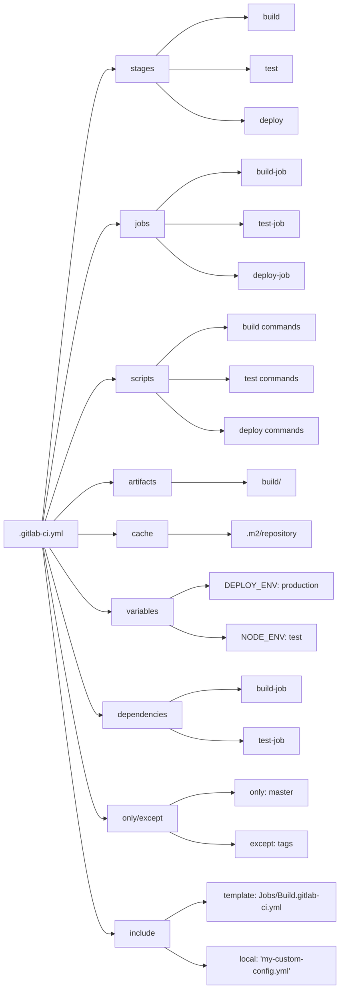
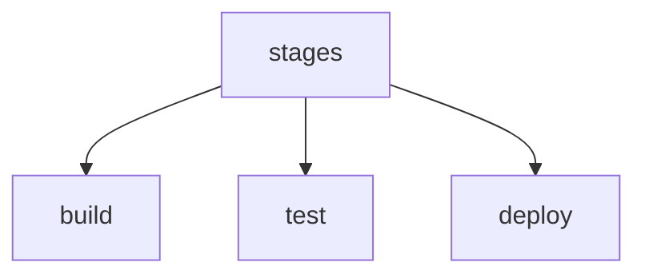
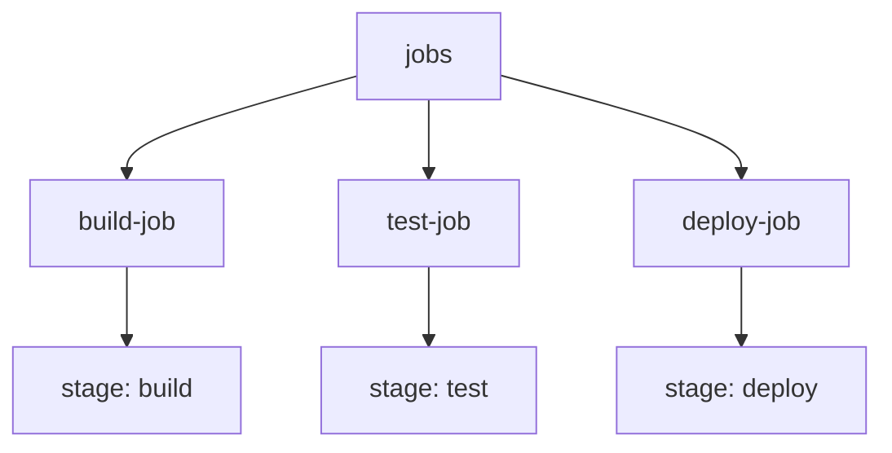
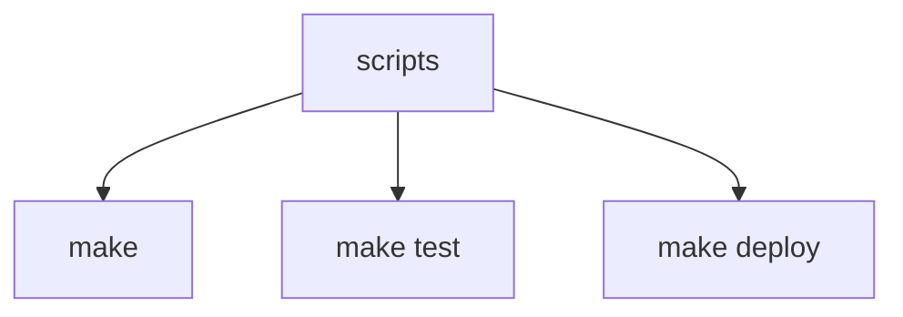
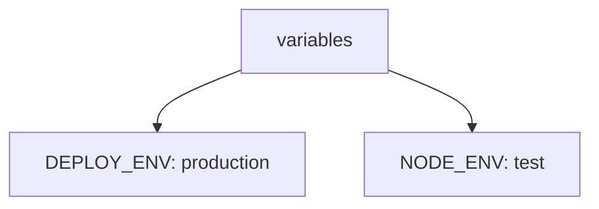
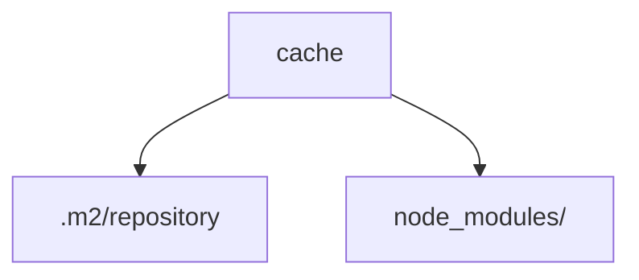
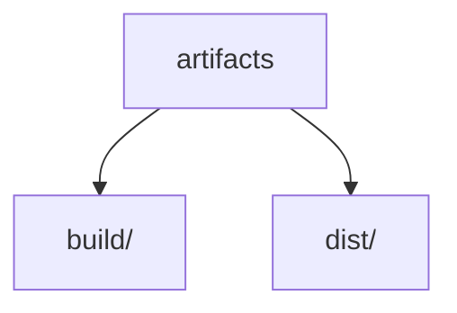
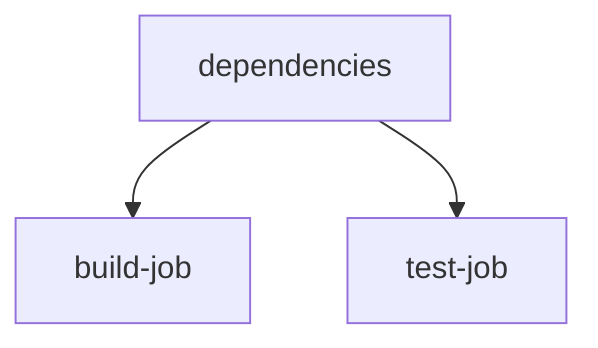
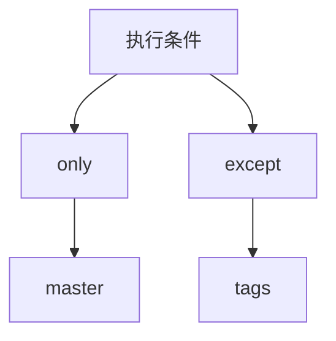
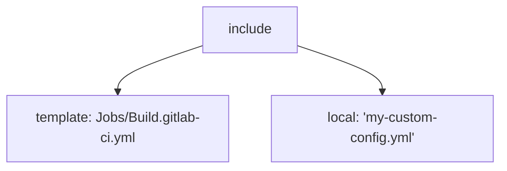

## GitLab CI/CD

### 基本概念和工作原理

GitLab CI/CD (Continuous Integration and Continuous Delivery/Deployment) 是一种自动化工具链，用于软件开发过程中从代码提交到生产部署的全过程。它包括连续集成（CI）和连续交付/部署（CD）的实践。


- **Continuous Integration (CI)**: CI 主要关注代码的频繁集成和测试。每当开发人员提交代码到版本控制系统时，CI 系统会自动触发构建和测试流程，确保代码的正确性和质量。通过频繁集成和测试，能够快速发现和修复问题，减少集成风险。
- **Continuous Delivery (CD)**: CD 的目标是确保软件在任何时候都可以安全地部署到生产环境。它通过自动化的方式，将经过测试的代码推送到预生产或生产环境中。CD 包括自动化的部署、测试和发布过程。
- **Continuous Deployment**: 是 Continuous Delivery 的延伸，它将经过验证的代码自动部署到生产环境中，无需人工干预。这种实践要求更高的自动化和监控能力。


**GitLab CI/CD 通过 .gitlab-ci.yml 文件定义 CI/CD 流程，该文件包含了所有的构建、测试和部署步骤。** GitLab Runner 是 GitLab CI/CD 的执行者，它运行在不同的环境中，执行 .gitlab-ci.yml 文件中定义的任务。

### GitLab Runner

GitLab Runner 是一个开源项目，用于运行由 GitLab CI/CD 定义的任务。它从 GitLab 服务器获取 .gitlab-ci.yml 文件中读取配置和作业，并在不同的执行环境中执行这些作业。GitLab Runner 支持多种执行模式，并能与 GitLab 实例无缝集成。

- 执行构建、测和部署任务
- 支持并行作业和多平台执行
- 提供日志记录和结果报告
- 支持缓存和 artifacts，优化构建过程

#### GitLab Runner 的不同执行模式（如 Shell、Docker、Kubernetes）

GitLab Runner 支持多种执行模式，每种模式适用于不同的使用场景：

| **执行模式**       | **描述**                                               | **优点**                                                 | **缺点**                                                   | **适用场景**                                                 |
| ------------------ | ------------------------------------------------------ | -------------------------------------------------------- | ---------------------------------------------------------- | ------------------------------------------------------------ |
| **Shell**          | 使用主机的 Shell 环境执行作业。                        | 配置简单，直接使用主机环境，开销低。                     | 缺乏环境隔离，可能影响主机系统，安全性较低。               | 适用于简单的构建和测试任务，不需要复杂依赖或隔离环境的场景。 |
| **Docker**         | 在 Docker 容器中执行作业，提供隔离的执行环境。         | 提供环境隔离，易于管理依赖和一致性，支持多种语言和工具。 | 需要配置 Docker，容器启动有额外开销，可能增加复杂性。      | 需要特定依赖和环境配置的任务，如使用特定版本的编译器、库或工具的构建和测试任务。 |
| **Docker Machine** | 动态创建和销毁 Docker 主机，支持弹性扩展。             | 自动化资源管理，弹性扩展能力强，适合大规模分布式系统。   | 配置和管理复杂，资源使用成本较高，创建和销毁主机耗时较长。 | 需要弹性扩展、动态分配资源的场景，适合高并发或资源密集型的 CI/CD 管道。 |
| **Kubernetes**     | 在 Kubernetes 集群中运行作业，提供容器编排和管理能力。 | 强大的容器编排和管理功能，适合复杂的部署和扩展需求。     | 需要熟悉 Kubernetes 的配置和管理，初始设置和维护较为复杂。 | 适用于大规模分布式系统和云原生应用的 CI/CD 管道，特别是在微服务架构下的持续集成和部署。 |
| **Custom**         | 允许用户定义自定义执行器，满足特定需求。               | 灵活性极高，能够满足特定的、非标准的需求。               | 需要自行开发和维护自定义执行器，配置复杂，调试困难。       | 需要特殊硬件或自定义环境的场景，如 FPGA 编程、特殊设备测试，或使用非标准的执行环境。 |

#### GitLab Runner 的安装步骤和配置方法

安装 GitLab Runner 的过程因操作系统和执行模式不同而有所差异，**[建议参考官方文档手册](https://docs.gitlab.com/runner/install/)。**

### .gitlab-ci.yml

`.gitlab-ci.yml` 是 GitLab 用于定义 CI/CD（持续集成和持续部署）管道的配置文件，采用 YAML 语法编写。它位于 GitLab 项目的根目录中，描述了项目的自动化构建、测试和部署流程。每次代码提交或合并时，GitLab 会根据 `.gitlab-ci.yml` 文件中的配置自动触发相应的管道任务。基本结构包括以下部分：



| **元素**         | **描述**                                                     |
| ---------------- | ------------------------------------------------------------ |
| **stages**       | 定义 CI/CD 管道的不同阶段，按顺序执行，例如构建（build）、测试（test）和部署（deploy）。 |
| **jobs**         | 定义在不同阶段中执行的具体任务，每个任务必须属于某个阶段。   |
| **scripts**      | 指定每个任务执行的命令和脚本，通常包括构建、测试和部署的具体操作。 |
| **artifacts**    | 定义构建产物的存储和使用，通常用于保存构建结果以供后续作业使用或为后续步骤提供数据。 |
| **cache**        | 配置缓存以优化构建速度，减少重复下载或构建的时间，尤其是在使用外部依赖时。 |
| **variables**    | 定义环境变量，配置不同任务的执行环境，变量可以在脚本中引用，以提供灵活的配置。 |
| **dependencies** | 指定当前作业依赖的前一阶段作业，以确保当前作业可以访问前一作业的产物或输出。 |
| **only/except**  | 定义作业的执行条件，`only` 指定作业只在某些情况下执行，`except` 指定作业在某些情况下不执行。 |
| **include**      | 从外部文件或模板中引入配置，便于配置的复用和管理，常用于共享公共配置或集成现有配置文件。 |

#### 阶段（stages）

**Stages** 是 GitLab CI/CD 管道的核心组成部分，用于定义管道的执行顺序。每个 `stage` 代表一个阶段，按顺序执行。例如，常见的阶段包括 `build`（构建）、`test`（测试）和 `deploy`（部署）。所有在同一个 `stage` 中的作业会并行执行，整个 `stage` 成功后，管道会进入下一个阶段。



#### 作业（jobs）

**Jobs** 是在 CI/CD 管道中实际执行的任务，每个 `job` 都属于一个特定的 `stage`。一个 `job` 通常包括编译代码、运行测试或部署应用的操作。每个 `job` 都会指定一个 `stage`，并包含执行这些操作的具体命令和脚本。GitLab 会按照 `stage` 的顺序执行相应的 `job`。



#### 脚本（scripts）

**Scripts** 是 `job` 中的核心部分，定义了在 CI/CD 管道中执行的具体命令或操作。这些脚本可以是简单的命令，如打印消息、编译代码、运行测试，或是调用外部工具。`script` 是实现构建、测试、部署等操作的关键，通过这些命令来自动化 CI/CD 流程。



#### 变量（Variables）

变量用于在 `.gitlab-ci.yml` 文件中定义环境变量，帮助配置不同任务的执行环境。变量可以在脚本中引用，以实现动态配置。例如，环境变量 `DEPLOY_ENV` 可以用于指定部署的目标环境。



#### 缓存（Cache）

缓存用于保存构建过程中生成的中间文件或依赖项，减少重复下载或构建的时间，从而加快 CI/CD 管道的执行速度。例如，可以缓存 Maven 的依赖库。



#### 构建产物（Artifacts）

Artifacts 是作业运行后生成的文件或构建产物，可以在后续作业中使用或下载。Artifacts 通常用于保存构建结果、测试报告等内容。



#### 依赖（Dependencies）

通过 `dependencies` 关键字，可以指定当前作业依赖于前一个阶段的某些作业。这样可以确保作业在正确的依赖产物生成后才会运行。例如，测试作业可以依赖于构建作业生成的构建产物。



#### 执行条件（Conditions）

通过 `only`、`except` 和 `when` 等关键字，可以指定作业的执行条件。`only` 和 `except` 用于限定作业在哪些分支或条件下执行，而 `when` 用于指定作业何时执行（例如：手动触发）。



#### 包含（Includes）

GitLab 提供了一些预定义的 CI/CD 模板，可以通过 `include` 关键字直接在 `.gitlab-ci.yml` 文件中引用。这些模板包含常见的构建、测试和部署任务，从而复用和共享配置。这对于大型项目或需要在多个项目间共享 CI/CD 配置时非常有用。



#### 示例配置

```yaml
# 定义不同的 CI/CD 阶段，按顺序执行
stages:
  - build
  - test
  - deploy

# 定义全局变量，可在所有作业中引用
variables:
  DEPLOY_ENV: production
  NODE_ENV: test

# 使用缓存加速构建过程，避免重复下载依赖
cache:
  paths:
    - .m2/repository
    - node_modules/

# 构建作业，属于 build 阶段
build-job:
  stage: build
  script:
    # 运行构建命令
    - echo "Building the project..."
    - make build
  artifacts:
    # 保存构建产物以供后续作业使用
    paths:
      - build/
  tags:
    # 使用带有 docker 标签的 Runner 运行作业
    - docker

# 测试作业，属于 test 阶段
test-job:
  stage: test
  script:
    # 运行测试命令
    - echo "Running tests..."
    - make test
  dependencies:
    # 指定依赖的作业，确保使用 build-job 的构建产物
    - build-job
  only:
    # 仅在 master 分支上执行测试作业
    - master
  artifacts:
    # 保存测试结果
    paths:
      - test-reports/

# 部署作业，属于 deploy 阶段
deploy-job:
  stage: deploy
  script:
    # 部署到生产环境
    - echo "Deploying to $DEPLOY_ENV environment..."
    - make deploy
  only:
    # 仅在 master 分支或带有生产标签的提交上执行部署
    - master
  except:
    # 排除带有 ci-skip 标签的提交
    - tags
  environment:
    # 定义部署的环境
    name: production
    url: https://production.example.com

# 包含外部模板配置
include:
  - template: Jobs/Build.gitlab-ci.yml
```

## 基础实践

### 创建第一个 GitLab CI/CD 管道（Pipeline）

创建一个简单的 .gitlab-ci.yml 文件是开始使用 GitLab CI/CD 的第一步。该文件定义了管道中的作业和阶段。以下是一个简单的示例：

```yaml
stages:
  - build
  - test

build-job:
  stage: build
  script:
    - echo "Compiling the code..."
    - make

test-job:
  stage: test
  script:
    - echo "Running tests..."
    - make test
```

#### 在 GitLab 中运行第一个管道

1. 将 .gitlab-ci.yml 文件提交到项目的根目录。
2. 登录 GitLab，导航到项目页面。
3. 在左侧菜单中选择 "CI / CD" -> "Pipelines"。
4. 查看新创建的管道，点击查看详细信息。

**GitLab 会自动检测 .gitlab-ci.yml 文件并运行管道。你可以查看每个作业的日志，了解执行情况。**

#### 监控和管理管道执行

1. **监控管道状态**: 在 Pipelines 页面查看所有管道的状态（成功、失败、进行中）。
2. **查看作业日志**: 点击具体作业查看详细日志，了解作业的执行情况和输出。
3. **重试失败的作业**: 对于失败的作业，可以点击 Retry 按钮重新执行。
4. **取消进行中的管道**: 如果需要终止进行中的管道，可以点击 Cancel 按钮。

### 使用预定义的 GitLab CI 模板

GitLab 提供了一些预定义的 CI 模板，帮助用户快速上手常见的 CI/CD 流程。这些模板涵盖了多种编程语言和框架，如 Java、Node.js、Python 等。

- 常见模板:

  - `Jobs/Build.gitlab-ci.yml`
  - `Jobs/Test.gitlab-ci.yml`
  - `Jobs/Deploy.gitlab-ci.yml`

#### 如何在项目中引用和使用预定义模板

你可以通过 `include` 关键字在 .gitlab-ci.yml 文件中引用预定义模板。例如下述示例中，引用了 GitLab 提供的构建模板，同时添加了一个自定义的测试作业。

```yaml
include:
  - template: Jobs/Build.gitlab-ci.yml

stages:
  - build
  - test

test-job:
  stage: test
  script:
    - echo "Running custom tests..."
    - make test
```

#### 根据需求自定义和扩展模板

使用预定义模板后，你可以根据项目的具体需求进行自定义和扩展。例如通过自定义模板，你可以在标准流程基础上添加特定的测试和部署逻辑。

```yaml
include:
  - template: Jobs/Build.gitlab-ci.yml

stages:
  - build
  - test
  - deploy

test-job:
  stage: test
  script:
    - echo "Running custom tests..."
    - make test

deploy-job:
  stage: deploy
  script:
    - echo "Deploying to production..."
    - make deploy
  only:
    - master
```

### 运行基本的 CI 流程（如构建、测试）

#### 在管道中定义和运行构建作业

构建作业是 CI 流程的核心部分，通常包括编译代码和生成构建产物。以下是一个构建作业的示例：

```yaml
stages:
  - build

build-job:
  stage: build
  # 定义构建过程中需要执行的命令。
  script:
    - echo "Compiling the code..."
    - make
  # 定义构建产物的路径，供后续作业使用。
  artifacts:
    paths:
      - build/
```

#### 集成单元测试和集成测试

测试作业用于运行单元测试和集成测试，确保代码的正确性。以下是一个测试作业的示例：

```yaml
stages:
  - test

# 运行单元测试
unit-test-job:
  stage: test
  script:
    - echo "Running unit tests..."
    - make test-unit

# 运行集成测试
integration-test-job:
  stage: test
  script:
    - echo "Running integration tests..."
    - make test-integration
```

#### 查看和分析测试结果

GitLab CI/CD 提供了详细的测试结果报告，帮助开发人员分析和解决问题。

1. **查看测试日志**: 在 Pipelines 页面点击具体作业，查看测试的详细日志和输出。
2. **分析测试结果**: 使用 GitLab 提供的测试报告工具，如 JUnit 报告，查看测试通过率和失败的测试用例。

#### 使用 GitLab CI 的代码质量分析功能

GitLab CI/CD 提供了代码质量分析功能，帮助识别代码中的潜在问题和改进点。以下是一个代码质量分析的示例：

```yaml
stages:
  - code_quality

code_quality:
  stage: code_quality
  script:
    - echo "Running code quality checks..."
    - eslint . # 使用 ESLint 等工具运行代码质量检查。
  # 生成代码质量报告并存储在 GitLab 中，供后续分析和查看。
  artifacts:
    reports:
      codequality: gl-code-quality-report.json
```

## 进阶技能

### 使用 GitLab Runner 执行自定义作业

#### 编写和配置自定义作业脚本

自定义作业脚本使得 CI/CD 流程能够灵活适应不同的项目需求。通过在 `.gitlab-ci.yml` 文件中定义脚本，可以执行特定任务，例如编译、测试、部署等。以下是一个示例，在 `script` 部分中，可以编写任意 Bash 命令或调用外部脚本文件，以执行具体的任务。

```yaml
stages:
  - build
  - test
  - deploy

build-job:
  stage: build
  script:
    - echo "Compiling the code..."
    - make

test-job:
  stage: test
  script:
    - echo "Running tests..."
    - make test

deploy-job:
  stage: deploy
  script:
    - echo "Deploying to production..."
    - make deploy
```

#### 在不同执行环境中运行自定义作业

GitLab Runner 支持多种执行环境，使得 CI/CD 管道可以在不同的操作系统和容器中运行。以下是一些常见的执行环境配置示例：

##### Shell 执行环境

```yaml
build-job:
  stage: build
  script:
    - echo "Running in shell..."
    - make
  tags:
    - shell
```

##### Docker 执行环境

```yaml
build-job:
  stage: build
  image: maven:3.6.3-jdk-8
  script:
    - echo "Running in Docker..."
    - mvn install
```

##### Kubernetes 执行环境

```yaml
build-job:
  stage: build
  script:
    - echo "Running in Kubernetes..."
    - kubectl apply -f deployment.yaml
  tags:
    - kubernetes
```

#### 利用并行作业和矩阵构建提高效率

并行作业和矩阵构建使得多个作业可以同时运行，从而加快 CI/CD 管道的执行速度。以下是并行作业和矩阵构建的示例：

##### 并行作业

```yaml
stages:
  - test

test-job-1:
  stage: test
  script:
    - echo "Running test job 1..."
    - make test-1

test-job-2:
  stage: test
  script:
    - echo "Running test job 2..."
    - make test-2
```

##### 矩阵构建

```yaml
stages:
  - test

test-job:
  stage: test
  script:
    - echo "Running tests..."
    - make test
  parallel:
    matrix:
      - TEST_ENV: ["python2.7", "python3.6"]
      - DB: ["mysql", "postgres"]
```

### 使用 GitLab Secrets 进行安全管理

#### GitLab CI/CD 中的秘密变量和环境变量管理

GitLab 提供了管理秘密变量和环境变量的功能，以确保敏感信息（如 API 密钥、密码等）不会泄露。可以在 GitLab 项目或组的设置中定义这些变量。

**定义秘密变量:**

1. 进入项目设置: Settings -> CI/CD -> Variables
2. 点击 "Add Variable"
3. 输入变量名称和值，并选择保护选项（如保护、掩码）

#### 在 .gitlab-ci.yml 中安全使用秘密

在 `.gitlab-ci.yml` 文件中，可以通过 `${VARIABLE_NAME}` 的形式引用环境变量和秘密变量。通过这种方式，可以确保敏感信息不会暴露在代码库中。

```yaml
stages:
  - deploy

deploy-job:
  stage: deploy
  script:
    - echo "Deploying to production..."
    - deploy --api-key=${API_KEY} --password=${PASSWORD}
```

#### 配置和管理 GitLab 项目和组的秘密

GitLab 允许在项目和组级别管理秘密变量，便于多个项目共享相同的配置。

##### 项目级变量

1. 进入项目设置: Settings -> CI/CD -> Variables
2. 添加或编辑变量

##### 组级变量

1. 进入组设置: Group Settings -> CI/CD -> Variables
2. 添加或编辑变量

### 多阶段管道和依赖管理

#### 定义多阶段（multi-stage）管道

多阶段管道通过定义不同的阶段（如 build、test、deploy）来组织 CI/CD 流程。以下是一个多阶段管道的示例：

```yaml
stages:
  - build
  - test
  - deploy

build-job:
  stage: build
  script:
    - echo "Building the project..."
    - make build

test-job:
  stage: test
  script:
    - echo "Testing the project..."
    - make test

deploy-job:
  stage: deploy
  script:
    - echo "Deploying the project..."
    - make deploy
```

#### 阶段之间的依赖管理和条件执行

**通过定义阶段之间的依赖关系，可以控制作业的执行顺序和条件执行。**例如，可以使用 `needs` 关键字定义依赖关系：

```yaml
stages:
  - build
  - test
  - deploy

build-job:
  stage: build
  script:
    - echo "Building the project..."
    - make build

test-job:
  stage: test
  script:
    - echo "Testing the project..."
    - make test
  needs: ["build-job"]

deploy-job:
  stage: deploy
  script:
    - echo "Deploying the project..."
    - make deploy
  only:
    - master
```

#### 使用 Needs 关键字优化管道执行顺序

使用 `needs` 关键字可以显著优化管道的执行顺序，避免不必要的等待时间：

```yaml
stages:
  - build
  - test
  - deploy

build-job:
  stage: build
  script:
    - echo "Building the project..."
    - make build

unit-test-job:
  stage: test
  script:
    - echo "Running unit tests..."
    - make test-unit
  needs: ["build-job"]

integration-test-job:
  stage: test
  script:
    - echo "Running integration tests..."
    - make test-integration
  needs: ["build-job"]

deploy-job:
  stage: deploy
  script:
    - echo "Deploying the project..."
    - make deploy
  needs: ["unit-test-job", "integration-test-job"]
```

### 集成第三方服务（如 Docker Registry、Kubernetes）

#### 配置和使用 GitLab 内置的 Docker Registry

GitLab 提供内置的 Docker Registry，方便用户存储和管理 Docker 镜像。以下是配置和使用的步骤：

1. **启用 Docker Registry**:

   - 进入项目设置: Settings -> CI/CD -> Container Registry
   - 确认 Docker Registry 已启用

2. **登录 Docker Registry**:

   ```shell
   $ docker login registry.gitlab.com
   ```

3. **构建和推送 Docker 镜像**:

   ```yaml
   stages:
     - build
     - deploy
   
   build-job:
     stage: build
     image: docker:latest
     services:
       - docker:dind
     script:
       - docker build -t registry.gitlab.com/your-namespace/your-project:latest .
       - docker push registry.gitlab.com/your-namespace/your-project:latest
   ```

#### 在管道中构建和推送 Docker 镜像

通过在管道中构建和推送 Docker 镜像，可以实现自动化的容器化部署：

```yaml
stages:
  - build
  - deploy

build-job:
  stage: build
  image: docker:latest
  services:
    - docker:dind
  script:
    - docker build -t registry.gitlab.com/your-namespace/your-project:latest .
    - docker push registry.gitlab.com/your-namespace/your-project:latest

deploy-job:
  stage: deploy
  script:
    - docker pull registry.gitlab.com/your-namespace/your-project:latest
    - docker run -d registry.gitlab.com/your-namespace/your-project:latest
  only:
    - master
```

#### 集成 Kubernetes 进行持续部署

GitLab CI/CD 可以与 Kubernetes 集成，实现自动化的持续部署：

1. **配置 Kubernetes 集群**:

   - 在 GitLab 项目的 Kubernetes 集成页面添加集群信息

2. **在管道中使用 Kubernetes**:

   ```yaml
   stages:
     - deploy
   
   deploy-job:
     stage: deploy
     script:
       - kubectl apply -f deployment.yaml
     tags:
       - kubernetes
   ```

#### 使用 GitLab Kubernetes 集群管理工具

GitLab 提供了 Kubernetes 集群管理工具，简化集群的配置和管理：

1. **添加 Kubernetes 集群**:
   - 进入项目设置: Operations -> Kubernetes
   - 添加集群信息（API URL、CA 证书、Token 等）
2. **管理集群**:
   - 使用 GitLab 提供的界面管理集群中的资源，如 Pods、Services 等
   - 配置自动化的 CI/CD 管道，实现持续部署

## 高级实践

### 持续交付（CD）流程

#### 定义和实现持续交付（CD）管道

持续交付（CD）是指将代码在经过一系列自动化测试后，自动部署到预生产或生产环境。以下是一个持续交付管道的示例：

```yaml
stages:
  - build     # 定义构建阶段
  - test      # 定义测试阶段
  - deploy    # 定义部署阶段

build-job:
  stage: build   # 指定作业所属的阶段
  script:
    - echo "Building the project..."
    - make build
  artifacts:
    paths:
      - build/    # 保存构建产物供后续使用

test-job:
  stage: test    # 指定作业所属的阶段
  script:
    - echo "Running tests..."
    - make test
  dependencies:
    - build-job   # 使用构建阶段的产物

deploy-job:
  stage: deploy   # 指定作业所属的阶段
  script:
    - echo "Deploying to production..."
    - make deploy
  only:
    - master    # 仅在 master 分支上执行部署
  environment:
    name: production                       # 部署环境名称
    url: https://production.example.com    # 部署环境的 URL

```

#### 配置环境部署策略

GitLab 提供了丰富的环境和部署策略配置选项，确保部署过程的安全性和稳定性。

##### 动态环境

用于临时创建环境，进行测试或演示。

```yaml
environment:
  name: review/$CI_COMMIT_REF_NAME
  url: https://$CI_COMMIT_REF_NAME.example.com
  on_stop: stop_review
```

##### 手动部署

需要手动确认才能执行部署。

```yaml
deploy-job:
  stage: deploy
  script:
    - echo "Deploying to production..."
    - make deploy
  when: manual
```

#### 使用 GitLab 的环境和部署管理功能

GitLab 提供环境和部署管理功能，帮助开发者和运维人员轻松管理不同的部署环境。

- **查看环境状态**: 在项目的 Environments 页面查看所有环境的状态和部署历史。
- **手动触发部署**: 在 Environments 页面手动触发部署任务。
- **环境保护**: 配置环境保护规则，限制谁可以部署到特定环境。

#### 回滚和部署策略优化

部署过程中可能会遇到问题，需要回滚到之前的版本。可以通过以下方式实现回滚和优化部署策略：

**自动回滚**: 在部署失败时自动回滚到上一个稳定版本。

```yaml
deploy-job:
  stage: deploy
  script:
    - echo "Deploying to production..."
    - make deploy || make rollback
```

- **蓝绿部署**: 同时运行两个版本的应用，切换流量以实现无缝升级。

- **金丝雀发布**: 部分用户先访问新版本，观察其稳定性，然后逐步扩展。

### 使用缓存和 Artifacts 提高构建效率

#### 配置和使用缓存加速构建过程

缓存可以显著加快构建过程，通过缓存依赖和构建中间结果，减少重复工作。

##### 配置缓存

```yaml
cache:
  paths:
    - .m2/repository
    - node_modules/
```

##### 清理缓存

在需要时清理缓存以确保使用最新的依赖。

```yaml
cache:
  key: "$CI_COMMIT_REF_SLUG"
  paths:
    - .m2/repository
  policy: push
```

#### 定义和管理 Artifacts

Artifacts 是管道运行过程中生成的文件，通常用于后续阶段或作为构建产物存储。并在 GitLab 界面查看和下载 artifacts。

```yaml
artifacts:
  paths:
    - build/
```

#### 优化缓存和 Artifacts 的存储策略

为了更好地利用缓存和 artifacts，优化存储策略非常重要。

##### 按分支缓存

不同分支使用不同的缓存，避免相互影响。

```yaml
cache:
  key: "$CI_COMMIT_REF_NAME"
  paths:
    - .m2/repository
```

##### 长期存储

重要的构建产物可以配置长期存储，避免被清理。

```yaml
artifacts:
  paths:
    - build/
  expire_in: 1 month
```

### 部署到 Kubernetes 和其他云平台

#### 使用 GitLab CI/CD 管道部署到 Kubernetes 集群

将应用部署到 Kubernetes 集群，可以利用其强大的容器编排和管理能力。

**配置 Kubernetes 集群**:

1. 在 GitLab 项目的 Kubernetes 集成页面添加集群信息。
2. 配置 `kubeconfig` 文件，用于访问 Kubernetes 集群。

```yaml
stages:
  - deploy

deploy-job:
  stage: deploy
  script:
    - kubectl apply -f k8s/deployment.yaml
    - kubectl apply -f k8s/service.yaml
  tags:
    - kubernetes
```

#### 配置和使用 GitLab 的 Auto DevOps 功能

Auto DevOps 是 GitLab 提供的自动化 CI/CD 流程，适用于常见的开发场景。启用 Auto DevOps 后，GitLab 会自动检测并运行合适的 CI/CD 管道。

- **启用 Auto DevOps**:
  1. 在项目设置页面启用 Auto DevOps。
  2. 配置 Kubernetes 集群和相关的 CI/CD 设置。
- **定制 Auto DevOps**: 可以通过自定义 `.gitlab-ci.yml` 文件来扩展和定制 Auto DevOps 流程。

#### 集成其他云平台进行部署

通过 GitLab CI/CD 管道，可以将应用部署到各种云平台。

##### 部署到 AWS

```yaml
stages:
  - deploy

deploy-job:
  stage: deploy
  image: amazon/aws-cli
  script:
    - aws s3 cp build/ s3://my-bucket/ --recursive
  only:
    - master
```

##### 部署到 GCP

```yaml
stages:
  - deploy

deploy-job:
  stage: deploy
  image: google/cloud-sdk
  script:
    - gcloud auth activate-service-account --key-file $GCP_KEY_FILE
    - gcloud app deploy
  only:
    - master
```

##### 部署到 Azure

```yaml
stages:
  - deploy

deploy-job:
  stage: deploy
  image: mcr.microsoft.com/azure-cli
  script:
    - az login --service-principal -u $AZURE_CLIENT_ID -p $AZURE_CLIENT_SECRET --tenant $AZURE_TENANT_ID
    - az webapp up --name myapp --resource-group myResourceGroup --location "East US"
  only:
    - master
```

### 性能优化和故障排查

#### 优化管道执行时间和资源使用

通过以下方法可以优化 CI/CD 管道的执行时间和资源使用：

- **并行执行**: 将作业并行化，减少整体执行时间。
- **缓存利用**: 使用缓存减少重复工作。
- **按需执行**: 使用 `only` 和 `except` 关键字控制作业执行条件。

#### 监控和分析管道性能指标

GitLab 提供了多种监控和分析工具，帮助优化管道性能：

- **Pipeline Analytics**: 查看管道执行时间和成功率等指标。
- **Job Artifacts**: 分析作业的日志和生成的报告。
- **GitLab CI/CD Monitoring**: 使用外部监控工具（如 Prometheus、Grafana）集成 GitLab 的 CI/CD 监控。

#### 常见错误和问题的排查方法

常见错误包括作业失败、超时、依赖问题等。排查方法如下：

- **查看日志**: 详细查看作业日志，分析错误信息。
- **重试作业**: 对于临时性问题，可以尝试重试作业。
- **环境检查**: 确认执行环境的配置和依赖是否正确。

#### 使用 GitLab CI/CD 的调试和日志功能

GitLab CI/CD 提供了丰富的调试和日志功能，帮助定位和解决问题：

- **Debug 作业**: 在 `.gitlab-ci.yml` 中添加调试信息。

  ```
  script:
    - echo "Debug info:"
    - env
    - make test
  ```

- **查看作业日志**: 在 GitLab 界面查看详细的作业执行日志。

- **使用 SSH 访问 Runner**: 在调试模式下使用 SSH 访问 Runner，进行更深入的调试。
