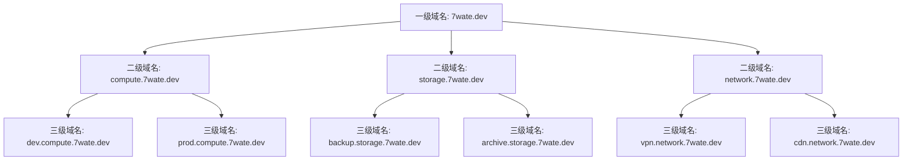
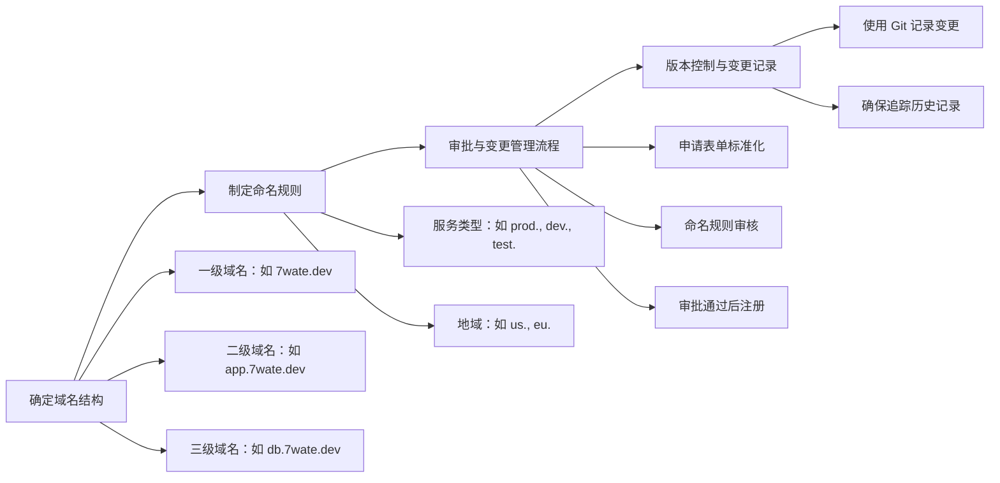
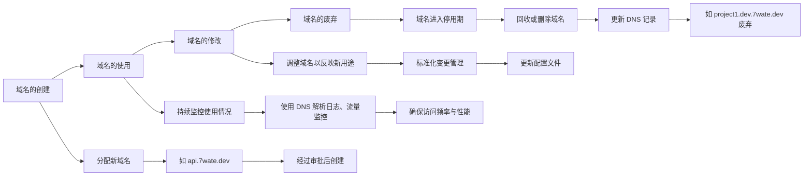
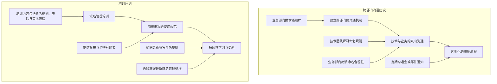

## **1. 引言**

### **1.1 背景**

**随着全球企业数字化转型的加速推进，信息技术（IT）已成为企业运营的核心驱动力。** 从传统的本地数据中心逐渐向云计算、自动化和智能化转型，企业的 IT 基础设施变得更加复杂且灵活。在这一转型过程中，企业不仅需要处理大量的数据，还需要更高效的管理和维护其网络资源，以便在激烈的市场竞争中保持敏捷性和竞争优势。

在现代化企业中，云计算服务模型的广泛应用将企业的 IT 服务按需求划分为不同的层级。主要的云服务模型包括**IaaS（Infrastructure as a Service，基础设施即服务）**、**PaaS（Platform as a Service，平台即服务）\**和\**SaaS（Software as a Service，软件即服务）**。这三种模型为企业提供了不同层次的服务，从基础的硬件资源到高级的软件应用，各层次都具备灵活性和可扩展性。

- **IaaS**：为企业提供虚拟化的计算资源，包括服务器、存储和网络等。它允许企业像管理物理资源一样管理云端的基础设施，但无需负责硬件的维护。
- **PaaS**：在 IaaS 之上，PaaS 为企业提供了开发和部署应用程序的平台，企业可以专注于应用程序的开发，而不需要管理底层基础设施。这极大地提高了应用开发的效率。
- **SaaS**：SaaS 进一步抽象化，直接向企业用户提供了完整的应用程序，如办公套件、客户关系管理（CRM）系统等，用户只需使用，不需关注底层的维护。

尽管这些服务模型为企业的 IT 运营带来了巨大的灵活性和效率，但它们也增加了系统管理的复杂性。企业在采用多层次云服务的同时，面临着如何有效管理其网络资源、应用程序和数据的挑战。尤其在企业规模扩展、资源多样化的情况下，合理规划并分配域名，确保各类服务、系统和应用之间的高效协作，显得尤为重要。

域名分配不仅仅是企业外部访问的窗口，它还影响着内部的资源组织、访问控制和网络结构的优化。在数字化企业中，域名用于标识各种内部系统、应用程序、服务接口（API）以及不同部门或子公司的网络资源。因此，设计和分配合理的域名系统是确保企业 IT 运营顺畅的重要环节。

此外，随着企业对云服务的依赖日益加深，管理多层次、多类型的网络资源变得更为复杂，域名分配问题逐渐凸显。例如，当企业同时使用 IaaS、PaaS、SaaS 的服务时，若没有一套清晰且灵活的域名分配策略，不同服务之间的互通性和资源管理将变得混乱且低效。域名规划不仅仅需要解决技术层面的访问问题，还要为运维、开发、安全等多个团队提供清晰的逻辑结构和标准化的管理方式。因此，域名分配不仅是网络访问层面的技术问题，还是企业资源管理和内部运营效率提升的关键之一。

### **1.2 目标**

本白皮书的目标是为现代化企业设计一套高效、灵活且安全的域名分配规范，帮助企业更好地组织和管理其内部网络资源。通过这一规范，企业可以在 IaaS、PaaS、SaaS 三层服务模型下，将复杂的 IT 资源进行逻辑化的分类与管理，确保不同层次的服务能够有效协作，同时提升内部系统的可管理性和可扩展性。

具体而言，本白皮书希望通过以下目标实现企业内部网络资源的优化：

1. **高效管理**：通过系统化的域名分配，企业可以更容易地管理其内部网络资源，包括虚拟机、数据库、应用程序和用户终端。域名规划为各类资源提供了唯一且清晰的标识，使得资源管理和访问控制变得更加直观和高效。
2. **灵活性**：考虑到企业 IT 环境的动态性，域名分配规范应具备足够的灵活性，以适应不断变化的需求。无论是新服务的上线、业务的扩展，还是技术的迭代升级，域名系统都应能够轻松调整，并且在不影响现有服务的情况下实现无缝扩展。
3. **一致性**：域名分配规范将确保企业内部所有 IT 服务和资源的命名遵循统一的标准。这不仅有助于跨部门、跨团队的沟通和协作，还能避免命名冲突、歧义或混乱，有效减少管理难度和运维成本。
4. **安全性**：在域名管理过程中，安全性也是关键要素之一。通过明确的域名分配和命名规则，企业可以更好地控制不同资源之间的访问权限，防止未授权访问，提升整体的网络安全性。同时，合理的域名分配还能减少安全漏洞，如 DNS 劫持、缓存中毒等风险。
5. **可扩展性**：随着企业业务的扩展和技术需求的变化，域名分配系统应具备良好的可扩展性，以支持未来的增长。无论是增加新的应用服务，还是引入新的云计算模型（如 Serverless、边缘计算等），域名规范应能灵活适应，并确保系统的稳定性和兼容性。

通过建立这一套域名分配规范，企业不仅能够提高其 IT 系统的管理效率，还能通过清晰的命名和分配策略确保各类资源的安全与可持续性。最终，这一白皮书将为企业在复杂的多层次云环境下，提供一套可行的解决方案，帮助企业优化其网络架构，提升业务运营效率，并保持技术和业务发展的灵活性。

## **2. 域名分配的总体架构**

域名分配的总体架构是现代化企业内部网络资源管理的重要组成部分。一个清晰、系统的域名分配结构不仅能帮助企业高效管理复杂的 IT 基础设施，还能在不同层次上为服务的部署和维护提供明确的指引。通过构建合理的域名分层结构，企业能够在不同的业务场景中实现灵活、稳定和安全的访问控制。

### **2.1 域名分层结构**

域名的分层结构是企业内部网络资源组织和命名的重要基础。通常，企业内部的域名分层可分为**一级域名**、**二级域名**和**三级域名**，这些层次共同构成了完整的命名体系，用于区分和标识企业内的不同服务、应用和资源。

- **一级域名**（顶级域名，TLD）通常用于标识企业的网络边界。对于企业而言，一级域名是最外层的标识，用于区分企业与外界的网络访问。以企业 7wate 为例，**7wate.dev**可以作为企业的顶级域名，用于承载企业的所有内部网络服务。该域名是企业网络资源的根节点，所有二级和三级域名都将以此为基础进行分配和管理。
- **二级域名**主要用于区分不同的服务类型或业务功能。通过将 IaaS、PaaS、SaaS 等云服务的不同模块划分为独立的二级域名，企业可以在逻辑上对服务进行分类和管理。例如，可以根据企业的 IT 服务模型对资源进行划分，生成如**compute.7wate.dev**（用于计算资源）、**storage.7wate.dev**（用于存储服务）等域名。这种结构不仅简化了服务的标识和访问，还为后续的三级域名提供了清晰的框架。
- **三级域名**用于进一步细化管理，通常用于标识具体的子服务或业务模块。三级域名的引入允许企业在更复杂的场景下对资源进行精细化管理。比如，企业在网络管理模块下可能会有多个子服务，如 VPN 服务、内容分发网络（CDN）等，通过引入三级域名，可以将这些子服务细分为**vpn.network.7wate.dev**、**cdn.network.7wate.dev**等。这种结构增强了域名的灵活性，使得企业在扩展业务时能够轻松调整和增加服务。

### **2.2 IaaS、PaaS、SaaS 三层服务模型下的域名分配**

现代企业的 IT 服务通常采用 IaaS、PaaS 和 SaaS 三层服务模型，每一层都有其独特的功能和特性，因此在域名规划上需要根据各层的特点进行合理划分。下面我们将详细说明每一层的域名分配策略。

#### **IaaS 层域名规划**

IaaS（基础设施即服务）为企业提供虚拟化的计算资源、存储资源、网络管理和安全服务。在 IaaS 层中，资源往往以基础设施为中心，域名规划需要反映这一特性，确保对基础设施资源的精细化管理。

| **资源类型** | **二级域名**         | **三级域名示例**                            | **说明**                                             |
| ------------ | -------------------- | ------------------------------------------- | ---------------------------------------------------- |
| 计算资源     | `compute.7wate.dev`  | `vm.compute.7wate.dev`（虚拟机管理）        | 用于管理虚拟机、容器化服务、裸金属服务器等计算资源。 |
| 存储资源     | `storage.7wate.dev`  | `backup.storage.7wate.dev`（数据备份）      | 存储资源包括对象存储、文件存储、块存储等。           |
| 网络管理     | `network.7wate.dev`  | `vpn.network.7wate.dev`（VPN 管理）          | 用于管理 VPC、负载均衡、内容分发网络等网络资源。      |
| 安全管理     | `security.7wate.dev` | `firewall.security.7wate.dev`（防火墙管理） | 管理身份验证、访问控制、防火墙等安全服务。           |

#### **PaaS 层域名规划**

PaaS（平台即服务）主要用于支持应用开发、测试和部署的技术平台。这一层的域名分配应考虑到开发环境、运行时环境、容器编排和中间件服务等需求。

| **资源类型**     | **二级域名**           | **三级域名示例**                            | **说明**                                                 |
| ---------------- | ---------------------- | ------------------------------------------- | -------------------------------------------------------- |
| 应用开发与运行时 | `app.7wate.dev`        | `test.app.7wate.dev`（测试环境）            | 用于管理应用开发与运行时环境，包括开发、测试、生产环境。 |
| 容器管理         | `container.7wate.dev`  | `k8s.container.7wate.dev`（Kubernetes 管理） | 管理 Kubernetes 或 Docker 容器化服务。                       |
| 数据库管理       | `database.7wate.dev`   | `sql.database.7wate.dev`（关系型数据库）    | 用于管理数据库服务，区分关系型数据库和 NoSQL 数据库。      |
| 中间件与消息队列 | `middleware.7wate.dev` | `kafka.middleware.7wate.dev`（Kafka 队列）   | 用于管理中间件和消息队列服务。                           |

#### **SaaS 层域名规划**

SaaS（软件即服务）主要提供企业级的应用软件，帮助企业实现办公协作、客户关系管理、资源规划等功能。SaaS 层的域名规划应关注应用的最终用户，并确保每个应用有明确的域名标识。

| **资源类型**             | **二级域名**          | **三级域名示例**                              | **说明**                                           |
| ------------------------ | --------------------- | --------------------------------------------- | -------------------------------------------------- |
| 办公协作                 | `collab.7wate.dev`    | `email.collab.7wate.dev`（电子邮件服务）      | 办公协作服务，包括电子邮件、文档共享、视频会议等。 |
| 客户关系管理（CRM）      | `crm.7wate.dev`       | `sales.crm.7wate.dev`（销售管理）             | 管理销售、客户支持和营销服务。                     |
| 企业资源规划（ERP）      | `erp.7wate.dev`       | `finance.erp.7wate.dev`（财务模块）           | ERP 系统管理，涵盖财务、供应链、制造、采购等领域。  |
| 人力资源管理系统（HRMS） | `hrms.7wate.dev`      | `payroll.hrms.7wate.dev`（薪资管理）          | 管理人力资源流程，涵盖员工档案、薪酬福利等。       |
| 财务与会计管理           | `finance.7wate.dev`   | `billing.finance.7wate.dev`（账单管理）       | 用于管理企业财务与会计流程。                       |
| 项目管理                 | `project.7wate.dev`   | `tracking.project.7wate.dev`（项目进度追踪）  | 管理项目进度和任务分配。                           |
| 电子商务管理             | `ecommerce.7wate.dev` | `catalog.ecommerce.7wate.dev`（产品目录管理） | 管理电子商务平台的产品目录和订单处理。             |

### **三级域名的引入：在复杂服务下细分子服务的命名规则**

随着企业 IT 基础设施的复杂化，仅靠一级域名和二级域名无法完全涵盖企业的多层次、多业务模块需求。因此，三级域名的引入成为细分和管理子服务的有效手段。通过在二级域名下进一步引入三级域名，企业可以对每个独立的子服务进行更精准的管理，同时保持命名的结构化和逻辑性。

三级域名允许企业在现有的域名层次结构中细化管理，同时为未来的业务扩展留有足够的灵活性。以下是三级域名的几种常见使用场景：

| **场景**           | **二级域名**        | **三级域名示例**                                | **说明**                                         |
| ------------------ | ------------------- | ----------------------------------------------- | ------------------------------------------------ |
| 服务细分           | `network.7wate.dev` | `vpn.network.7wate.dev`（VPN 服务）              | 用于细分网络管理下的不同服务，如 VPN 和 CDN。       |
| 环境区分           | `app.7wate.dev`     | `test.app.7wate.dev`（测试环境）                | 用于区分应用的不同运行环境，如开发、测试、生产。 |
| 多业务模块支持     | `erp.7wate.dev`     | `finance.erp.7wate.dev`（财务模块）             | ERP、CRM 等系统的多业务模块支持。                |
| 地域或数据中心区分 | `compute.7wate.dev` | `us-east.compute.7wate.dev`（美国东部数据中心） | 用于区分不同地理区域或数据中心的资源。           |

引入三级域名的好处在于，它不仅能够有效提升网络资源的组织结构，还为企业的未来扩展留有充分的空间。随着企业业务的发展，新的服务、新的模块、新的地理区域可能不断加入，而通过三级域名的方式，企业可以灵活地将这些新元素纳入现有的网络体系中，确保网络结构的可扩展性。

## **3. 域名分配规范原则**

在现代化企业中，域名分配不仅仅是技术层面的操作，它承载了网络资源的组织、访问路径的设计，以及各个业务模块之间的交互。一个高效且规范的域名分配策略，能够有效提高资源管理的效率，简化跨部门和跨团队的协作，并为未来的扩展留有余地。因此，制定一套合理的域名分配规范原则至关重要。

### **3.1 一致性原则**

域名的命名规则必须具有一致性，这样可以确保企业内不同部门、不同团队之间的理解没有歧义。一致性原则的核心在于：**同一类服务或资源，在任何场景下都应遵循相同的命名规范**，无论是一级域名、二级域名还是三级域名。

一致性不仅有助于减少误解和混淆，还能够提升管理的简便性。举例来说，在一个跨部门的协作项目中，开发团队和运维团队如果使用不一致的命名规则，可能会导致资源访问不便、出错率增高。因此，企业应在域名分配时制定统一的命名模板，涵盖不同服务类型和资源类型。

**举例**：

- 所有的开发环境域名以 `dev.` 开头（如 `dev.app.7wate.dev`）。
- 生产环境则统一以 `prod.` 开头（如 `prod.app.7wate.dev`）。

通过这样统一的命名标准，任何团队在面对不同环境时都能清晰分辨服务类型，避免因命名混淆导致的误操作。

### **3.2 简洁性与可读性**

域名的简洁性与可读性是另一个重要的设计原则。一个简洁、易读的域名不仅能减少用户输入时的错误，还能提高对资源的辨识度。域名设计应避免过长、冗余的命名结构，确保域名在视觉上清晰易懂，同时能够直观地反映出其所指代的资源或服务类型。

在设计域名时，企业需要找到简洁性与信息量之间的平衡。虽然过于简短的域名可能显得抽象和模糊，但过长的域名则会造成复杂性增加，降低可读性。因此，域名应简洁明了，且足够传递必要的含义。

**良好的例子**：

- `api.dev.7wate.dev`：通过简短的 `api`，能够清晰传达出其服务的类型为应用编程接口（API），并通过 `dev` 标识这是开发环境。

**不良的例子**：

- `applicationinterface.development.environment.7wate.dev`：虽然表达的信息完整，但过于冗长，增加了访问难度且降低了可读性。

简洁性与可读性的重要性在于其对日常管理的影响。管理员在处理大量域名时，一个简明的结构可以大幅减少管理成本，提高工作效率，同时便于系统自动化工具（如 DNS 管理工具）的使用和部署。

### **3.3 灵活性与扩展性**

企业的 IT 系统和业务需求随着时间的推移而不断变化，域名分配策略必须具有足够的灵活性和扩展性，才能适应未来的技术和业务发展。这意味着域名结构不仅要适应现有的需求，还必须为未来可能引入的新服务、新技术做好准备。

在设计域名时，尤其要考虑到新兴技术的发展趋势。例如，随着**Serverless 架构**和**边缘计算**的普及，传统的域名分配方式可能无法很好地支持这些新架构。因此，企业应预留足够的灵活性来容纳这些新服务，并通过合理的命名结构确保可扩展性。

**举例**：

- 在 Serverless 架构下，函数即服务（FaaS）可以使用 `function.` 前缀，如 `function.compute.7wate.dev`。
- 在边缘计算场景中，可以通过引入地域标识，如 `us-west.edge.7wate.dev`（表示美国西部的边缘节点），确保地域性资源与其他资源的区分。

此外，在多云环境中，企业可能同时使用多个云服务提供商的资源。通过在域名中引入云提供商的标识，如 `aws.`、`azure.` 等前缀，可以有效区分不同平台上的资源，提升资源管理的灵活性。例如，`aws.compute.7wate.dev` 和 `azure.compute.7wate.dev` 可分别指代 AWS 和 Azure 上的计算资源。

### **3.4 简拼与全拼的使用规范**

在域名设计中，企业可能会使用全拼和简拼两种方式命名不同的资源。全拼通常能够提供更高的信息透明度，用户一目了然可以判断出资源类型。而简拼则更为简短，便于记忆和快速输入，尤其适用于操作频繁的场景。然而，简拼的使用必须遵循明确的规范，以防止跨部门、跨团队的理解混淆。

**简拼与全拼的使用规范**应考虑以下几个要点：

1. **明确简拼和全拼的使用场景**：一般来说，重要的、核心的服务可以使用全拼来增强可读性，而次要或频繁使用的服务可以考虑简拼。例如，`database.7wate.dev` 清晰表明是数据库服务，而 `db.7wate.dev` 可以用于更高频的场景下快速访问数据库资源。
2. **提供简拼表和常用缩写对照表**：企业应制定统一的简拼缩写对照表，明确哪些服务可以简拼，如何简拼。例如，`app` 可以代表应用程序（Application），`db` 可以代表数据库（Database），`net` 可以代表网络服务（Network）。这种标准化的对照表可以避免由于部门各自命名而造成的命名混乱。
3. **避免歧义**：有些简拼可能在不同场景下具有不同的意义，例如 `app` 既可以代表应用程序，也可能代表某些特殊业务名称。因此，在简拼的设计中，必须确保不会引发歧义。通过明确的规则和命名前缀，可以有效避免这类问题。例如，在应用程序上下文中，`app.7wate.dev` 代表应用服务，而在业务流程中，可能使用 `businessapp.7wate.dev` 表示某一特定的应用。

**简拼与全拼的应用示例**：

- `database.7wate.dev` 与 `db.7wate.dev`：前者全拼清晰表明为数据库服务，适用于文档、管理界面等场景；后者适合频繁查询和操作。
- `application.7wate.dev` 与 `app.7wate.dev`：全拼用于正式的、面向管理层或广泛用户的场景，简拼适用于开发人员或内部使用。

通过全拼和简拼的结合使用，企业既可以保持命名规则的简洁性，又不失可读性。为了确保命名规则的一致性和规范化，企业应建立一个专门的简拼/全拼管理制度，并定期审查以适应不断变化的业务需求和技术环境。

## **4. 域名分配的实施策略**

在一个现代化企业中，域名分配不仅需要一套清晰的规划和规范，还需要通过合理的实施策略来确保系统的安全性、可扩展性以及管理的高效性。为了保证域名分配能够顺利支持企业的日常运营和业务扩展，实施过程中必须考虑到 DNS 解析、扩展性、安全性以及自动化管理等多个方面。以下将详细讨论域名分配的具体实施策略。

### **4.1 本地 DNS 解析与管理**

**本地 DNS 解析**（Local DNS Resolution）是指企业在内部设置并管理自己的 DNS 服务器，用于解析企业内部资源的域名。与使用外部公共 DNS 服务器相比，本地 DNS 解析可以提供更快的响应速度、更多的控制权以及更高的安全性，特别是在处理内部网络流量时。

**优点**：

- **性能提升**：通过本地 DNS，企业内部域名的解析速度明显加快，因为请求不需要通过互联网路由到外部 DNS 服务器。对于频繁使用的域名，尤其是与内部资源相关的服务（如数据库、内部应用系统等），本地 DNS 解析能够有效减少网络延迟，提高访问效率。
- **更高的控制权**：使用本地 DNS 服务器，企业可以完全掌控域名解析规则和策略。例如，可以通过本地 DNS 实现访问控制、流量监控和内部域名分配。企业还可以根据具体业务需求，灵活地修改域名解析的记录，确保内部网络资源的最佳分配。
- **安全性提升**：通过本地 DNS 解析，企业能够保护其网络流量，避免 DNS 请求暴露给外部 DNS 服务器，这能够减少潜在的攻击面。同时，企业能够使用防火墙、入侵检测系统等工具来监控和防护 DNS 服务器，确保内部网络的安全性。

**本地 DNS 管理策略**：

- **内部域名的集中管理**：企业可以通过设置一个或多个本地 DNS 服务器来集中管理所有内部域名。这种集中化的管理方式不仅简化了运维流程，还能通过一站式配置解决域名冲突和解析问题。
- **缓存机制**：本地 DNS 服务器可以对频繁请求的域名进行缓存，从而减少外部查询的频率，提升解析速度。合理设置缓存时间（TTL, Time To Live）可以在提高性能的同时确保域名解析的准确性和及时性。

### **4.2 DNS 扩展性设计**

随着企业规模的扩大，尤其是多地域、多数据中心的部署，DNS 的扩展性设计变得至关重要。**扩展性**确保 DNS 能够支持更多的流量、更复杂的服务以及分布式的基础设施，同时不会影响性能和安全性。

**多数据中心的 DNS 设计**： 在多数据中心环境下，DNS 必须能够处理来自不同地理区域的流量，并确保每个区域都能高效解析域名。常见的设计方案包括**混合 DNS**和**云 DNS**。

- **混合 DNS**：混合 DNS 是指本地 DNS 和公共 DNS 服务相结合的一种解决方案。在这种设计下，企业可以将内部的解析请求通过本地 DNS 处理，而外部请求则通过公共 DNS（如 AWS Route 53、Google Cloud DNS 等）处理。这种方式能够同时享受到本地 DNS 的快速响应和公共 DNS 的全球覆盖能力。
- **云 DNS**：对于跨国运营的企业，云 DNS 服务提供了全球范围的域名解析服务。云 DNS 能够自动根据用户的地理位置将请求路由到最近的数据中心，提高跨区域的访问速度。例如，**地理负载均衡**（Geo Load Balancing）能够根据用户位置自动选择最近的服务器，减少延迟并提高服务可用性。

**跨区域、多云环境下的 DNS 管理策略**：

- **多云环境的 DNS 策略**：在多云环境中，不同的云提供商提供的服务可能需要独立的 DNS 配置。企业可以通过设置独立的域名或子域来管理不同云平台的资源，例如 `aws.compute.7wate.dev` 和 `azure.compute.7wate.dev` 分别指向 AWS 和 Azure 上的计算资源。通过这种方法，企业能够灵活地管理多云环境中的域名解析，避免平台之间的冲突。
- **冗余与容错**：为了确保 DNS 的高可用性，企业可以采用冗余的 DNS 架构。在每个数据中心或云平台中部署多个 DNS 服务器，确保在某一服务器故障时，其他服务器能够继续提供解析服务，从而提高系统的容错性。

### **4.3 安全性考虑**

DNS 作为互联网的基础服务之一，长期以来一直是攻击的目标，尤其是对企业内部网络而言，确保 DNS 安全至关重要。安全性主要体现在防止恶意攻击、数据篡改和未经授权的访问。

**常见的 DNS 安全威胁**：

- **DNS 缓存中毒**（DNS Cache Poisoning）：攻击者通过向 DNS 缓存注入伪造的解析记录，使得用户请求被重定向到恶意网站。为了防止这种攻击，企业应确保本地 DNS 服务器的安全配置，定期清理缓存并使用可信的上游 DNS 服务器。
- **DNS 劫持**：DNS 劫持是一种攻击方式，攻击者通过篡改 DNS 记录，将合法流量重定向到虚假网站。防止 DNS 劫持的关键在于对 DNS 服务器的安全性加强保护，并引入加密和签名技术。

**安全措施**：

- **DNSSEC（域名系统安全扩展）**：DNSSEC 是一种安全扩展协议，允许 DNS 响应中的数据进行数字签名，从而防止 DNS 记录被篡改或伪造。企业可以在本地 DNS 服务器上部署 DNSSEC，确保域名解析的安全性。通过验证签名，DNSSEC 可以有效防止缓存中毒和 DNS 劫持等常见攻击。
- **入侵检测系统**：为了防止 DNS 服务器被攻击，企业可以部署入侵检测系统（IDS），实时监控 DNS 服务器的网络流量，检测异常的请求和潜在的攻击行为。通过结合防火墙和 IPS（入侵防御系统），企业能够更好地保护其 DNS 基础设施。
- **访问控制与监控**：企业应设置严格的访问控制策略，确保只有授权的用户和系统能够修改 DNS 配置。定期对 DNS 服务器的日志进行审查，及时发现并修复潜在的安全漏洞。

### **4.4 自动化域名管理工具**

随着企业业务的增长，手动管理大量的域名和 DNS 配置将变得非常复杂且低效。因此，**自动化工具**的引入可以显著提升域名管理的效率，减少人为错误的发生，并加快变更的实施速度。

**自动化工具的应用**：

- **Ansible、Terraform 等自动化工具**：这些基础设施即代码（Infrastructure as Code, IaC）工具可以帮助企业自动化管理和部署 DNS 记录。通过配置代码，企业可以轻松地创建、更新和删除 DNS 记录。例如，使用 Terraform 脚本可以自动生成 DNS 配置文件并部署到 DNS 服务器中，从而避免手动配置时的重复性工作和错误。
- **CI/CD 工具与 DNS 集成**：现代化的 DevOps 流程可以通过 CI/CD 工具自动化域名的配置和更新。在每次应用部署时，CI/CD 流水线可以自动生成相应的 DNS 记录，并将其更新到本地或云 DNS 服务器中。例如，当应用的运行环境或域名需要修改时，CI/CD 工具可以自动执行更新，确保 DNS 配置与应用部署保持一致。这不仅提升了管理效率，还减少了因手动操作引发的错误。

**自动化域名管理的优点**：

- **快速响应业务需求**：在自动化工具的支持下，企业可以根据业务变化快速创建和更新域名解析记录，无需手动干预。这种方式不仅能够加快新服务的上线速度，还能够灵活应对技术变革。
- **降低人为错误**：自动化配置减少了手动操作的环节，从而降低了因操作失误导致的域名解析错误。通过精确的自动化脚本，所有的变更都可以提前测试并通过版本控制系统进行跟踪和审查，确保配置的可靠性。

## **5. 未来技术趋势与域名规划的扩展**

随着企业技术架构的快速演变，域名规划的方式必须灵活适应新的技术趋势。无服务器架构（Serverless）、边缘计算（Edge Computing）以及多云策略的广泛应用，给传统的域名管理带来了新的挑战和机遇。为了确保未来的技术发展能够得到充分支持，企业需要在域名规划中做出前瞻性的布局。以下将详细探讨在这些新兴技术环境下，如何设计灵活的域名体系来应对未来的发展需求。

### **5.1 无服务器架构（Serverless）域名规划**

**无服务器架构**（Serverless）是一种新兴的计算模型，在该模型中，开发人员无需管理底层服务器或基础设施，而是将计算资源的管理交由云服务提供商。Serverless 应用通过按需执行来处理任务，常见的应用包括云函数（Function as a Service, FaaS）和事件驱动的微服务架构。由于 Serverless 架构不依赖固定的服务器或虚拟机，域名规划必须能够灵活应对动态的资源调用和自动扩展的服务。

**域名规划策略**：

| **规划策略**         | **示例域名**                   | **说明**                                                     |
| -------------------- | ------------------------------ | ------------------------------------------------------------ |
| 专用二级域名         | `serverless.7wate.dev`         | 为无服务器应用设计专用的二级域名，确保与传统服务的命名空间隔离。 |
| 事件驱动的子域名结构 | `upload.serverless.7wate.dev`  | 处理文件上传的无服务器函数，基于事件类型创建子域名。         |
|                      | `process.serverless.7wate.dev` | 处理数据处理事件的函数。                                     |
| 动态扩展与命名约定   | `v1.dev.serverless.7wate.dev`  | 支持不同版本和环境的动态扩展，如开发环境中的 v1 版本。         |
|                      | `prod.serverless.7wate.dev`    | 用于生产环境的无服务器应用。                                 |

无服务器架构的优势在于其高度自动化和动态扩展的能力，因此，域名规划必须灵活适应这种动态性，确保每个服务调用都能快速、精准地对应到相应的资源。

### **5.2 边缘计算（Edge Computing）域名规划**

**边缘计算**（Edge Computing）是在网络边缘处理数据的技术，特别适用于低延迟、高带宽需求的应用场景，如物联网（IoT）、实时数据处理和视频流传输。在边缘计算环境中，设备通常分布在地理上分散的多个位置，传统的集中式计算无法有效满足这些设备的需求。因此，域名规划必须考虑如何有效地管理分布在不同地理区域、数据中心和网络边缘节点的资源。

**域名规划策略**：

| **规划策略**       | **示例域名**                        | **说明**                                                     |
| ------------------ | ----------------------------------- | ------------------------------------------------------------ |
| 地理区分的二级域名 | `us-west.edge.7wate.dev`            | 表示位于美国西部的边缘计算节点，便于地理位置区分。           |
|                    | `eu-central.edge.7wate.dev`         | 表示位于欧洲中部的边缘节点或数据中心。                       |
| 设备类型的细分     | `sensor1.us-west.edge.7wate.dev`    | 标识位于美国西部的传感器设备，便于设备类型和地理位置的管理。 |
|                    | `gateway.eu-central.edge.7wate.dev` | 标识位于欧洲中部的边缘网关设备。                             |
| IoT 设备的域名分配  | `device123.iot.edge.7wate.dev`      | 根据设备 ID 生成唯一的域名，适用于大规模物联网设备的标识和管理。 |
|                    | `camera1.edge.7wate.dev`            | 用于标识摄像头设备，确保物联网设备有唯一的域名。             |

由于边缘计算节点的部署是动态且分散的，域名规划应预留足够的空间以适应设备的大规模增长和地理分布的变化。

### **5.3 多云策略下的域名管理**

随着企业逐渐采用**多云策略**，即同时使用多个云服务提供商的资源，域名管理面临新的挑战。不同云平台上的资源需要在命名上加以区分，同时又要保持一致的管理方式，以避免管理的混乱。通过设计合理的域名结构，企业能够有效地组织和管理多云环境中的资源，并提高不同云平台之间的互操作性。

**域名规划策略**：

| **规划策略**           | **示例域名**                      | **说明**                                                     |
| ---------------------- | --------------------------------- | ------------------------------------------------------------ |
| 云提供商区分的二级域名 | `aws.compute.7wate.dev`           | 标识 AWS 上的计算资源，便于区分不同云提供商的资源。          |
|                        | `gcp.compute.7wate.dev`           | 标识 Google Cloud 上的计算资源。                             |
| 跨云服务的命名一致性   | `aws.database.7wate.dev`          | 标识 AWS 上的数据库服务，保持多云平台的命名结构一致。        |
|                        | `azure.database.7wate.dev`        | 标识 Azure 上的数据库服务。                                  |
| 多云资源的自动化管理   | `terraform.aws.compute.7wate.dev` | 使用自动化工具（如 Terraform）管理 AWS 上的计算资源的域名配置。 |
|                        | `ansible.gcp.compute.7wate.dev`   | 使用 Ansible 管理 Google Cloud 上的计算资源的域名配置，确保配置一致性。 |

在多云环境下，企业可以通过域名冗余实现高可用性。使用多个云服务提供商的域名配置，确保当一个云平台的资源不可用时，流量可以无缝转移到另一个平台。例如，通过配置 `failover.aws.compute.7wate.dev` 和 `failover.azure.compute.7wate.dev`，确保服务的高可用性。

## **6. 域名管理的最佳实践**

为了确保企业在域名管理方面具备良好的组织性、可操作性和一致性，必须制定一套完善的最佳实践。这些实践不仅能够有效规范域名的命名、分配、生命周期管理，还能提升跨部门的协作和沟通效率。通过这些措施，企业可以确保域名资源的长期可用性、减少管理中的冲突和错误，并为未来的扩展做好准备。

### **6.1 域名命名的标准化流程**

域名命名的标准化是确保一致性和易管理的基础。一个清晰、合理的域名命名流程可以帮助企业减少混淆，避免命名冲突，并确保所有部门和团队对命名规则有统一的理解。

**标准化流程的步骤**：

1. **确定域名结构**：首先，明确域名的层次结构，通常包括一级、二级和三级域名。一级域名通常是企业的根域名（如 `7wate.dev`），二级和三级域名根据服务类型、部门、地域等进行分类。这种结构应满足企业内部资源管理的需求，并具备灵活性以应对未来的扩展。
   - 例如：`app.7wate.dev` 用于应用服务，`db.7wate.dev` 用于数据库服务。
2. **制定命名规则**：确定域名的命名规则，包括哪些服务使用全拼，哪些使用简拼，如何处理不同服务、环境（如开发、测试、生产）和地域的命名。例如，可以使用 `prod.`、`dev.` 或 `test.` 前缀区分环境，使用 `us.` 或 `eu.` 区分地域。
   - 示例：`prod.api.us-west.7wate.dev`（美国西部生产环境的 API 服务）和 `test.db.eu-central.7wate.dev`（欧洲中部测试环境的数据库服务）。
3. **审批与变更管理流程**：为了确保命名规范的一致性，域名的分配与修改需要经过审批流程。所有新域名的申请、命名规则的更新、域名的回收都应通过明确的审批流程进行。变更管理流程应包括：
   - 域名申请表单的标准化，记录申请的理由、命名方案和预期用途。
   - 审批人（如网络管理员、运维经理）对域名的命名是否符合标准化规则的核查。
   - 审批通过后域名的注册和变更记录归档，以便未来追溯和管理。
4. **版本控制与变更记录**：在大规模的企业中，域名的变更必须通过版本控制系统（如 Git 等）记录。每次域名分配、修改或删除的操作都应有详细的变更记录，确保所有操作都有历史记录可追踪。这样不仅有助于问题排查，也能提升管理的透明度。

**命名流程的效果**： 通过标准化流程，企业能够实现跨部门、跨团队的一致性，减少误解或错误。同时，制定审批流程确保了命名规范和变更管理的透明性，减少不必要的命名冲突，并能够对未来的域名规划进行系统性调整。

### **6.2 域名生命周期管理**

域名的生命周期管理是确保域名资源合理分配、有效使用和及时回收的重要措施。企业的域名从创建到废弃，经历多个阶段，每个阶段都需要清晰的管理流程和监控机制。

**域名生命周期的阶段**：

1. **域名的创建**：在企业内需要新资源或新服务时，首先根据命名标准和业务需求分配新的域名。在域名创建阶段，必须遵循标准化流程，确保命名符合企业命名规则，并进行审批。
   - 例如，开发团队需要为新上线的 API 服务申请域名 `api.7wate.dev`，经过审批后正式创建。
2. **域名的使用**：在域名的使用阶段，企业应持续监控其使用情况，确保资源的合理利用。监控工具（如 DNS 解析日志、网络流量监控）可以帮助跟踪域名的访问频率和性能，确保服务的可用性。
   - 通过工具监控 `api.7wate.dev` 的流量，确保其响应时间符合业务需求，并检测异常访问。
3. **域名的修改**：当服务调整、资源转移或架构升级时，可能需要对域名进行修改。例如，将服务从开发环境迁移到生产环境时，需要修改域名以反映新的用途。在这种情况下，域名的修改必须通过标准化的变更管理流程，确保所有相关方都知悉变更，并同步更新相关配置文件。
4. **域名的废弃**：当服务不再使用时，应及时将相关域名回收。废弃的域名需进入停用期，确保不会误删有效的服务。停用期结束后，域名可以重新分配或完全删除。回收的域名需在管理系统中标记为废弃，并更新相关的 DNS 记录，防止继续解析。
   - 例如，某个项目结束，相关的域名 `project1.dev.7wate.dev` 应该进入停用状态，相关的 DNS 记录也应被移除。

**域名生命周期监控工具**： 为了确保资源的有效利用，企业应使用专门的监控工具（如 Nagios、Zabbix 或自定义脚本）来跟踪域名的状态、性能和使用情况。这些工具可以提供实时的数据，帮助运维团队及时发现未使用的或被滥用的域名资源，确保资源优化利用，并通过定期审查报告判断是否有废弃域名需要回收。

### **6.3 跨部门沟通与培训**

在企业中，域名不仅是技术团队的关注点，也与业务部门、产品团队密切相关。为了确保域名规划的有效执行，跨部门的沟通与培训是关键的一环。

**跨部门沟通建议**：

1. **建立跨部门的沟通机制**：确保 IT 部门与业务部门之间的紧密协作。例如，业务部门在规划新服务时，应该提前通知 IT 部门，确保域名能够合理分配，并为即将上线的服务做准备。域名命名和分配需要业务部门的参与，以确保命名符合业务目标并具有实际意义。
2. **技术与业务的双向沟通**：技术团队应向业务部门解释域名命名和分配的标准和规则，确保业务部门理解其重要性。同时，业务部门也应向技术团队反馈命名方案的合理性，确保域名命名符合产品需求和用户体验。
3. **透明化的审批流程**：通过透明的域名申请与审批流程，业务团队能够清楚了解域名分配的状态和审批进度。技术团队应通过定期的沟通会或邮件通知，向业务部门汇报域名管理的状态与进展。

**培训计划**：

1. **域名管理培训**：所有相关团队（如开发、运维、产品和安全团队）应接受关于域名管理的基本培训。培训内容应包括域名命名规则、申请与审批流程、如何监控和维护域名，以及简拼缩写的使用规范。
2. **简拼缩写的使用规范**：由于不同部门可能对简拼和全拼的理解存在差异，培训应明确简拼的使用场景和规则。提供统一的简拼对照表，并通过实例演示如何正确使用简拼和全拼。例如，`app.7wate.dev` 代表应用服务，而 `db.7wate.dev` 代表数据库服务，这些命名规则必须在培训中详细解释。
3. **持续性学习与更新**：随着企业的业务变化和技术更新，域名管理的规范也会不断演进。因此，企业应定期组织培训，更新域名命名规则和管理流程，并确保所有团队都能掌握最新的域名管理标准。

**培训效果的评估**：企业可以通过定期的反馈机制评估培训效果，确保所有团队对域名管理有足够的理解和应用能力。通过内部问卷或测试评估培训效果，及时调整培训内容，确保培训能够跟上技术和业务需求的变化。

## **7. 企业 A 实例分析**

在企业的日常运营中，域名规划和分配起到了至关重要的作用。通过合理的域名规划，企业可以更高效地管理其内部资源，优化 IT 基础设施，提升运营效率。本节将通过实例分析和常见问题的讨论，深入探讨企业在域名管理中面临的挑战及其解决方案。

### **7.1 企业 A 的域名规划实例**

**背景：** 企业 A 是一家全球性的互联网技术公司，拥有庞大的 IT 基础设施。企业 A 的业务涵盖多个领域，包括云计算服务、电子商务、客户关系管理（CRM）和物联网（IoT）设备管理。为了确保各个业务模块的网络资源管理清晰、灵活并且可扩展，企业 A 决定为不同的业务模块制定一套合理的域名规划体系。

**域名规划目标：**

1. **简化管理**：通过清晰的命名规范，简化不同业务模块的资源管理，确保不同部门能够快速识别和访问所需资源。
2. **支持全球部署**：企业 A 的业务遍布全球，因此需要域名体系能够反映不同地理区域的数据中心和服务节点。
3. **适应多云和边缘计算环境**：随着企业 A 逐步采用多云策略和边缘计算技术，域名规划必须支持这些新技术的发展和管理。
4. **安全性和一致性**：确保所有域名规划遵循统一的规则，并且具备足够的安全性以应对网络攻击。

**域名规划示例：**

企业 A 选择了其顶级域名 `enterpriseA.com`，并根据不同业务模块、地域和服务类型划分二级和三级域名。

#### IaaS 服务

企业 A 的基础设施服务（IaaS）主要涵盖全球多个数据中心的计算、存储和网络资源。

| **服务类型** | **二级域名**              | **三级域名示例**                                  | **说明**              |
| ------------ | ------------------------- | ------------------------------------------------- | --------------------- |
| 计算资源     | `compute.enterpriseA.com` | `us.compute.enterpriseA.com`（北美数据中心）      | 企业 A 的计算资源管理 |
|              |                           | `ap.compute.enterpriseA.com`（亚太数据中心）      |                       |
| 存储资源     | `storage.enterpriseA.com` | `us-east.storage.enterpriseA.com`（美国东部存储） | 企业 A 的存储资源管理 |
|              |                           | `eu.storage.enterpriseA.com`（欧洲存储）          |                       |
| 网络资源     | `network.enterpriseA.com` | `vpn.network.enterpriseA.com`（VPN 服务）         | 企业 A 的网络资源管理 |
|              |                           | `cdn.network.enterpriseA.com`（CDN 服务）         |                       |

#### PaaS 服务

企业 A 为其开发团队提供了丰富的 PaaS 平台，支持应用开发、测试和运行。

| **服务类型** | **二级域名**          | **三级域名示例**                           | **说明**                     |
| ------------ | --------------------- | ------------------------------------------ | ---------------------------- |
| 应用开发平台 | `app.enterpriseA.com` | `dev.app.enterpriseA.com`（开发环境）      | 支持应用开发、测试和生产环境 |
|              |                       | `prod.app.enterpriseA.com`（生产环境）     |                              |
| 数据库管理   | `db.enterpriseA.com`  | `sql.db.enterpriseA.com`（关系型数据库）   | 管理企业 A 的数据库服务      |
|              |                       | `nosql.db.enterpriseA.com`（NoSQL 数据库） |                              |

#### SaaS 服务

企业 A 提供的 SaaS 服务涵盖电子商务、CRM 和其他企业应用服务。

| **服务类型** | **二级域名**                | **三级域名示例**                               | **说明**                  |
| ------------ | --------------------------- | ---------------------------------------------- | ------------------------- |
| 电子商务平台 | `ecommerce.enterpriseA.com` | `us.ecommerce.enterpriseA.com`（北美电商平台） | 管理企业 A 的电子商务平台 |
|              |                             | `eu.ecommerce.enterpriseA.com`（欧洲电商平台） |                           |
| CRM 系统     | `crm.enterpriseA.com`       | `marketing.crm.enterpriseA.com`（营销自动化）  | 管理企业 A 的 CRM 系统    |
|              |                             | `support.crm.enterpriseA.com`（客户支持）      |                           |

**优化效果：**

通过这一域名规划体系，企业 A 在以下方面取得了显著提升：

1. **提升管理效率**：每个服务和资源都有明确的域名，运维团队能够快速识别并访问所需资源，减少了查询和管理的复杂性。
2. **全球化支持**：通过引入地理标识，企业 A 能够有效管理不同区域的服务节点，确保全球用户能够获得最佳的访问速度和服务质量。
3. **灵活的扩展性**：域名规划为多云环境和边缘计算的扩展预留了足够的灵活性，随着业务增长，企业可以轻松添加新的资源和服务而不会影响现有的命名体系。
4. **安全性提升**：通过严格的命名规则和统一的域名管理，企业 A 减少了命名冲突，提升了网络安全性。

### **7.2 域名分配中的常见问题**

尽管域名分配体系在现代企业中发挥着重要作用，但在实际应用中，企业仍然面临诸多挑战。以下列出了企业在域名分配中常见的问题及其解决方案。

#### **1. 命名冲突**

**问题**：命名冲突是企业域名分配中的常见问题，尤其是在大型企业中，不同部门或团队可能会为相似的服务申请相同或类似的域名。这不仅会导致访问混淆，还可能造成不必要的业务中断。

**解决方案**：

- **标准化命名规则**：通过制定明确的命名规范，确保每个域名都包含独特的标识符，如地域、环境、功能等。引入标准化的审批流程，确保所有新域名的申请都经过审查，以防止重复命名。
- **命名空间隔离**：在二级或三级域名中加入部门或服务前缀，确保不同部门的服务在逻辑上独立。例如，开发部门使用 `dev.app.enterpriseA.com`，运维部门使用 `ops.app.enterpriseA.com`。

#### **2. 域名过长**

**问题**：为了确保域名的独特性和可读性，有时域名会变得过长，导致输入不便、易于出错。这种情况在多层次的命名结构中尤为常见，例如跨部门、跨地域的资源管理。

**解决方案**：

- **简化命名结构**：通过合理的命名缩写和前缀，减少域名的长度。例如，`us-east-ecommerce-production.enterpriseA.com` 可以简化为 `prod.ecom.us-east.enterpriseA.com`，确保域名在传达信息的同时保持简洁。
- **简拼与全拼结合**：可以通过全拼命名重要核心服务（如 `ecommerce.enterpriseA.com`），而对于次要或内部服务使用简拼命名（如 `ecom.enterpriseA.com`）。

#### **3. 管理不善导致的资源混乱**

**问题**：在缺乏有效管理机制的情况下，企业可能会出现域名过度分配、资源命名不统一以及废弃域名未及时回收等问题。这不仅浪费了域名资源，还可能导致安全隐患。

**解决方案**：

- **生命周期管理**：建立域名的生命周期管理系统，确保每个域名从创建到使用、修改、废弃都有明确的管理流程。定期审查域名的使用情况，回收不再使用的域名，减少资源浪费。
- **自动化管理工具**：使用自动化工具（如 Ansible、Terraform）进行域名的批量管理和更新。通过自动化工具，企业可以定期检查域名的使用情况，识别未使用或重复的域名，并自动执行清理和更新操作。

#### **4. 跨部门协作不足**

**问题**：不同部门对域名的理解和需求不同，往往会导致命名不统一、资源分配冲突以及沟通不畅。特别是在多个部门共享相同基础设施的情况下，缺乏协作会导致命名混乱。

**解决方案**：

- **跨部门协作与培训**：建立跨部门的域名管理委员会或工作组，确保各部门能够参与域名的分配和管理。同时，定期进行域名管理的培训，确保各部门对命名规则有一致的理解。
- **透明的审批流程**：通过透明化的域名申请和审批流程，确保跨部门的沟通畅通，减少重复和冲突。

## **8. 总结与展望**

域名规划是现代化企业 IT 管理中的关键环节。一个灵活、规范且可扩展的域名分配体系，不仅能够帮助企业高效地管理网络资源，还能提升整体运营效率，支持企业的业务增长和技术变革。随着企业逐步采用云计算、多云策略、无服务器架构和边缘计算，域名管理的重要性愈加凸显。

### **8.1 域名规划的重要性**

在现代化企业中，域名不仅是访问资源的入口，更是企业网络架构中至关重要的组织工具。域名规划决定了企业如何在复杂的 IT 环境下高效管理资源、支持不同业务模块、确保网络安全并保持灵活的扩展性。

随着企业逐步转向云计算环境，尤其是在采用**IaaS**、**PaaS**和**SaaS**三层服务模型的情况下，合理的域名规划可以确保不同服务和资源的有序管理。通过制定清晰的命名规则和分配策略，企业能够快速定位、访问并管理其全球范围内的网络资源。域名的规划在跨部门协作、资源分配以及数据中心管理中也扮演着至关重要的角色，它为企业的技术团队、业务部门提供了标准化的管理框架，减少了混淆和命名冲突，确保了服务的可用性和一致性。

**在云计算和复杂的多层服务环境中，域名规划的核心作用体现在：**

- **简化资源管理**：通过明确的命名规则，企业能够快速识别、管理和维护其内部资源，减少复杂系统中的管理负担。
- **提升协作效率**：在跨团队和跨部门协作中，统一的域名分配策略能够提高沟通效率，减少命名冲突带来的管理问题。
- **支持业务扩展**：域名规划为企业提供了可扩展的架构，支持业务和技术的快速增长，确保企业能够轻松应对未来的技术发展。

### **8.2 持续优化与改进**

尽管域名分配策略能够为企业提供有效的管理工具，但由于技术环境和业务需求的动态变化，企业的域名管理策略必须具备足够的灵活性，并且需要不断进行优化和改进。

**1. 灵活应对技术与业务变化：** 企业的业务和技术需求在不断发展。例如，随着企业逐步扩展到新的地域、采用新的技术架构（如**无服务器架构**或**边缘计算**），现有的域名分配体系可能不再完全适用。因此，域名分配策略需要具备足够的灵活性，能够根据企业的新需求进行动态调整。

- **无服务器架构**带来了动态资源的管理需求，域名分配需要更加灵活，以适应自动扩展的服务。
- **边缘计算**增加了对地理分布广泛的资源管理的需求，域名策略应支持基于地域和节点的细化管理。

**2. 定期审查与更新：** 企业应定期对其域名分配策略进行审查，确保命名规则和管理流程依然符合业务需求。定期的审查和更新不仅可以优化现有的域名结构，还能确保过时的域名被及时回收，从而保持网络资源的有序管理。审查过程中应关注以下方面：

- 是否有过时的域名或未使用的域名需要清理。
- 是否有新业务模块需要引入新的命名规则。
- 是否存在命名冲突或复杂的命名结构需要简化。

**3. 自动化与工具优化：** 借助自动化工具（如 Terraform、Ansible 等），企业能够提高域名管理的效率，减少手动配置引发的错误。自动化不仅可以加速域名的分配和管理，还能够实时监控域名的使用情况，自动执行清理和更新操作。这一趋势将继续推动域名管理的效率提升。

### **8.3 展望未来**

随着全球企业的数字化转型深入发展，云计算、边缘计算和物联网的广泛应用，企业的 IT 基础设施变得越来越复杂，域名管理的重要性也将继续上升。展望未来，域名分配规范有几个值得期待的改进方向：

**1. 多云环境下的统一域名管理**： 未来的企业将越来越多地采用**多云策略**，这意味着企业需要同时管理多个云服务提供商的资源。为了应对这一挑战，域名管理将逐步实现跨云平台的统一管理。通过引入跨云的命名规则和自动化工具，企业能够在不同平台之间无缝管理其资源，并确保每个平台上的资源具备清晰的命名结构。

**2. 边缘计算与物联网的广泛应用**： 随着**边缘计算**和**物联网**（IoT）的普及，数以百万计的设备和节点需要被管理和监控。未来的域名规划将进一步细化，支持大量分布式设备的管理。企业需要为其边缘节点和物联网设备制定专门的命名规则，确保这些设备能够在全球范围内被有效监控和管理。

**3. 自动化与智能化管理**： 未来的域名管理将进一步依赖**自动化**和**智能化**工具。这些工具不仅能够帮助企业批量管理域名，还能够通过人工智能（AI）技术预测资源需求，自动分配合适的域名资源。通过引入智能化域名管理，企业将能够更高效地应对复杂的技术架构和动态的业务需求。

**4. 增强的安全性**： 随着网络攻击日益复杂，域名管理的安全性也将成为未来发展的重点。企业将逐步采用更高级的安全协议，如**DNSSEC**（域名系统安全扩展）和**加密 DNS**，确保域名解析的安全性，并防止域名篡改和攻击。未来的域名管理系统不仅需要具备强大的防护能力，还需要提供实时监控和预警功能，帮助企业抵御潜在的安全威胁。

## **附录**

------

### **A. 常见简拼缩写对照表**

为确保企业内各部门在域名命名中的一致性与清晰性，以下提供常见简拼与全拼的对照表。此表适用于常见服务、资源和功能模块的命名，避免不同团队间的命名混乱。

| **服务/功能**    | **全拼**                          | **简拼** |
| ---------------- | --------------------------------- | -------- |
| 应用程序         | application                       | app      |
| 数据库           | database                          | db       |
| 开发环境         | development                       | dev      |
| 测试环境         | testing                           | test     |
| 生产环境         | production                        | prod     |
| 网络             | network                           | net      |
| 容器             | container                         | ctr      |
| 存储             | storage                           | sto      |
| 无服务器         | serverless                        | srvless  |
| 电子商务         | ecommerce                         | ecom     |
| 客户关系管理     | customer relationship management  | crm      |
| 企业资源规划     | enterprise resource planning      | erp      |
| 人力资源管理系统 | human resources management system | hrms     |
| 内容分发网络     | content delivery network          | cdn      |
| 负载均衡         | load balancer                     | lb       |
| 边缘计算         | edge computing                    | edge     |
| 虚拟专用网络     | virtual private network           | vpn      |

通过该简拼对照表，企业可以有效减少命名冲突，并在命名时保持简洁与一致。

### **B. 域名规划工具与资源**

为了提高域名管理的效率和可靠性，企业可以借助多种工具来实现自动化的域名分配、管理和监控。以下是一些推荐的 DNS 管理和自动化部署工具：

**1. DNS 管理工具**：

- **Bind**：一种广泛使用的开源 DNS 服务器软件，提供灵活的域名解析功能，适用于中大型企业的本地 DNS 部署。它支持多种安全功能，如 DNSSEC 和防缓存中毒。
- **PowerDNS**：另一款高性能的开源 DNS 服务器，具备灵活的后端支持，包括数据库和 API 管理功能。适合需要高可用性和集成灵活性的企业。
- **Amazon Route 53**：AWS 提供的云 DNS 服务，支持全球范围的域名解析，具有自动化功能，并且与 AWS 生态系统深度集成，适合使用 AWS 云服务的企业。
- **Google Cloud DNS**：Google 提供的云 DNS 服务，支持地理负载均衡和自动化管理，适合使用 GCP 的企业。

**2. 自动化部署工具**：

- **Ansible**：Ansible 是一款流行的自动化工具，支持基础设施即代码（IaC），能够快速实现批量的 DNS 记录管理和域名配置。其简洁的 YAML 语法使得复杂的任务易于编写和管理。
- **Terraform**：Terraform 提供了强大的多云管理功能，支持 AWS Route 53、Google Cloud DNS 等云 DNS 服务的自动化管理。它通过声明式配置文件来定义 DNS 记录，使得变更管理更加直观和可控。
- **Puppet**：Puppet 是另一种基础设施自动化工具，适用于复杂环境下的 DNS 管理。它支持模块化管理，能够通过编写配置文件来自动部署和更新 DNS 记录。

**3. 域名监控工具**：

- **Nagios**：Nagios 是一款开源的网络监控工具，能够帮助企业实时监控 DNS 服务器的状态和性能，并及时发现潜在问题。它支持通过自定义脚本监控域名解析的可用性。
- **Zabbix**：Zabbix 同样是一款强大的监控工具，支持 DNS 解析监控，能够生成实时的性能报告并自动通知故障情况。

**4. 域名管理平台**：

- **Cloudflare**：Cloudflare 不仅是 DNS 服务提供商，还提供内容分发网络（CDN）、DDoS 防护等功能，适合对安全性要求较高的企业。其管理界面简洁，自动化集成方便。
- **DNSimple**：DNSimple 是一款简单易用的域名管理服务，适合中小企业进行 DNS 自动化管理和 API 集成。

这些工具能够大大简化企业的域名管理任务，减少手动操作的复杂性，并且提高整体运维效率。

### **C. 域名分配相关的标准和合规性要求**

在全球化运营背景下，企业的域名管理需要遵循相关法律法规和行业标准，确保合法合规的域名使用。以下是企业在域名管理中需要关注的主要标准和合规性要求：

**1. GDPR（General Data Protection Regulation，通用数据保护条例）**：

- **背景**：GDPR 是欧盟于 2018 年实施的一项隐私保护法规，旨在保护欧盟公民的个人数据。尽管它与域名管理没有直接关联，但企业在域名使用过程中会涉及数据收集和存储，特别是关于 WHOIS 信息的收集和处理。
- **合规要求**：企业需要确保在域名注册和管理过程中，遵守 GDPR 关于数据隐私和数据保留的规定。尤其是在公开 WHOIS 信息时，企业需要保护相关域名持有者的信息，避免泄露个人数据。

**2. ICANN（互联网名称与数字地址分配机构）**：

- **背景**：ICANN 是全球范围内管理域名分配的非营利组织，负责协调域名系统、IP 地址的全球唯一性。ICANN 制定了一系列的域名注册、管理和争议解决政策。
- **合规要求**：所有域名注册和分配必须遵守 ICANN 的政策。包括域名争议解决机制（UDRP），确保企业在全球范围内的域名注册具有合法性和唯一性。此外，企业还需根据 ICANN 规定，维护准确的域名注册信息。

**3. WHOIS 隐私保护**：

- **背景**：WHOIS 是一个公开的数据库，用于存储域名的注册信息。域名持有者的信息可以通过 WHOIS 查询获得。
- **合规要求**：为了防止域名持有者的信息被滥用，企业可以选择启用 WHOIS 隐私保护服务。这些服务将域名持有者的信息隐藏，并使用中介信息代替个人信息发布。

**4. DNSSEC（域名系统安全扩展协议）**：

- **背景**：DNSSEC 是用于确保 DNS 查询数据完整性和真实性的安全扩展协议。它通过数字签名机制，防止域名系统中的数据被篡改或伪造。
- **合规要求**：为了提高企业域名解析的安全性，企业应考虑采用 DNSSEC 来保护其域名。特别是在涉及金融、医疗等高安全性要求的领域，使用 DNSSEC 已成为行业标准之一。

**5. ccTLDs（国家及地区顶级域名）管理**：

- **背景**：不同国家和地区对其国家代码顶级域名（ccTLD）的管理规则各不相同，例如 `.cn`（中国）、`.de`（德国）、`.jp`（日本）等。
- **合规要求**：企业在申请和使用 ccTLD 时，必须遵守相应国家或地区的域名管理规定。这些规定通常包括注册流程、信息披露和争议解决机制等。

通过遵守上述法律法规和行业标准，企业不仅能确保其域名管理的合规性，还能提高网络安全性和业务合法性。
