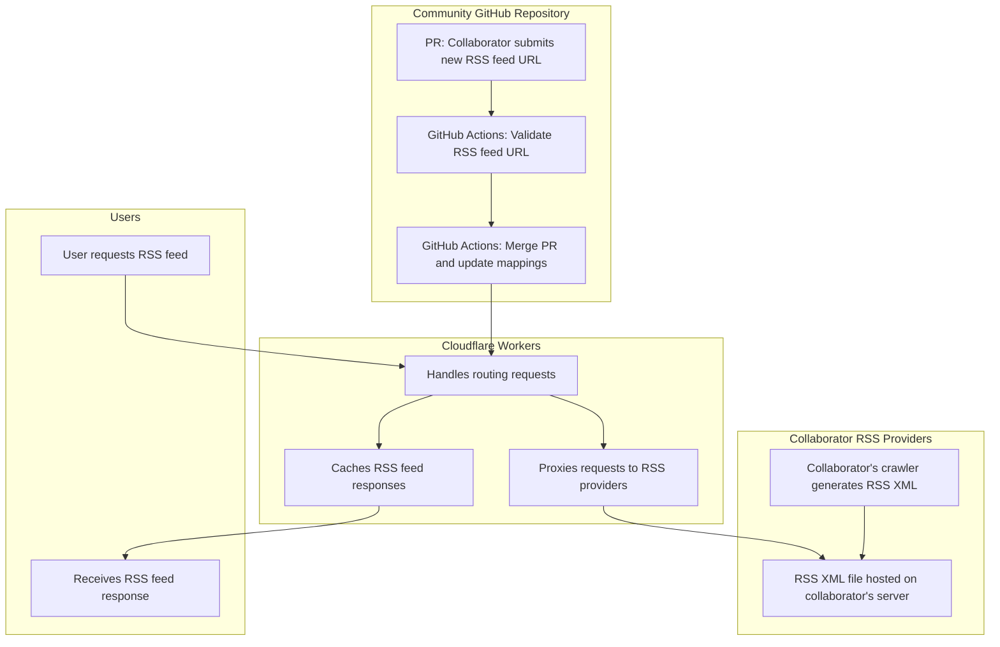
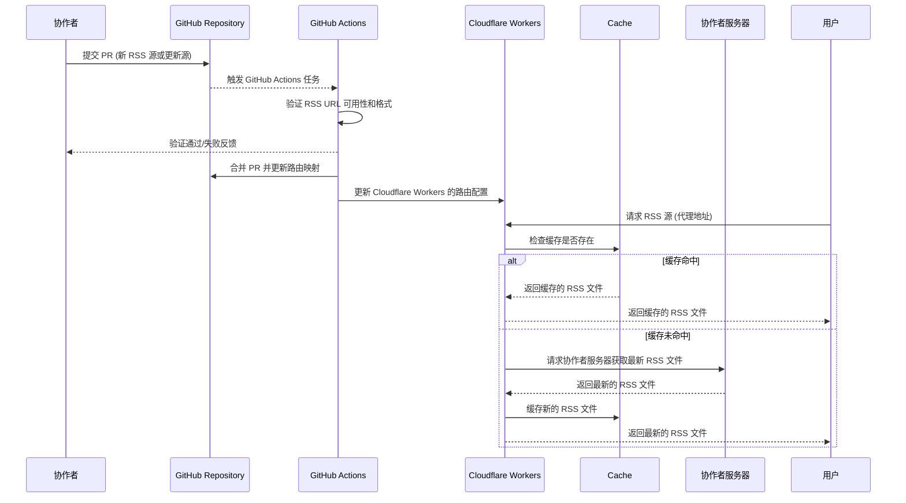
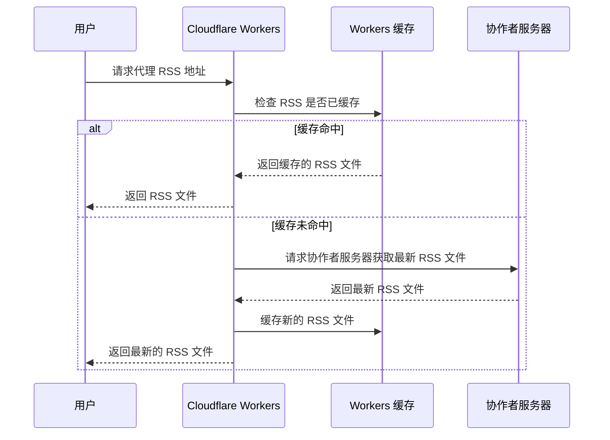
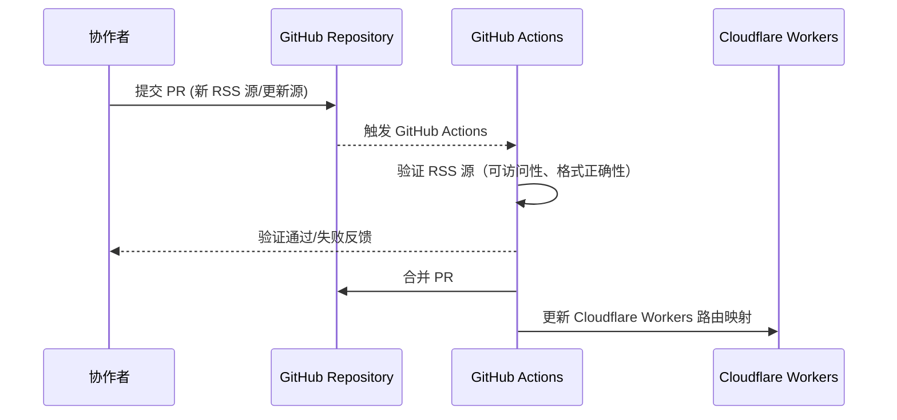
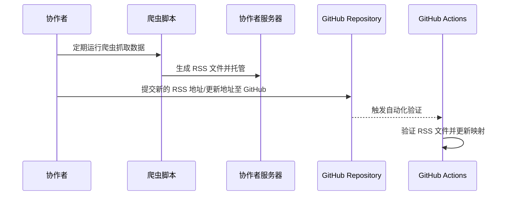

## 1. 引言

### 1.1 项目背景

在信息爆炸的时代，互联网用户面对海量信息时，常常陷入**信息茧房**。这一现象指的是，用户的接收信息渠道受到算法推荐的限制，导致其只能接触到与自己兴趣、观点一致的信息，从而失去了多元视角。这不仅影响了个人的全面认知，也限制了社会整体的多样化对话。

《穹顶之下》项目（RSSky）旨在通过为用户提供多维度的信息获取渠道，打破信息茧房，提升信息获取的质量和效率。RSSky 的核心理念是建立一个开放、透明、自由的信息获取平台，依托 RSS 技术和社区协作，为用户带来高质量、全面的内容订阅服务。

### 1.2 项目愿景

**愿景**：打破信息茧房，提供多元信息获取渠道，提升用户对世界的理解和信息辨别能力。通过社区协作，提供开放、透明、自由的 RSS 资源代理与管理服务。

## 2. 项目概述

### 2.1 项目目标

> 无限可能，为自由而生

**《穹顶之下》（RSSky）** 的主要目标是为用户提供高质量的 RSS 订阅资源，并通过开源社区协作管理和代理这些资源，确保信息获取的稳定性和高效性。具体目标包括：

1. **信息开放**：打破信息茧房，提供多元化、全面的信息获取渠道。
2. **社区协作**：通过社区成员共同贡献和管理 RSS 资源，实现分布式、协作式的信息提供。
3. **自动化管理**：使用自动化技术实现 RSS 资源的更新、验证、路由与缓存管理，确保数据的实时性和稳定性。
4. **用户需求满足**：支持个性化需求定制，帮助用户根据兴趣选择、管理和获取内容。

### 2.2 阶段性目标

- **阶段一**：完成社区平台的搭建，实现 100 个高质量的 RSS 资源代理，并通过 Cloudflare Workers 进行路由管理。
- **阶段二**：扩展到 100 名活跃用户，代理 1000 个 RSS 资源，并支持用户需求定制，优化路由系统性能。

## 3. 技术方案

### 3.1 总体架构设计

RSSky 的核心是 **RSS 资源代理与路由管理**，它通过社区协作者提交的 RSS 资源地址，社区仓库对这些资源进行代理和缓存，所有的爬虫及 RSS 生成工作由协作者独立完成，**社区负责数据的流通与路由映射管理。**

架构核心模块包括：

- **Cloudflare Workers**：用于代理和缓存 RSS 请求。
- **社区 GitHub 仓库**：用于管理 RSS 路由映射和自动化任务。
- **协作者独立爬虫**：由社区协作者独立运行爬虫，生成 RSS 资源。

#### 3.1.1 核心架构图

#### 3.1.2 核心流程图

#### 3.1.3 核心功能模块

##### Cloudflare Workers 路由管理

**Cloudflare Workers** 是整个系统的核心代理模块，负责处理所有用户的 RSS 资源请求，并代理协作者提供的真实 RSS 地址。

它的主要职责包括：

1. **处理路由请求**：
   - Cloudflare Workers 接收用户请求并通过路由映射找到相应的 RSS 资源地址。
   - 当用户访问代理的 RSS 地址时，Cloudflare Workers 负责转发请求并获取真实的 RSS 资源。
2. **缓存管理**：
   - 为提高效率，Cloudflare Workers 会将已请求的 RSS 文件进行缓存，下一次请求同样的资源时，直接从缓存中返回结果。
   - 缓存策略会根据 RSS 内容的更新频率进行动态调整，确保用户始终获取最新的 RSS 信息。
3. **代理与负载均衡**：
   - 当缓存失效或 RSS 源地址不可访问时，Cloudflare Workers 通过代理访问协作者服务器以获取最新 RSS 文件。

##### 社区 GitHub 仓库

社区 GitHub 仓库作为系统的核心协作平台，管理所有 RSS 资源的路由映射文件及更新。每一个 RSS 资源由社区成员通过 PR 提交。

社区具体功能包括：

1. **PR 提交与验证**：
   - 协作者可以通过 GitHub PR 提交新的 RSS 资源地址或更新已有的地址。
   - GitHub Actions 自动触发对 RSS 资源的验证，确保提交的地址能够正常访问，并且格式正确。
2. **自动化管理**：
   - 验证通过后，GitHub Actions 会自动合并 PR 并更新路由映射文件。这些映射文件由 Cloudflare Workers 使用，确保用户请求能够正确路由到真实的 RSS 地址。
   - GitHub Actions 定期执行健康检查，验证现有 RSS 资源的可用性，若发现失效资源，将通知相关贡献者修复或删除。
3. **社区协作与贡献激励**：
   - 社区成员通过贡献 RSS 资源或修复现有问题，提升社区的活跃度。GitHub 仓库提供公开的贡献历史，社区可以通过排行榜、积分等机制激励成员贡献。

##### 协作者独立爬虫

协作者独立爬虫是系统的基础数据来源，由各个社区贡献者负责编写、维护并托管。

其主要功能和责任如下：

1. **RSS 生成与托管**：
   - 协作者可以使用任意编程语言编写爬虫，负责抓取目标网站的内容并生成 RSS 文件。每个协作者独立运行自己的爬虫，系统不会集中管理爬虫任务。
   - 生成的 RSS 文件由协作者服务器托管，协作者需要定期维护爬虫，确保 RSS 文件的时效性。
2. **自动化生成与更新**：
   - 协作者可以通过 GitHub Actions 或其他定时任务自动生成和更新 RSS 文件。例如，协作者可以设置每天定时运行爬虫，抓取最新的内容并更新 RSS 文件。
   - RSS 文件生成后，协作者将地址提交至社区 GitHub 仓库，系统自动更新对应的路由映射。
3. **灵活性与兼容性**：
   - 系统允许协作者使用多种语言编写爬虫，例如 Python、Node.js 或 Rust 等。不同协作者可以根据自己熟悉的开发环境选择合适的技术栈，提升社区贡献的灵活性。
   - 为确保统一标准，建议社区提供爬虫编写的模板和代码规范，确保不同语言编写的爬虫都能顺利集成到系统中。

### 3.2 技术选型

1. **语言与开发工具**：
   - **JavaScript**：用于编写 Cloudflare Workers 路由逻辑。
   - **Python、Node.js、Rust**：协作者可以自行选择开发 RSS 爬虫的语言，**项目不限制爬虫开发语言。**
   - **GitHub Actions**：用于处理自动化任务，如提交的 RSS 资源验证、合并、定期更新等。
2. **数据库与存储**：
   - **GitHub 仓库**：社区不直接存储 RSS 数据，仅存储 URL 映射文件，数据存储由提供者决定。
   - **缓存机制**：Cloudflare Workers 通过缓存管理 RSS 资源，确保访问效率。
3. **代理与路由管理**：
   - **Cloudflare Workers**：用于动态代理协作者提供的 RSS 资源。

### 3.3 核心功能实现

项目的核心功能围绕**自动化工作流**、**用户界面与订阅管理**、以及**健康监控与通知**展开。这些功能不仅确保 RSS 资源的自动更新和管理，还提供了一种用户友好的交互方式，以便轻松管理和订阅内容。

#### 3.3.1 自动化工作流

**GitHub Actions** 在整个项目中扮演了自动化管理的关键角色，通过其强大的 CI/CD 流程，协作者提交的 RSS 资源能够得到快速验证、自动化处理和更新。自动化工作流的几个关键部分包括：

1. **PR 提交与自动化处理**：
   - 当协作者提交新的 RSS 资源或更新现有资源时，GitHub Actions 会自动触发，进行以下步骤：
     - 验证提交的 RSS URL 是否能够正常访问。
     - 检查 RSS 源的内容格式是否正确。
     - 验证通过后，自动合并 PR 到主仓库。
   - 如果验证失败，GitHub Actions 会通过评论通知提交者，并提供失败原因及修复建议。
2. **自动化健康监控**：
   - **定期任务**：GitHub Actions 通过定期执行的任务，检查所有已代理的 RSS 资源的可用性。确保每个资源能够在特定时间窗口内正常访问。
   - **自动修复**：当某个 RSS 资源无法访问时，GitHub Actions 可以通知协作者修复或更新资源。如果资源未能在规定时间内恢复，系统将自动标记为失效，并建议用户切换到备用资源。
3. **版本管理与发布**：
   - **自动化版本发布**：每周发布新版本，包含所有新提交的 RSS 资源及改进。每日生成体验版本，用于测试和持续改进系统功能。
   - **GitHub Releases**：每个稳定版本会自动发布到 GitHub Releases，社区开发者和用户可以获取最新的资源映射和路由信息。

#### 3.3.2 用户界面与订阅管理

项目通过**基于 Markdown 文件**来构建一个用户友好的静态站点界面，帮助用户轻松管理和订阅 RSS 资源。静态站点的优点是结构简单、维护方便、性能优越，并且可以与 GitHub Pages 无缝集成。以下是核心功能模块的详细说明：

1. **基于 Markdown 的静态站点**：
   - 使用静态站点生成器基于 Markdown 文件构建一个简单直观的 Web 界面。每个 RSS 源都有一个对应的内容，文件中包含 RSS 源的详细信息、使用说明、订阅地址等。
   - 该静态站点将托管在 GitHub Pages 上，用户可以直接访问，并通过搜索或分类功能查找感兴趣的订阅源。
2. **订阅管理与搜索功能**：
   - **搜索功能**：用户可以通过站点内置的搜索引擎（如 Lunr.js 或 Algolia）搜索 RSS 资源。关键词搜索能够快速找到符合条件的 RSS 订阅源，极大提高了用户查找效率。
   - **分类展示**：每个 RSS 资源根据类别（如新闻、科技、娱乐等）进行分类展示，用户可以通过分类标签快速找到自己感兴趣的资源。每个分类页面使用 Markdown 文件生成，简单明了，方便用户浏览。
3. **个性化推荐与管理**：
   - **RSS 管理面板**：为用户提供简单的订阅管理面板，用户可以收藏、标记或取消订阅 RSS 源。管理面板将依靠客户端存储（如 LocalStorage）保持用户偏好，便于浏览器持久化用户的订阅记录。
   - **一键订阅**：每个 RSS 资源都提供一键复制订阅地址功能，用户可以快速将订阅地址复制并粘贴到其 RSS 阅读器中。
4. **RSS 资源展示与说明**：
   - 每个 RSS 资源的详细页面包含资源的介绍、更新频率、内容预览、订阅地址等详细信息。
   - 通过模板化 Markdown 文件生成资源页面，确保所有 RSS 源的展示信息一致且规范。

#### 3.3.3 健康监控与通知

系统通过**自动化健康监控机制**确保所有代理的 RSS 源在服务期间始终可用，并提供多层次的通知机制以便及时处理出现的任何问题。以下是功能模块的详细说明：

1. **自动化健康检查**：
   - **定期任务**：通过 GitHub Actions 定期执行健康检查任务，验证所有 RSS 资源的可访问性和格式是否正确。
   - **内容验证**：检查每个 RSS 文件是否符合标准格式，如 `<channel>`, `<item>` 等必要的标签。确保 RSS 资源可以正常解析和使用。
   - **更新频率检测**：通过分析 RSS 源中的 `<pubDate>` 或 `<lastBuildDate>`，检测资源是否定期更新。对于长时间未更新的资源，标记为需要维护或替换。
2. **问题通知与修复建议**：
   - **协作者通知**：当发现某个 RSS 源失效时，系统会通过 GitHub Issues 自动生成问题报告，并通知协作者进行修复。协作者会收到问题的详细说明，包括失效原因和修复建议。
   - **邮件与推送通知**：协作者还会收到邮件通知或推送消息，确保他们能够及时修复问题，维持资源的可用性。
   - **问题报告**：所有检测结果会生成报告，并记录在 GitHub 中，便于社区成员审查和后续维护。
3. **备用资源支持**：
   - **备用源配置**：为一些重要或高访问量的 RSS 资源设置备用源，确保在主 RSS 资源失效时，系统可以自动切换到备用资源。
   - **自动切换**：当健康检查发现主源失效时，系统会自动启用备用源，保障服务的连续性。用户无需任何手动操作，系统会自动处理切换。
   - **备用源管理**：协作者可以通过提交 PR 方式更新或增加备用 RSS 源，确保资源在出现问题时能够顺利切换。
4. **用户反馈与问题报告**：
   - **用户通知**：当系统切换到备用资源时，用户将收到简要的通知，告知当前资源的状况。用户可以在资源页面查看详细信息，并选择是否手动更新订阅。
   - **问题反馈渠道**：用户可以通过静态站点的反馈功能报告失效的 RSS 资源。提交的反馈会转化为 GitHub Issues，供协作者查看并处理。

#### 3.3.4 社区协作与贡献者管理

社区协作是 RSSky 项目的基础，协作者通过贡献 RSS 资源并不断完善系统，维持项目的高活跃度。为了确保项目长期健康发展，系统提供了一套协作和管理机制，帮助社区成员更高效地参与项目。

1. **贡献者管理与激励机制**：
   - **贡献者排行榜**：每个贡献者的贡献（包括提交的 RSS 源、修复的问题等）都会被记录，并根据贡献量进行积分评定。贡献者可以通过排行榜查看自己的排名，激励社区成员更加积极地参与。
   - **贡献奖励与徽章系统**：为激励活跃的贡献者，项目引入了社区徽章和奖励系统。核心贡献者可以获得“活跃贡献者”、“修复专家”等徽章，这些徽章会展示在贡献者的 GitHub 个人资料上，增加社区声望。
   - **长期贡献者的社区影响力**：核心贡献者可以被邀请参与项目的长期规划，帮助制定新功能的路线图，并参与项目的重大决策，进一步增强社区归属感。
2. **贡献者协作流程**：
   - **GitHub PR 审核流程**：贡献者通过 PR 向项目提交新功能或 RSS 资源。系统通过 GitHub Actions 自动验证 PR 的正确性（如 RSS URL 的有效性、内容格式的正确性等）。社区维护者或管理员在自动验证通过后，可以进一步进行手动审查和合并。
   - **社区反馈与讨论**：贡献者提交的 PR 可以通过 GitHub Discussions 或 Issues 进行社区讨论，确保提交的功能或 RSS 资源符合社区共识。这种开源协作的模式可以确保所有变更都能被详细审查和讨论。
3. **协作模板与文档支持**：
   - **贡献指南**：为协作者提供详细的贡献指南，帮助新加入的贡献者快速上手。指南中包含如何提交 PR、如何编写 RSS 源格式、以及如何通过 GitHub Actions 进行自动化测试等。
   - **模板与代码规范**：为确保不同贡献者提交的代码和 RSS 源符合统一标准，项目提供了模板和代码规范文档。所有贡献者在提交代码或 RSS 源之前，需要使用这些模板和规范进行检查，确保代码的可维护性和一致性。
4. **定期社区活动与黑客松**：
   - **社区黑客松**：项目可以定期组织在线黑客松活动，邀请全球开发者参与，推动新功能的开发和讨论。黑客松不仅能够激发创新，也能为项目引入更多新贡献者。
   - **反馈与路线图讨论**：项目管理员可以定期发起社区讨论，听取社区成员的意见和建议，并根据讨论结果调整未来的开发路线图。

### 3.4 项目路线图

#### 3.4.1 短期目标（0-6 个月）

- 实现基础的 RSS 资源代理和路由管理功能，使用 Cloudflare Workers 处理 RSS 资源请求。
- 吸引社区成员贡献 RSS 资源，完善 PR 流程，实现自动化更新和验证。
- 提供用户订阅管理的基本 Web 界面，支持一键订阅和管理功能。

以帮助项目更好地监控和追踪进展。

| 主任务                    | 子任务                                     | 状态  |
| ---------------------- | --------------------------------------- | --- |
| **完成基础 RSS 资源代理与路由管理** | 构建 Cloudflare Workers 路由逻辑              |     |
|                        | 实现 RSS URL 到真实源地址的路由映射                  |     |
|                        | 实现基本缓存管理机制（支持频繁更新的 RSS 缓存刷新）            |     |
|                        | 配置负载均衡机制，处理高并发 RSS 请求                   |     |
|                        | 创建基础状态页面，展示路由和缓存状态                      |     |
| **实现自动化工作流与 PR 管理**    | 集成 GitHub Actions，自动触发 PR 检查            |     |
|                        | 编写 PR 验证脚本，检查 RSS 源可用性和格式               |     |
|                        | 自动合并通过验证的 PR，更新路由映射                     |     |
|                        | 创建状态页面，展示 PR 提交、验证、合并的实时状态              |     |
| **搭建用户界面与订阅管理**        | 使用 Hugo 或 Jekyll 构建静态站点                 |     |
|                        | 创建 RSS 源详细页面（包含订阅地址、说明）                 |     |
|                        | 集成 Lunr.js 或 Algolia 搜索引擎，支持 RSS 源关键词搜索 |     |
|                        | 按类别展示 RSS 源，提供分类筛选功能                    |     |
|                        | 为每个 RSS 源创建一键复制订阅地址的功能                  |     |
|                        | 创建状态页面，展示站点更新和页面访问数据                    |     |
| **吸引社区协作者贡献 RSS 资源**   | 编写贡献指南，详细描述如何编写爬虫和提交 RSS 源              |     |
|                        | 提供爬虫模板，支持多种语言（Python、Node.js、Rust）      |     |
|                        | 开展社区推广活动，通过开发者论坛和社交媒体吸引贡献者              |     |
|                        | 设置贡献排行榜，展示贡献者提交的 RSS 源和参与度              |     |
|                        | 创建状态页面，展示社区成员贡献的统计数据                    |     |

#### 3.4.2 中期目标（6-12 个月）

- 扩展到 1000 个高质量的 RSS 订阅源，优化路由管理功能，提升系统的稳定性和性能。
- 引入个性化推荐功能，通过分析用户的订阅历史，为用户提供更多相关 RSS 资源推荐。
- 完善用户界面，增加 RSS 资源的可视化管理和分类功能，帮助用户更好地管理信息。

| 主任务                          | 子任务                                                       |
| ------------------------------- | ------------------------------------------------------------ |
| **扩展 RSS 资源与优化缓存策略** | 扩展至 1000 个高质量的 RSS 资源                              |
|                                 | 为不同类型的 RSS 源优化缓存策略（高频、低频源不同缓存时间）  |
|                                 | 对路由映射进行优化，减少处理时间                             |
|                                 | 设置缓存刷新状态页面，实时展示缓存命中率和缓存刷新周期       |
| **开发个性化推荐功能**          | 通过分析用户订阅历史，开发个性化 RSS 源推荐算法              |
|                                 | 在用户界面增加推荐模块，提供相关推荐 RSS 源                  |
|                                 | 开发订阅管理面板，支持收藏、标记已读、取消订阅等操作         |
| **健康监控与备用资源支持**      | 开发 GitHub Actions 任务，定期检查 RSS 源的可用性和更新频率  |
|                                 | 为高访问量的 RSS 源设置备用资源，自动切换到备用源            |
|                                 | 为协作者提供 RSS 源状态通知，提醒源失效或需更新              |
|                                 | 创建状态页面，展示 RSS 源健康状态（可用性、频率、错误报告等） |
| **完善社区激励与协作机制**      | 引入贡献者排行榜，展示贡献者的提交、修复等贡献记录           |
|                                 | 增加贡献徽章系统，奖励活跃贡献者                             |
|                                 | 定期举办线上黑客松活动，激励新功能开发和修复任务             |
|                                 | 创建状态页面，展示社区活动的参与情况和贡献者活跃度           |

## 4. 用户体验与社区运营

### 4.1 用户体验

1. **稳定性与高可用性**：
   - 通过 Cloudflare Workers 的缓存机制，用户可以快速访问代理的 RSS 资源，确保信息流的稳定性和高效性。
   - 健康监控机制确保 RSS 源始终有效，用户可以获得高质量的订阅体验。
2. **个性化推荐**：
   - 系统通过用户订阅行为分析，为用户推荐与其兴趣相关的 RSS 源，帮助用户避免信息过载，并提升信息获取的效率。
3. **多维度管理**：
   - 用户可以通过 Web 界面轻松管理订阅源，并根据个人需求进行订阅源分类和筛选。

### 4.2 社区协作与运营

1. **贡献者管理与激励**：
   - 通过贡献者排行榜和积分机制，激励社区成员提交优质的 RSS 资源。贡献者可以通过定期提交和维护获得社区认可和奖励。
   - 核心贡献者将有机会参与项目的长期发展规划，提升社区的参与度和活跃度。
2. **运营成本管理**：
   - 初期依赖 Cloudflare Workers 进行代理和路由，随着用户规模扩大，可以逐步引入自建 Nginx 反向代理，优化系统的流量管理，降低运营成本。
   - 项目也可以通过与云服务提供商建立合作，利用免费资源进一步降低成本。

### 4.3 社区增长策略

- **推广和营销**：通过社交媒体、开发者论坛、开源社区等渠道推广项目，吸引更多用户和开发者参与。
- **合作伙伴计划**：与相关的 RSS 订阅平台、信息流工具建立合作伙伴关系，增加 RSSky 的知名度。
- **社区激励计划**：引入贡献者奖励机制，通过排行榜、徽章、积分等方式，激励更多开发者和贡献者积极参与项目建设。

### 4.4 持续创新

- **AI 驱动的个性化推荐**：引入基于 AI 的算法模型，进一步优化个性化推荐功能，让用户能够快速找到感兴趣的订阅源。
- **分布式缓存与优化**：随着用户规模的扩展，引入分布式缓存和 CDN 技术，进一步提高系统的响应速度和稳定性，确保全球范围内用户都能高效访问内容。
- **新技术引入**：密切关注前沿技术的发展，如去中心化的内容发布协议、更加高效的内容聚合工具等，并探索这些技术如何与 RSSky 项目结合，推动项目的技术革新。

## 5. 开发者文档与协作

### 5.1 开发者支持

1. 详细文档：
   - 提供详细的开发者文档，包含如何编写爬虫、如何通过 GitHub Actions 自动生成 RSS 源，以及如何提交 PR。
2. 标准化工具链：
   - 制定统一的代码规范和测试标准，确保不同语言的爬虫代码具有一致性，便于项目的长期维护和扩展。

### 5.2 贡献指南

1. 贡献流程：
   - 开发者可以通过 GitHub 提交 PR，RSS 源的提交和更新将由 GitHub Actions 自动化处理。贡献者可以通过贡献文档了解详细的贡献指南。
2. 贡献激励：
   - 通过贡献者的活跃度和代码质量进行评估，为高质量贡献者提供社区认可和奖励，增强社区凝聚力。

## 6. 安全性与合法性

### 6.1 数据安全

- **用户隐私保护**：项目不存储用户的个人数据，所有 RSS 资源的获取通过代理完成，确保用户信息的隐私性。

### 6.2 法律合规

- **内容版权保护**：原则上所有提交的 RSS 资源必须经过社区审核，确保其合法合规，避免侵犯目标网站的版权和知识产权。
