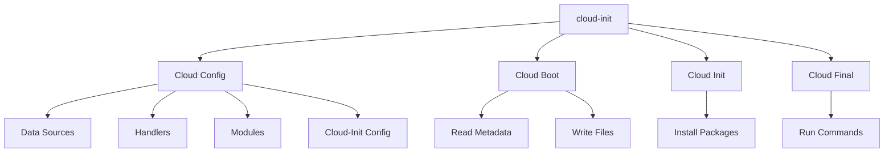
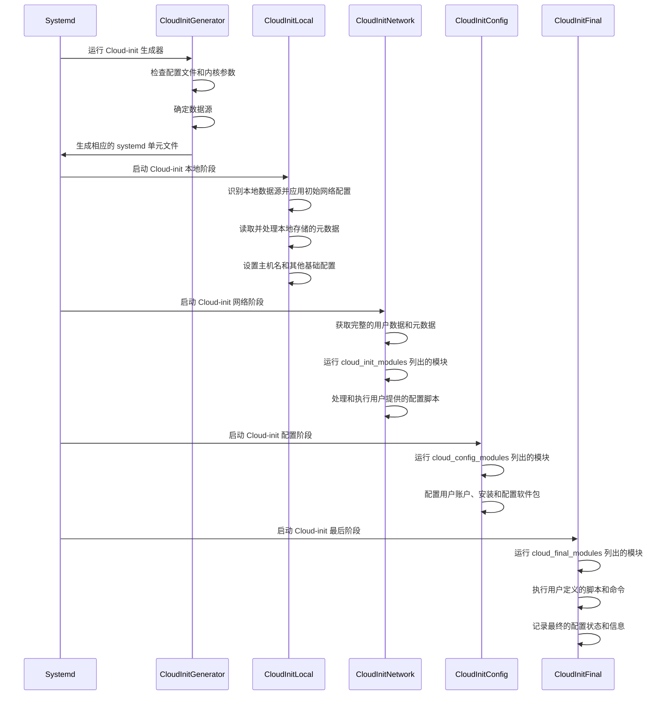

## Cloud-init

### 概述

Cloud-init 是一个用于在云计算环境中自动化配置虚拟机实例的工具。它能够在实例启动时根据用户提供的配置脚本或元数据进行初始化和配置，使得实例能够快速、统一地完成设置过程。Cloud-init 被广泛用于各种云平台，如 AWS、Azure、Google Cloud、OpenStack 等。

#### 历史与发展

[Cloud-init](https://cloud-init.io/) 最早由 Canonical 公司开发，最初用于 Ubuntu 服务器的自动化配置。随着时间的推移，Cloud-init 的功能不断扩展，逐渐支持更多的操作系统和云平台。现在，它已经成为云计算环境中不可或缺的配置工具，拥有一个活跃的开源社区，持续推动其发展和改进。

#### 为什么选择 Cloud-init

1. **自动化配置**：Cloud-init 可以自动执行实例初始化和配置，减少手动干预，提升效率。
2. **跨平台支持**：Cloud-init 支持多种云平台和操作系统，具有广泛的适用性。
3. **模块化设计**：通过模块化架构，用户可以根据需求选择和定制功能。
4. **开源和社区支持**：Cloud-init 是开源软件，拥有活跃的社区和丰富的文档支持。

### 主要特性

- **无代理设计：**Cloud-init 采用无代理设计，不需要在实例中运行长期驻留的代理进程。这种设计简化了系统架构，减少了资源占用和潜在的安全风险。
- **基于云元数据的初始化：**Cloud-init 利用云服务提供的元数据服务，在实例启动时获取必要的配置信息。元数据通常包含实例的网络配置、用户数据脚本、公钥等，Cloud-init 通过读取这些元数据进行相应的配置操作。
- **支持多种云平台：**Cloud-init 支持广泛的云平台，包括但不限于：Amazon Web Services (AWS)、Microsoft Azure、Google Cloud Platform (GCP)、OpenStack、Oracle Cloud Infrastructure (OCI)、DigitalOcean。

#### 主要优势

- **无代理设计**：无需安装和维护长期驻留的代理进程，减少系统资源占用和维护开销。
- **快速初始化**：在实例启动时立即执行配置，适用于快速部署环境。
- **多平台支持**：支持多种云服务提供商和操作系统，灵活适用。
- **易于使用**：使用 YAML 格式配置文件，简洁易读，方便编写和维护。

#### 潜在劣势

- **功能有限**：主要用于初始配置，不适合复杂的持续配置管理和任务编排。
- **单次执行**：通常在实例启动时执行一次，不适合需要频繁更新配置的场景。
- **依赖云平台**：依赖于云服务提供商提供的元数据服务，在非云环境中使用受限。

### 模块化架构



Cloud-init 采用模块化架构，每个功能模块负责特定的配置任务。例如，网络配置模块、用户数据处理模块、包管理模块等。用户可以根据需求启用或禁用特定模块，并且可以编写自定义模块以满足特殊需求。

### 应用场景

#### 云实例初始化

**Cloud-init 最常见的应用场景是云实例的初始化。**在实例启动时，Cloud-init 自动获取并应用配置，完成系统设置、网络配置、用户账户创建、SSH 密钥安装等任务，使实例能够快速投入使用。

#### 配置管理

Cloud-init 可以用作配置管理工具，执行复杂的系统配置任务。例如，安装和配置软件包、设置系统参数、管理用户权限等。通过用户数据脚本，用户可以定义详细的配置步骤，Cloud-init 在实例启动时自动执行这些步骤。

#### 应用部署

Cloud-init 还可以用于自动化应用部署。用户可以在用户数据脚本中包含应用安装和配置指令，Cloud-init 在实例启动时执行这些指令，完成应用的自动化部署。这种方式适用于 DevOps 流程，能够加速应用的交付和更新。

## Cloud-init 安装与配置

### 系统要求

Cloud-init 支持多种操作系统，包括但不限于：Ubuntu、CentOS、Fedora、Red Hat Enterprise Linux (RHEL)、Debian、SUSE Linux Enterprise Server (SLES)、Oracle Linux、FreeBSD。

这些操作系统在不同的云平台上广泛使用，使得 Cloud-init 能够在多种环境中提供一致的自动化配置功能。

#### 必要的依赖项

在安装 Cloud-init 之前，确保系统满足以下基本依赖项：

- **Python：**Cloud-init 主要用 Python 编写，因此需要系统中预装有 Python（通常是 Python 3）。
- **网络工具：**如 `curl` 或 `wget`，用于从数据源获取元数据。
- **包管理工具：**如 `apt`、`yum` 或 `zypper`，用于安装 Cloud-init 和相关依赖包。

### 安装步骤

#### 通过包管理器安装

在大多数 Linux 发行版中，Cloud-init 都可以通过包管理器安装。根据具体的操作系统选择合适的包管理工具：

- Debian/Ubuntu 系列：

  ```shell
  sudo apt-get install cloud-init
  ```

- RHEL/CentOS 系列：

  ```shell
  sudo yum install cloud-init
  ```

- SUSE 系列：

  ```shell
  sudo zypper install cloud-init
  ```

#### 从源代码安装

1. 克隆 Cloud-init 源代码仓库：

   ```shell
   git clone https://github.com/canonical/cloud-init.git
   ```

2. 切换到源码目录：

   ```shell
   cd cloud-init
   ```

3. 安装必要的依赖：

   ```shell
   sudo apt-get install python3 python3-pip
   ```

4. 安装 Cloud-init：

   ```shell
   sudo python3 setup.py install
   ```

## Cloud-init 自动化管理基础

### Cloud-init 语法

Cloud-init 配置文件由多个配置段组成，每个配置段负责特定的初始化任务。常见的配置段包括用户定义、网络配置、包管理等。

#### 配置示例

以下是一个 Cloud-init 配置文件的示例结构：

```yaml
#cloud-config

# 1. 定义用户和其相关配置
# 配置了一个名为 `ubuntu` 的用户，并设置了 SSH 公钥、sudo 权限和 shell。
users:
  - name: ubuntu
    sudo: ['ALL=(ALL) NOPASSWD:ALL']
    groups: sudo
    ssh-authorized-keys:
      - ssh-rsa AAAAB3NzaC1yc2EAAAABIwAAAQEAr...  # 用户的 SSH 公钥
    shell: /bin/bash

# 2. 配置网络设置
# 启用了 DHCP 以自动获取 IP 地址。
network:
  version: 2
  ethernets:
    eth0:
      dhcp4: true

# 3. 配置系统包更新和升级选项
# 启用了系统包更新和升级。
package_update: true
package_upgrade: true

# 4. 配置 apt 包管理器的相关选项
apt:
  sources:
    my_ppa:
      source: "ppa:my/ppa"
  preserve_sources_list: false

# 5. 配置 snap 包管理器的相关选项
snappy:
  snaps:
    - name: core
      channel: stable
    - name: docker
      channel: stable

# 6. 创建或修改两个文件
write_files:
  - path: /etc/myconfig.conf
    content: |
      This is my config file
  - path: /etc/motd
    content: |
      Welcome to my custom server!

# 7. 在实例引导过程中运行命令
bootcmd:
  - echo 'Booting...'
  - mkdir -p /etc/mydir

# 8. 在实例初始化过程中运行自定义命令
runcmd:
  - echo 'Hello, world!'
  - [ cloud-init, status, --wait ]

# 9. 配置系统的语言环境（locale）
locale: en_US.UTF-8

# 10. 配置系统时区
timezone: America/New_York

# 11. 配置 NTP（网络时间协议）服务
ntp:
  servers:
    - ntp.ubuntu.com
    - ntp.ubuntu.net

# 12. 配置用户的 SSH 公钥，用于无密码登录
ssh_authorized_keys:
  - ssh-rsa AAAAB3NzaC1yc2EAAAABIwAAAQEAr...

# 13. 配置根文件系统自动扩展
resize_rootfs: true

# 14. 配置在 Cloud-init 最终阶段运行的模块
cloud_final_modules:
  - [scripts-user]
  - [phone-home, service]

# 15. 配置实例初始化完成后发送通知
phone_home:
  url: http://example.com/phone_home
  post:
    - instance_id
    - hostname
```

### Cloud-init 模块

#### 常用模块

Cloud-init 通过模块化设计，将不同的初始化任务分配给不同的模块。以下是一些常用的 Cloud-init 模块：

| 模块                     | 描述                                                     | 运行阶段  | 权重 |
| ------------------------ | -------------------------------------------------------- | --------- | ---- |
| **bootcmd**              | 在系统引导过程中运行命令，早于其他 Cloud-init 配置执行。 | boot 阶段  | 1    |
| **growpart**             | 扩展分区大小。                                           | init 阶段  | 2    |
| **resize_rootfs**        | 配置根文件系统自动扩展。                                 | init 阶段  | 3    |
| **set_hostname**         | 设置实例的主机名。                                       | init 阶段  | 4    |
| **write_files**          | 创建或修改文件。                                         | init 阶段  | 5    |
| **users**                | 定义用户和其相关配置，如用户名、SSH 密钥等。             | init 阶段  | 6    |
| **locale**               | 配置系统的语言环境（locale）。                           | init 阶段  | 7    |
| **timezone**             | 配置系统时区。                                           | init 阶段  | 8    |
| **ntp**                  | 配置 NTP（网络时间协议）服务。                           | init 阶段  | 9    |
| **apt**                  | 配置 apt 包管理器的相关选项。                            | init 阶段  | 10   |
| **yum**                  | 配置 yum 包管理器的相关选项。                            | init 阶段  | 11   |
| **snappy**               | 配置 snap 包管理器的相关选项。                           | init 阶段  | 12   |
| **ssh_authorized_keys**  | 配置用户的 SSH 公钥，用于无密码登录。                    | init 阶段  | 13   |
| **package_update**       | 配置系统包更新选项。                                     | init 阶段  | 14   |
| **package_upgrade**      | 配置系统包升级选项。                                     | init 阶段  | 15   |
| **apt-configure**        | 配置 apt 包管理器。                                      | init 阶段  | 16   |
| **ssh**                  | 配置 SSH 相关设置，如主机密钥和 SSH 服务的相关配置。     | init 阶段  | 17   |
| **disable-ec2-metadata** | 禁用 EC2 元数据服务。                                    | init 阶段  | 18   |
| **grub-dpkg**            | 配置 GRUB 引导加载程序。                                 | init 阶段  | 19   |
| **rsyslog**              | 配置 rsyslog 服务。                                      | init 阶段  | 20   |
| **snap**                 | 配置 Snap 包管理器。                                     | init 阶段  | 21   |
| **mounts**               | 配置文件系统的挂载点。                                   | init 阶段  | 22   |
| **runcmd**               | 在实例初始化过程中运行自定义命令。                       | final 阶段 | 23   |
| **phone_home**           | 配置实例初始化完成后发送通知。                           | final 阶段 | 24   |
| **cloud_final_modules**  | 配置在 Cloud-init 最终阶段运行的模块。                   | final 阶段 | 25   |

#### 分阶段执行

当 Cloud-init 运行时，它会在三个主要阶段中按顺序执行配置文件中的模块：

1. **网络阶段 (cloud_init_modules)**：
   - 处理网络相关的配置。
   - 设置主机名、获取用户数据和元数据。
2. **配置阶段 (cloud_config_modules)**：
   - 配置用户账户和权限。
   - 安装和配置软件包。
   - 处理 SSH 密钥和认证设置。
3. **最终阶段 (cloud_final_modules)**：
   - 执行用户定义的脚本和命令。
   - 触发配置管理插件。
   - 记录配置状态和信息。

#### 模块执行频率

Cloud-init 的模块可以配置不同的执行频率：

- **Per instance**：模块在实例的首次引导时运行。例如，克隆一个实例或从保存的镜像创建新实例时，指定为 per instance 的模块会再次运行。
- **Per once**：模块只运行一次。例如，如果克隆实例或从保存的镜像创建新实例，指定为 per once 的模块不会在这些实例上再次运行。
- **Per always**：模块在每次引导时都运行。

#### 自定义模块开发

用户可以根据需求编写自定义模块，以扩展 Cloud-init 的功能。自定义模块需遵循 Cloud-init 的模块开发规范，并放置在合适的目录中（如 `/etc/cloud/cloud.cfg.d/`）。以下是一个简单的自定义模块示例：

```python
# custom_module.py
import os
from cloudinit import util

def handle(name, cfg, cloud, log, args):
    log.info("Running custom module")
    util.write_file('/var/log/custom_module.log', 'Custom module executed')
```

将自定义模块集成到 Cloud-init 配置中：

```yaml
cloud_final_modules:
  - custom_module
```

### Cloud-init 数据源

Cloud-init 通过数据源获取实例的元数据和用户数据。一般 Cloud-init 使用用户数据、元数据和厂商数据来完成实例初始化：

- **用户数据**：用户在 `cloud.cfg` 文件和 `cloud.cfg.d` 目录中指定的指令，如要运行的脚本、要安装的软件包等。
- **元数据**：与特定数据源关联的数据，如服务器名称和实例 ID。不同的云平台决定实例从哪里查找元数据和用户数据。
- **厂商数据**：由云提供商提供，包含用于自定义镜像的信息。

**Cloud-init 的主要配置文件是 `/etc/cloud/cloud.cfg`。**该文件定义了 Cloud-init 在实例启动时执行的全局配置和行为。**拓展数据源的文件通常位于 `/etc/cloud/cloud.cfg.d/` 目录下。**

#### 数据源类型

数据源类型决定了 Cloud-init 如何获取和处理这些数据。常见的数据源类型包括：

- NoCloud：用于本地测试和开发，数据存储在 ISO 镜像或本地文件中。
- EC2：用于 Amazon Web Services (AWS)。
- Azure：用于 Microsoft Azure。
- GCE：用于 Google Cloud Platform。
- OpenStack：用于 OpenStack 环境。

#### 常用数据源

以下是一些常用的数据源配置示例：

##### NoCloud

```yaml
datasource_list: [ NoCloud ]
datasource:
  NoCloud:
    seedfrom: /path/to/nocloud/seed/
```

##### EC2

```yaml
datasource_list: [ Ec2 ]
datasource:
  Ec2:
    metadata_urls: [ 'http://169.254.169.254' ]
```

##### GCE

```yaml
datasource_list: [ GCE ]
datasource:
  GCE:
    metadata_server: 'http://metadata.google.internal'
```

##### Azure

```yaml
datasource_list: [ Azure ]
datasource:
  Azure:
    retries: 10
    timeout: 5
```

#### 数据源优先级和故障处理

Cloud-init 可以配置多个数据源，并按照优先级顺序依次尝试。当一个数据源不可用时，Cloud-init 会自动尝试下一个数据源。优先级顺序通过 `datasource_list` 配置项定义：

```yaml
datasource_list: [ NoCloud, Ec2, GCE, Azure ]
```

可以通过配置故障处理选项，控制 Cloud-init 在数据源不可用时的行为：

```yaml
datasource:
  Ec2:
    max_wait: 120  # 最大等待时间（秒）
    timeout: 5     # 每次请求的超时时间（秒）
    retries: 10    # 重试次数
```

## Cloud-init 的生命周期

Cloud-init 的生命周期分为多个阶段，每个阶段负责特定的初始化和配置任务。理解这些阶段有助于更好地使用和调试 Cloud-init。下面是 Cloud-init 的详细生命周期描述：



### 1. 生成器阶段 (Generator Stage)

在系统引导过程中，systemd 会运行 Cloud-init 生成器（generator）。生成器的主要任务是确定是否在当前引导中启用 Cloud-init 以及选择适当的数据源。生成器阶段包括以下任务：

- 检查配置文件和内核参数，决定是否启用 Cloud-init。
- 确定使用哪个数据源（例如 EC2、Azure、NoCloud 等）。
- 生成相应的 systemd 单元文件，以便在后续阶段运行 Cloud-init 服务。

### 2. 本地阶段 (Local Stage)

本地阶段是 Cloud-init 的第一个主要执行阶段，发生在实例启动的早期阶段。在本地阶段，Cloud-init 会执行以下操作：

- 识别本地数据源，并应用初始网络配置。
- 读取并处理本地存储的元数据。
- 处理基本的网络配置，如静态 IP 设置或 DHCP 回退机制。
- 设置实例的主机名和其他基础配置。

本地阶段的主要目的是确保实例在能够访问外部网络之前完成基本的配置。

### 3. 网络阶段 (Network Stage)

网络阶段是 Cloud-init 的第二个主要执行阶段，依赖于实例已经有了基础网络连接。在这一阶段，Cloud-init 会执行以下任务：

- 通过网络访问数据源，获取完整的用户数据和元数据。
- 运行 `/etc/cloud/cloud.cfg` 文件中 `cloud_init_modules` 部分列出的模块。
- 处理和执行用户提供的配置脚本和指令。

这一阶段确保实例能够通过网络访问必要的资源，并完成初步的配置任务。

### 4. 配置阶段 (Config Stage)

配置阶段是 Cloud-init 的第三个主要执行阶段，负责更详细的系统配置。在这一阶段，Cloud-init 会执行以下操作：

- 运行 `/etc/cloud/cloud.cfg` 文件中 `cloud_config_modules` 部分列出的模块。
- 配置用户账户和权限、安装和配置软件包、设置系统参数等。

配置阶段处理实例的核心配置任务，确保系统按预期进行初始化和设置。

### 5. 最后阶段 (Final Stage)

最后阶段是 Cloud-init 的最后一个主要执行阶段，负责执行所有剩余的配置任务和用户定义的脚本。在这一阶段，Cloud-init 会执行以下操作：

- 运行 `/etc/cloud/cloud.cfg` 文件中 `cloud_final_modules` 部分列出的模块。
- 执行用户定义的脚本和命令，如软件包安装、服务启动等。
- 记录最终的配置状态和信息。

最后阶段确保所有配置任务完成，并记录实例的最终状态。

## Cloud-init 高级应用技巧

### Cloud-init 用户数据

#### 用户数据格式和用法

Cloud-init 用户数据用于在实例启动时传递自定义的配置和脚本。用户数据支持多种格式：

- **Cloud Config（YAML 格式）**：使用 `#cloud-config` 作为头标识。
- **Shell 脚本**：使用 `#!` 或 `#cloud-boothook` 作为头标识。
- **MIME 多部分消息**：支持混合多种类型的数据。

示例：

```yaml
#cloud-config
users:
  - name: example-user
    ssh-authorized-keys:
      - ssh-rsa AAAAB3Nza...


#!/bin/bash
echo "Hello, World!" > /var/log/hello.log

Content-Type: multipart/mixed; boundary="===============BOUNDARY=="

MIME-Version: 1.0

--===============BOUNDARY==
Content-Type: text/cloud-config


#cloud-config
users:
  - name: example-user
    ssh-authorized-keys:
      - ssh-rsa AAAAB3Nza...

--===============BOUNDARY==
Content-Type: text/x-shellscript


#!/bin/bash
echo "Hello, World!" > /var/log/hello.log

--===============BOUNDARY==--
```

#### 脚本和配置的集成

用户数据可以包含多个脚本和配置指令，Cloud-init 会按照定义的顺序依次执行。例如，可以先配置用户，然后运行一个脚本来安装软件：

```yaml
#cloud-config
users:
  - name: example-user
    ssh-authorized-keys:
      - ssh-rsa AAAAB3Nza...

runcmd:
  - apt-get update
  - apt-get install -y nginx
```

#### 用户数据的传递和解析

用户数据可以通过多种方式传递到实例中：

- **Cloud Provider 控制台**：通过云服务提供商的控制台界面输入用户数据。
- **API 调用**：使用云服务提供商的 API 传递用户数据。
- **配置文件**：在本地环境中，通过配置文件传递用户数据。

Cloud-init 会在实例启动时解析这些数据，并根据配置执行相应的任务。

### 调试和日志

Cloud-init 在实例启动时会生成日志，记录执行的每个步骤。这些日志通常保存在 `/var/log/cloud-init.log` 和 `/var/log/cloud-init-output.log` 文件中。通过检查这些日志，可以调试和验证用户数据是否正确执行。

## Cloud-init 与其他工具的比较

| **维度**       | **Cloud-init**                 | **Ansible**            | **Puppet**             |
| -------------- | ------------------------------ | ---------------------- | ---------------------- |
| **架构**       | 无代理，实例初始化             | 无代理，远程执行       | 代理 - 服务器，持续管理  |
| **设计理念**   | 云实例启动时配置               | 配置管理和应用部署     | 声明式，持续配置       |
| **使用场景**   | **云实例首次配置**             | 持续配置管理，多节点   | 大规模持续管理         |
| **主要优势**   | 轻量，快速配置，多平台支持     | 强大编排，灵活管理     | 自动纠正，模块丰富     |
| **主要劣势**   | 功能有限，单次执行，依赖云平台 | 需维护控制节点，执行慢 | 需安装代理，学习曲线陡 |
| **适用场景**   | 初始配置，快速部署，统一环境   | 动态配置，多节点管理   | 持续监控，大规模部署   |
| **不适用场景** | 复杂多节点，持续监控           | **快速初始配置**       | **轻量初始配置**       |

## Cloud-init 在实际环境中的应用

### Cloud-init 在云环境中的应用

#### 在 AWS 中的使用

在 AWS 中，Cloud-init 通过 EC2 实例元数据服务获取用户数据和元数据进行初始化配置。以下是一个示例：

1. 创建一个 EC2 实例时，在“高级详细信息”部分提供用户数据。

2. 例如，用户数据可以是一个简单的 Shell 脚本或 Cloud-config 配置：

   ```shell
   #!/bin/bash
   echo "Hello from EC2" > /var/log/cloud-init.log
   ```

   或者：

   ```yaml
   #cloud-config
   packages:
     - nginx
   runcmd:
     - service nginx start
   ```

3. 启动实例后，Cloud-init 会在首次启动时自动执行这些配置。

#### 在 Azure 中的使用

在 Azure 中，Cloud-init 支持通过 Azure 元数据服务进行初始化配置。

1. 创建虚拟机时，选择“云初始化”选项来提供用户数据。

2. 例如，一个简单的 Cloud-config 文件：

   ```yaml
   #cloud-config
   users:
     - default
   packages:
     - apache2
   runcmd:
     - systemctl start apache2
   ```

3. 启动虚拟机后，Cloud-init 将读取用户数据并执行相应配置。

#### 在 Google Cloud 中的使用

在 Google Cloud 中，Cloud-init 支持通过 GCE 元数据服务进行实例初始化配置。

1. 创建 VM 实例时，在“管理、安全性、磁盘、网络、单租户”部分提供启动脚本。

2. 例如，一个简单的启动脚本：

   ```shell
   #!/bin/bash
   echo "Hello from GCE" > /var/log/cloud-init.log
   ```

   或者：

   ```yaml
   #cloud-config
   packages:
     - mysql-server
   runcmd:
     - systemctl start mysql
   ```

3. 启动实例后，Cloud-init 会读取用户数据并执行配置。

### Cloud-init 在容器化环境中的应用

#### 容器实例初始化

Cloud-init 主要用于虚拟机实例的初始化，而在容器化环境中，初始化和配置任务通常由容器编排工具（如 Kubernetes）和容器镜像自身完成。不过，在一些场景下，Cloud-init 也可以用于初始化容器主机环境。

#### 与 Docker 的集成

虽然 Cloud-init 本身不直接用于 Docker 容器的管理，但它可以用于配置运行 Docker 容器的主机。例如，配置主机环境并安装 Docker：

```yaml
#cloud-config
packages:
  - docker.io
runcmd:
  - systemctl start docker
  - docker run hello-world
```

#### 与 Kubernetes 的集成

Cloud-init 可以用于配置 Kubernetes 集群的节点，在节点启动时自动完成必要的配置和初始化步骤：

1. 安装 Kubernetes 必要的软件包：

   ```yaml
   #cloud-config
   packages:
     - kubeadm
     - kubelet
     - kubectl
   runcmd:
     - kubeadm join --token <token> <master-ip>:<port>
   ```

2. 启动节点后，Cloud-init 会自动加入节点到 Kubernetes 集群。

### Cloud-init 在传统 IT 环境中的应用

#### 虚拟机初始化

在传统的虚拟化环境中（如 VMware、KVM），Cloud-init 也可以用于虚拟机的初始化和配置。通过本地数据源（NoCloud）来提供用户数据和元数据：

```yaml
#cloud-config
users:
  - name: admin
    ssh-authorized-keys:
      - ssh-rsa AAAAB3Nza...
```

#### 本地部署配置

在本地数据中心环境中，Cloud-init 可以用于统一配置管理和自动化部署。例如，通过本地镜像或 ISO 文件传递配置数据，实现自动化初始化：

```yaml
#cloud-config
packages:
  - nginx
runcmd:
  - systemctl start nginx
```

#### 跨平台管理

Cloud-init 的跨平台支持使得它可以用于多种操作系统和环境中的一致性管理。在不同的平台上使用相同的 Cloud-config 文件，实现统一的配置和管理：

```yaml
#cloud-config
users:
  - name: user
    ssh-authorized-keys:
      - ssh-rsa AAAAB3Nza...
packages:
  - git
runcmd:
  - git clone https://github.com/example/repo.git /opt/repo
```
