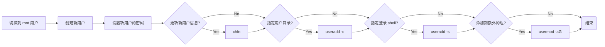

## 概述

Linux 多用户系统的历史可以追溯到 1960 年代的 Unix 系统，Unix 是一种多用户、多任务的操作系统，被广泛应用于大型计算机和服务器上。随着 Linux 的发展，它也成为了一种强大的多用户操作系统，并被广泛应用于服务器、个人电脑和移动设备等领域。

### 设计原则

Linux 多用户系统的设计基于以下原则：

- **唯一用户标识符（UID）**：每个用户都有一个唯一的标识符，用于标识其身份。
- **用户组标识符（GID）**：每个用户可以分配到一个或多个用户组，用户组也有一个唯一的标识符。
- **所有者和用户组**：每个文件和目录都有一个所有者和一个所属用户组，用于控制访问权限。
- **主目录（Home Directory）**：每个用户都有一个主目录，用于存储其个人文件和设置。
- **系统管理员权限**：系统管理员可以创建、删除和管理用户和用户组，以及控制用户的权限和访问权限。

### 实现机制

Linux 多用户系统的实现基于以下机制：

- **配置文件**：用户和用户组的信息存储在特定的配置文件中，如 `/etc/passwd`、`/etc/shadow`、`/etc/group` 和 `/etc/gshadow`。
- **身份验证**：用户登录时需要进行身份验证，通常使用用户名和密码进行认证。
- **管理工具**：系统管理员可以使用命令行工具或图形界面来创建、删除和管理用户和用户组，以及配置用户的权限和访问权限。
- **安全机制**：Linux 系统提供了许多安全机制，如访问控制列表（ACL）、文件系统权限和 SELinux，用于保护系统和用户的数据安全。

### 权限管理

在 Linux 系统中，文件和目录的权限由三个组件组成：所有者权限、所属组权限和其他用户权限。每个组件可以设置为读取（r）、写入（w）和执行（x）权限，这些权限可以用数字表示（r=4, w=2, x=1）。

### 用户和权限的配置文件

以下是存储用户和权限信息的主要配置文件：

- **/etc/passwd**：存储用户账户信息。
- **/etc/shadow**：存储用户密码信息，包含加密的密码和其他安全信息。
- **/etc/group**：存储用户组信息。
- **/etc/gshadow**：存储用户组密码信息。
- **/etc/login.defs**：定义系统登录的默认配置。
- **/etc/adduser.conf**：定义添加用户时的默认配置。

### 安全性建议

在使用 root 用户时，应注意系统的安全性，**尽量使用 `sudo` 或 `su` 命令以普通用户身份执行命令，以减少误操作对系统的影响。**

## 用户

### 创建

#### Useradd

`useradd` 命令是 Linux 系统中的一个命令行工具，用于创建新用户帐户。通过 `useradd` 命令，可以指定新用户的用户名、用户 ID（UID）、主目录、默认 shell 和密码等信息。

在大多数 Linux 系统中，只有管理员用户（如 root 用户）可以创建新用户。通常情况下，管理员用户需要使用 `sudo` 命令或以 root 用户身份登录系统，才能使用 `useradd` 命令创建新用户。

```shell
# 创建一个新用户
sudo useradd john
```

| 选项                           | 描述                                                | 示例                                   |
| ------------------------------ | --------------------------------------------------- | -------------------------------------- |
| `-c, --comment COMMENT`        | 指定用户的注释字段。                                | `sudo useradd -c "John Smith" john`    |
| `-d, --home-dir HOME_DIR`      | 指定用户的家目录。                                  | `sudo useradd -d /home/john john`      |
| `-e, --expiredate EXPIRE_DATE` | 指定用户的账户过期日期。                            | `sudo useradd -e 2023-06-30 john`      |
| `-f, --inactive INACTIVE`      | 设置密码过期后的不活动期限为 INACTIVE，以禁用账户。 | `sudo useradd -f 30 john`              |
| `-g, --gid GROUP`              | 指定用户的主用户组。                                | `sudo useradd -g staff john`           |
| `-G, --groups GROUPS`          | 指定用户所属的其他用户组。                          | `sudo useradd -G staff,developer john` |
| `-m, --create-home`            | 创建用户的家目录。                                  | `sudo useradd -m john`                 |
| `-p, --password PASSWORD`      | 指定用户的加密密码。                                | `sudo useradd -p password_hash john`   |
| `-s, --shell SHELL`            | 指定用户的默认 shell。                              | `sudo useradd -s /bin/bash john`       |
| `-u, --uid UID`                | 指定用户的 UID。                                    | `sudo useradd -u 1001 john`            |

#### Adduser

**`adduser` 命令是 Linux 系统中的一个高层次的用户添加工具，它提供了比 `useradd` 更加用户友好的界面和交互过程。**`adduser` 通常作为一个 Perl 脚本，封装了 `useradd` 命令，并在用户创建过程中进行一些附加的配置工作，如创建主目录、复制模板文件、设置密码等。

- **配置文件**：`adduser` 命令的默认配置文件为 `/etc/adduser.conf`，可以在此文件中修改默认设置，如主目录、用户组等。
- **密码设置**：`adduser` 默认会在用户创建过程中提示输入密码。如果使用 `--disabled-password` 选项，则不会设置密码，需要在用户创建后使用 `passwd` 命令单独设置。
- **与 `useradd` 的兼容性**：虽然 `adduser` 提供了更友好的用户创建界面，但它并不是所有发行版都默认包含的命令。某些轻量级发行版可能只提供 `useradd`。

```shell
# 创建一个新用户
sudo adduser john
```

| 选项                    | 描述                         | 示例                                               |
| ----------------------- | ---------------------------- | -------------------------------------------------- |
| `--home HOME_DIR`       | 指定用户的家目录。           | `sudo adduser --home /home/john john`              |
| `--shell SHELL`         | 指定用户的默认 shell。       | `sudo adduser --shell /bin/bash john`              |
| `--uid UID`             | 指定用户的 UID。             | `sudo adduser --uid 1001 john`                     |
| `--gid GID`             | 指定用户的 GID。             | `sudo adduser --gid 100 john`                      |
| `--disabled-password`   | 创建用户但不设置密码。       | `sudo adduser --disabled-password john`            |
| `--disabled-login`      | 创建用户但禁止登录。         | `sudo adduser --disabled-login john`               |
| `--gecos GECOS`         | 提供用户的 GECOS 信息。      | `sudo adduser --gecos "John Smith,,," john`        |
| `--no-create-home`      | 不创建用户的家目录。         | `sudo adduser --no-create-home john`               |
| `--ingroup GROUP`       | 将用户添加到指定的主用户组。 | `sudo adduser --ingroup staff john`                |
| `--extra-groups GROUPS` | 将用户添加到附加用户组。     | `sudo adduser --extra-groups staff,developer john` |

**`adduser` 与 `useradd` 的区别:**

- **交互式**：`adduser` 提供了交互式的用户创建过程，向导会提示输入用户名、密码、GECOS 信息（如全名、电话等）。
- **默认设置**：`adduser` 使用系统默认配置文件（如 `/etc/adduser.conf`）来设定新用户的默认值，例如主目录位置、用户组等。
- **附加任务**：`adduser` 会自动完成一些附加任务，如创建用户主目录、复制 `/etc/skel` 目录中的模板文件到新用户主目录等。

### 管理

#### Chfn

`chfn` （change finger information）命令用于更改用户的 GECOS 信息。GECOS 字段包含用户的全名、办公地址、办公电话和家庭电话等信息。通常，这些信息存储在 `/etc/passwd` 文件中

```shell
# 更改当前用户信息
debian@SevenWate-PC:$ chfn
Password:
Changing the user information for debian
Enter the new value, or press ENTER for the default
        Full Name:
        Room Number []:
        Work Phone []:
        Home Phone []:
```

| 选项                     | 描述                                                         | 示例                             |
| ------------------------ | ------------------------------------------------------------ | -------------------------------- |
| `-f, --full-name NAME`   | 更改用户的全名。                                             | `chfn -f "John Smith"`           |
| `-r, --room ROOM`        | 更改用户的办公地址。                                         | `chfn -r "Room 123"`             |
| `-w, --work-phone PHONE` | 更改用户的办公电话。                                         | `chfn -w "555-1234"`             |
| `-h, --home-phone PHONE` | 更改用户的家庭电话。                                         | `chfn -h "555-5678"`             |
| `-o, --other OTHER`      | 更改用户的其他信息。                                         | `chfn -o "Other Info"`           |
| `-u, --username USER`    | 指定要更改 GECOS 信息的用户名（仅 root 用户可以使用该选项）。 | `sudo chfn -f "John Smith" john` |
| `-q, --quiet`            | 安静模式，不输出任何信息。                                   | `chfn -q`                        |
| `-v, --verbose`          | 显示详细信息。                                               | `chfn -v`                        |

#### Chsh

`chsh` （change shell）命令用于更改用户的默认登录 shell。通过 `chsh` 命令，用户可以选择不同的 shell 来作为他们的登录环境。在 Linux 系统中，常见的 shell 有 `bash`、`zsh`、`ksh`、`csh` 等。

```shell
# 查看当前系统 shell
cat /etc/shells

# 更改当前用户的默认 shell
chsh -s /bin/bash

# 更改其他用户的默认 shell
chsh -s /bin/bash john
```

| 选项                  | 描述                                                  | 示例                         |
| --------------------- | ----------------------------------------------------- | ---------------------------- |
| `-s, --shell SHELL`   | 指定新的登录 shell。                                  | `chsh -s /bin/zsh`           |
| `-l, --list-shells`   | 列出系统中可用的 shell。                              | `chsh -l`                    |
| `-u, --username USER` | 指定要更改 shell 的用户。仅 root 用户可以使用该选项。 | `sudo chsh -s /bin/zsh john` |
| `-h, --help`          | 显示帮助信息。                                        | `chsh -h`                    |

| Shell       | 描述                                                   | 主要特性                                         | 适用场景                                     |
| ----------- | ------------------------------------------------------ | ------------------------------------------------ | -------------------------------------------- |
| `sh`        | Bourne Shell，最早的 UNIX Shell。                      | 基本命令解释器，轻量，标准 UNIX Shell            | 传统 UNIX 系统，基础脚本编写                 |
| `bash`      | Bourne Again Shell，最常用的 Shell，向后兼容 `sh`。    | 强大的脚本功能，命令行编辑，历史记录，命令补全   | 日常使用，脚本编写，系统管理员使用           |
| `csh`       | C Shell，语法类似 C 语言。                             | C 语言风格语法，别名，历史记录                   | 喜欢 C 语言语法的用户，脚本编写              |
| `tcsh`      | `csh` 的改进版本，增加了一些用户友好功能。             | 增强的命令行编辑，命令补全，语法高亮             | 改进的 C Shell 用户，交互式使用              |
| `ksh`       | Korn Shell，结合了 `sh` 和 `csh` 的优点。              | 丰富的编程特性，数组处理，命令行编辑             | 高级脚本编写，系统管理员使用                 |
| `zsh`       | Z Shell，功能强大且灵活，支持许多高级特性。            | 强大的命令补全，插件系统，主题支持，多行命令编辑 | 高级用户，脚本编写，开发人员                 |
| `fish`      | Friendly Interactive Shell，用户友好的 Shell。         | 人性化提示，智能命令补全，颜色高亮，简易配置     | 新手用户，日常使用，用户友好环境             |
| `dash`      | Debian Almquist Shell，轻量级的 `sh` 实现。            | 轻量快速，标准兼容，资源占用低                   | 系统启动脚本，嵌入式系统，资源受限环境       |
| `ash`       | Almquist Shell，另一个轻量级的 `sh` 实现。             | 轻量快速，标准兼容，资源占用低                   | 嵌入式系统，资源受限环境，轻量级需求         |
| `rbash`     | Restricted Bash，限制版的 `bash`。                     | 限制用户执行某些命令，增强安全性                 | 受限用户环境，安全要求高的场景               |
| `scponly`   | 限制用户只能使用 `scp` 命令。                          | 限制用户只进行 SCP 操作，增强安全性              | 安全文件传输环境，受限用户访问               |
| `nologin`   | 禁止用户登录 Shell，但允许 FTP 等非交互式服务。        | 禁止交互登录，显示消息，安全性控制               | 禁止交互登录的用户，提供非交互服务           |
| `git-shell` | 专为 Git 用户设计的 Shell，限制用户只能执行 Git 命令。 | 限制用户只能使用 Git 命令，增强代码管理安全性    | Git 服务器环境，限制用户操作，代码管理服务器 |

#### Chage

`chage` （change age）命令用于更改用户密码的有效期和过期信息。系统管理员可以通过 `chage` 命令来设置用户密码的到期时间、警告时间和账户失效时间等，从而增强系统的安全性。

```shell
# 查看用户密码信息
sudo chage -l john
```

| 选项                           | 描述                                                         | 示例                            |
| ------------------------------ | ------------------------------------------------------------ | ------------------------------- |
| `-d, --lastday LAST_DAY`       | 设置用户密码最后一次更改的日期。日期格式为 YYYY-MM-DD。      | `sudo chage -d 2024-08-05 john` |
| `-E, --expiredate EXPIRE_DATE` | 设置账户过期日期。日期格式为 YYYY-MM-DD。                    | `sudo chage -E 2024-12-31 john` |
| `-I, --inactive INACTIVE`      | 设置密码过期后多少天账户变为不活跃状态。                     | `sudo chage -I 30 john`         |
| `-m, --mindays MIN_DAYS`       | 设置密码的最短使用期限（两次修改密码之间最少要间隔的天数）。 | `sudo chage -m 7 john`          |
| `-M, --maxdays MAX_DAYS`       | 设置密码的最长使用期限（密码过期前的最大天数）。             | `sudo chage -M 90 john`         |
| `-W, --warndays WARN_DAYS`     | 设置密码过期前警告用户的天数。                               | `sudo chage -W 7 john`          |
| `-l, --list`                   | 显示用户密码和账户的过期信息。                               | `sudo chage -l john`            |
| `-h, --help`                   | 显示帮助信息。                                               | `chage -h`                      |

*日期格式应为 YYYY-MM-DD，如果不指定具体日期，可以使用 `-1` 表示永不过期。*

#### Passwd

`passwd` （password）命令是 Linux 系统中的一个命令行工具，用于更改用户的密码或口令。默认情况下，每个 Linux 用户都有一个口令或密码来保护其账户的安全性。`passwd` 命令可用于更改密码或口令。

```shell
# 更改当前用户的
passwd 

# 更改其他用户的密码
passwd john
```

| 选项                       | 描述                                               | 示例                     |
| -------------------------- | -------------------------------------------------- | ------------------------ |
| `-d, --delete`             | 删除用户的密码，使账户不需要密码即可登录。         | `sudo passwd -d john`    |
| `-e, --expire`             | 使用户密码立即过期，强制用户在下次登录时更改密码。 | `sudo passwd -e john`    |
| `-i, --inactive INACTIVE`  | 设置密码过期后账户被禁用前的天数。                 | `sudo passwd -i 30 john` |
| `-k, --keep-tokens`        | 仅更新有效期信息而不更改密码。                     | `sudo passwd -k john`    |
| `-l, --lock`               | 锁定用户密码，禁用账户。                           | `sudo passwd -l john`    |
| `-S, --status`             | 显示账户的密码状态信息。                           | `sudo passwd -S john`    |
| `-u, --unlock`             | 解锁用户密码，启用账户。                           | `sudo passwd -u john`    |
| `-x, --maxdays MAX_DAYS`   | 设置密码的最大使用期限（天）。                     | `sudo passwd -x 90 john` |
| `-n, --mindays MIN_DAYS`   | 设置密码的最小使用期限（天）。                     | `sudo passwd -n 7 john`  |
| `-w, --warndays WARN_DAYS` | 设置密码过期前的警告天数。                         | `sudo passwd -w 7 john`  |
| `-q, --quiet`              | 安静模式，不输出任何信息。                         | `passwd -q`              |

#### Usermod

`usermod`（user modify）命令是 Linux 系统中的一个命令行工具，用于修改用户的属性或配置。`usermod` 命令允许您更改现有用户的用户名、UID、主目录、默认 shell 等信息，还可以将用户添加到其他用户组中。

| 选项                           | 描述                                                         | 示例                                    |
| ------------------------------ | ------------------------------------------------------------ | --------------------------------------- |
| `-c, --comment COMMENT`        | 修改用户的注释字段。                                         | `sudo usermod -c "John Smith" john`     |
| `-d, --home HOME_DIR`          | 修改用户的主目录，并将目录内容移至新位置（使用 `-m` 选项）。 | `sudo usermod -d /home/newjohn -m john` |
| `-e, --expiredate EXPIRE_DATE` | 设置用户帐户的过期日期。                                     | `sudo usermod -e 2024-12-31 john`       |
| `-f, --inactive INACTIVE`      | 设置密码过期后多少天账户变为不活跃状态。                     | `sudo usermod -f 30 john`               |
| `-g, --gid GROUP`              | 修改用户的主用户组。                                         | `sudo usermod -g staff john`            |
| `-G, --groups GROUPS`          | 修改用户所属的附加组。                                       | `sudo usermod -G staff,developer john`  |
| `-a, --append`                 | 将用户添加到附加组（与 `-G` 选项一起使用）。                 | `sudo usermod -a -G sudo john`          |
| `-l, --login NEW_LOGIN`        | 修改用户的登录名。                                           | `sudo usermod -l newjohn john`          |
| `-L, --lock`                   | 锁定用户密码，禁用账户。                                     | `sudo usermod -L john`                  |
| `-U, --unlock`                 | 解锁用户密码，启用账户。                                     | `sudo usermod -U john`                  |
| `-s, --shell SHELL`            | 修改用户的登录 shell。                                       | `sudo usermod -s /bin/zsh john`         |
| `-u, --uid UID`                | 修改用户的用户 ID（UID）。                                   | `sudo usermod -u 1001 john`             |
| `-p, --password PASSWORD`      | 修改用户的加密密码。                                         | `sudo usermod -p password_hash john`    |
| `-m, --move-home`              | 将用户的主目录内容移动到新位置（与 `-d` 选项一起使用）。     | `sudo usermod -d /home/newjohn -m john` |
| `-o, --non-unique`             | 允许分配重复的 UID（与 `-u` 选项一起使用）。                 | `sudo usermod -o -u 1001 john`          |

### 删除

#### Userdel

`userdel`（User Delete）命令是 Linux 系统中的一个命令行工具，用于删除现有用户帐户。默认情况下，`userdel` 命令仅删除用户的帐户，而不删除用户的主目录和邮件箱。如果需要删除用户的主目录和邮件箱，可以使用 `-r` 选项。

- **删除用户前的检查**：在删除用户之前，应检查用户是否拥有任何正在运行的进程，并终止这些进程。可以使用 `ps -u username` 命令查看用户的进程。
- **备份重要数据**：在删除用户及其主目录之前，建议备份用户的重要数据，以防止数据丢失。
- **SELinux 用户映射**：如果系统启用了 SELinux，并且为用户分配了 SELinux 用户映射，可以使用 `-Z` 选项删除该映射。
- **删除用户后**：删除用户后，应检查并清理与该用户相关的任何残留文件或配置，以确保系统的一致性和安全性。

```shell
# 删除一个用户
sudo userdel john
```

| 选项                 | 描述                                     | 示例                   |
| -------------------- | ---------------------------------------- | ---------------------- |
| `-f, --force`        | 强制删除用户账户，即使用户当前正在登录。 | `sudo userdel -f john` |
| `-r, --remove`       | 删除用户的主目录及其邮件池。             | `sudo userdel -r john` |
| `-Z, --selinux-user` | 删除用户的 SELinux 用户映射。            | `sudo userdel -Z john` |

## 用户组

### 创建

#### Groupadd

`groupadd` 命令是 Linux 系统中的一个命令行工具，用于创建新的用户组。管理员用户（如 root 用户）可以使用 `groupadd` 命令创建新组。

```shell
# 创建一个新组
sudo groupadd newgroup
```

| 选项                  | 描述                                                     | 示例                                       |
| --------------------- | -------------------------------------------------------- | ------------------------------------------ |
| `-f, --force`         | 强制操作，如果组已存在则不报错。如果组不存在则创建新组。 | `sudo groupadd -f developers`              |
| `-g, --gid GID`       | 指定新组的组 ID。                                        | `sudo groupadd -g 1001 developers`         |
| `-K, --key KEY=VALUE` | 覆盖 `/etc/login.defs` 文件中的设置。                    | `sudo groupadd -K GID_MIN=1000 developers` |
| `-o, --non-unique`    | 允许创建具有重复 GID 的组。                              | `sudo groupadd -o -g 1001 developers`      |
| `-r, --system`        | 创建一个系统组。                                         | `sudo groupadd -r sysgroup`                |

### 管理

#### Groups

`groups` 命令是 Linux 系统中的一个命令行工具，用于显示当前用户所属的用户组。如果没有指定用户名，则 `groups` 命令将显示当前用户所属的用户组。

```shell
# 显示当前用户所属的用户组
groups

# 显示指定用户所属的用户组
groups john
```

#### Gpasswd

`gpasswd` （group password）命令是 Linux 系统中的一个命令行工具，用于管理用户组的密码和成员列表。管理员用户（如 root 用户）可以使用 `gpasswd` 命令来添加或删除用户组的成员，或者设置或删除用户组的密码。

```shell
# 设置组密码
sudo gpasswd newgroup
```

| 选项                            | 描述                                             | 示例                                       |
| ------------------------------- | ------------------------------------------------ | ------------------------------------------ |
| `-a, --add user`                | 将用户添加到组中。                               | `sudo gpasswd -a john developers`          |
| `-d, --delete user`             | 从组中删除用户。                                 | `sudo gpasswd -d john developers`          |
| `-r, --remove`                  | 删除组密码。                                     | `sudo gpasswd -r developers`               |
| `-R, --restrict`                | 禁用组密码，只有组管理员可以使用 `newgrp` 命令。 | `sudo gpasswd -R developers`               |
| `-A, --administrators user,...` | 设置组管理员。                                   | `sudo gpasswd -A admin1,admin2 developers` |
| `-M, --members user,...`        | 设置组成员，覆盖现有成员。                       | `sudo gpasswd -M john,doe developers`      |

#### Groupmod

`groupmod` （group modify）命令是 Linux 系统中的一个命令行工具，用于修改已有用户组的属性，例如组 ID、组名称和组密码等。管理员用户（如 root 用户）可以使用 `groupmod` 命令来更改用户组的属性。

```shell
# 修改组名
sudo groupmod -n newname oldname
```

| 选项                       | 描述                         | 示例                                   |
| -------------------------- | ---------------------------- | -------------------------------------- |
| `-g, --gid GID`            | 将组的 GID 设置为指定的值。  | `sudo groupmod -g 1001 newgroup`       |
| `-n, --new-name NEW_GROUP` | 将组的名称更改为指定的名称。 | `sudo groupmod -n newgroup2 newgroup`  |
| `-o, --non-unique`         | 允许使用非唯一 GID 创建组。  | `sudo groupmod -o newgroup`            |
| `-p, --password PASSWORD`  | 将组密码设置为指定的密码。   | `sudo groupmod -p mypassword newgroup` |

### 删除

#### Groupdel

`groupdel` （group delete）是 Linux 系统中的一个命令行工具，用于删除一个用户组。删除用户组时，系统会自动将该组的所有成员从该组中删除，并将文件和目录中的组 ID 更改为其他组。

```shell
# 删除一个用户组
sudo groupdel newgroup
```

| 选项                    | 描述                               | 示例                                         |
| ----------------------- | ---------------------------------- | -------------------------------------------- |
| `-f, --force`           | 强制删除用户组，即使该组仍有成员。 | `sudo groupdel -f newgroup`                  |
| `-h, --help`            | 显示命令帮助信息。                 | `groupdel -h`                                |
| `-R, --root CHROOT_DIR` | 在指定的 chroot 环境中运行命令。   | `sudo groupdel --root /mnt/newroot newgroup` |
| `-v, --verbose`         | 显示命令详细输出。                 | `sudo groupdel -v newgroup`                  |

## Root 超级用户

在 Linux 系统中，root 是超级用户，具有完全的系统管理权限。root 用户可以执行任何命令，并访问系统中的所有文件和资源。在默认情况下，root 用户的密码是空的，因此在安全性方面需要额外注意。

### Su

`su`（switch user）命令是 Linux 系统中的一个命令行工具，它允许您在不注销当前用户的情况下切换到其他用户帐户。默认情况下，`su` 命令切换到超级用户帐户（root）。

- **使用 `sudo` 代替 `su`**：在许多现代系统中，推荐使用 `sudo` 命令来代替 `su`，以提供更细粒度的权限控制和审计功能。
- **登录环境**：使用 `-l` 或 `-` 选项时，`su` 命令会模拟用户完整的登录过程，包括加载用户的 shell 配置文件（如 `.bash_profile`、`.profile` 等）。
- **环境变量**：默认情况下，`su` 命令会重置环境变量，以匹配目标用户的环境。使用 `-m` 或 `-p` 选项可以保留当前的环境变量。
- **权限要求**：切换到其他用户身份通常需要输入目标用户的密码。切换到 root 用户身份需要输入 root 用户的密码。
- **安全性**：尽量使用 `su` 命令时指定 `-` 选项，以确保切换到目标用户的完整环境，减少潜在的权限问题。

```shell
# 默认切换 root
su

# 切换到 debian
su debian
```

| 选项                         | 描述                                          | 示例                   |
| ---------------------------- | --------------------------------------------- | ---------------------- |
| `-`                          | 切换到目标用户的登录环境，相当于 `-l` 选项。  | `su -`                 |
| `-l, --login`                | 切换到目标用户的登录环境。                    | `su -l john`           |
| `-c, --command COMMAND`      | 执行指定的命令，然后退出。                    | `su -c 'ls /root'`     |
| `-s, --shell SHELL`          | 使用指定的 shell 而不是目标用户的默认 shell。 | `su -s /bin/bash john` |
| `-m, --preserve-environment` | 保留当前环境变量而不是重置它们。              | `su -m john`           |
| `-p`                         | 保留当前环境变量（等同于 `-m` 选项）。        | `su -p john`           |
| `-h, --help`                 | 显示帮助信息。                                | `su -h`                |
| `-v, --version`              | 显示版本信息。                                | `su -v`                |

### Sudo

在 Unix 和类 Unix 系统中，`sudo` 是一个强大的工具，允许普通用户以超级用户（root）的权限来执行特定的命令或访问受限资源。`sudo` 命令的行为由一个配置文件定义，这个文件通常称为 `sudoers` 文件。

`sudoers` 文件位于 `/etc/sudoers` 或 `/etc/sudoers.d` 目录中，只有超级用户（root）有权限进行编辑。

- **谨慎编辑 `sudoers` 文件**：对 `sudoers` 文件的修改应当谨慎进行，并且建议使用 `visudo` 命令来编辑，以确保语法正确并避免意外的访问限制。
- **安全性**：在使用 `sudo` 命令时，应确保只有可信任的用户和命令被授权，以防止潜在的安全漏洞。
- **审计和记录**：`sudo` 命令的使用会被记录在 `/var/log/auth.log` 文件中，管理员可以通过该日志进行审计和监控。

```shell
# Sudoers 文件示例

# 允许 `sudo` 组的成员以任何用户身份（ALL:ALL）执行任何命令（ALL）。
%sudo   ALL=(ALL:ALL) ALL

# 允许 `admin` 组的成员以任何用户身份（ALL:ALL）执行任何命令（ALL）。
%admin  ALL=(ALL:ALL) ALL

# 允许 `root` 用户以任何用户身份（ALL:ALL）执行任何命令（ALL）。
root    ALL=(ALL:ALL) ALL

# 允许 `sudo` 组的成员以任何用户身份（ALL:ALL）执行任何命令（ALL），并且无需输入密码（NOPASSWD）。
%sudo   ALL=(ALL:ALL) NOPASSWD: ALL
```

#### 语法格式

```shell
user/group  hosts=(users:groups) commands
```

| 项目           | 描述                                                         |
| -------------- | ------------------------------------------------------------ |
| `user/group`   | 指定用户或用户组，可以使用用户名或组名。                     |
| `hosts`        | 指定可以使用 `sudo` 命令的主机列表，可以是主机名、IP 地址或特殊的通配符。 |
| `users:groups` | 指定要执行命令的用户和组，以冒号分隔。                       |
| `commands`     | 指定允许执行的命令。                                         |
| `ALL`          | 表示匹配所有主机、用户或命令。                               |
| `NOPASSWD`     | 表示无需输入密码。                                           |

#### 使用 `sudo` 命令创建 `sudo` 用户

```shell
# 1. 创建用户
sudo adduser username

# 2. 将用户添加到 sudo 组
sudo usermod -aG sudo username

# 3. 检查用户是否已成功添加到 sudo 组
groups username

# 4. 确认用户可以使用 sudo 命令
sudo -l -U username
```

| 选项                    | 描述                                                         | 示例                                    |
| ----------------------- | ------------------------------------------------------------ | --------------------------------------- |
| `-u, --user USER`       | 指定要切换到的用户。                                         | `sudo -u user1 ls -l`                   |
| `-g, --group GROUP`     | 指定要切换到的组。                                           | `sudo -g group1 ls -l`                  |
| `-k, --reset-timestamp` | 重置 `sudo` 命令的时间戳。                                   | `sudo -k`                               |
| `-v, --validate`        | 验证 `sudo` 命令的权限，但不执行任何命令。                   | `sudo -v`                               |
| `-l, --list [COMMAND]`  | 显示 `sudo` 命令当前用户的授权信息，或显示指定命令的授权信息。 | `sudo -l` 或 `sudo -l /usr/bin/apt-get` |
| `-h, --help`            | 显示 `sudo` 命令的帮助信息。                                 | `sudo -h`                               |
| `-V, --version`         | 显示 `sudo` 命令的版本信息。                                 | `sudo -V`                               |

### Newusers

`newusers` 是一个 Linux 系统命令，用于批量创建新的用户账号。该命令可以从指定的文件中读取一组用户信息，并自动创建这些用户账号，设置相应的密码、主目录和 shell。

#### 语法格式

`newusers` 命令从指定的文件中读取用户信息，每行包括以下字段，字段间用冒号分隔：

```text
用户名:密码:用户ID:主组ID:注释字段:主目录:默认shell
```

- 用户名：新用户的登录名。
- 密码：用户的密码，通常以加密格式存储。
- 用户 ID（UID）：新用户的用户标识符。
- 主组 ID（GID）：新用户的主组标识符。
- 注释字段：用户的全名或其他描述信息。
- 主目录：用户的主目录路径。
- 默认 shell：用户登录时的默认 shell。

#### 使用 Newusers 批量创建

```shell
-------------------- user.txt --------------------
user1:x:1001:1001:User One:/home/user1:/bin/bash
user2:x:1002:1002:User Two:/home/user2:/bin/bash
user3:x:1003:1003:User Three:/home/user3:/bin/bash
--------------------------------------------------

# 读取 user.txt 批量创建用户
newusers user.txt
```

| 选项                   | 描述                       | 示例                                                         |
| ---------------------- | -------------------------- | ------------------------------------------------------------ |
| `-u, --uid`            | 指定起始用户 ID             | `newusers -u 1000 users.txt`                                 |
| `-g, --gid`            | 指定起始组 ID               | `newusers -g 1000 users.txt`                                 |
| `-c, --comment`        | 指定用户的注释信息         | `newusers -c "User One" users.txt`, `newusers --comment "User One" users.txt` |
| `-s, --shell`          | 指定新用户的默认 shell     | `newusers -s /bin/bash users.txt`, `newusers --shell /bin/bash users.txt` |
| `-H, --no-create-home` | 禁止创建用户主目录         | `newusers -H users.txt`, `newusers --no-create-home users.txt` |
| `-N, --no-user-group`  | 禁止创建与用户名同名的主组 | `newusers -N users.txt`, `newusers --no-user-group users.txt` |

### Chpasswd

`chpasswd` 命令用于批量修改用户的密码，可以一次性修改多个用户的密码，而不需要逐个输入密码。它可以从标准输入、文件或命令行参数中读取用户密码信息，并将其应用于指定的用户账户。

- **文件安全**：文件中包含敏感信息（用户密码），应妥善保管并确保其权限设置正确，以防止未经授权的访问。
- **加密格式**：如果密码已加密，确保使用 `-e` 选项。否则，密码将被视为明文并重新加密。
- **权限要求**：`chpasswd` 命令需要管理员权限，通常通过 `sudo` 命令运行。
- **密码复杂性**：在更新密码时，建议使用复杂密码，包括大小写字母、数字和特殊字符，以提高账户的安全性。

#### 语法格式

```text
user1:password1
user2:password2
```

#### 使用 Chpasswd 批量更改

```shell
-------------------- users.txt --------------------
user1:password1
user2:password2
--------------------------------------------------

# 将 user1 的密码修改为 password1
echo 'user1:password1' | chpasswd

# 批量更新，使用 md5 加密方式
sudo chpasswd -m < users.txt
```

| 选项                 | 描述                       | 示例                                         |
| -------------------- | -------------------------- | -------------------------------------------- |
| `-e, --encrypted`    | 指定密码已加密             | `chpasswd -e < users.txt`                    |
| `-h, --help`         | 显示帮助信息并退出         | `chpasswd --help`                            |
| `-m, --md5`          | 指定密码以 MD5 格式加密    | `chpasswd -m < users.txt`                    |
| `-c, --crypt-method` | 指定密码加密方法           | `chpasswd --crypt-method SHA512 < users.txt` |
| `-R, --root`         | 以 root 权限运行命令       | `sudo chpasswd --root`                       |
| `-u, --update`       | 仅更新现有用户的密码       | `chpasswd -u < users.txt`                    |
| `-I, --inactive`     | 指定密码失效时间，单位为天 | `chpasswd --inactive 7 < users.txt`          |

### pwck、grpck

`pwck`（Password Check）和 `grpck`（Group Check）命令是 Linux 系统中用于检查 `/etc/passwd`、`/etc/shadow` 和 `/etc/group` 等文件的格式和完整性的工具。这些命令可以帮助系统管理员查找和修复这些文件中的错误，以确保系统的安全性和稳定性。

在执行 `pwck` 或 `grpck` 之前，建议备份 `/etc/passwd`、`/etc/shadow`、`/etc/group` 和 `/etc/gshadow` 文件，以防止误操作导致数据丢失。

**用户配置文件：**

- **用户配置文件**：`/etc/passwd` 文件是 Linux 系统中存储用户信息的文件之一，包含每个用户的用户名、用户 ID、主目录、登录 shell 等信息。
- **用户密码配置文件**：`/etc/shadow` 文件是 Linux 系统中存储用户密码信息的文件之一，包含每个用户的密码哈希值、最后一次更改密码的日期等信息。
- **用户组配置文件**：`/etc/group` 文件是 Linux 系统中存储用户组信息的文件之一，包含每个用户组的名称、组 ID 和组成员列表等信息。
- **用户组密码配置文件**：`/etc/gshadow` 文件是 Linux 系统中存储用户组密码信息的文件之一，包含每个用户组的密码哈希值、管理员列表和成员列表等信息。
- **默认配置文件**：`/etc/login.defs` 文件是 Linux 系统中存储默认登录选项的文件之一，包含默认的密码长度、最大尝试登录次数等信息。
- **配置文件**：`/etc/adduser.conf` 文件是 Linux 系统中存储新用户默认配置选项的文件之一，包含新用户的默认主目录、默认 shell 等信息。

| 选项             | 描述                     | 示例                                    |
| ---------------- | ------------------------ | --------------------------------------- |
| `-r, --root DIR` | 指定要检查的根目录       | `pwck/grpck -r /mnt`                    |
| `-s, --silent`   | 安静模式，只输出错误信息 | `pwck/grpck -s /etc/passwd /etc/shadow` |
| `-q, --quiet`    | 安静模式，不输出信息     | `pwck/grpck -q /etc/passwd /etc/group`  |
| `-n, --nocheck`  | 不检查用户主目录和组文件 | `pwck/grpck -n /etc/passwd /etc/shadow` |

### pwconv、pwunconv、grpconv、grpunconv

`pwconv`（Password Conversion）、`pwunconv`（Password unConversion）、`grpconv`（Group Conversion）和 `grpunconv`（Group unConversion） 命令是 Linux 系统中的工具，用于转换密码文件和组文件的格式。它们帮助系统管理员将 `/etc/passwd`、`/etc/shadow` 和 `/etc/group` 等文件的格式进行转换或恢复，从而提高系统的安全性和管理效率。

**作用和用途：**

- **`pwconv` 命令**：将 `/etc/passwd` 和 `/etc/shadow` 文件的格式从标准格式（包括用户名、密码和 UID 等信息）转换为 shadow 格式（将密码单独存储在 `/etc/shadow` 文件中）。
- **`pwunconv` 命令**：将 `/etc/passwd` 和 `/etc/shadow` 文件的格式从 shadow 格式转换为标准格式。
- **`grpconv` 命令**：将 `/etc/group` 文件的格式从标准格式（包括组名、组密码和 GID 等信息）转换为 gshadow 格式（将组密码单独存储在 `/etc/gshadow` 文件中）。
- **`grpunconv` 命令**：将 `/etc/group` 文件的格式从 gshadow 格式转换为标准格式。

这些工具的用途包括但不限于：

- **提高系统安全性**：使用 shadow 格式将用户密码单独存储在 `/etc/shadow` 文件中，可以防止未经授权的用户访问密码信息，提高系统安全性。
- **管理用户和组的身份验证**：通过转换和恢复密码和组文件格式，可以更轻松地管理用户和组的身份验证信息，例如更改密码、添加或删除用户和组等操作。

## 其他

### W

`w` 命令在 Unix 和 Unix 类操作系统中用于显示有关系统活动的信息。这个命令可以显示当前系统中登录的用户、他们所做的事情、从哪里登录、他们登录的时间以及系统负载等。

```shell
root@LinuxTest:~# w
 14:16:51 up 22:16,  2 users,  load average: 0.00, 0.00, 0.00
USER     TTY      来自           LOGIN@   IDLE   JCPU   PCPU WHAT
sevenwat tty1     -                二16   22:15m  0.16s  0.05s -bash
sevenwat pts/0    172.17.0.100     13:55    0.00s  0.51s  0.13s sshd: sevenwate [priv]
```

### Id

`id` 命令用于显示用户和用户组的标识信息。它可以用于查看当前用户或指定用户的 UID（用户标识符）、GID（组标识符）和所属用户组的名称。

```shell
sevenwate@LinuxTest:~$ id
用户id=1000(sevenwate) 组id=1000(sevenwate) 组=1000(sevenwate),24(cdrom),25(floppy),27(sudo),29(audio),30(dip),44(video),46(plugdev),108(netdev),1001(grpdemo)
```

### Whoami

`whoami` 命令用于显示当前登录用户的用户名。它是一个非常简单的命令，通常用于 shell 脚本和命令行中，以便在需要当前用户的用户名时快速获取它。

```shell
sevenwate@LinuxTest:~$ whoami
sevenwate
```

### Last

`last` 命令在 Linux 中用于显示系统的登录记录。这个命令列出了系统登录和启动的详细信息，如登录用户、登录的 IP 地址、登录时间以及登录持续的时间。

```shell
root@LinuxTest:~# last
sevenwat pts/0        172.17.0.100     Wed May 31 13:55   still logged in
sevenwat pts/1        172.17.0.100     Wed May 31 11:07 - 11:21  (00:14)
sevenwat pts/0        172.17.0.100     Wed May 31 11:07 - 13:00  (01:53)
sevenwat pts/0        172.17.0.100     Wed May 31 10:55 - 11:04  (00:09)
sevenwat pts/0        172.17.0.100     Wed May 31 10:49 - 10:51  (00:02)
sevenwat pts/0        172.17.0.100     Tue May 30 17:03 - 17:35  (00:32)
sevenwat pts/0        172.17.0.100     Tue May 30 16:03 - 16:53  (00:50)
sevenwat pts/2        172.17.0.100     Tue May 30 16:02 - 16:02  (00:00)
sevenwat pts/1        172.17.0.100     Tue May 30 16:02 - 16:02  (00:00)
sevenwat pts/0        172.17.0.100     Tue May 30 16:02 - 16:02  (00:00)
sevenwat tty1                          Tue May 30 16:01   still logged in
reboot   system boot  5.10.0-23-amd64  Tue May 30 16:00   still running

wtmp begins Tue May 30 16:00:47 2023
```

### Lastlog

`lastlog` 命令用于查看所有用户最后一次登录的时间和登录的终端。这个命令检查 `/var/log/lastlog` 文件以确定每个用户的最后一次登录信息。此命令的输出包含用户名、最后登录的端口和最后登录的时间。

```shell
root@LinuxTest:~# lastlog
用户名           端口     来自                最后登录时间
root                                       **从未登录过**
……
sevenwate        pts/0    172.17.0.100     三 5月 31 13:55:15 +0800 2023
newuser                                    **从未登录过**
```

## 创建用户示例



1. **打开终端**：快捷键 Ctrl+Alt+T 打开终端。
2. **切换到 root 用户**：使用 `su -` 命令切换到 root 用户。
3. **使用 useradd 命令创建新用户**：使用 `useradd` 命令和新用户的用户名来创建新用户。例如创建一个名为 `newuser` 的新用户：

    ```shell
    root@LinuxTest:~# useradd newuser
    ```

4. **设置新用户的密码**：使用 `passwd` 命令和新用户的用户名来设置密码。

    ```shell
    root@LinuxTest:~# passwd newuser
    新的 密码：
    重新输入新的 密码：
    passwd：已成功更新密码
    ```

5. **更改新用户的信息**（可选）：可以使用 `chfn` 命令更改新用户的全名、房间号、工作电话和家庭电话。

    ```shell
    root@LinuxTest:~# chfn newuser
    正在改变 newuser 的用户信息
    请输入新值，或直接敲回车键以使用默认值
            全名 []: newuser
            房间号码 []: 888
            工作电话 []: 18688888888
            家庭电话 []: 0371
            其它 []: 
    ```

6. **给新用户分配家目录**（可选）：默认情况下 `useradd` 命令会为新用户创建一个在 `/home` 下的家目录。`usermod` 可以使用 `-d` 选项为新用户指定一个不同的家目录。例如，指定 `newuser` 的家目录是 `/opt/newuser`：

    ```shell
    root@LinuxTest:~# usermod -d /opt/newuser -m newuser
    ```

7. **指定不同的登录 shell**（可选）：`usermod` 可以使用 `-s` 选项指定一个不同的登录 shell。例如为 `newuser` 指定 `/bin/sbin/noligin` 作为登录 shell，你可以运行：

    ```shell
    # 使用 usermod 命令
    root@LinuxTest:~# usermod -s /usr/bin/nologin newuser
    # 使用 chsh 命令
    root@LinuxTest:~# chsh -s /bin/bash newuser
    ```

8. **将新用户添加到一个或多个额外的组**（可选）：可以使用 `usermod` 命令的 `-G` 选项将新用户添加到一个或多个额外的组。例如将 `newuser` 添加到 `sudo` 和 `users` 组，你可以运行：

    ```shell
    root@LinuxTest:~# usermod -aG sudo,users newuser
    root@LinuxTest:~# id newuser
    用户id=1003(newuser) 组id=1003(newuser) 组=1003(newuser),27(sudo),100(users)
    # 用户最终信息
    root@LinuxTest:~# cat /etc/passwd | grep newuser
    newuser:x:1003:1003:newuser,888-1,18688888888,0371-88888888:/opt/newuser2:/usr/bin/nologin
    ```
