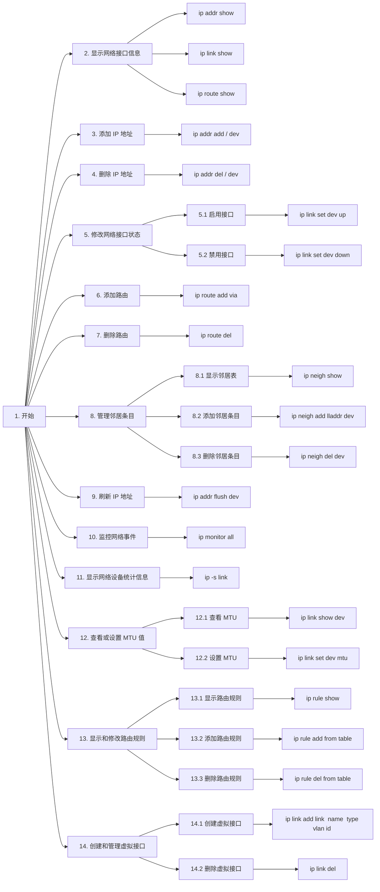
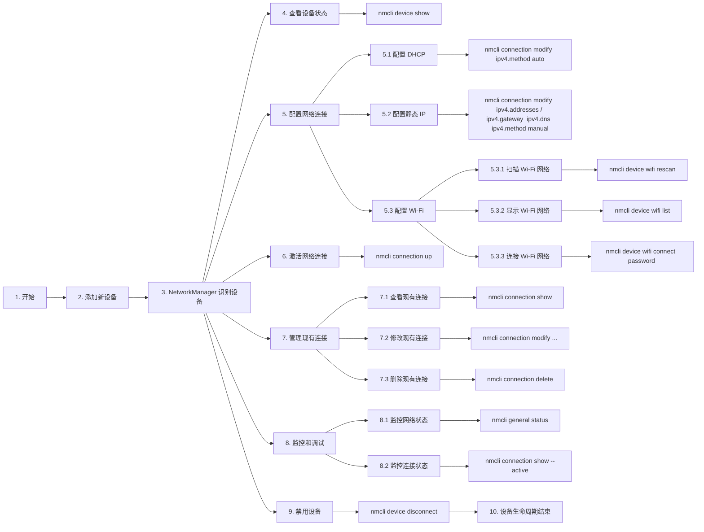
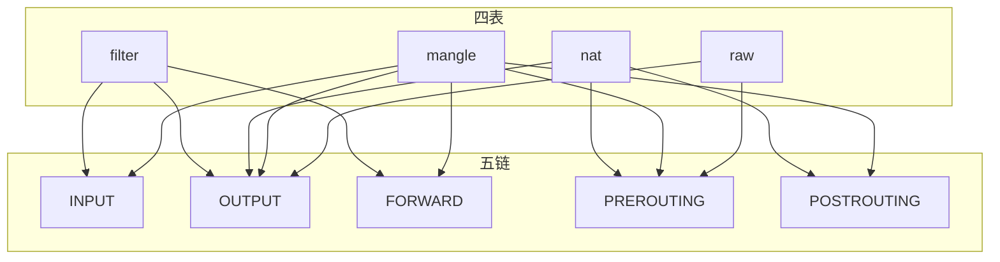
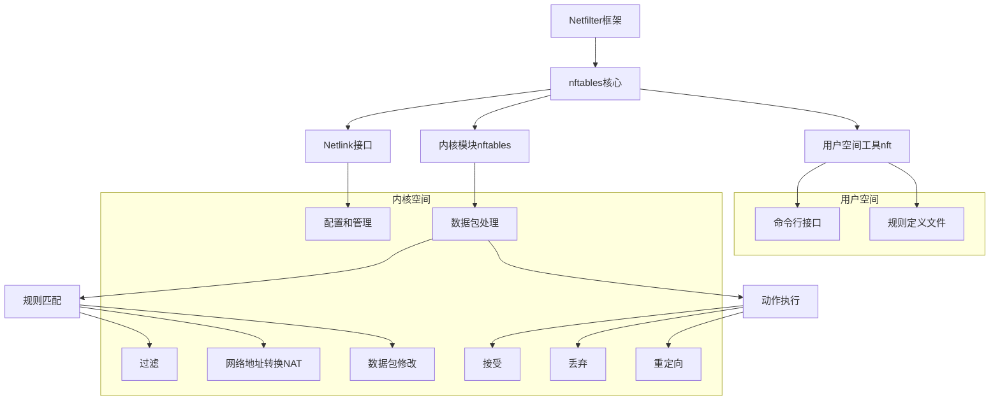
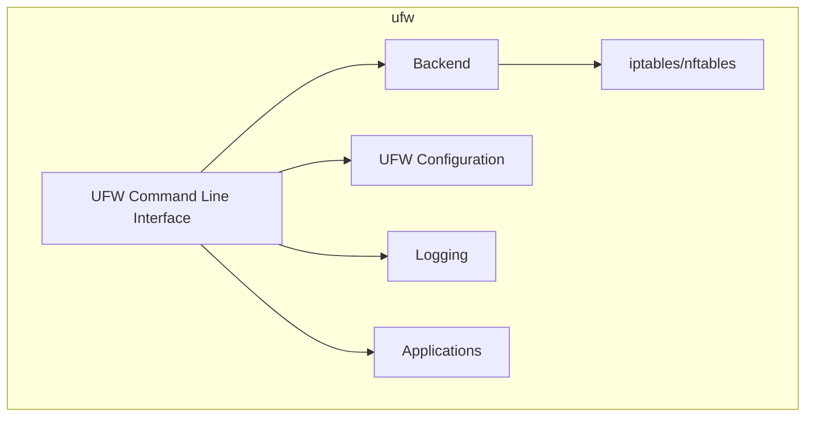
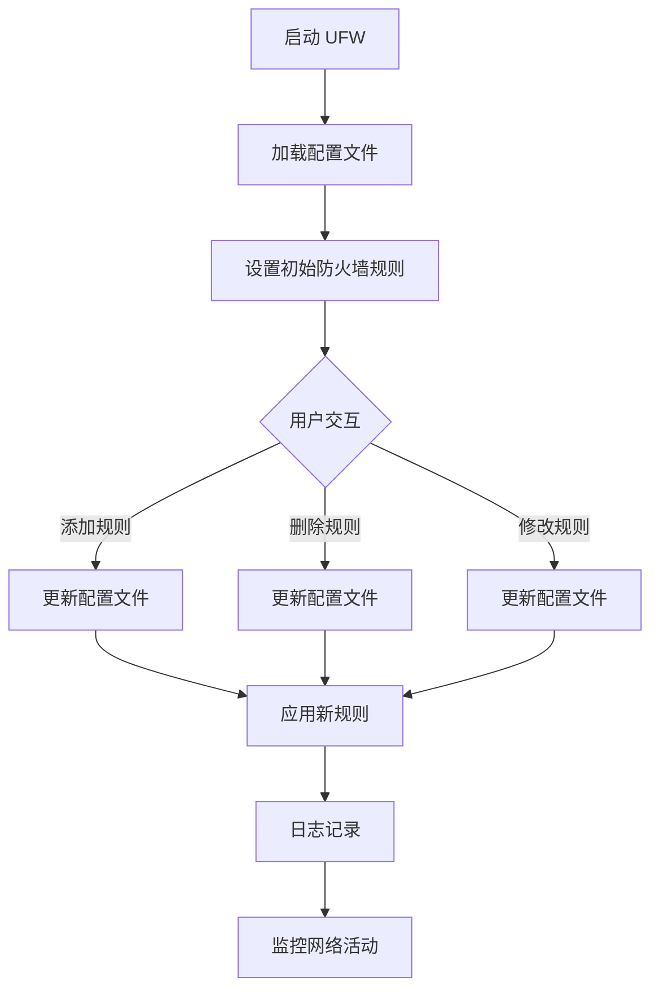
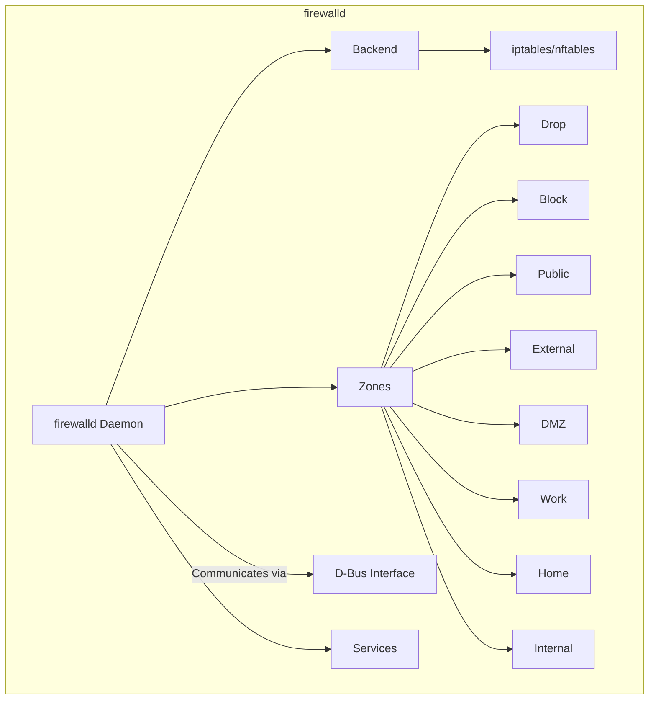
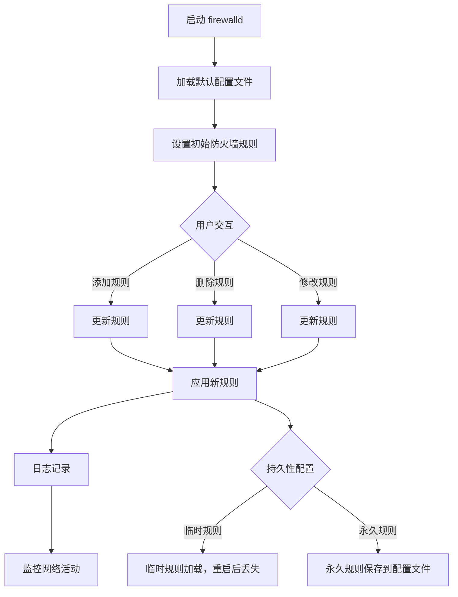

## 网络配置

| 发行版      | 常用网络管理工具                           | 网络配置文件路径                       |
| ----------- | ------------------------------------------ | -------------------------------------- |
| Ubuntu      | NetworkManager, systemd-networkd           | /etc/netplan/                          |
| Debian      | NetworkManager, systemd-networkd, ifupdown | /etc/network/interfaces                |
| CentOS/RHEL | NetworkManager, systemd-networkd, ifcfg    | /etc/sysconfig/network-scripts/ifcfg-* |
| Fedora      | NetworkManager, systemd-networkd, ifcfg    | /etc/sysconfig/network-scripts/ifcfg-* |
| Arch Linux  | netctl                                     | /etc/netctl/                           |
| openSUSE    | NetworkManager, ifup                       | /etc/sysconfig/network/ifcfg-*         |

### 关键网络概念

- **动态主机配置协议（DHCP）：**DHCP 用于自动分配 IP 地址、子网掩码、默认网关等网络参数。
- **静态地址（Static IP）：**静态 IP 是预先分配给设备的固定 IP 地址。
- **地址（IP）**：网络设备的唯一标识符，用于在网络中进行通信。IPv4 地址格式为 `xxx.xxx.xxx.xxx`，例如 `192.168.1.10`。
- **子网掩码（NetMask）**：用于划分 IP 地址的网络和主机部分。常见的子网掩码有 `255.255.255.0`，表示一个 C 类子网。
- **网关（Gateway）**：连接不同网络的设备，通常是路由器。默认网关用于转发网络请求到其他网络段。
- **域名系统（DNS）**：将域名解析为 IP 地址的服务。常见的 DNS 服务器有 Google 的 `8.8.8.8` 和 `8.8.4.4`。

## Ip

`ip` 命令是 Linux 系统中用于管理网络设备、地址、路由等网络设置的一个强大工具。它是 iproute2 软件包的一部分，由 Alexey N. Kuznetsov 开发，首次发布于 1999 年。**`ip` 命令的设计目的是替代原有的 `ifconfig`、`route` 等传统网络配置工具，提供更灵活、功能强大的解决方案。**

**`ip` 命令通过 Netlink 套接字与 Linux 内核通信，实现对网络设备、地址、路由等资源的管理。**Netlink 是一种用于在内核和用户空间之间传递信息的通信机制。通过 Netlink，`ip` 命令能够执行各种复杂的网络配置任务。

***ip 命令的配置是临时的，仅在当前会话中有效。重启系统或网络服务后，这些配置将会丢失。***

### 生命周期



### 常用命令

| 命令            | 说明                   |
| --------------- | ---------------------- |
| `ip addr show`  | 显示网络接口的地址信息 |
| `ip addr add`   | 为网络接口添加 IP 地址 |
| `ip addr del`   | 删除网络接口的 IP 地址 |
| `ip link show`  | 显示网络接口状态       |
| `ip link set`   | 修改网络接口属性       |
| `ip route show` | 显示路由表             |
| `ip route add`  | 添加路由               |
| `ip route del`  | 删除路由               |
| `ip neigh show` | 显示邻居表（ARP 缓存） |
| `ip neigh add`  | 添加邻居条目           |
| `ip neigh del`  | 删除邻居条目           |

### 常用选项

| 选项         | 说明                                           |
| ------------ | ---------------------------------------------- |
| `show`       | 显示指定类型的网络对象（如地址、链接、路由等） |
| `add`        | 添加指定类型的网络对象                         |
| `del`        | 删除指定类型的网络对象                         |
| `set`        | 修改指定类型的网络对象的属性                   |
| `list`       | 列出指定类型的网络对象                         |
| `flush`      | 清除指定类型的网络对象                         |
| `monitor`    | 监控网络事件                                   |
| `-4`         | 仅处理 IPv4 地址和路由                         |
| `-6`         | 仅处理 IPv6 地址和路由                         |
| `-s`         | 输出简化版信息                                 |
| `-brief`     | 以简洁的格式输出信息                           |
| `-json`      | 以 JSON 格式输出信息                           |
| `-details`   | 输出详细信息                                   |
| `-family`    | 指定地址族（如 inet、inet6、link 等）          |
| `-dynamic`   | 设置动态属性（如动态路由等）                   |
| `-permanent` | 设置永久属性（如永久地址等）                   |

### 操作示例

1. 查看当前网络接口信息

    ```shell
    $ ip route show
    192.168.101.0/24 dev ens32 proto kernel scope link src 192.168.101.177

    $ ip link show
    1: lo: <LOOPBACK,UP,LOWER_UP> mtu 65536 qdisc noqueue state UNKNOWN mode DEFAULT group default qlen 1000
        link/loopback 00:00:00:00:00:00 brd 00:00:00:00:00:00
    2: ens32: <BROADCAST,MULTICAST,UP,LOWER_UP> mtu 1500 qdisc pfifo_fast state UP mode DEFAULT group default qlen 1000
        link/ether 00:0c:29:99:2f:75 brd ff:ff:ff:ff:ff:ff
        altname enp2s0

    $ ip addr show
    1: lo: <LOOPBACK,UP,LOWER_UP> mtu 65536 qdisc noqueue state UNKNOWN group default qlen 1000
        link/loopback 00:00:00:00:00:00 brd 00:00:00:00:00:00
        inet 127.0.0.1/8 scope host lo
           valid_lft forever preferred_lft forever
        inet6 ::1/128 scope host
           valid_lft forever preferred_lft forever
    2: ens32: <BROADCAST,MULTICAST,UP,LOWER_UP> mtu 1500 qdisc pfifo_fast state UP group default qlen 1000
        link/ether 00:0c:29:99:2f:75 brd ff:ff:ff:ff:ff:ff
        altname enp2s0
        inet 192.168.101.177/24 scope global ens32
           valid_lft forever preferred_lft forever
    ```

2. 关闭指定网络接口

    ```shell
    $ ip link set dev ens32 down
    ```

    *注意：如果通过 SSH 连接，执行此操作会导致连接断开。*

3. 配置静态 IP 地址

    ```shell
    $ ip addr add 192.168.101.222/24 dev ens32
    $ ip addr show
    1: lo: <LOOPBACK,UP,LOWER_UP> mtu 65536 qdisc noqueue state UNKNOWN group default qlen 1000
        link/loopback 00:00:00:00:00:00 brd 00:00:00:00:00:00
        inet 127.0.0.1/8 scope host lo
           valid_lft forever preferred_lft forever
        inet6 ::1/128 scope host
           valid_lft forever preferred_lft forever
    2: ens32: <BROADCAST,MULTICAST,UP,LOWER_UP> mtu 1500 qdisc pfifo_fast state UP group default qlen 1000
        link/ether 00:0c:29:99:2f:75 brd ff:ff:ff:ff:ff:ff
        altname enp2s0
        inet 192.168.101.177/24 scope global ens32
           valid_lft forever preferred_lft forever
        inet 192.168.101.222/24 scope global secondary ens32
           valid_lft forever preferred_lft forever
    ```

4. 配置网关地址

    ```shell
    $ ip route add default via 192.168.101.1
    ```

5. 配置 DNS 服务器地址

    ```shell
    $ echo "nameserver 8.8.8.8" > /etc/resolv.conf
    $ echo "nameserver 8.8.4.4" >> /etc/resolv.conf
    ```

6. 启用网络接口

    ```shell
    $ ip link set dev ens32 up
    ```

## NetworkManager

**NetworkManager 是由 Red Hat 公司开发的一款用于管理 Linux 操作系统上网络连接的软件。**自 2004 年首次发布以来，它迅速成为 Linux 操作系统中最流行的网络管理工具之一。在 NetworkManager 诞生之前，Linux 中的网络管理通常需要通过手动配置网络文件完成，这一过程不仅繁琐且易出错，但随着 NetworkManager 的出现，这一切都变得简单和直观。

NetworkManager 展现了其在管理网络连接和网络接口方面的核心能力，提供了**一整套综合工具，大大简化了网络设置的复杂性。**用户得以轻松添加、修改、启用或禁用各类网络连接，包括有线和无线网络，乃至虚拟私人网络（VPN）。其核心由负责监控和管理网络的后台守护进程、提供直观操作的图形界面以及功能强大的命令行界面组成，还包括管理设备驱动和处理连接请求的高效后端服务。

在用户进行网络设置调整时，**NetworkManager 自动更新相关配置文件**，确保网络设置的一致性和准确性得到坚实保障。借助灵活的插件体系和高效的 D-Bus 通信机制，NetworkManager 能够轻松处理多种类型的网络连接，将配置和管理过程自动化，从而提供了一个无缝、直观且高度可靠的网络管理解决方案。

### Nmcli

**`nmcli` 是 NetworkManager 的命令行界面**，提供了全面的功能来管理网络。用户可以通过它快速创建、修改和监控网络连接。无论是列出网络设备状态，管理网络连接，设置静态 IP，还是管理 VPN 和其他特殊连接，`nmcli` 都能提供强大支持。

### Nmtui

对于那些偏好图形界面或在终端中工作的用户，`nmtui` 提供了一个简单直观的解决方案。这个**交互式的文本界面**应用使得配置 NetworkManager 控制的网络设置变得轻松。它的直观操作和无需鼠标的特性，使得 `nmtui` 成为 SSH 会话和终端窗口中理想的网络管理工具。

### 生命周期



### 常用命令

| 命令                      | 说明                            |
| ------------------------- | ------------------------------- |
| nmcli dev show            | 显示所有网络设备的信息          |
| nmcli conn show           | 显示所有网络连接的信息          |
| nmcli conn up             | 启用指定的网络连接              |
| nmcli conn down           | 禁用指定的网络连接              |
| nmcli conn add            | 添加一个新的网络连接            |
| nmcli conn modify         | 修改一个已有的网络连接          |
| nmcli conn delete         | 删除一个已有的网络连接          |
| nmcli connection edit     | 编辑一个已有的网络连接          |
| nmcli device wifi         | 显示所有 Wi-Fi 网络及其相关信息 |
| nmcli device wifi rescan  | 重新扫描 Wi-Fi 网络列表         |
| nmcli device wifi connect | 连接指定的 Wi-Fi 网络           |

### 常用选项

| 选项               | 说明                                       |
| ------------------ | ------------------------------------------ |
| -f，--format       | 指定输出格式（例如 csv、json、tabular 等） |
| -t，--terse        | 指定分隔符                                 |
| -m，--mode         | 指定最大输出宽度（用于长文本的换行）       |
| -p，--set-property | 指定要修改的属性                           |
| -a，--add          | 添加新的属性                               |
| -r，--remove       | 删除一个属性                               |
| -e，--enable       | 激活一个属性                               |
| -d，--disable      | 禁用一个属性                               |
| -v，--verbose      | 输出详细信息                               |
| -i，--ignore-case  | 忽略大小写                                 |

### 操作实例

1. 查看当前网络接口信息

    ```shell
    # 显示所有网络设备的信息
    nmcli device show
    ```

2. 配置静态 IP 地址

    注意：如果当前已经有一个 DHCP 分配的 IP 地址，则需要首先释放该地址。

    ```shell
    # 释放 DHCP 分配的 IP 地址
    nmcli connection modify ens160 ipv4.method auto

    # 为指定网络接口配置静态 IP 地址
    nmcli connection modify ens160 ipv4.addresses 192.168.101.123/24 ipv4.gateway 192.168.101.1 ipv4.dns 114.114.114.114 ipv4.method manual
    ```

3. 激活新的网络配置

    ```shell
    # 激活新的网络配置
    nmcli connection up ens160
    ```

4. 连接到 Wi-Fi 网络

    ```shell
    # 重新扫描 Wi-Fi 网络列表
    nmcli device wifi rescan

    # 显示所有 Wi-Fi 网络及其相关信息
    nmcli device wifi list

    # 连接指定的 Wi-Fi 网络
    nmcli device wifi connect <SSID> password <password>
    ```

5. 添加新的网络连接

    ```shell
    # 添加一个新的以太网连接
    nmcli connection add type ethernet ifname eth0 con-name static-eth0 autoconnect yes ip4 192.168.1.100/24 gw4 192.168.1.1 ipv4.dns 8.8.8.8
    ```

6. 删除网络连接

    ```shell
    # 删除一个已有的网络连接
    nmcli connection delete static-eth0
    ```

7. 查看和管理 VPN 连接

    ```shell
    # 显示活动的 VPN 连接
    nmcli connection show --active
    
    # 添加一个新的 OpenVPN 连接
    nmcli connection import type openvpn file <path-to-ovpn-file>
    
    # 激活 VPN 连接
    nmcli connection up <vpn-connection-name>
    
    # 禁用 VPN 连接
    nmcli connection down <vpn-connection-name>
    ```

## 网络管理

### Iptables

`iptables` 是 Linux 系统中的一个命令行防火墙工具，它允许系统管理员配置内核防火墙（netfilter）规则。它主要用于数据包过滤、网络地址转换（NAT）和数据包修改。由于 `iptables` 在内核空间运行，能够为内核提供强大的防火墙和网络处理功能。

`iptables` 由 Rusty Russell 在 1998 年创建，最初作为 `ipchains` 的替代品发布。它是 netfilter 项目的一部分，该项目的目标是提供一套丰富且可靠的防火墙和路由工具。

#### 架构图

在 `iptables` 的规则体系中，存在**一个重要的概念叫做四表五链**。这些表和链提供了 `iptables` 进行包过滤和处理的基础架构。



#### 四表

| 表名   | 用途                | 关联的链                                        |
| ------ | ------------------- | ----------------------------------------------- |
| filter | 数据包过滤          | INPUT、FORWARD、OUTPUT                          |
| nat    | 网络地址转换（NAT） | PREROUTING、OUTPUT、POSTROUTING                 |
| mangle | 数据包修改          | PREROUTING、INPUT、FORWARD、OUTPUT、POSTROUTING |
| raw    | 配置连接追踪豁免    | PREROUTING、OUTPUT                              |

#### 五链

| 链名        | 用途                               |
| ----------- | ---------------------------------- |
| INPUT       | 处理进入本机的数据包               |
| OUTPUT      | 处理本机产生的数据包               |
| FORWARD     | 处理经过本机转发的数据包           |
| PREROUTING  | 在路由决策之前处理进入系统的数据包 |
| POSTROUTING | 在路由决策之后处理离开系统的数据包 |

尽管 `iptables` 强大且灵活，但也有一些缺点。例如，**`iptables` 的配置较为复杂**，需要花费较多的时间学习和理解。

此外，`iptables` 的**性能与网络流量和规则数量成正比**，大量的规则和网络流量可能会导致性能下降。然而，通过深入理解和恰当配置，管理员可以充分利用 `iptables` 来建立强大且灵活的网络防火墙。

随着时间的推移，**`iptables` 已经不再是 Linux 系统中唯一的防火墙解决方案**。在最近的 Linux 发行版中，`nftables` 开始替代 `iptables` 成为默认的防火墙工具。`nftables` 提供了与 `iptables` 类似的功能，但具有更优的性能和更简洁的语法。

尽管如此，`iptables` 仍然广泛用于很多系统中，并且由于其强大和灵活的特性，仍然是许多系统管理员的首选工具。

#### 常用命令

```shell
# 列出所有防火墙规则
sudo iptables -L

# 添加一条新的规则
sudo iptables -A INPUT -p tcp --dport 22 -j ACCEPT

# 删除一条规则
sudo iptables -D INPUT 1

# 清空所有规则
sudo iptables -F

# 设置默认策略
sudo iptables -P INPUT DROP

# 创建新的链
sudo iptables -N LOGGING

# 删除一个空链
sudo iptables -X LOGGING

# 在链中插入一条规则
sudo iptables -I INPUT 1 -p tcp --dport 22 -j ACCEPT

# 替换链中的一条规则
sudo iptables -R INPUT 1 -p tcp --dport 80 -j ACCEPT

# 列出所有规则的详细信息
sudo iptables -S

# 列出规则，不解析服务名称
sudo iptables -n -L

# 保存 iptables 规则
sudo iptables-save > /etc/iptables/rules.v4

# 恢复 iptables 规则
sudo iptables-restore < /etc/iptables/rules.v4
```

### Nftables

**`nftables` (Netfilter tables) 是一种 Linux 内核的包过滤框架，它是 `iptables`、`ip6tables`、`arptables`、`ebtables` 等工具的替代品**，旨在提供单一、统一的解决方案，以简化包过滤和防火墙的配置。`nftables` 提供了一个新的、更高级的语法，用于更简洁、更直观地定义和管理规则。

`nftables` 于 2014 年作为 Linux 内核 3.13 的一部分首次发布。它由同样也是 `iptables` 创建者的 Netfilter 项目团队开发，主要目的是解决 `iptables` 在易用性和性能上的一些问题。新的框架是为了改善和扩展现有的过滤系统，提供更强大的网络数据包处理能力。

#### 架构图



`nftables` 提供了一种新的、基于 Netlink 的接口，用于配置网络过滤规则。它还提供了一种新的语法，用于定义过滤规则。这种语法更加简洁、直观，比 `iptables` 的语法更易于学习和使用。与 `iptables` 相比，`nftables` 还有一些其他的优点。例如，它能更高效地处理大量的规则，支持更多的数据类型和操作符，提供更强大的过滤和分类功能，支持动态更新规则等等。

#### 核心特性

1. **更简洁、更直观的语法**：`nftables` 的语法比 `iptables` 的语法更简洁、更直观，更易于学习和使用。
2. **更高的性能**：`nftables` 能更高效地处理大量的规则，对性能的影响较小。
3. **更强大的功能**：`nftables` 支持更多的数据类型和操作符，提供更强大的过滤和分类功能，支持动态更新规则。
4. **替代多种工具**：`nftables` 可以替代 `iptables`、`ip6tables`、`arptables`、`ebtables` 等工具，提供一个统一的解决方案。
5. **使用新技术**：作为一种新的包过滤框架，`nftables` 使用了许多新的技术和接口，这可能需要一些学习和适应。

尽管 `nftables` 在许多方面都优于 `iptables`，但它也存在一些问题。例如，它的**语法和接口与 `iptables` 不兼容**，这可能导致一些旧的脚本和工具无法正常工作。此外，由于 `nftables` 是相对较新的技术，可能还存在一些 bug 或不稳定的问题。

总的来说，`nftables` 是一种强大而灵活的网络过滤框架，它提供了许多 `iptables` 所不具备的特性和优点。它的目标是简化网络过滤和防火墙的配置，提供更高的性能，支持更多的功能，使得网络管理员能够更有效地管理他们的网络。

#### 常用的命令

```shell
# 显示当前已定义的所有表
nft list tables

# 添加一个新表，表名为 "mytable"，表类型为 "ip"
nft add table ip mytable

# 列出在表 "mytable" 下的 "mychain" 中定义的所有链
nft list chain ip mytable mychain

# 在表 "mytable" 下添加一个新链 "mychain"，并设置链的类型为 "filter"，hook 为 "input"，优先级为 0
nft add chain ip mytable mychain { type filter hook input priority 0 \; }

# 在 "mychain" 中添加一个新规则，如果源 IP 地址是 192.0.2.1，则丢弃该包
nft add rule ip mytable mychain ip saddr 192.0.2.1 drop

# 列出所有已定义的规则集
nft list ruleset

# 删除在 "mychain" 中的 handle 是 1 的规则
nft delete rule ip mytable mychain handle 1

# 清空指定链 "mychain" 中的所有规则
nft flush chain ip mytable mychain

# 删除指定链 "mytable" 中的 "mychain"
nft delete chain ip mytable mychain

# 删除指定表 "mytable"
nft delete table ip mytable
```

### Ufw

**`ufw`（Uncomplicated Firewall）是一种简洁的防火墙配置工具，专门为 Linux 设计。** 该工具的主要目标是简化 `iptables` 防火墙配置的复杂性，并提供一个用户友好的界面，以便于用户进行操作和管理。UFW 是由 Ubuntu 开发的，但它也能在其他的 Linux 发行版上使用。

UFW 的功能主要是通过控制网络流量来提供安全防护。用户可以设置防火墙规则，来允许或拒绝某个 IP 地址、端口或服务的入站或出站流量。同时，UFW 也支持 IPv6，这样可以满足现代网络环境的需求。

#### 架构图



1. **UFW Command Line Interface**：UFW 提供了一个简单的命令行界面，通过该界面用户可以方便地管理防火墙规则。
2. **UFW Configuration**：配置文件存储了 UFW 的规则和策略，用户可以编辑这些文件以自定义防火墙行为。
3. **Backend（后端）**：UFW 支持两种主要的后端：iptables 和 nftables。后端负责实际执行防火墙规则。
4. **Logging（日志）**：UFW 支持日志记录功能，用户可以配置日志级别以监控网络活动。
5. **Applications（应用）**：UFW 支持预配置的应用规则，使用户能够方便地管理常见应用的防火墙规则。

#### 工作流程



1. **启动**：当 UFW 启用时，它会加载配置文件，并根据这些配置文件设置初始的防火墙规则。
2. **规则管理**：用户可以通过 CLI（命令行界面）与 UFW 进行交互，添加、删除或修改防火墙规则。
3. **应用规则**：UFW 支持预配置的应用规则，用户可以通过简单的命令添加或删除这些规则。
4. **日志记录**：用户可以配置 UFW 的日志记录级别，以便监控和调试网络活动。
5. **持久性配置**：UFW 的配置文件存储在系统中，可以在重启后自动加载。

#### 常用命令

```shell
# 启用 UFW
sudo ufw enable

# 禁用 UFW
sudo ufw disable

# 显示 UFW 状态和规则
sudo ufw status

# 允许特定端口或服务的流量
sudo ufw allow 22

# 拒绝特定端口或服务的流量
sudo ufw deny 22

# 删除特定规则
sudo ufw delete allow 22

# 设置默认的入站或出站策略
sudo ufw default deny incoming

# 显示预配置的应用规则
sudo ufw app list

# 显示特定应用的规则信息
sudo ufw app info 'Apache'

# 设置日志记录级别
sudo ufw logging medium

# 重新加载 UFW 规则，无需重启防火墙服务
sudo ufw reload

# 重置 UFW 配置为默认状态
sudo ufw reset
```

### Firewalld

firewalld 是一个用于管理 Linux 发行版的防火墙的动态守护程序。主要用于 IPv4、IPv6 防火墙规则以及以太网桥的管理，**firewalld 基于 nftables 或 iptables 实现网络包过滤。**相较于传统的防火墙管理方式，firewalld 采用动态管理，能够让你在无需重启防火墙的情况下实时更新策略和规则。

**firewalld 使用区域（zones）来定义不同网络接口或连接的安全级别和防火墙规则。**每个区域都有一组默认规则，可以允许或拒绝特定类型的流量。区域的设计目的是根据网络信任度对网络流量进行分区管理。这使你能够为信任的网络接口、设备和服务定义区域，实现更加灵活的防火墙管理。

#### 架构图



1. **firewalld Daemon**：firewalld 是一个常驻内存的守护进程，负责管理防火墙规则。它通过 D-Bus 接口提供与外部交互的能力，可以动态加载和卸载规则，而不需要重启防火墙服务。
2. **D-Bus Interface**：D-Bus 是一个消息总线系统，firewalld 通过它与其他系统组件和应用程序进行通信。用户和管理工具可以通过 D-Bus 与 firewalld 交互，查询状态、修改规则等。
3. **Backend（后端）**：firewalld 支持两种主要的后端：iptables 和 nftables。后端是实际执行防火墙规则的地方，firewalld 负责将用户定义的规则翻译成适当的后端命令并执行。
4. **Zones（区域）**：区域是 firewalld 管理规则的一种方式。每个网络接口或连接可以分配到一个区域，区域定义了特定的信任级别和规则集。常见的区域包括 `public`、`home`、`work` 和 `internal` 等。
5. **Services（服务）**：服务定义了一组预定义的规则，这些规则允许或拒绝特定的网络流量。例如，HTTP 服务允许 TCP 端口 80 的流量。通过添加或删除服务，用户可以方便地管理复杂的防火墙规则。

| 区域     | 描述                                                      | 默认行为               | 适用场景                       |
| -------- | --------------------------------------------------------- | ---------------------- | ------------------------------ |
| drop     | 丢弃所有传入的网络包，不回应任何请求。                    | 丢弃所有传入流量       | 高度安全需求，伪装系统离线     |
| block    | 拒绝所有传入的连接，返回拒绝信息。                        | 拒绝所有传入流量       | 完全信任的网络连接             |
| public   | 对外部网络的默认配置，允许有限的传入连接。                | 允许有限的传入流量     | 公共网络连接，最低信任级别     |
| external | 用于外部网关，启用网络地址转换（NAT），保护内部网络。     | 启用 NAT，限制传入流量 | 外部网络网关，保护内部网络     |
| dmz      | 非军事区（DMZ），允许对公众开放的服务，同时保护内部网络。 | 允许特定服务的传入流量 | 公共服务的隔离区，保护内部网络 |
| work     | 适用于工作环境，信任网络较高，允许更多的传入连接。        | 允许更多的传入流量     | 工作环境，较高信任级别         |
| home     | 适用于家庭网络，信任网络较高，允许更多的传入连接。        | 允许更多的传入流量     | 家庭网络，高信任级别           |
| internal | 适用于完全信任的内部网络，允许所有传入的连接。            | 允许所有传入流量       | 完全信任的内部网络             |

#### 工作流程



1. **启动 firewalld**：当 firewalld 守护进程启动时，开始加载默认配置文件。
2. **加载默认配置文件**：从系统中读取默认的防火墙配置文件。
3. **设置初始防火墙规则**：根据配置文件设置初始的防火墙规则。
4. **用户交互**：用户通过 CLI（命令行界面）或 GUI（图形用户界面）与 firewalld 进行交互，执行添加、删除或修改规则的操作。这些命令通过 D-Bus 接口传递给 firewalld 守护进程。
5. **更新规则**：根据用户的操作，更新防火墙规则。
6. **应用新规则**：根据更新后的配置文件，立即应用新的防火墙规则，而不需要重启服务。
7. **日志记录**：firewalld 支持日志记录功能，记录防火墙的操作和网络活动。
8. **监控网络活动**：通过日志，用户可以监控和分析网络活动及安全事件。
9. **持久性配置：**firewalld 提供两种规则管理模式：
   - **临时规则**：这些规则在系统重启后会丢失。
   - **永久规则**：这些规则会保存到配置文件中，在系统重启后自动加载。

#### 常用命令

```shell
# 启动 firewalld
systemctl start firewalld

# 停止 firewalld
systemctl stop firewalld

# 在启动时启用 firewalld
systemctl enable firewalld

# 查看 firewalld 状态
firewall-cmd --state

# 列出所有区域
firewall-cmd --get-zones

# 查看某个区域的详细信息
firewall-cmd --zone=public --list-all

# 更改默认区域
firewall-cmd --set-default-zone=home

# 将接口分配到特定区域
firewall-cmd --zone=home --change-interface=eth0

# 永久分配接口到特定区域
firewall-cmd --permanent --zone=home --add-interface=eth0

# 添加源地址到区域
firewall-cmd --zone=public --add-source=192.168.1.0/24

# 永久添加源地址到区域
firewall-cmd --permanent --zone=public --add-source=192.168.1.0/24

# 列出所有默认防火墙规则
firewall-cmd --list-all

# 添加服务到防火墙
firewall-cmd --permanent --add-service=http

# 删除服务
firewall-cmd --permanent --remove-service=http

# 开放端口
firewall-cmd --permanent --add-port=8080/tcp

# 移除端口
firewall-cmd --permanent --remove-port=8080/tcp

# 重新载入防火墙规则
firewall-cmd --reload

# 列出所有区域
firewall-cmd --get-zones

# 查看某个区域的详细信息
firewall-cmd --zone=public --list-all

# 更改默认区域
firewall-cmd --set-default-zone=home

# 将接口分配到特定区域
firewall-cmd --zone=home --change-interface=eth0

# 永久分配接口到特定区域
firewall-cmd --permanent --zone=home --add-interface=eth0

# 添加源地址到区域
firewall-cmd --zone=public --add-source=192.168.1.0/24

# 永久添加源地址到区域
firewall-cmd --permanent --zone=public --add-source=192.168.1.0/24
```

### iptables、nftables、UFW、firewalld 对比

在 Linux 环境下，`iptables`，`nftables`，`ufw` 和 `firewalld` 都是常用的防火墙工具，每种工具都有其独特的优点和使用场景：

在 Linux 环境下，`iptables`，`nftables`，`ufw` 和 `firewalld` 都是常用的防火墙工具，每种工具都有其独特的优点和使用场景：

| 特性           | iptables     | nftables     | ufw        | firewalld         |
| -------------- | ------------ | ------------ | ---------- | ----------------- |
| 发布日期       | 1998         | 2014         | 2008       | 2011              |
| 操作复杂度     | 高           | 中           | 低         | 中                |
| 基于           | netfilter    | netfilter    | iptables   | iptables/nftables |
| 内建于内核     | 是           | 是           | 否         | 否                |
| GUI            | 否           | 否           | 否         | 是                |
| 基于区域的过滤 | 否           | 否           | 否         | 是                |
| 直接规则       | 是           | 是           | 否         | 是                |
| 规则集合       | 否           | 是           | 否         | 是                |
| 协议支持       | IPv4/IPv6    | IPv4/IPv6    | IPv4/IPv6  | IPv4/IPv6         |
| 适用于         | 服务器、桌面 | 服务器、桌面 | 桌面、新手 | 服务器、桌面      |
| 跨平台         | 是           | 是           | 是         | 是                |
| 语法复杂度     | 高           | 低           | 低         | 中                |
| 动态规则修改   | 否           | 是           | 否         | 是                |
| 日志记录       | 是           | 是           | 是         | 是                |
| 应用配置支持   | 否           | 否           | 是         | 是                |
| 持久性配置     | 是           | 是           | 是         | 是                |

- **初学者和基本防火墙需求**：`ufw` 是最好的选择，因其简易性和用户友好性。
- **高级用户和复杂配置**：`iptables` 提供了最细致的控制，适合需要高度自定义和复杂配置的环境。
- **现代化和简化管理**：`nftables` 提供了更简洁的语法和规则集合功能，是 iptables 的现代替代品。
- **动态和区域管理**：`firewalld` 结合了强大功能和易用性，适合需要动态管理和基于区域的过滤需求的环境。

**总的来说，应该根据特定需求和技能水平选择最适合的防火墙工具。**对于初学者和只需要基本防火墙功能的用户来说，`ufw` 可能是最好的选择。对于需要进行精细控制和高级配置的用户，`iptables` 和 `nftables` 可能更合适。如果您需要一种同时提供强大功能和易用性的防火墙工具，那么 `firewalld` 可能是最好的选择。

## 网络优化

### 网络带宽管理

网络带宽管理是一种在 Linux 系统上优化网络性能和响应时间的方法。它允许管理员控制和分配网络带宽，从而为不同的应用程序和服务提供最佳性能。

- **tc (Traffic Control)**：Linux 内核的一部分，用于实现复杂的带宽管理和流量控制策略。
- **HTB (Hierarchical Token Bucket)**：一个基于 tc 的流量整形工具，允许管理员创建多层次的带宽限制和优先级分配策略。

### 网络质量管理（QoS）

网络质量管理（Quality of Service，QoS）是一种用于分配网络带宽的技术，确保网络资源的公平使用和最佳利用。通过 QoS，管理员可以根据应用程序的需求和优先级分配网络带宽，从而优化网络性能。

- **tc (Traffic Control)**：用于实现复杂的 QoS 策略和流量控制。
- **Wondershaper**：一个基于 tc 的简单 QoS 工具，允许管理员轻松设置带宽限制和优先级策略。

### 负载均衡

负载均衡是在多个服务器之间分配负载的技术，以提高应用程序的性能和可靠性。在 Linux 系统上，可以使用软件负载均衡器和硬件负载均衡器来实现负载均衡。

- **HAProxy**：一个高性能、高可用性的软件负载均衡器，支持 TCP 和 HTTP 协议。
- **Nginx**：一个功能强大的 Web 服务器，也可以作为负载均衡器和反向代理服务器。
- **LVS (Linux Virtual Server)**：一个基于 Linux 内核的负载均衡解决方案，支持多种负载均衡算法。

### 数据压缩

数据压缩技术可以减少网络传输的数据量，从而提高网络带宽利用率和传输效率。Linux 系统提供了多种压缩工具和库，支持不同的压缩算法。

- **gzip**：一种广泛使用的文件压缩工具，基于 DEFLATE 压缩算法。
- **bzip2**：一个基于 Burrows-Wheeler 算法的文件压缩工具，提供较高的压缩率。
- **lz4**：一种快速的无损压缩算法，适用于实时场景和大数据处理。

### 缓存服务

缓存服务用于在网络上存储和提供数据，以提高访问速度和响应时间。Linux 系统上有多种缓存服务可用，包括 Web 缓存、DNS 缓存和内容分发网络（CDN）。

- **Squid**：一个成熟的 Web 缓存代理服务器，可以用来缓存网站内容和优化网络访问速度。
- **Unbound**：一个轻量级的 DNS 缓存服务器，用于加速 DNS 解析请求和提高域名解析性能。
- **Varnish**：一个高性能的 HTTP 加速器和缓存服务器，广泛用于 Web 应用程序的性能优化。

### TCP/IP 优化

TCP/IP 优化包括调整 TCP 拥塞控制算法、修改最大传输单元（MTU）、调整 Nagle 算法等，以提高网络性能和传输速度。Linux 系统提供了多种工具和设置来优化 TCP/IP 性能。

- **修改内核参数**：通过调整 `/proc/sys/net/ipv4/` 目录下的内核参数，如 `tcp_wmem`、`tcp_rmem` 和 `tcp_congestion_control`，以优化 TCP 性能。
- **调整 MTU**：修改网卡的 MTU 设置，以适应网络环境和提高传输效率。
- **禁用 Nagle 算法**：通过设置 `TCP_NODELAY` 选项，关闭 Nagle 算法以减小传输延迟。

### CDN（内容分发网络）

内容分发网络（CDN）是一种用于分发静态内容的技术，通过在全球范围内部署多个数据中心，将内容缓存到离用户最近的节点，从而提高访问速度和减轻源服务器负担。CDN 广泛应用于 Web 应用程序和大型网站，以提供优质的用户体验。

- **Akamai**：全球最大的 CDN 服务商，提供广泛的网络加速和安全解决方案。
- **Cloudflare**：一家提供 CDN 和网络安全服务的公司，帮助网站加速和保护其内容。
- **Amazon CloudFront**：亚马逊提供的全球内容分发服务，与其他 AWS 服务紧密集成。

## 网络安全

### 网络故障排查与诊断

Linux 系统提供了一系列工具来帮助用户进行网络故障排查与诊断，包括 `ping`、`traceroute`、`mtr`、`nslookup`、`dig` 和 `whois` 等。

- **ping**：用于检测网络连接和延迟，通过发送 ICMP 数据包来检测目标主机是否可达。
- **traceroute**：用于显示数据包从源主机到目标主机经过的路由路径。
- **mtr**：结合了 `ping` 和 `traceroute` 功能的网络诊断工具，提供实时路由分析。
- **nslookup**：用于查询 DNS 服务器以获取域名解析信息。
- **dig**：功能强大的 DNS 查询工具，可以获取详细的 DNS 记录信息。
- **whois**：用于查询域名注册信息和 IP 地址分配信息。

### 安全隔离

安全隔离是网络安全的重要概念，可以防止潜在的网络攻击和数据泄露。主要实现技术包括 VLAN、DMZ 和容器网络隔离。

- **VLAN (Virtual Local Area Network)**：通过在网络交换机上配置 VLAN，可以将物理网络划分为多个逻辑子网，实现网络资源的安全隔离。
- **DMZ (Demilitarized Zone)**：一种网络安全策略，通过在内部网络和外部网络之间建立一个隔离区域，保护内部网络资源免受外部攻击。
- **容器网络隔离**：通过使用容器技术（如 Docker、Kubernetes）和虚拟网络（如 Calico、Flannel）来实现应用程序的安全隔离。

### SSH 安全配置

SSH 是远程登录和管理 Linux 系统的常用协议。正确配置 SSH 可以提高系统的安全性。

- **密钥认证**：使用公钥/私钥对进行身份验证，替代密码认证，提高安全性。
- **端口改变**：将 SSH 服务端口从默认的 22 更改为其他端口，降低被扫描和攻击的风险。
- **禁止 root 登录**：禁止直接通过 SSH 以 root 身份登录，减少被攻击者利用的可能性。
- **防止暴力破解**：通过限制登录尝试次数、使用防火墙规则或安装防暴力破解软件（如 Fail2Ban）来防止暴力破解攻击。

### 虚拟化网络

虚拟化网络是在物理网络基础上创建虚拟网络资源的技术，包括虚拟网卡、虚拟交换机、网桥和 SDN（软件定义网络）等。

- **虚拟网卡**：在虚拟机和容器中模拟的网络接口，与物理网卡类似，可用于建立虚拟网络连接。
- **虚拟交换机**：在虚拟环境中实现网络连接和数据包转发的虚拟设备。
- **网桥**：用于连接虚拟网络和物理网络，实现虚拟机与外部网络通信。
- **SDN**：一种将网络控制平面与数据平面分离的技术，允许通过软件实现网络资源的动态配置和管理。

### 网络监测和分析

网络监测和分析工具可以帮助管理员实时监控网络状况、发现异常行为和安全威胁。常用工具包括 `tcpdump`、`Wireshark`、`netstat`、`nmap`、`sniffing`、`IDS` 和 `NMS` 等。

- **tcpdump**：用于捕获和分析网络数据包的命令行工具。
- **Wireshark**：一个图形界面的网络协议分析器。
- **netstat**：用于显示网络连接状态和监听端口的命令行工具。
- **nmap**：一款强大的网络扫描和安全审计工具。

### 网络入侵检测系统（IDS）

网络入侵检测系统（Intrusion Detection System，IDS）可以检测网络中的恶意行为和攻击活动。常见的 IDS 工具包括 Snort、Suricata、OSSEC 和 Bro/Zeek。

- **Snort**：一款开源的网络入侵检测和防御系统，基于规则匹配和异常检测来识别恶意流量。
- **Suricata**：一个高性能的开源 IDS/IPS/NSM（网络安全监控）引擎，支持实时流量分析和威胁防御。
- **OSSEC**：一个开源的主机入侵检测系统，用于监控文件系统、日志文件和网络活动。
- **Bro/Zeek**：一款强大的网络安全监控平台，支持实时流量分析、协议解析和异常检测。

### 网络安全监控系统（NMS）

网络安全监控系统（Network Monitoring System，NMS）用于实时监控网络设备和服务的运行状况，发现性能问题和安全威胁。常见的 NMS 工具包括 Nagios、Zabbix、Cacti、Prometheus 和 Grafana。

- **Nagios**：一款功能强大的开源网络监控系统，支持多种插件和扩展，用于监控网络设备、服务和应用程序。
- **Zabbix**：一种企业级的开源监控解决方案，提供分布式监控、报警和报表功能。
- **Cacti**：一个基于 RRDtool 的网络图形监控工具，用于绘制网络设备性能图表。
- **Prometheus**：一个开源的监控和告警系统，广泛用于监控微服务和容器化应用程序。
- **Grafana**：一个流行的开源监控数据可视化工具，支持多种数据源，如 Prometheus、InfluxDB 和 Elasticsearch 等。

### 网络安全审计系统

网络安全审计系统用于评估网络设备和应用程序的安全性，发现潜在的漏洞和配置问题。常见的安全审计工具包括 OSSEC、Tripwire、AIDE、OpenSCAP 和 Lynis。

- **OSSEC**：一个开源的主机入侵检测系统，也可以用于安全审计和配置检查。
- **Tripwire**：一款用于文件完整性检查和安全审计的工具，可以检测文件的变更和潜在的安全问题。
- **AIDE (Advanced Intrusion Detection Environment)**：一个用于文件完整性检查和入侵检测的开源工具。
- **OpenSCAP (Open Security Content Automation Protocol)**：一个开源的安全配置和漏洞管理框架，基于 SCAP 标准实现。
- **Lynis**：一个开源的安全审计和硬化工具，用于检查 Linux 系统的配置和安全性。

### 网络加密技术

网络加密技术用于保护数据在传输过程中的隐私和完整性。主要的网络加密技术包括 SSL/TLS、IPSec、SSH 等。

- **SSL/TLS**：安全套接层（Secure Sockets Layer，SSL）和传输层安全（Transport Layer Security，TLS）是应用于网络传输层的加密技术，用于保护 Web 浏览、电子邮件和其他应用程序的数据安全。
- **IPSec**：Internet 协议安全（IP Security，IPSec）是一个用于保护 IP 数据包传输安全的协议套件，提供加密、认证和完整性保护功能。IPSec 广泛应用于 VPN 技术中。
- **SSH**：安全外壳（Secure Shell，SSH）是一种加密网络协议，用于在不安全的网络环境中实现安全的远程登录、文件传输和其他网络服务。

### 安全认证和授权

安全认证和授权技术用于验证用户身份和控制用户访问权限。主要技术包括 RADIUS、TACACS+、LDAP、Kerberos 等。

- **RADIUS**：远程认证拨号用户服务（Remote Authentication Dial-In User Service，RADIUS）是一个用于 AAA（认证、授权和计费）的网络协议，广泛应用于网络接入和 VPN 服务中。
- **TACACS+**：终端访问控制器访问控制系统 +（Terminal Access Controller Access-Control System+，TACACS+）是一种用于网络设备管理的 AAA 协议，主要应用于路由器、交换机等网络设备的远程管理。
- **LDAP**：轻型目录访问协议（Lightweight Directory Access Protocol，LDAP）是一种用于访问和维护分布式目录信息服务的协议，常用于企业网络的用户认证和组织结构管理。
- **Kerberos**：一种基于票据的网络认证协议，用于实现单点登录（Single Sign-On，SSO）和安全的跨域认证。

### 网络安全策略和最佳实践

为了提高网络安全，企业和组织需要制定和实施合适的网络安全策略，并遵循最佳实践。

- 制定并执行网络安全政策：明确网络资源的访问控制、数据保护和应急响应等方面的要求。
- 定期进行安全审计和漏洞扫描：检查网络设备和应用程序的安全配置，发现并修复潜在的安全漏洞。
- 提高员工安全意识：通过培训和教育，提高员工对网络安全的认识，防止误操作和内部威胁。
